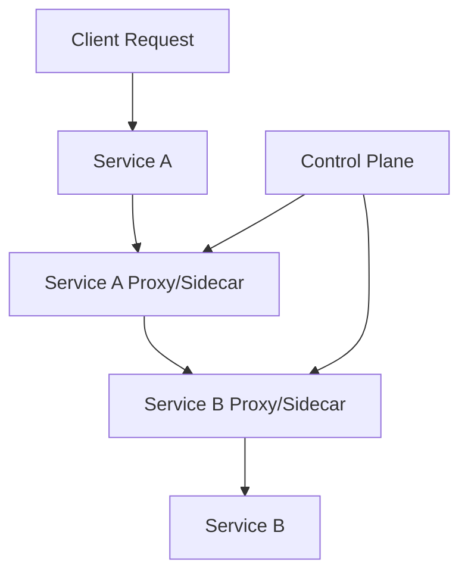
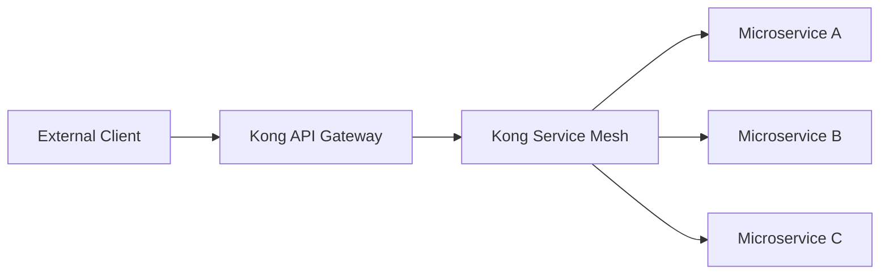

# Kong Service Mesh

## Introduction

A service mesh is a dedicated infrastructure layer for handling service-to-service communication in microservices architectures. Kong Service Mesh, built on top of the open-source Kuma platform, provides a modern solution for managing the complex networking challenges that arise when applications are broken down into numerous microservices.

In this guide, we'll explore what Kong Service Mesh is, how it works, and why it has become an essential tool for developers working with distributed systems. Whether you're managing a small cluster or a large enterprise deployment, understanding service mesh concepts will help you build more resilient, secure, and observable applications.

## What is Kong Service Mesh?

Kong Service Mesh is a service mesh solution that helps you control, observe, and secure the network traffic between your microservices. It's built on top of Kuma, an open-source service mesh platform originally created by Kong Inc. and now a Cloud Native Computing Foundation (CNCF) project.

At its core, Kong Service Mesh provides:

- **Traffic Control**: Route and load balance requests between services
- **Security**: Enforce mutual TLS (mTLS) encryption and access policies
- **Observability**: Collect metrics, logs, and traces to monitor your services
- **Reliability**: Implement circuit breaking, retries, and timeouts

All of these features are implemented without requiring changes to your application code, as Kong Service Mesh operates at the infrastructure level.

## How Service Mesh Works

Before diving into Kong specifics, let's understand how a service mesh operates:



In this diagram:

1. Each service has its own proxy (often called a "sidecar")
2. All network communication goes through these proxies
3. A central control plane configures and manages all proxies

Kong Service Mesh follows this pattern, using Envoy as the proxy and Kuma as the control plane.

## Key Components of Kong Service Mesh

### 1. Control Plane (Kuma)

The control plane is the brain of the service mesh. It:

- Stores mesh policies and configurations
- Distributes configurations to all data plane proxies
- Provides APIs for managing the mesh

### 2. Data Plane (Envoy Proxies)

The data plane consists of proxy instances (Envoy) that:

- Are deployed alongside each service instance
- Intercept all incoming and outgoing traffic
- Apply policies for routing, security, etc.
- Collect telemetry data

### 3. Kong Mesh CLI and UI

Kong provides command-line tools and a web interface for:

- Managing mesh configurations
- Monitoring mesh health
- Troubleshooting issues

## Getting Started with Kong Service Mesh

Let's walk through a basic setup of Kong Service Mesh in a Kubernetes environment.

### Prerequisites

- Kubernetes cluster (v1.16+)
- kubectl command-line tool
- helm (v3+)

### Step 1: Install Kong Mesh Control Plane

First, add the Kong Mesh Helm repository:

```bash
helm repo add kong https://charts.konghq.com
helm repo update
```

Then, install the Kong Mesh control plane:

```bash
helm install kong-mesh kong/kong-mesh \
  --namespace kong-mesh-system \
  --create-namespace
```

The output will look something like:

```
NAME: kong-mesh
LAST DEPLOYED: Mon Mar 9 2025 10:00:00
NAMESPACE: kong-mesh-system
STATUS: deployed
REVISION: 1
...
```

### Step 2: Enable Automatic Sidecar Injection

To have Kong Mesh automatically inject Envoy proxies alongside your services, label your namespace:

```bash
kubectl label namespace default kong-mesh-sidecar-injection=enabled
```

### Step 3: Deploy a Sample Application

Let's deploy a simple application to test our mesh:

```yaml
apiVersion: apps/v1
kind: Deployment
metadata:
  name: demo-app
spec:
  replicas: 2
  selector:
    matchLabels:
      app: demo-app
  template:
    metadata:
      labels:
        app: demo-app
    spec:
      containers:
      - name: demo-app
        image: nginx:latest
        ports:
        - containerPort: 80
---
apiVersion: v1
kind: Service
metadata:
  name: demo-app-service
spec:
  selector:
    app: demo-app
  ports:
  - port: 80
    targetPort: 80
```

Save this as `demo-app.yaml` and apply it:

```bash
kubectl apply -f demo-app.yaml
```

Kong Mesh will automatically inject an Envoy sidecar into each pod. You can verify this by checking the running pods:

```bash
kubectl get pods
```

You should see two containers running in each pod:

```
NAME                        READY   STATUS    RESTARTS   AGE
demo-app-7b9b8f8d9d-abcd1   2/2     Running   0          1m
demo-app-7b9b8f8d9d-efgh2   2/2     Running   0          1m
```

## Implementing Traffic Policies

Now that we have a basic mesh setup, let's implement some common policies.

### Traffic Routing

Create a traffic routing policy to split traffic between different versions of a service:

```yaml
apiVersion: kuma.io/v1alpha1
kind: TrafficRoute
metadata:
  name: route-by-version
spec:
  sources:
    - match:
        kuma.io/service: demo-app-service
  destinations:
    - match:
        kuma.io/service: demo-app-service
        kuma.io/version: v1
      weight: 80
    - match:
        kuma.io/service: demo-app-service
        kuma.io/version: v2
      weight: 20
```

Save this as `traffic-route.yaml` and apply it:

```bash
kubectl apply -f traffic-route.yaml
```

### Mutual TLS (mTLS)

Enable encryption between services:

```yaml
apiVersion: kuma.io/v1alpha1
kind: Mesh
metadata:
  name: default
spec:
  mtls:
    enabledBackend: ca-1
    backends:
    - name: ca-1
      type: builtin
```

Save this as `mtls.yaml` and apply it:

```bash
kubectl apply -f mtls.yaml
```

### Health Checks

Configure health checks to improve reliability:

```yaml
apiVersion: kuma.io/v1alpha1
kind: HealthCheck
metadata:
  name: demo-health-check
spec:
  sources:
  - match:
      kuma.io/service: '*'
  destinations:
  - match:
      kuma.io/service: demo-app-service
  conf:
    interval: 10s
    timeout: 2s
    unhealthyThreshold: 3
    healthyThreshold: 1
    healthyPanicThreshold: 0
    failTrafficOnPanic: true
    passiveHealthCheck:
      maxEjectionPercentage: 50
      unhealthyThreshold: 5
```

Save this as `health-check.yaml` and apply it:

```bash
kubectl apply -f health-check.yaml
```

## Observability with Kong Service Mesh

One of the key benefits of a service mesh is improved observability. Let's set up metrics collection:

```yaml
apiVersion: kuma.io/v1alpha1
kind: Mesh
metadata:
  name: default
spec:
  metrics:
    enabledBackend: prometheus-1
    backends:
    - name: prometheus-1
      type: prometheus
      conf:
        port: 5670
        path: /metrics
        skipMTLS: true
```

Save this as `metrics.yaml` and apply it:

```bash
kubectl apply -f metrics.yaml
```

You can now collect Prometheus metrics from all services in your mesh. To visualize these metrics, you can set up Grafana with pre-built dashboards for Kong Mesh.

## Practical Example: API Gateway Integration

Kong is well-known for its API Gateway. Let's see how Kong Service Mesh integrates with Kong API Gateway to provide end-to-end API management:



### Step 1: Install Kong API Gateway

```bash
helm install kong-gateway kong/kong \
  --namespace kong \
  --create-namespace \
  --set ingressController.enabled=true
```

### Step 2: Create a Service and Route

```yaml
apiVersion: networking.k8s.io/v1
kind: Ingress
metadata:
  name: demo-ingress
  annotations:
    konghq.com/strip-path: "true"
spec:
  ingressClassName: kong
  rules:
  - http:
      paths:
      - path: /api
        pathType: Prefix
        backend:
          service:
            name: demo-app-service
            port:
              number: 80
```

Save this as `ingress.yaml` and apply it:

```bash
kubectl apply -f ingress.yaml
```

Now, external requests to `/api` will be routed through Kong API Gateway to your mesh-enabled service.

## Advanced Features

### Multi-Mesh Deployment

For large organizations with multiple teams, Kong Service Mesh supports multi-mesh deployments:

```yaml
apiVersion: kuma.io/v1alpha1
kind: Mesh
metadata:
  name: team-a-mesh
spec:
  mtls:
    enabledBackend: ca-1
    backends:
    - name: ca-1
      type: builtin
---
apiVersion: kuma.io/v1alpha1
kind: Mesh
metadata:
  name: team-b-mesh
spec:
  mtls:
    enabledBackend: ca-1
    backends:
    - name: ca-1
      type: builtin
```

### Traffic Permissions

Control which services can communicate with each other:

```yaml
apiVersion: kuma.io/v1alpha1
kind: TrafficPermission
metadata:
  name: allow-web-to-backend
  mesh: default
spec:
  sources:
    - match:
        kuma.io/service: web-frontend
  destinations:
    - match:
        kuma.io/service: backend-api
```

## Troubleshooting Kong Service Mesh

### Common Issues and Solutions

1. **Sidecar Injection Failed**
   
   Check if the namespace is labeled correctly:
   ```bash
   kubectl get namespace <namespace> --show-labels
   ```

2. **Services Cannot Communicate**
   
   Verify if TrafficPermission policies are blocking communication:
   ```bash
   kubectl get trafficpermissions -n kong-mesh-system
   ```

3. **High Latency**
   
   Check for misconfigured timeout or retry policies:
   ```bash
   kubectl get timeouts -n kong-mesh-system
   kubectl get retries -n kong-mesh-system
   ```

### Debugging with Kong Mesh CLI

The Kong Mesh CLI provides tools for inspecting and debugging your mesh:

```bash
# Get a list of all dataplanes
kumactl get dataplanes

# Inspect a specific dataplane
kumactl inspect dataplane <name>

# Check mesh configuration
kumactl get meshes
```

## Summary

Kong Service Mesh provides a powerful solution for managing microservices communication. In this guide, we've covered:

- The fundamentals of service mesh architecture
- How Kong Service Mesh works
- Setting up Kong Service Mesh in Kubernetes
- Implementing common traffic policies
- Integrating with Kong API Gateway
- Advanced features and troubleshooting

By implementing a service mesh like Kong, you gain enhanced control, security, and observability for your microservices without modifying your application code.

## Further Learning

To continue your Kong Service Mesh journey:

1. Explore Kong's official documentation for more advanced configurations
2. Try implementing different traffic policies like fault injection and circuit breaking
3. Set up a complete observability stack with Prometheus and Grafana
4. Experiment with multi-cluster mesh deployments

## Exercises

1. Deploy Kong Service Mesh in a local Kubernetes cluster using Minikube or Kind
2. Create a simple application with two services and configure traffic routing between them
3. Implement mTLS security between your services and verify the encryption
4. Set up Prometheus and Grafana to monitor your mesh
5. Create a fault injection policy to test your application's resilience