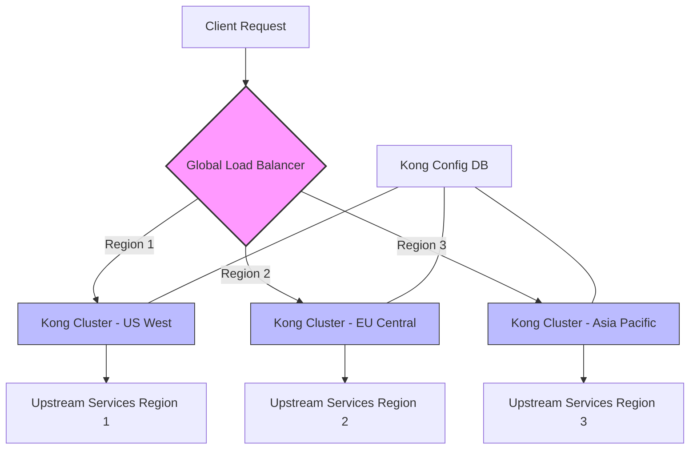

# Kong Multi-Region Setup

## Introduction

When building global applications, ensuring your API infrastructure is resilient, performant, and compliant with geographic data regulations becomes crucial. Kong, a popular API gateway, can be deployed across multiple geographic regions to address these needs. This guide will walk you through the process of setting up Kong in a multi-region architecture, explaining the benefits, challenges, and implementation steps.

Multi-region deployments help you:
- Reduce latency for global users
- Improve disaster recovery capabilities
- Meet data sovereignty requirements
- Enhance system reliability

## Prerequisites

Before setting up a multi-region Kong deployment, make sure you have:

- Experience with basic Kong configuration
- Access to cloud infrastructure in multiple regions
- Basic understanding of networking concepts
- Familiarity with container orchestration (like Kubernetes) or VM management

## Understanding Multi-Region Architecture

In a multi-region Kong setup, you'll deploy Kong instances across different geographic locations, with each region capable of handling API traffic independently while maintaining synchronization.



## Core Components

A multi-region Kong setup consists of:

1. **Kong Gateway Clusters**: Independent Kong deployments in each region
2. **Database Backend**: Either:
   - Centralized database with read replicas
   - Independent databases with synchronization
3. **Global Load Balancer**: Directs traffic to the nearest healthy region
4. **Configuration Management**: System to ensure consistent configuration across regions

## Step-by-Step Implementation

### Step 1: Database Strategy Selection

Choose one of the following approaches:

#### Option A: Centralized Database with Replicas

```bash
# Example for PostgreSQL setup with read replicas
# Primary DB setup in Region 1
pg_basebackup -h primary.db -D /var/lib/postgresql/data -U replication -W -P

# Configure kong.conf to use the appropriate DB in each region
# Region 1 (primary)
pg_host = primary.db.example.com
pg_port = 5432

# Region 2 (read replica)
pg_host = replica.eu.db.example.com
pg_port = 5432
```

#### Option B: Decentralized Database with Kong Vitals

```bash
# Configure kong.conf for independent databases
# Region 1
pg_host = us-west.db.example.com
pg_port = 5432

# Region 2
pg_host = eu-central.db.example.com
pg_port = 5432

# Enable Kong Vitals for synchronization
vitals = on
vitals_strategy = prometheus
vitals_statsd_udp_address = metrics.example.com:8125
```

### Step 2: Kong Cluster Setup in Each Region

```bash
# Example Kubernetes deployment for Region 1 (US-West)
$ kubectl create namespace kong-us-west
$ helm install kong-us-west kong/kong \
  --namespace kong-us-west \
  --set env.pg_host=us-west.db.example.com \
  --set env.pg_password=<PASSWORD> \
  --set env.pg_user=kong \
  --set env.pg_database=kong \
  --set env.proxy_access_log=/dev/stdout \
  --set env.proxy_error_log=/dev/stderr \
  --set ingressController.installCRDs=false

# Repeat for other regions with appropriate configuration
```

### Step 3: Configure Global Load Balancer

Most cloud providers offer global load balancing solutions:

```yaml
# Example AWS Global Accelerator configuration
Resources:
  GlobalAccelerator:
    Type: AWS::GlobalAccelerator::Accelerator
    Properties:
      Name: kong-global-accelerator
      Enabled: true
  
  Listener:
    Type: AWS::GlobalAccelerator::Listener
    Properties:
      AcceleratorArn: !Ref GlobalAccelerator
      PortRanges:
        - FromPort: 80
          ToPort: 80
        - FromPort: 443
          ToPort: 443
      Protocol: TCP
  
  EndpointGroup1:
    Type: AWS::GlobalAccelerator::EndpointGroup
    Properties:
      ListenerArn: !Ref Listener
      EndpointGroupRegion: us-west-2
      EndpointConfigurations:
        - EndpointId: nlb-us-west-2
          Weight: 100
  
  EndpointGroup2:
    Type: AWS::GlobalAccelerator::EndpointGroup
    Properties:
      ListenerArn: !Ref Listener
      EndpointGroupRegion: eu-central-1
      EndpointConfigurations:
        - EndpointId: nlb-eu-central-1
          Weight: 100
```

### Step 4: Synchronize Kong Configuration

For consistent API configurations across regions, use one of these approaches:

#### Option A: Declarative Configuration (recommended)

```yaml
# kong.yaml - Declarative configuration file
_format_version: "2.1"
_transform: true

services:
  - name: example-service
    url: https://api.example.com
    plugins:
      - name: rate-limiting
        config:
          minute: 5
          policy: local
    routes:
      - name: example-route
        paths:
          - /example
```

Deploy using:

```bash
# Push configuration to all regions
$ for region in us-west eu-central ap-southeast; do
    kubectl exec -it -n kong-$region deployment/kong-kong -- \
    kong config db_import /kong/declarative/kong.yaml
  done
```

#### Option B: Kong Decks (for CI/CD pipelines)

```bash
# Install deck CLI
$ curl -sL https://github.com/kong/deck/releases/download/v1.13.0/deck_1.13.0_linux_amd64.tar.gz | tar xz -C /tmp
$ sudo cp /tmp/deck /usr/local/bin/

# Export configuration from one region
$ deck dump --kong-addr http://kong-admin.us-west:8001 -o kong-config.yaml

# Sync to other regions
$ deck sync --kong-addr http://kong-admin.eu-central:8001 -s kong-config.yaml
$ deck sync --kong-addr http://kong-admin.ap-southeast:8001 -s kong-config.yaml
```

### Step 5: Test Your Multi-Region Setup

Verify that your setup works by testing:

```bash
# Test access through global load balancer
$ curl -i https://api-global.example.com/example

# Test direct access to each region
$ curl -i https://api-us-west.example.com/example
$ curl -i https://api-eu-central.example.com/example
```

Ensure the configuration is consistent by checking:

```bash
$ for region in us-west eu-central ap-southeast; do
    curl -s http://kong-admin.$region:8001/services | jq '.data[].name'
  done
```

## Challenges and Solutions

### Data Consistency

**Challenge**: Ensuring all Kong instances have the same configuration.

**Solution**: Use declarative configuration with automated deployment pipelines.

```bash
# Example CI/CD script (bash)
#!/bin/bash
set -e

# Generate Kong configuration
kong config init

# Validate configuration
kong config parse kong.yaml

# Deploy to all regions
for region in ${KONG_REGIONS}; do
  echo "Deploying to $region..."
  curl -X POST http://kong-admin.${region}:8001/config \
    -F config=@kong.yaml
done
```

### Latency Between Regions

**Challenge**: High latency between regions can cause synchronization issues.

**Solution**: Use asynchronous updates and eventual consistency model.

```yaml
# Kong configuration for better handling of latency issues
_format_version: "2.1"
_transform: true

plugins:
  - name: rate-limiting
    config:
      minute: 10
      policy: redis
      redis_host: redis.example.com
      redis_port: 6379
      redis_timeout: 2000
      redis_database: 0
```

### Disaster Recovery

**Challenge**: Handling region failures gracefully.

**Solution**: Implement proper health checks and automatic failover.

```bash
# Configure health checks for Kong instances
$ kubectl apply -f - <<EOF
apiVersion: networking.k8s.io/v1
kind: Ingress
metadata:
  name: kong-proxy
  annotations:
    kubernetes.io/ingress.class: "kong"
    konghq.com/health-checks: "true"
    konghq.com/health-check-path: "/status"
    konghq.com/health-check-timeout: "5000"
    konghq.com/health-check-interval: "10000"
spec:
  rules:
  - http:
      paths:
      - path: /
        pathType: Prefix
        backend:
          service:
            name: kong-proxy
            port:
              number: 80
EOF
```

## Best Practices

1. **Deploy in at least three regions** for maximum availability
2. **Automate everything** including configuration, deployments, and testing
3. **Monitor across regions** with centralized observability
4. **Test region failures** regularly to ensure resilience
5. **Implement progressive rollouts** of configuration changes
6. **Use canary deployments** to validate changes in one region before global deployment

## Example: Complete Multi-Region Setup for an E-commerce API

This example demonstrates setting up Kong for a global e-commerce platform with regions in the US, Europe, and Asia.

```yaml
# kong.yaml - Complete configuration example
_format_version: "2.1"
_transform: true

# Upstream services in each region
upstreams:
  - name: product-service
    targets:
      - target: product-service.us-west.svc:8080
        tags: ["region:us-west"]
      - target: product-service.eu-central.svc:8080
        tags: ["region:eu-central"]
      - target: product-service.ap-southeast.svc:8080
        tags: ["region:ap-southeast"]

# Services and routes
services:
  - name: products-api
    url: http://product-service/
    routes:
      - name: product-list
        paths:
          - /products
        methods:
          - GET
      - name: product-detail
        paths:
          - /products/(?<id>\d+)
        methods:
          - GET
      - name: product-create
        paths:
          - /products
        methods:
          - POST
        plugins:
          - name: jwt
          - name: rate-limiting
            config:
              minute: 10
              policy: redis

# Global plugins
plugins:
  - name: cors
    config:
      origins:
        - "*.example.com"
      methods:
        - GET
        - POST
        - PUT
      headers:
        - Authorization
        - Content-Type
      credentials: true
      max_age: 3600
  
  - name: prometheus
    config:
      status_code_metrics: true
      latency_metrics: true
      upstream_health_metrics: true
```

## Summary

Setting up Kong in a multi-region architecture provides significant benefits for global applications, including improved latency, disaster recovery, and geographic compliance. By following the steps outlined in this guide, you can create a resilient API infrastructure that serves users worldwide with high performance and reliability.

The key components to remember are:
- Database strategy (centralized or distributed)
- Regional Kong clusters
- Global load balancing
- Configuration synchronization
- Proper monitoring and testing

## Additional Resources

- [Kong Enterprise Documentation](https://docs.konghq.com/enterprise/)
- [Multi-region Kubernetes Deployments](https://kubernetes.io/docs/concepts/cluster-administration/federation/)
- [Database Replication Patterns](https://www.postgresql.org/docs/current/high-availability.html)
- [Global Load Balancing Strategies](https://aws.amazon.com/blogs/networking-and-content-delivery/latency-based-routing-with-aws-global-accelerator/)

## Exercises

1. Set up a local multi-region Kong environment using Docker Compose with three separate networks simulating different regions.

2. Implement a CI/CD pipeline that automatically validates and deploys Kong configuration changes to all regions.

3. Create a disaster recovery plan for your Kong multi-region setup, including procedures for handling region outages.

4. Design a monitoring dashboard that provides visibility into Kong performance across all regions.

5. Implement a blue-green deployment strategy for Kong configurations that allows testing changes in one region before deploying globally.