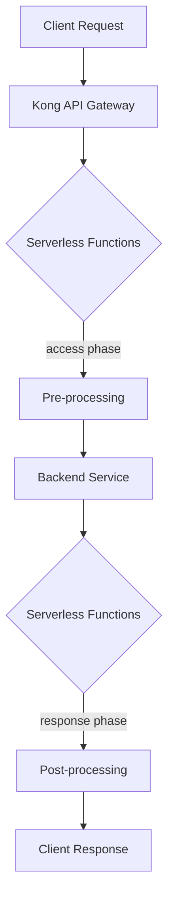

# Kong Serverless Functions

## Introduction

Kong Serverless Functions allow you to run custom code directly within the Kong API Gateway without deploying separate microservices. This feature enables you to extend Kong's functionality by injecting custom logic at different points in the request/response lifecycle.

Serverless functions in Kong provide several advantages:

- **Reduced infrastructure complexity** - Run code directly in Kong without managing additional servers
- **Lower latency** - Avoid network hops between services
- **Simplified development workflow** - Deploy code changes without redeploying entire services
- **Cost efficiency** - Only consume resources when functions are invoked

In this guide, we'll explore how Kong Serverless Functions work, how to implement them, and examine some practical use cases.

## Prerequisites

Before getting started with Kong Serverless Functions, you should have:

- Basic understanding of API Gateways and microservices
- Kong Gateway installed (version 2.0 or later)
- Familiarity with JavaScript/Node.js
- Basic knowledge of HTTP protocol

## How Kong Serverless Functions Work

Kong Serverless Functions operate within the request/response lifecycle of the API Gateway. You can inject custom code at different phases:



Kong provides two main phases for serverless execution:

1. **Access Phase** - Executes before the request is proxied to the upstream service
2. **Response Phase** - Executes after receiving a response from the upstream service

## Setting Up Kong Serverless Functions

### Installing the Plugin

To use serverless functions, you need to enable the `serverless-functions` plugin in Kong. This can be done via the Admin API:

```bash
curl -X POST http://localhost:8001/plugins/ \
  --data "name=serverless-functions" \
  --data "config.functions=@access.js,@response.js"
```

Or through a declarative configuration (Kong YAML):

```yaml
plugins:
- name: serverless-functions
  config:
    functions:
    - "@access.js"
    - "@response.js"
```

### Writing Your First Serverless Function

Kong serverless functions are written in JavaScript and have access to Kong's PDK (Plugin Development Kit). Here's a simple example of an access phase function:

```javascript
// access.js
Kong.log.info("Executing access phase serverless function")

// Get client IP address
const clientIP = kong.client.get_forwarded_ip()
kong.log.info("Client IP: " + clientIP)

// Add a custom header to the request
kong.service.request.set_header("X-Custom-Header", "Custom Value")

// Continue to the upstream service
return kong.response.exit(200)
```

And here's a response phase function example:

```javascript
// response.js
Kong.log.info("Executing response phase serverless function")

// Get the response status code
const status = kong.service.response.get_status()
kong.log.info("Response status: " + status)

// Add a custom header to the response
kong.response.set_header("X-Response-Time", Date.now().toString())

// Continue with the response
return kong.response.exit(status)
```

## Practical Use Cases

Let's explore some practical applications of Kong Serverless Functions:

### 1. Request Transformation

You can use serverless functions to transform incoming requests before they reach your backend services:

```javascript
// request-transform.js
// Parse the incoming request body
const body = kong.request.get_body()

// Transform the body
if (body) {
  // Add a timestamp field
  body.timestamp = Date.now()
  
  // Convert snake_case to camelCase
  if (body.user_name) {
    body.userName = body.user_name
    delete body.user_name
  }
  
  // Set the transformed body
  kong.service.request.set_body(body)
}

// Continue to the upstream service
return kong.response.exit(200)
```

### 2. Authentication and Authorization

Implement custom authentication logic:

```javascript
// auth.js
// Get the API key from the request header
const apiKey = kong.request.get_header("X-API-Key")

// Check if the API key is valid
if (!apiKey || !isValidApiKey(apiKey)) {
  return kong.response.exit(401, { message: "Unauthorized: Invalid API key" })
}

// If valid, add user information to the request
const user = getUserByApiKey(apiKey)
kong.service.request.set_header("X-User-ID", user.id)
kong.service.request.set_header("X-User-Role", user.role)

// Continue to the upstream service
return kong.response.exit(200)

// Helper functions
function isValidApiKey(key) {
  // In a real implementation, you would check against a database or cache
  const validKeys = ["key1", "key2", "key3"]
  return validKeys.includes(key)
}

function getUserByApiKey(key) {
  // Mock implementation
  return { id: "123", role: "admin" }
}
```

### 3. Response Caching

Implement a simple caching mechanism:

```javascript
// cache.js
// Generate a cache key based on the request
const cacheKey = kong.request.get_path() + kong.request.get_query()

// Check if we have a cached response
const cachedResponse = kong.cache.get(cacheKey)
if (cachedResponse) {
  kong.log.info("Cache hit for: " + cacheKey)
  return kong.response.exit(200, cachedResponse.body, cachedResponse.headers)
}

// If no cache hit, continue to the upstream service
kong.log.info("Cache miss for: " + cacheKey)
return kong.response.exit(200)
```

And in the response phase:

```javascript
// cache-response.js
// Only cache successful responses
const status = kong.service.response.get_status()
if (status === 200) {
  const cacheKey = kong.request.get_path() + kong.request.get_query()
  const responseBody = kong.service.response.get_body()
  const responseHeaders = kong.service.response.get_headers()
  
  // Store in cache for 5 minutes (300 seconds)
  kong.cache.set(cacheKey, { 
    body: responseBody, 
    headers: responseHeaders 
  }, 300)
}

// Continue with the response
return kong.response.exit(status)
```

### 4. Rate Limiting

Implement custom rate limiting logic:

```javascript
// rate-limit.js
// Get client identifier (IP address or API key)
const clientId = kong.request.get_header("X-API-Key") || kong.client.get_forwarded_ip()

// Check current rate
const rateLimitKey = "rate_limit:" + clientId
let currentCount = kong.cache.get(rateLimitKey) || 0

// Define limit (100 requests per minute)
const LIMIT = 100
const WINDOW = 60 // seconds

if (currentCount >= LIMIT) {
  return kong.response.exit(429, { message: "Too many requests" })
}

// Increment counter
kong.cache.set(rateLimitKey, currentCount + 1, WINDOW)

// Add rate limit headers
kong.response.set_header("X-RateLimit-Limit", LIMIT.toString())
kong.response.set_header("X-RateLimit-Remaining", (LIMIT - currentCount - 1).toString())

// Continue to the upstream service
return kong.response.exit(200)
```

## Best Practices

When working with Kong Serverless Functions, keep these best practices in mind:

1. **Keep functions lightweight** - Serverless functions should execute quickly to avoid adding latency
2. **Handle errors gracefully** - Always implement proper error handling
3. **Use caching when possible** - Leverage Kong's built-in caching for better performance
4. **Monitor function performance** - Set up proper logging and monitoring
5. **Secure sensitive data** - Be careful with how you handle credentials or personally identifiable information
6. **Test thoroughly** - Validate functions under various conditions before deployment

## Debugging Kong Serverless Functions

To debug your serverless functions, you can use Kong's logging capabilities:

```javascript
// debug.js
// Log request information
kong.log.info("Request path: " + kong.request.get_path())
kong.log.info("Request method: " + kong.request.get_method())
kong.log.info("Request headers: " + JSON.stringify(kong.request.get_headers()))

try {
  // Your function logic here
  const result = someOperation()
  kong.log.info("Operation result: " + result)
} catch (error) {
  kong.log.err("Error in serverless function: " + error.message)
  return kong.response.exit(500, { error: "Internal Server Error" })
}

// Continue to the upstream service
return kong.response.exit(200)
```

Check Kong's error logs to see the output:

```bash
tail -f /usr/local/kong/logs/error.log
```

## Deployment Strategies

There are several ways to deploy serverless functions to Kong:

1. **Inline in Kong configuration**:
   ```yaml
   plugins:
   - name: serverless-functions
     config:
       functions:
       - |
         function(request, response)
           -- Your code here
           return kong.response.exit(200)
         end
   ```

2. **From external files**:
   ```yaml
   plugins:
   - name: serverless-functions
     config:
       functions:
       - "@access.js"
       - "@response.js"
   ```

3. **Using Kong's DB-less mode with declarative configuration**:
   ```bash
   kong start -c kong.conf --db-less
   ```

## Limitations

Be aware of these limitations when working with Kong Serverless Functions:

1. **Execution time** - Functions should complete quickly (ideally under 50ms)
2. **Language support** - Currently only JavaScript is supported
3. **External dependencies** - Limited ability to use external libraries
4. **Statelessness** - Functions should be stateless and not rely on local storage
5. **Memory limits** - Functions run in Kong's memory space and should be lightweight

## Examples: Complete Implementation

Let's build a complete example that combines several concepts:

```javascript
// api-gateway.js
// This serverless function implements multiple API gateway patterns:
// - Authentication
// - Request transformation
// - Response transformation
// - Basic analytics

// --- ACCESS PHASE ---

// 1. Authentication check
const apiKey = kong.request.get_header("X-API-Key")
if (!apiKey) {
  return kong.response.exit(401, { error: "API key required" })
}

// Simple key validation (in production, use a more secure approach)
const validKeys = ["test-key-1", "test-key-2", "test-key-3"] 
if (!validKeys.includes(apiKey)) {
  return kong.response.exit(403, { error: "Invalid API key" })
}

// 2. Track API usage
const timestamp = Date.now()
const path = kong.request.get_path()
const method = kong.request.get_method()

// Store analytics data (in a real scenario, you'd use a persistent store)
kong.log.info(`API_ANALYTICS|${timestamp}|${apiKey}|${method}|${path}`)

// 3. Request transformation
// Add headers for downstream services
kong.service.request.set_header("X-Request-ID", generateUUID())
kong.service.request.set_header("X-Request-Time", timestamp.toString())

// 4. Continue to upstream service
return kong.response.exit(200)

// --- Helper functions ---

// Generate a simple UUID v4
function generateUUID() {
  return 'xxxxxxxx-xxxx-4xxx-yxxx-xxxxxxxxxxxx'.replace(/[xy]/g, function(c) {
    const r = Math.random() * 16 | 0, v = c == 'x' ? r : (r & 0x3 | 0x8)
    return v.toString(16)
  })
}
```

And a response phase function:

```javascript
// api-gateway-response.js
// --- RESPONSE PHASE ---

// Get the response status and headers
const status = kong.service.response.get_status()
const headers = kong.service.response.get_headers()

// 1. Add response headers
kong.response.set_header("X-Response-Time", Date.now().toString())
kong.response.set_header("X-Powered-By", "Kong Serverless Functions")

// 2. Transform error responses to a consistent format
if (status >= 400) {
  let body = kong.service.response.get_body()
  try {
    // If body is a string, parse it as JSON
    if (typeof body === 'string') {
      body = JSON.parse(body)
    }
  } catch (e) {
    // If parsing fails, create a new body
    body = { message: body }
  }
  
  // Create standardized error response
  const errorResponse = {
    status: status,
    error: getErrorName(status),
    message: body.message || body.error || "An error occurred",
    timestamp: new Date().toISOString(),
    path: kong.request.get_path()
  }
  
  return kong.response.exit(status, errorResponse)
}

// 3. Continue with the response for successful requests
return kong.response.exit(status)

// --- Helper functions ---

// Get error name from status code
function getErrorName(status) {
  const errorMap = {
    400: "Bad Request",
    401: "Unauthorized",
    403: "Forbidden",
    404: "Not Found",
    500: "Internal Server Error",
    502: "Bad Gateway",
    503: "Service Unavailable"
  }
  return errorMap[status] || "Unknown Error"
}
```

## Performance Considerations

Kong Serverless Functions are executed within the Kong gateway itself, which means they can impact the overall performance of your API gateway. Here are some performance considerations:

1. **Function complexity** - Keep your functions simple and focused
2. **Memory usage** - Avoid large data structures or memory-intensive operations
3. **CPU usage** - Limit CPU-intensive calculations
4. **I/O operations** - Minimize network calls or file operations
5. **Caching** - Use caching for expensive operations

## Summary

Kong Serverless Functions provide a powerful way to extend Kong API Gateway's functionality without deploying separate microservices. They allow you to inject custom logic at different points in the request/response lifecycle, enabling use cases like:

- Authentication and authorization
- Request and response transformation
- Caching
- Rate limiting
- Analytics and logging
- Error handling

By leveraging serverless functions, you can build more flexible and efficient API architectures while reducing infrastructure complexity and operational overhead.

## Additional Resources

To continue learning about Kong Serverless Functions:

- Experiment with the examples in this guide
- Try implementing your own custom functions for specific use cases
- Consider more complex scenarios like service composition or request routing

## Exercises

1. **Basic Function**: Write a serverless function that adds a custom header to all outgoing responses.
2. **Request Validation**: Create a function that validates incoming request bodies against a JSON schema.
3. **Mock Service**: Implement a function that returns mock data for a specific endpoint, bypassing the upstream service.
4. **Analytics**: Build a function that collects basic analytics about API usage and logs them.
5. **Advanced Security**: Create a function that implements JWT validation and role-based access control.