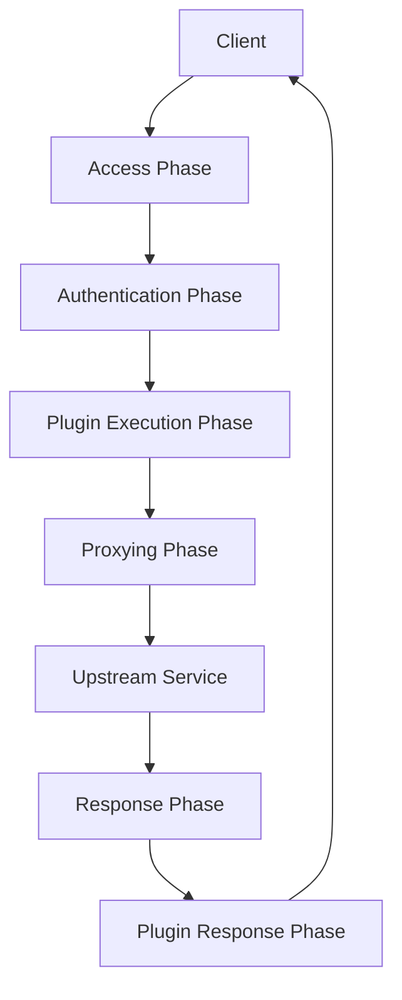

# Kong Custom Plugin

## Introduction

Kong is a powerful, open-source API gateway and microservices management layer that sits in front of your APIs. One of Kong's most valuable features is its extensibility through plugins. While Kong offers many [built-in plugins](https://docs.konghq.com/hub/) for authentication, security, traffic control, and more, you can also create custom plugins to implement specific functionality that meets your unique requirements.

In this tutorial, we'll explore how to create custom plugins for Kong, enabling you to extend Kong's capabilities and tailor it to your specific use cases. By the end, you'll understand how to build, deploy, and manage your own Kong plugins.

## Prerequisites

Before we dive in, make sure you have:

- Basic understanding of API gateways and Kong
- Kong Gateway installed (version 2.0 or later recommended)
- Basic knowledge of Lua programming language (Kong plugins are written in Lua)
- Development environment with text editor and terminal

## Understanding Kong Plugins

### What is a Kong Plugin?

A Kong plugin is a piece of Lua code that gets executed during the Kong request/response lifecycle. Plugins can perform various operations, such as:

- Authentication and authorization
- Request/response transformation
- Logging and monitoring
- Rate limiting and traffic control
- Custom business logic

### Kong Plugin Architecture

Kong follows a modular architecture with a well-defined request/response lifecycle:



Plugins can hook into different phases of this lifecycle, allowing you to modify or analyze the request/response at various stages.

## Creating Your First Custom Plugin

Let's create a simple custom plugin that adds a custom header to each request. We'll call it `custom-header`.

### Step 1: Set Up the Plugin Structure

Kong plugins follow a specific directory structure. Create the following directory and files:

```
kong-custom-plugin/
├── kong-plugin-custom-header-0.1.0-1.rockspec
└── kong
    └── plugins
        └── custom-header
            ├── handler.lua
            └── schema.lua
```

### Step 2: Define the Plugin Schema

The `schema.lua` file defines the configuration parameters for your plugin:

```lua
local typedefs = require "kong.db.schema.typedefs"

return {
  name = "custom-header",
  fields = {
    { consumer = typedefs.no_consumer },
    { protocols = typedefs.protocols_http },
    { config = {
        type = "record",
        fields = {
          { header_name = { type = "string", default = "X-Custom-Header" }, },
          { header_value = { type = "string", default = "Kong-Custom-Plugin" }, },
        },
      },
    },
  },
}
```

This schema defines two configuration parameters:
- `header_name`: The name of the custom header (default: "X-Custom-Header")
- `header_value`: The value of the custom header (default: "Kong-Custom-Plugin")

### Step 3: Implement the Plugin Handler

The `handler.lua` file contains the actual logic of your plugin:

```lua
local CustomHandler = {
  VERSION  = "0.1.0",
  PRIORITY = 1000,
}

function CustomHandler:access(conf)
  kong.service.request.set_header(conf.header_name, conf.header_value)
end

return CustomHandler
```

This handler:
- Sets a version and priority for your plugin
- Implements the `access` phase function, which adds the custom header defined in the configuration

### Step 4: Create the Rockspec File

The `.rockspec` file is used to package and distribute your plugin:

```lua
package = "kong-plugin-custom-header"
version = "0.1.0-1"
source = {
  url = "git://github.com/yourusername/kong-plugin-custom-header",
  tag = "0.1.0"
}
description = {
  summary = "Kong plugin that adds a custom header to requests",
  homepage = "https://github.com/yourusername/kong-plugin-custom-header",
  license = "MIT"
}
dependencies = {
  "lua >= 5.1"
}
build = {
  type = "builtin",
  modules = {
    ["kong.plugins.custom-header.handler"] = "kong/plugins/custom-header/handler.lua",
    ["kong.plugins.custom-header.schema"] = "kong/plugins/custom-header/schema.lua",
  }
}
```

## Installing Your Custom Plugin

### Installing Locally for Development

1. Navigate to your plugin directory:
   ```bash
   cd kong-custom-plugin
   ```

2. Install the plugin:
   ```bash
   luarocks make
   ```

3. Enable the plugin in Kong's configuration (`kong.conf`):
   ```
   plugins = bundled,custom-header
   ```

4. Restart Kong:
   ```bash
   kong restart
   ```

### Deploying in Production

For production environments, you have several options:

1. Package your plugin as a LuaRock:
   ```bash
   luarocks pack kong-plugin-custom-header
   ```

2. Add it to your Kong container/VM image

3. Use Kong's Plugin Development Kit (PDK) for advanced distribution

## Using Your Custom Plugin

### Enabling the Plugin Globally

To enable your plugin for all services:

```bash
curl -X POST http://localhost:8001/plugins/ \
  --data "name=custom-header" \
  --data "config.header_name=X-Custom-Header" \
  --data "config.header_value=Hello-World"
```

### Enabling for a Specific Service

To enable your plugin for a specific service:

```bash
curl -X POST http://localhost:8001/services/{service_id}/plugins \
  --data "name=custom-header" \
  --data "config.header_name=X-Service-Header" \
  --data "config.header_value=Service-Specific"
```

### Enabling for a Specific Route

To enable your plugin for a specific route:

```bash
curl -X POST http://localhost:8001/routes/{route_id}/plugins \
  --data "name=custom-header" \
  --data "config.header_name=X-Route-Header" \
  --data "config.header_value=Route-Specific"
```

### Verifying the Plugin is Working

Once your plugin is enabled, you can verify it's working by sending a request to your API through Kong and checking the headers:

```bash
curl -i http://localhost:8000/your-api-endpoint
```

You should see your custom header in the upstream request.

## Advanced Plugin Development

Let's explore more advanced plugin development topics:

### Plugin Lifecycle and Phases

Kong plugins can hook into multiple phases of the request/response lifecycle:

- `init_worker`: Called when Kong initializes the Lua worker
- `certificate`: Called during TLS handshake
- `rewrite`: Early-stage request processing
- `access`: Authentication and authorization
- `header_filter`: Processing response headers
- `body_filter`: Processing response body
- `log`: Final phase, for logging purposes

Here's an example of a plugin that hooks into multiple phases:

```lua
local AdvancedPlugin = {
  VERSION  = "0.1.0",
  PRIORITY = 1000,
}

function AdvancedPlugin:init_worker()
  kong.log.debug("Plugin initialized")
end

function AdvancedPlugin:rewrite(conf)
  kong.log.debug("Rewrite phase")
end

function AdvancedPlugin:access(conf)
  kong.log.debug("Access phase")
  kong.service.request.set_header("X-Custom-Header", "Custom Value")
end

function AdvancedPlugin:header_filter(conf)
  kong.log.debug("Header filter phase")
  kong.response.set_header("X-Response-Header", "Response Value")
end

function AdvancedPlugin:log(conf)
  kong.log.debug("Logging request details")
end

return AdvancedPlugin
```

### Using Kong PDK

Kong provides a Plugin Development Kit (PDK) that offers a stable interface to Kong's functionality. Here are some common PDK functions:

#### Request/Response Manipulation

```lua
-- Get request information
local path = kong.request.get_path()
local method = kong.request.get_method()
local headers = kong.request.get_headers()
local query_params = kong.request.get_query()

-- Modify request
kong.service.request.set_header("X-Modified", "true")
kong.service.request.set_path("/modified" .. path)

-- Modify response
kong.response.set_header("X-Response", "Modified")
kong.response.set_status(201)
```

#### Logging and Debugging

```lua
kong.log.debug("Debug message")
kong.log.info("Info message")
kong.log.err("Error message")
```

#### Cache Access

```lua
local value, err = kong.cache:get("my_key", nil, function()
  return "cached_value"
end)
```

### Real-World Plugin Example: Rate Limiting by IP Address

Let's create a more practical plugin that implements rate limiting based on client IP addresses:

```lua
-- schema.lua
local typedefs = require "kong.db.schema.typedefs"

return {
  name = "ip-rate-limiter",
  fields = {
    { consumer = typedefs.no_consumer },
    { protocols = typedefs.protocols_http },
    { config = {
        type = "record",
        fields = {
          { limit = { type = "number", default = 100 }, },
          { window_size = { type = "number", default = 60 }, },
        },
      },
    },
  },
}
```

```lua
-- handler.lua
local IPRateLimiter = {
  VERSION  = "0.1.0",
  PRIORITY = 901,  -- Run after authentication plugins
}

local redis = require "resty.redis"

function IPRateLimiter:access(conf)
  -- Get client IP
  local client_ip = kong.client.get_ip()
  
  -- Connect to Redis
  local red = redis:new()
  red:set_timeout(2000)
  local ok, err = red:connect("127.0.0.1", 6379)
  
  if not ok then
    kong.log.err("Failed to connect to Redis: ", err)
    return
  end
  
  -- Create Redis key
  local key = "rate_limit:" .. client_ip
  
  -- Increment counter
  local current, err = red:incr(key)
  if not current then
    kong.log.err("Failed to increment counter: ", err)
    return
  end
  
  -- Set expiry on key for first request in window
  if current == 1 then
    red:expire(key, conf.window_size)
  end
  
  -- Check if rate limit exceeded
  if current > conf.limit then
    return kong.response.exit(429, { message = "Rate limit exceeded" })
  end
  
  -- Set headers
  kong.response.set_header("X-RateLimit-Limit", conf.limit)
  kong.response.set_header("X-RateLimit-Remaining", conf.limit - current)
  
  -- Close Redis connection
  local ok, err = red:set_keepalive(10000, 100)
  if not ok then
    kong.log.err("Failed to set Redis keepalive: ", err)
  end
end

return IPRateLimiter
```

## Testing Your Plugins

### Unit Testing with Busted

Kong uses Busted for unit testing. Here's a simple example for our custom header plugin:

```lua
-- spec/custom-header/01-unit_spec.lua
local PLUGIN_NAME = "custom-header"

describe(PLUGIN_NAME .. ": (unit)", function()
  local plugin, conf
  
  setup(function()
    -- Load the plugin
    plugin = require("kong.plugins." .. PLUGIN_NAME .. ".handler")
    
    -- Mock Kong PDK
    _G.kong = {
      service = {
        request = {
          set_header = function() end
        }
      }
    }
    
    -- Spy on the set_header function
    spy.on(_G.kong.service.request, "set_header")
    
    conf = {
      header_name = "X-Test-Header",
      header_value = "Test-Value"
    }
  end)
  
  describe("access", function()
    it("adds the configured header", function()
      plugin:access(conf)
      assert.spy(_G.kong.service.request.set_header).was_called_with("X-Test-Header", "Test-Value")
    end)
  end)
end)
```

### Integration Testing

To run integration tests, you'll need a running Kong instance:

```lua
-- spec/custom-header/02-integration_spec.lua
local helpers = require "spec.helpers"

local PLUGIN_NAME = "custom-header"

describe(PLUGIN_NAME .. ": (integration)", function()
  local client
  
  setup(function()
    local bp = helpers.get_db_utils()
    
    -- Create a test route and service
    local service = bp.services:insert {
      name = "test-service",
      url = "http://mockbin.org"
    }
    
    local route = bp.routes:insert {
      hosts = { "test.com" },
      service = service
    }
    
    -- Add the plugin to the route
    bp.plugins:insert {
      name = PLUGIN_NAME,
      route = { id = route.id },
      config = {
        header_name = "X-Test-Header",
        header_value = "Test-Value"
      }
    }
    
    -- Start Kong
    assert(helpers.start_kong({
      plugins = "bundled," .. PLUGIN_NAME,
    }))
  end)
  
  teardown(function()
    helpers.stop_kong()
  end)
  
  before_each(function()
    client = helpers.proxy_client()
  end)
  
  after_each(function()
    if client then client:close() end
  end)
  
  describe("request", function()
    it("adds the configured header", function()
      local r = client:get("/request", {
        headers = { host = "test.com" }
      })
      assert.response(r).has.status(200)
      local body = assert.response(r).has.jsonbody()
      assert.equal("Test-Value", body.headers["X-Test-Header"])
    end)
  end)
end)
```

## Debugging Plugins

When developing plugins, you might encounter issues. Here are some tips for debugging:

1. Enable debug logging in Kong:
   ```
   log_level = debug
   ```

2. Use `kong.log.debug()` statements in your plugin code

3. Check Kong error logs:
   ```bash
   tail -f /usr/local/kong/logs/error.log
   ```

4. Test your plugins with curl and examine the responses:
   ```bash
   curl -i http://localhost:8000/your-api-endpoint
   ```

## Best Practices for Kong Plugin Development

1. **Follow the Kong Plugin Design Pattern**
   - Create separate schema.lua and handler.lua files
   - Use appropriate plugin priority

2. **Use Kong PDK**
   - Leverage Kong's Plugin Development Kit instead of direct Nginx APIs
   - This ensures compatibility with future Kong versions

3. **Error Handling**
   - Implement proper error handling in your plugins
   - Use kong.log for debugging and error reporting

4. **Testing**
   - Write unit and integration tests for your plugins
   - Test all configuration options

5. **Performance**
   - Keep plugins lightweight and efficient
   - Minimize external dependencies
   - Use caching when appropriate

6. **Documentation**
   - Document your plugin's purpose, configuration, and usage
   - Include examples

## Common Use Cases for Custom Plugins

1. **Custom Authentication**
   - Implementing proprietary or legacy authentication schemes

2. **Request/Response Transformation**
   - Adding/removing headers
   - Modifying request/response bodies
   - Format conversion (XML to JSON, etc.)

3. **Business Logic**
   - Feature flags
   - A/B testing
   - User-specific processing

4. **Advanced Logging and Monitoring**
   - Custom analytics
   - Audit logging
   - Performance metrics

5. **Traffic Control**
   - Custom rate limiting
   - Request routing based on content
   - Canary deployments

## Summary

In this tutorial, we've explored how to create, deploy, and test custom plugins for Kong API Gateway:

1. We learned about Kong's plugin architecture and lifecycle
2. We created a simple custom header plugin
3. We explored more advanced plugin development techniques
4. We implemented a practical IP-based rate limiting plugin
5. We covered testing and debugging strategies
6. We discussed best practices and common use cases

Kong's plugin system provides a powerful way to extend the gateway's functionality to meet your specific requirements. By creating custom plugins, you can implement unique business logic, integrate with legacy systems, and build a truly tailored API management solution.

## Further Resources

To continue learning about Kong plugins:

1. **Official Documentation**
   - [Kong Plugin Development Guide](https://docs.konghq.com/gateway/latest/plugin-development/)
   - [Kong PDK Reference](https://docs.konghq.com/gateway/latest/pdk/)

2. **Books and Courses**
   - "API Gateway Pattern & Kong" by Marco Palladino
   - "Microservices API Design with Kong" - Kong Academy

3. **Practice Exercises**
   - Modify the custom header plugin to support multiple headers
   - Create a plugin that modifies request/response bodies
   - Implement a plugin that integrates with a third-party service

By mastering Kong custom plugin development, you'll be able to extend Kong's capabilities to support virtually any API management requirement your organization might have.