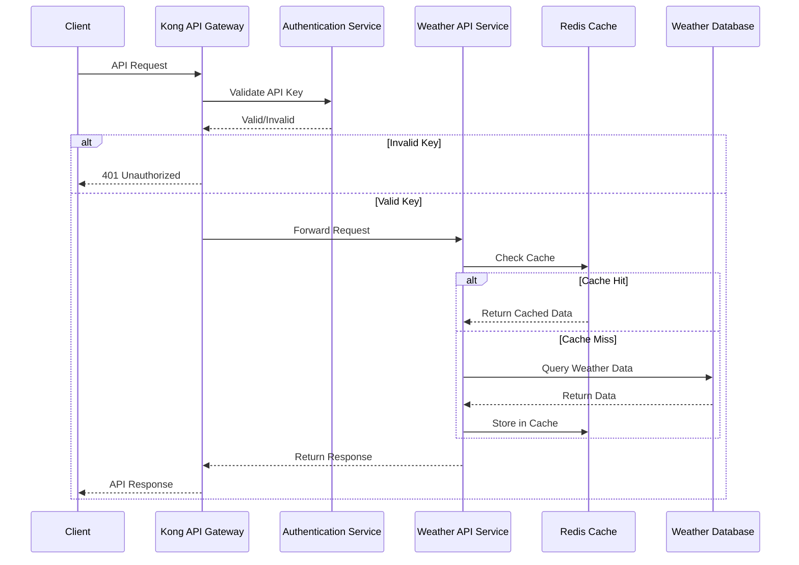

# Kong Developer Portal

## Introduction

The Kong Developer Portal is a powerful feature of Kong Gateway that allows organizations to create, manage, and publish API documentation. It serves as a centralized hub where developers can discover, learn about, and interact with your APIs. By providing well-organized documentation, interactive API testing capabilities, and user management features, the Developer Portal bridges the gap between API providers and consumers.

For beginners working with Kong, understanding how to effectively utilize the Developer Portal is essential for creating a professional developer experience around your APIs.

## What is Kong Developer Portal?

Kong Developer Portal is a customizable web application that:

- Publishes API documentation automatically from your Kong Gateway configuration
- Provides interactive API testing capabilities (similar to Swagger UI or Postman)
- Offers user registration and management for API consumers
- Supports customization of themes, layouts, and content
- Can be extended with plugins and custom code

Think of it as your API's "storefront" - where developers come to learn about and use your services.

## Key Concepts

Before diving into implementation, let's understand some fundamental concepts:

### Portal Files and Workspaces

Kong Developer Portal organizes content using:

- **Workspaces**: Logical separations allowing you to manage multiple developer portals from one Kong instance
- **Files**: Content files (Markdown, images, code) that make up your portal
- **Specifications**: OpenAPI (formerly Swagger) or other API specification files

### Portal Templates

The Developer Portal uses templates to render content:
- **Themes**: Control the visual appearance of your portal
- **Layouts**: Define how content is structured
- **Partials**: Reusable components that can be included in multiple pages

### Authentication and Access Control

The portal provides several authentication options:
- **Developer accounts**: Self-service registration for API consumers
- **Basic Auth**: Simple username/password authentication
- **OIDC/OAuth**: Integration with external identity providers
- **Custom plugins**: Build your own authentication mechanisms

## Setting Up Kong Developer Portal

Let's walk through setting up a basic Developer Portal step by step:

### Prerequisites

Before starting, ensure you have:

1. Kong Gateway installed (Enterprise Edition for full Developer Portal features)
2. Kong Manager access
3. Basic understanding of APIs and RESTful concepts

### Step 1: Enable the Developer Portal

First, we need to enable the Developer Portal in Kong:

```bash
# Using Kong configuration file (kong.conf)
portal = on
portal_gui_host = localhost:8003
portal_api_url = localhost:8004

# Or using environment variables
export KONG_PORTAL=on
export KONG_PORTAL_GUI_HOST=localhost:8003
export KONG_PORTAL_API_URL=localhost:8004
```

After making these changes, restart Kong to apply them:

```bash
kong restart
```

### Step 2: Create a Workspace (Enterprise only)

Kong Enterprise organizes portals by workspaces. Let's create one:

```bash
# Using the Admin API
curl -X POST http://localhost:8001/workspaces \
  -d "name=my-first-workspace"
```

The response will look similar to:

```json
{
  "name": "my-first-workspace",
  "created_at": 1678901234,
  "id": "a1b2c3d4-5678-90ab-cdef-ghijklmnopqr",
  "config": {
    "portal": true,
    "portal_access": true
  }
}
```

### Step 3: Enable Portal for the Workspace

```bash
# Enable Developer Portal for a workspace
curl -X PATCH http://localhost:8001/workspaces/my-first-workspace \
  -d "config.portal=true" \
  -d "config.portal_access=true"
```

### Step 4: Create Your First API Documentation

Let's create a simple Markdown file for our documentation:

```bash
# Create a new file in the Developer Portal
curl -X POST http://localhost:8001/my-first-workspace/files \
  -d "path=/content/welcome.md" \
  -d "contents=# Welcome to Our API

This is the documentation for our amazing API."
```

### Step 5: Access Your Developer Portal

After configuration, access your portal at:
- Portal GUI: http://localhost:8003/my-first-workspace
- Portal API: http://localhost:8004/my-first-workspace

## Customizing Your Developer Portal

Now let's explore how to customize the portal to match your organization's needs.

### Working with Content

The Developer Portal uses a file-based content system. You can manage content in several ways:

#### 1. Using the Kong Manager UI

The easiest approach is through Kong Manager:

1. Navigate to http://localhost:8002
2. Select your workspace
3. Click on "Developer Portal" > "Editor"
4. Create and modify files through the web interface

#### 2. Using the Files API

For programmatic management, use the Files API:

```bash
# List all files
curl http://localhost:8001/my-first-workspace/files

# Create a new file
curl -X POST http://localhost:8001/my-first-workspace/files \
  -d "path=/content/getting-started.md" \
  -d "contents=# Getting Started

Follow these steps to begin using our API."

# Update an existing file
curl -X PATCH http://localhost:8001/my-first-workspace/files/content/getting-started.md \
  -d "contents=# Getting Started

Here's how to get started with our awesome API."

# Delete a file
curl -X DELETE http://localhost:8001/my-first-workspace/files/content/unwanted-file.md
```

### Creating API Specifications

The true power of the Developer Portal comes from its ability to render interactive API documentation from OpenAPI specifications:

1. Create an OpenAPI specification file (YAML or JSON)
2. Upload it to your Developer Portal
3. Kong automatically generates interactive documentation

Here's an example of uploading a specification:

```bash
# Upload OpenAPI spec
curl -X POST http://localhost:8001/my-first-workspace/files \
  -d "path=/specs/my-api.yaml" \
  -d @my-api-spec.yaml
```

Example OpenAPI specification (simplified):

```yaml
openapi: 3.0.0
info:
  title: Pet Store API
  version: 1.0.0
  description: A sample API that uses a pet store as an example
paths:
  /pets:
    get:
      summary: List all pets
      responses:
        '200':
          description: A list of pets
          content:
            application/json:
              schema:
                type: array
                items:
                  type: object
                  properties:
                    id:
                      type: integer
                    name:
                      type: string
```

### Customizing Portal Appearance

The Developer Portal's appearance can be customized through themes and templates:

#### Modifying Theme Files

```bash
# Update the main CSS file
curl -X PATCH http://localhost:8001/my-first-workspace/files/themes/base/assets/css/main.css \
  -d "contents=body { font-family: 'Arial', sans-serif; background-color: #f5f5f5; }"
```

#### Creating Custom Layouts

```bash
# Create a custom homepage layout
curl -X POST http://localhost:8001/my-first-workspace/files \
  -d "path=/layouts/home.html" \
  -d "contents=<div class=\"hero\">
  <h1>{{page.title}}</h1>
  <p>{{page.description}}</p>
</div>
<div class=\"content\">
  {{{page.content}}}
</div>"
```

## Application Example: Building a Complete Developer Portal

Let's put everything together to create a complete Developer Portal for a fictional weather API service:

### Step 1: Set Up the Portal Structure

Create these essential files:

1. Homepage (`/content/index.md`)
2. API Documentation (`/content/api-docs.md`)
3. Getting Started Guide (`/content/getting-started.md`)
4. Authentication Guide (`/content/authentication.md`)
5. OpenAPI Specification (`/specs/weather-api.yaml`)

### Step 2: Create the Homepage

```bash
curl -X POST http://localhost:8001/my-first-workspace/files \
  -d "path=/content/index.md" \
  -d "contents=---
title: Weather API Documentation
description: Access global weather data through our simple RESTful API
---

# Welcome to the Weather API

Our Weather API provides real-time and forecast weather data for any location worldwide. This developer portal contains everything you need to integrate with our services.

## API Features

- Current weather conditions
- 7-day forecasts
- Historical weather data
- Severe weather alerts
- Global coverage

[Get Started](/getting-started) | [API Reference](/api-docs)"
```

### Step 3: Add API Documentation with Examples

```bash
curl -X POST http://localhost:8001/my-first-workspace/files \
  -d "path=/content/api-docs.md" \
  -d "contents=---
title: API Reference
description: Complete reference for the Weather API endpoints
---

# API Reference

## Endpoints

### GET /current/{city}

Retrieve current weather for a specified city.

**Example Request:**

```bash
curl -X GET \"https://api.example.com/weather/current/london\" \\
  -H \"Authorization: Bearer YOUR_API_KEY\"
```

**Example Response:**

```json
{
  \"location\": {
    \"name\": \"London\",
    \"country\": \"United Kingdom\",
    \"coordinates\": {
      \"lat\": 51.51,
      \"lon\": -0.13
    }
  },
  \"current\": {
    \"temperature\": 18.5,
    \"feels_like\": 17.8,
    \"humidity\": 72,
    \"wind_speed\": 12.5,
    \"wind_direction\": \"NE\",
    \"condition\": \"Partly Cloudy\"
  },
  \"updated_at\": \"2023-06-15T14:30:00Z\"
}
```"
```

### Step 4: Create a Flow Diagram with Mermaid

```bash
curl -X POST http://localhost:8001/my-first-workspace/files \
  -d "path=/content/architecture.md" \
  -d "contents=---
title: API Architecture
description: Understanding how our Weather API works
---

# Weather API Architecture

This diagram illustrates how our Weather API processes requests:



This architecture ensures high performance through caching while maintaining data accuracy and security."
```

## Implementing Developer Authentication

Kong Developer Portal supports various authentication methods for portal users:

### Basic Authentication (Default)

Users can register through the portal with email/password:

```bash
# Enable developer authentication
curl -X PATCH http://localhost:8001/my-first-workspace \
  -d "config.portal_auth=basic-auth"
```

### OAuth 2.0 / OpenID Connect

For enterprise integrations, configure OIDC:

```bash
# Configure OIDC for portal authentication
curl -X PATCH http://localhost:8001/my-first-workspace \
  -d "config.portal_auth=openid-connect" \
  -d "config.portal_auth_conf={\"issuer\": \"https://auth.example.com\", \"client_id\": \"your-client-id\", \"client_secret\": \"your-client-secret\", \"scopes\": [\"openid\", \"profile\", \"email\"]}"
```

## Managing API Access and Keys

A key feature of Kong Developer Portal is the ability for developers to request access to APIs:

### Configure API Access Requests

```bash
# Enable API access requests
curl -X PATCH http://localhost:8001/my-first-workspace \
  -d "config.portal_api_access=true"
```

When enabled, developers can:
1. Browse available API products/services
2. Request access credentials
3. Manage their API keys directly through the portal

## Best Practices for Kong Developer Portal

To create an effective Developer Portal:

### 1. Organize Content Logically

Structure your documentation with a clear hierarchy:
- Overview/Introduction
- Getting Started
- API Reference
- Use Cases/Tutorials
- SDKs and Libraries
- Troubleshooting

### 2. Include Interactive Examples

Use the built-in API console for interactive testing:

```md
---
title: Interactive Example
---

# Try the API

You can test our API directly from this page:

<div class="api-explorer">
  <spec-renderer spec-url="/specs/weather-api.yaml" operation-id="getCurrentWeather" />
</div>
```

### 3. Maintain Consistent Style

Use a style guide for your documentation to maintain consistency:
- Consistent terminology
- Standard code examples
- Uniform formatting
- Clear navigation

### 4. Provide Code Samples in Multiple Languages

```md
# Authentication Examples

## Python
```python
import requests

api_key = "your_api_key"
headers = {"Authorization": f"Bearer {api_key}"}
response = requests.get("https://api.example.com/weather/current/london", headers=headers)
data = response.json()
print(data)
```

## JavaScript
```javascript
fetch("https://api.example.com/weather/current/london", {
  headers: {
    "Authorization": `Bearer ${apiKey}`
  }
})
.then(response => response.json())
.then(data => console.log(data));
```
```

### 5. Version Your Documentation

Maintain documentation for different API versions:
- Clearly indicate version numbers
- Highlight deprecated features
- Provide migration guides
- Document breaking changes

## Troubleshooting Common Issues

### Portal Not Loading

If your Developer Portal isn't loading:

1. Check Kong is running:
   ```bash
   curl http://localhost:8001/status
   ```

2. Verify portal is enabled:
   ```bash
   curl http://localhost:8001/workspaces/my-first-workspace | grep portal
   ```

3. Check for errors in Kong logs:
   ```bash
   tail -f /usr/local/kong/logs/error.log
   ```

### Authentication Problems

If developers can't register or log in:

1. Verify auth configuration:
   ```bash
   curl http://localhost:8001/workspaces/my-first-workspace | grep portal_auth
   ```

2. Reset authentication if needed:
   ```bash
   curl -X PATCH http://localhost:8001/workspaces/my-first-workspace \
     -d "config.portal_auth=basic-auth" \
     -d "config.portal_auth_conf={}"
   ```

## Summary

The Kong Developer Portal is a powerful tool for API providers to create beautiful, functional documentation that helps developers consume their services. By following the steps in this guide, you can:

1. Set up and configure a Kong Developer Portal
2. Create and organize API documentation
3. Customize the portal appearance and behavior
4. Implement developer authentication
5. Manage API access requests

With a well-designed Developer Portal, you can improve developer experience, increase API adoption, and reduce support overhead.

## Additional Resources and Exercises

### Further Learning

- [Kong Documentation](https://docs.konghq.com/enterprise/latest/developer-portal/)
- [OpenAPI Specification](https://spec.openapis.org/oas/latest.html)
- [API Design Best Practices](https://swagger.io/resources/articles/best-practices-in-api-design/)

### Practice Exercises

1. **Basic Setup**: Enable the Developer Portal and create a basic homepage
2. **API Documentation**: Create documentation for a sample API with endpoints
3. **Custom Theme**: Modify the portal theme to match your organization's branding
4. **Interactive Testing**: Add an API console for testing endpoints
5. **Authentication**: Configure different authentication methods for your portal

### Advanced Challenge

Create a complete Developer Portal for a fictional e-commerce API with:
- Comprehensive documentation
- Custom theme and layout
- Interactive API testing
- Multiple API specifications
- Developer registration and key management