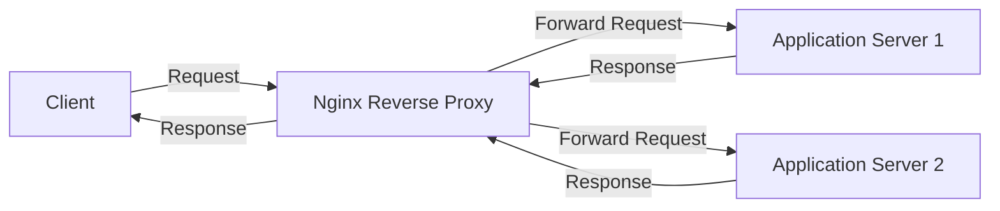

# Nginx Introduction

## What is Nginx?

Nginx (pronounced "engine-x") is a powerful, open-source web server that has gained enormous popularity due to its high performance, stability, rich feature set, and low resource consumption. Originally created by Igor Sysoev in 2004 to solve the C10K problem (handling 10,000+ concurrent connections), Nginx has evolved into a versatile tool used for web serving, reverse proxying, caching, load balancing, and more.

## Why Nginx Matters

In modern web development, Nginx plays a crucial role in:

- **Serving static content** efficiently
- **Proxying requests** to application servers
- **Load balancing** traffic across multiple servers
- **Improving security** as a frontend shield
- **Handling SSL/TLS** termination
- **Caching content** to improve performance

Whether you're building a personal blog, a high-traffic e-commerce site, or a microservices architecture, understanding Nginx fundamentals will significantly enhance your web infrastructure knowledge.

## Nginx vs. Apache: Key Differences

Nginx was designed to address performance limitations in traditional web servers like Apache. Here's how they differ:

| Feature                | Nginx                                                   | Apache                                        |
|------------------------|---------------------------------------------------------|-----------------------------------------------|
| Architecture           | Event-driven, asynchronous                              | Process-based, threaded                       |
| Performance under load | Handles thousands of concurrent connections efficiently | Performance can degrade with high concurrency |
| Memory footprint       | Relatively small                                        | Can be larger, especially with many modules   |
| Configuration          | Centralized, generally simpler                          | Distributed (.htaccess files), more complex   |
| Module system          | Modules compiled in                                     | Dynamic loading of modules                    |

## Getting Started with Nginx

### Installation

Installing Nginx is straightforward on most platforms:

**Ubuntu/Debian:**

```bash
sudo apt update
sudo apt install nginx
```

**CentOS/RHEL:**

```bash
sudo yum install epel-release
sudo yum install nginx
```

**macOS (using Homebrew):**

```bash
brew install nginx
```

**Windows:**
Download the Windows version from the [official Nginx website](http://nginx.org/en/download.html).

### Basic Commands

Once installed, you can manage Nginx with these commands:

```bash
# Start Nginx
sudo systemctl start nginx

# Stop Nginx
sudo systemctl stop nginx

# Restart Nginx
sudo systemctl restart nginx

# Reload configuration without stopping
sudo systemctl reload nginx

# Check configuration syntax
sudo nginx -t

# Check status
sudo systemctl status nginx
```

### Directory Structure

Understanding where Nginx keeps its files is important:

- **/etc/nginx/** - Main configuration directory
- **/etc/nginx/nginx.conf** - Primary configuration file
- **/etc/nginx/sites-available/** - Available site configurations
- **/etc/nginx/sites-enabled/** - Enabled site configurations (symlinks)
- **/var/log/nginx/** - Log files location
- **/var/www/html/** - Default document root for websites

## Basic Configuration

Nginx configuration uses a simple, declarative syntax. The main configuration file is typically located at `/etc/nginx/nginx.conf`.

### Configuration Structure

```nginx
# Main context
user nginx;
worker_processes auto;
error_log /var/log/nginx/error.log;

# Events context
events {
    worker_connections 1024;
}

# HTTP context
http {
    include /etc/nginx/mime.types;
    default_type application/octet-stream;
    
    # Logging settings
    access_log /var/log/nginx/access.log;
    
    # Server block (virtual host)
    server {
        listen 80;
        server_name example.com;
        
        # Location blocks
        location / {
            root /var/www/html;
            index index.html;
        }
    }
    
    # Include other configuration files
    include /etc/nginx/conf.d/*.conf;
}
```

The configuration consists of:

1. **Directives** - Single line commands like `user nginx;`
2. **Contexts** - Blocks enclosed in braces `{ }` that group related directives
3. **Comments** - Lines starting with `#`

### Creating a Simple Website

Let's create a basic website configuration:

1. Create an HTML file in the document root:

```bash
sudo mkdir -p /var/www/mysite
sudo nano /var/www/mysite/index.html
```

Add some content:

```html
<!DOCTYPE html>
<html>
<head>
    <title>My Nginx Website</title>
</head>
<body>
    <h1>Hello, Nginx!</h1>
    <p>If you see this, Nginx is working correctly.</p>
</body>
</html>
```

2. Create a server configuration:

```bash
sudo nano /etc/nginx/sites-available/mysite.conf
```

Add the following:

```nginx
server {
    listen 80;
    server_name mysite.local;
    
    root /var/www/mysite;
    index index.html;
    
    location / {
        try_files $uri $uri/ =404;
    }
}
```

3. Enable the site:

```bash
sudo ln -s /etc/nginx/sites-available/mysite.conf /etc/nginx/sites-enabled/
sudo nginx -t
sudo systemctl reload nginx
```

4. Add an entry to your hosts file (for local testing):

```bash
sudo nano /etc/hosts
```

Add:
```
127.0.0.1 mysite.local
```

Now visit http://mysite.local in your browser!

## Nginx as a Reverse Proxy

One of Nginx's most powerful features is its ability to act as a reverse proxy, forwarding requests to backend servers.



### Setting Up a Reverse Proxy

Here's how to proxy requests to a Node.js application running on port 3000:

```nginx
server {
    listen 80;
    server_name myapp.local;
    
    location / {
        proxy_pass http://localhost:3000;
        proxy_http_version 1.1;
        proxy_set_header Upgrade $http_upgrade;
        proxy_set_header Connection 'upgrade';
        proxy_set_header Host $host;
        proxy_cache_bypass $http_upgrade;
    }
}
```

This configuration:
1. Listens on port 80
2. Forwards all requests to the Node.js app on port 3000
3. Sets appropriate headers for WebSocket support

## Load Balancing with Nginx

Nginx can distribute traffic across multiple servers, improving reliability and performance.

### Basic Load Balancing Configuration

```nginx
# Define upstream servers
upstream backend_servers {
    server backend1.example.com;
    server backend2.example.com;
    server backend3.example.com;
}

server {
    listen 80;
    server_name myapp.example.com;
    
    location / {
        proxy_pass http://backend_servers;
        proxy_set_header Host $host;
        proxy_set_header X-Real-IP $remote_addr;
    }
}
```

This setup:
1. Defines a group of backend servers
2. Distributes requests among them using round-robin balancing (default)

### Load Balancing Methods

Nginx offers several load balancing algorithms:

- **Round-robin** (default): Requests are distributed evenly
- **Least connections**: Requests go to the server with the fewest active connections
- **IP hash**: Clients are consistently routed to the same server based on their IP

Example of IP hash:

```nginx
upstream backend_servers {
    ip_hash;
    server backend1.example.com;
    server backend2.example.com;
}
```

## Nginx Security Best Practices

Security is critical for any web server. Here are some Nginx security best practices:

### Hiding Server Information

```nginx
# In http context
http {
    server_tokens off;
}
```

### Configuring SSL/TLS

```nginx
server {
    listen 443 ssl;
    server_name secure.example.com;
    
    ssl_certificate /etc/nginx/ssl/example.com.crt;
    ssl_certificate_key /etc/nginx/ssl/example.com.key;
    ssl_protocols TLSv1.2 TLSv1.3;
    ssl_prefer_server_ciphers on;
    
    # Add HSTS header
    add_header Strict-Transport-Security "max-age=31536000" always;
}
```

### Basic Authentication

```nginx
location /admin {
    auth_basic "Restricted Content";
    auth_basic_user_file /etc/nginx/.htpasswd;
    # Other directives...
}
```

To create the password file:

```bash
sudo apt install apache2-utils
sudo htpasswd -c /etc/nginx/.htpasswd username
```

## Monitoring and Troubleshooting

### Checking Logs

Nginx logs are essential for troubleshooting:

```bash
# Access logs
sudo tail -f /var/log/nginx/access.log

# Error logs
sudo tail -f /var/log/nginx/error.log
```

### Common Issues and Solutions

1. **403 Forbidden**: Check file permissions and ownership
   ```bash
   sudo chown -R www-data:www-data /var/www/mysite
   ```

2. **502 Bad Gateway**: Backend server is unreachable or returning errors
   - Verify backend server is running
   - Check network connectivity
   - Review backend server logs

3. **Configuration Errors**: Always test before reloading
   ```bash
   sudo nginx -t
   ```

## Summary

Nginx is a versatile, high-performance web server that excels at serving static content, reverse proxying, load balancing, and more. Its event-driven architecture makes it incredibly efficient for handling concurrent connections.

In this introduction, we've covered:
- What Nginx is and why it's important
- Basic installation and configuration
- Setting up a simple website
- Using Nginx as a reverse proxy
- Implementing load balancing
- Security best practices
- Monitoring and troubleshooting

This foundation will help you build reliable, high-performance web infrastructures for your applications.

## Further Learning

To deepen your Nginx knowledge, consider exploring:

- **Rate limiting** to protect against traffic spikes
- **Caching** for improved performance
- **gzip compression** for reduced bandwidth usage
- **FastCGI** configuration for PHP and other languages
- **WebSocket** proxying for real-time applications
- **HTTP/2 and HTTP/3** for modern web performance

## Practice Exercises

1. Set up Nginx to serve a static website with custom error pages
2. Configure Nginx as a reverse proxy for a local development server
3. Implement basic authentication for a protected directory
4. Create a load-balanced configuration for multiple backend services
5. Set up HTTPS with a self-signed certificate for development