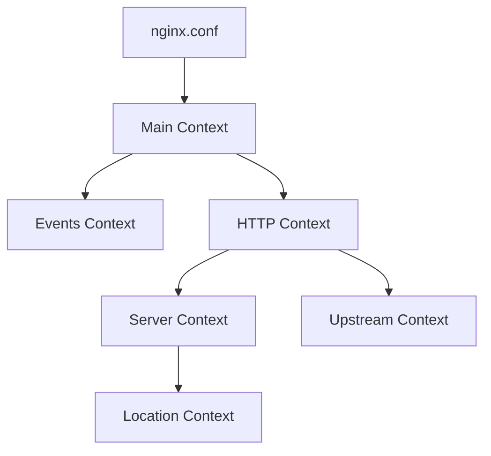

# Nginx Installation

## Introduction

Nginx (pronounced "engine-x") is a powerful, open-source web server that can also function as a reverse proxy, load balancer, mail proxy, and HTTP cache. Due to its efficient architecture that handles connections asynchronously, Nginx is known for its high performance, stability, rich feature set, and low resource consumption.

This guide will walk you through the installation process of Nginx on various operating systems, helping you set up your first web server. Whether you're using Linux, macOS, or Windows, we've got you covered with clear step-by-step instructions.

## Prerequisites

Before installing Nginx, ensure you have:

- Administrator/root access to your system
- Basic knowledge of command-line operations
- A stable internet connection for downloading packages

## Installation Methods

Let's explore how to install Nginx on different operating systems:

<div className="grid grid-cols-1 md:grid-cols-2 gap-4">
  <div className="bg-gray-100 p-4 rounded-md">
    <h3>Package Managers</h3>
    <p>Quick and easy for most use cases</p>
  </div>
  <div className="bg-gray-100 p-4 rounded-md">
    <h3>Source Code</h3>
    <p>Maximum flexibility and customization</p>
  </div>
</div>

## Installation on Linux

### Ubuntu/Debian

Ubuntu and Debian distributions make Nginx installation straightforward using the APT package manager:

```bash
# Update package index
sudo apt update

# Install Nginx
sudo apt install nginx

# Start Nginx service
sudo systemctl start nginx

# Enable Nginx to start on boot
sudo systemctl enable nginx

# Check status
sudo systemctl status nginx
```

Expected output:

```
● nginx.service - A high performance web server and a reverse proxy server
     Loaded: loaded (/lib/systemd/system/nginx.service; enabled; vendor preset: enabled)
     Active: active (running) since Mon 2023-01-09 12:34:56 UTC; 5s ago
       Docs: man:nginx(8)
   Main PID: 12345 (nginx)
      Tasks: 2 (limit: 1151)
     Memory: 3.5M
     CGroup: /system.slice/nginx.service
             ├─12345 nginx: master process /usr/sbin/nginx -g daemon on; master_process on;
             └─12346 nginx: worker process
```

### CentOS/RHEL/Rocky Linux/AlmaLinux

For Red Hat-based distributions, use the DNF (or YUM for older versions) package manager:

```bash
# Install EPEL repository (required for Nginx)
sudo dnf install epel-release

# Install Nginx
sudo dnf install nginx

# Start Nginx service
sudo systemctl start nginx

# Enable Nginx to start on boot
sudo systemctl enable nginx

# Check status
sudo systemctl status nginx
```

### Arch Linux

For Arch Linux and Arch-based distributions, use the Pacman package manager:

```bash
# Install Nginx
sudo pacman -S nginx

# Start Nginx service
sudo systemctl start nginx

# Enable Nginx to start on boot
sudo systemctl enable nginx
```

## Installation on macOS

### Using Homebrew

Homebrew is the preferred package manager for macOS:

```bash
# Install Homebrew if not already installed
/bin/bash -c "$(curl -fsSL https://raw.githubusercontent.com/Homebrew/install/HEAD/install.sh)"

# Install Nginx
brew install nginx

# Start Nginx
brew services start nginx
```

After installation, Nginx will be available at `http://localhost:8080/` by default.

## Installation on Windows

### Using Windows Package Manager (winget)

```powershell
# Install Nginx using winget
winget install nginx
```

### Manual Installation

1. Download the latest mainline version from the [official Nginx website](https://nginx.org/en/download.html)
2. Extract the zip file to a location of your choice (e.g., `C:
ginx`)
3. Open Command Prompt as Administrator and navigate to the Nginx directory:

```cmd
cd C:
ginx
start nginx
```

To verify the installation, open a web browser and navigate to `http://localhost`.

## Verifying Your Installation

After installation, verify that Nginx is running correctly:

1. Open a web browser
2. Navigate to `http://localhost` or `http://your_server_ip`
3. You should see the default Nginx welcome page:

```
Welcome to nginx!
If you see this page, the nginx web server is successfully installed and working.
```

## Installation from Source

For advanced users who need custom configurations or the latest features, compiling from source is the best option:

```bash
# Install dependencies
sudo apt install build-essential libpcre3-dev zlib1g-dev libssl-dev

# Download the latest stable version
wget https://nginx.org/download/nginx-1.24.0.tar.gz
tar -zxvf nginx-1.24.0.tar.gz
cd nginx-1.24.0

# Configure with common options
./configure --prefix=/usr/local/nginx \
            --with-http_ssl_module \
            --with-http_v2_module \
            --with-http_realip_module \
            --with-http_stub_status_module

# Compile and install
make
sudo make install

# Start Nginx
sudo /usr/local/nginx/sbin/nginx
```

## Basic Configuration Structure

After installation, it's important to understand the basic configuration structure:



The main configuration file is typically located at:

- Linux: `/etc/nginx/nginx.conf`
- macOS: `/usr/local/etc/nginx/nginx.conf`
- Windows: `C:
ginx\conf
ginx.conf`

## Basic Nginx Commands

Here are some essential commands to manage your Nginx server:

| Command | Description |
|---------|-------------|
| `nginx -t` | Test configuration file syntax |
| `nginx -s reload` | Reload configuration without stopping |
| `nginx -s stop` | Stop the Nginx server |
| `nginx -s quit` | Gracefully shut down the server |
| `nginx -v` | Show version information |

Example usage on Linux:

```bash
# Test your configuration
sudo nginx -t

# Reload configuration after changes
sudo nginx -s reload
```

On Windows:

```cmd
C:
ginx
ginx.exe -t
C:
ginx
ginx.exe -s reload
```

## Common Issues and Troubleshooting

### Port Conflicts

If Nginx fails to start, it might be due to port conflicts:

```bash
# Check if port 80 is already in use
sudo lsof -i:80

# Alternative with netstat
sudo netstat -tuln | grep 80
```

### Incorrect Permissions

Ensure Nginx has proper permissions:

```bash
# Set correct ownership
sudo chown -R www-data:www-data /var/www/html

# Set correct file permissions
sudo chmod -R 755 /var/www/html
```

## Security Considerations

After installation, consider these security measures:

1. Remove unnecessary default configurations
2. Create a dedicated Nginx user
3. Disable unused modules
4. Configure SSL/TLS properly
5. Set up proper access controls

## Next Steps

Now that you have Nginx installed, here are some suggestions for your next steps:

1. Configure a virtual host for your website
2. Set up SSL/TLS encryption with Let's Encrypt
3. Implement caching to improve performance
4. Configure Nginx as a reverse proxy for your applications

## Summary

In this guide, we've covered:

- Installing Nginx on various operating systems
- Verifying your installation
- Basic Nginx commands
- Initial troubleshooting steps
- Security considerations

Nginx's flexibility and performance make it an excellent choice for serving web content, proxying requests, load balancing, and more. With Nginx now installed on your system, you're ready to explore its powerful capabilities and configure it for your specific needs.

## Practice Exercises

1. Install Nginx on your preferred operating system
2. Create a simple HTML file and serve it through Nginx
3. Modify the default Nginx configuration to change the port
4. Set up a simple virtual host for a test domain

## Additional Resources

- [Nginx Official Documentation](https://nginx.org/en/docs/)
- [Nginx Community Forum](https://forum.nginx.org/)
- [Digital Ocean Nginx Tutorials](https://www.digitalocean.com/community/tags/nginx)