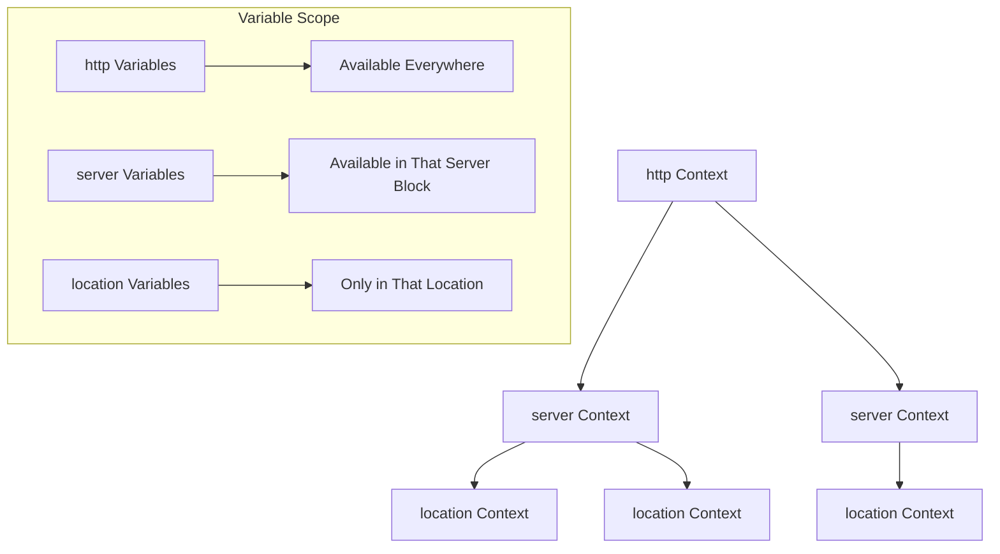

# Nginx Variables

## Introduction

Variables in Nginx provide a powerful way to create dynamic configurations. They allow you to store and manipulate data during request processing, making your Nginx setup more flexible and powerful. Whether you're setting up simple redirects or complex conditional logic, understanding Nginx variables is essential for mastering server configuration.

In this guide, we'll explore how variables work in Nginx, their different types, and how to use them effectively in your configurations.

## Understanding Nginx Variables

Nginx variables are placeholders that store values which can be used throughout your configuration files. They help you create dynamic configurations that adapt to different scenarios and conditions.

### Key characteristics of Nginx variables:

- They are prefixed with a dollar sign (`$`)
- They are evaluated at runtime for each request
- Their values can change during request processing
- They can be used in most configuration directives

## Types of Nginx Variables

Nginx has two main types of variables:

1. **Built-in variables**: Predefined by Nginx and represent various aspects of the request/response cycle
2. **Custom variables**: Defined by you in your configuration files

### Built-in Variables

Nginx comes with many built-in variables that provide information about the current request and connection. Here are some commonly used ones:

| Variable | Description |
|----------|-------------|
| `$uri` | Current URI (without query string) |
| `$request_uri` | Full original request URI (with query string) |
| `$args` | Query string parameters |
| `$arg_name` | Value of a specific query parameter (`name`) |
| `$http_user_agent` | Value of the User-Agent header |
| `$remote_addr` | Client IP address |
| `$server_name` | Name of the server processing the request |
| `$request_method` | HTTP method (GET, POST, etc.) |

Let's look at an example of how to use built-in variables:

```nginx
server {
    listen 80;
    server_name example.com;

    location / {
        return 200 "URI: $uri
Full request: $request_uri
Your IP: $remote_addr
";
    }
}
```

If a user visits `http://example.com/page?id=123`, they would see:

```
URI: /page
Full request: /page?id=123
Your IP: 192.168.1.100
```

### Custom Variables

You can create your own variables using the `set` directive. This allows you to store and manipulate data during request processing.

```nginx
server {
    listen 80;
    server_name example.com;

    # Define a custom variable
    set $mobile_device "false";

    # Check user agent and set the variable
    if ($http_user_agent ~* "mobile|android|iphone|ipad") {
        set $mobile_device "true";
    }

    location / {
        return 200 "Is mobile: $mobile_device";
    }
}
```

## Variable Evaluation and Scope

Nginx variables are evaluated at runtime for each request. Their scope depends on where they're defined:

- Variables defined at the `http` level are available to all server blocks
- Variables defined at the `server` level are available to all locations in that server block
- Variables defined at the `location` level are only available in that location



## Practical Examples

Let's explore some practical examples of using Nginx variables in real-world scenarios.

### Example 1: Redirecting based on query parameters

```nginx
server {
    listen 80;
    server_name example.com;

    location / {
        if ($arg_source = "newsletter") {
            set $campaign_source "email_campaign";
            return 302 /landing?campaign=$campaign_source;
        }
        
        # Normal processing
        root /var/www/html;
        index index.html;
    }
}
```

This configuration checks if the request has a query parameter `source=newsletter` and redirects to a landing page with a customized campaign parameter.

### Example 2: Conditional logging based on request type

```nginx
http {
    # Define a custom log format
    log_format detailed '$remote_addr - $remote_user [$time_local] '
                      '"$request" $status $body_bytes_sent '
                      '"$http_referer" "$http_user_agent"';

    server {
        listen 80;
        server_name example.com;

        # Initialize log variable
        set $log_file "access.log";

        # Change log file for API requests
        if ($uri ~* "^/api/") {
            set $log_file "api.log";
        }

        # Use variable in access_log directive
        access_log /var/log/nginx/$log_file detailed;

        location / {
            root /var/www/html;
            index index.html;
        }
    }
}
```

This configuration uses different log files for API requests and regular web requests.

### Example 3: Environment-based configuration

```nginx
server {
    listen 80;
    server_name example.com;

    # Set default environment
    set $environment "production";

    # Check for staging subdomain
    if ($host = "staging.example.com") {
        set $environment "staging";
    }

    # Set appropriate root directory based on environment
    root /var/www/$environment;

    location / {
        index index.html;
        
        # Show environment banner in staging
        if ($environment = "staging") {
            add_header X-Environment "STAGING SERVER" always;
        }
    }
}
```

This example uses variables to configure different settings based on whether the site is accessed through the production or staging domain.

## Advanced Variable Usage

### Variable Interpolation

You can include variables within strings for complex configurations:

```nginx
server {
    listen 80;
    server_name example.com;

    location / {
        set $greeting "Hello";
        set $name "World";
        
        # Combine variables
        return 200 "$greeting, $name!";
    }
}
```

This would return "Hello, World!" to the client.

### Using map for Variable Transformations

The `map` directive allows you to create new variables based on the values of other variables:

```nginx
http {
    # Map country codes to full names
    map $geoip_country_code $country_name {
        default "Unknown";
        US "United States";
        CA "Canada";
        UK "United Kingdom";
        FR "France";
        DE "Germany";
    }

    server {
        listen 80;
        server_name example.com;

        location / {
            return 200 "Your country: $country_name";
        }
    }
}
```

This example maps country codes from GeoIP to full country names for display.

### Using Nginx Variables with Proxy Configuration

Variables are particularly useful when configuring proxy settings:

```nginx
server {
    listen 80;
    server_name example.com;

    location /api/ {
        # Pass the original host header to the backend
        proxy_set_header Host $host;
        
        # Pass the real IP address
        proxy_set_header X-Real-IP $remote_addr;
        
        # Pass the protocol used by the client
        proxy_set_header X-Forwarded-Proto $scheme;
        
        # Set custom headers
        proxy_set_header X-API-Client "web";
        
        proxy_pass http://backend_servers;
    }
}
```

## Best Practices for Using Nginx Variables

1. **Avoid excessive variable use in performance-critical paths** - Variables add processing overhead
2. **Use meaningful variable names** - Make your configurations easier to understand
3. **Comment your variable usage** - Explain why you're using variables for complex logic
4. **Be careful with variable evaluation in if statements** - Nginx processes `if` directives differently than traditional programming languages
5. **Prefer `map` over `if` when possible** - The `map` directive is more efficient for variable transformations

## Summary

Nginx variables provide a powerful way to create dynamic, flexible server configurations. By understanding how to use both built-in and custom variables, you can:

- Create conditional logic in your server configuration
- Customize request and response handling based on various factors
- Pass important information between different parts of your configuration
- Build more sophisticated web server setups

With the knowledge from this guide, you should be able to leverage variables effectively in your Nginx configurations and create more dynamic, adaptable web server setups.

## Additional Resources and Exercises

### Resources
- The official [Nginx documentation on variables](http://nginx.org/en/docs/varindex.html)
- Nginx [directive reference](http://nginx.org/en/docs/dirindex.html)

### Exercises

1. **Basic Variable Usage**:
   - Create a configuration that displays different content based on the browser's User-Agent

2. **Custom Error Pages**:
   - Set up custom error pages that include the original requested URI using variables

3. **Request Routing Challenge**:
   - Create a configuration that routes requests to different backend servers based on the request path and query parameters

4. **Logging Enhancement**:
   - Extend the default Nginx logging format to include additional variables that would be useful for debugging