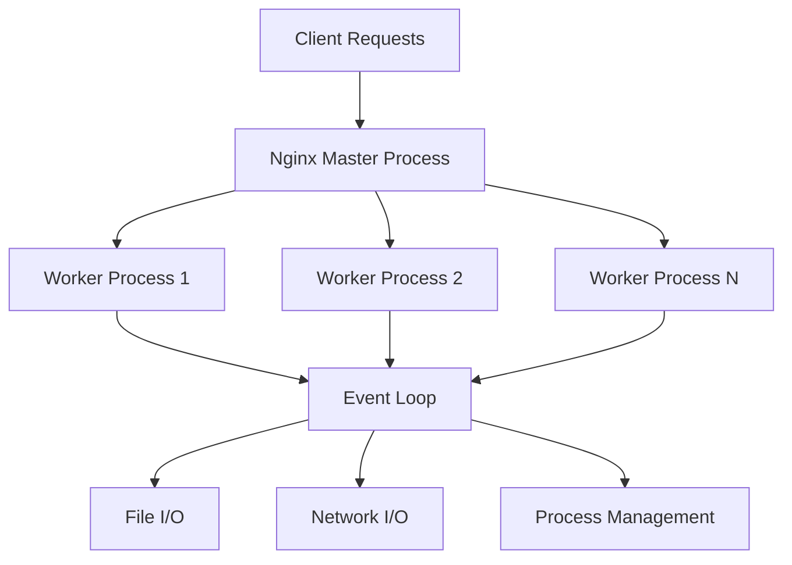

# Nginx Performance

## Introduction

Performance optimization is a critical aspect of web server management. Nginx (pronounced "engine-x") is renowned for its high performance, stability, and low resource consumption. This guide will help you understand how to configure and optimize Nginx to handle high traffic loads efficiently while maintaining fast response times.

Whether you're running a small personal blog or a high-traffic enterprise application, the performance techniques covered in this guide will help you get the most out of your Nginx installation.

## Why Nginx Performance Matters

Before diving into optimization techniques, let's understand why Nginx performance is crucial:

1. **User Experience**: Faster page loads lead to better user experiences and lower bounce rates
2. **SEO Rankings**: Page speed is a ranking factor for search engines
3. **Resource Efficiency**: Better performance means you can serve more visitors with the same hardware
4. **Cost Savings**: Optimized servers require less hardware, reducing infrastructure costs

## Understanding Nginx Architecture

Nginx's event-driven architecture is fundamental to its performance capabilities.



Unlike traditional web servers that create new processes or threads for each connection, Nginx uses an asynchronous, non-blocking approach that allows a single worker process to handle thousands of concurrent connections efficiently.

## Key Performance Configuration Directives

### Worker Processes

The `worker_processes` directive determines how many worker processes Nginx will use:

```nginx
# Set to the number of CPU cores for optimal performance
worker_processes auto;
```

Setting this to `auto` tells Nginx to detect the number of CPU cores and create an appropriate number of worker processes.

### Worker Connections

The `worker_connections` directive sets the maximum number of simultaneous connections each worker process can handle:

```nginx
events {
    worker_connections 1024;
}
```

The maximum number of clients you can serve simultaneously is approximately:
`worker_processes × worker_connections`

### Keepalive Connections

Keepalive connections reduce the overhead of establishing new connections:

```nginx
http {
    keepalive_timeout 65;
    keepalive_requests 100;
}
```

### Gzip Compression

Enabling compression reduces the size of data transferred:

```nginx
http {
    gzip on;
    gzip_comp_level 5;
    gzip_min_length 256;
    gzip_proxied any;
    gzip_vary on;
    gzip_types
        application/javascript
        application/json
        application/xml
        text/css
        text/plain
        text/xml;
}
```

## Buffering and Timeouts

Properly configured buffers and timeouts can significantly improve performance:

```nginx
http {
    client_body_buffer_size 10K;
    client_header_buffer_size 1k;
    client_max_body_size 8m;
    large_client_header_buffers 2 1k;
    
    client_body_timeout 12;
    client_header_timeout 12;
    send_timeout 10;
}
```

## Implementing Caching in Nginx

Caching is one of the most effective ways to improve Nginx performance.

### Basic Caching Configuration

```nginx
http {
    proxy_cache_path /var/cache/nginx levels=1:2 keys_zone=my_cache:10m max_size=10g inactive=60m;
    
    server {
        location / {
            proxy_cache my_cache;
            proxy_cache_valid 200 302 10m;
            proxy_cache_valid 404 1m;
            proxy_pass http://backend;
        }
    }
}
```

### Microcaching for Dynamic Content

For dynamic content that changes frequently but can tolerate slight delays in updates:

```nginx
http {
    proxy_cache_path /var/cache/nginx levels=1:2 keys_zone=microcache:10m max_size=1g inactive=1h;
    
    server {
        location / {
            proxy_cache microcache;
            proxy_cache_valid 200 302 15s;
            proxy_cache_use_stale updating;
            proxy_pass http://backend;
        }
    }
}
```

## Static File Serving Optimization

Nginx excels at serving static files efficiently:

```nginx
server {
    location ~* \.(jpg|jpeg|png|gif|ico|css|js)$ {
        expires 30d;
        add_header Cache-Control "public, no-transform";
        access_log off;
    }
}
```

This configuration:
- Sets long-term caching for static files (30 days)
- Adds appropriate Cache-Control headers
- Disables access logging for static files to reduce I/O

## Load Testing and Benchmarking

To measure the effectiveness of your optimizations, use benchmarking tools like `ab` (Apache Benchmark) or `wrk`.

Example using `ab` to test 10,000 requests with 100 concurrent connections:

```bash
ab -n 10000 -c 100 http://yourwebsite.com/
```

Sample output:

```
This is ApacheBench, Version 2.3 <$Revision: 1843412 $>

Server Software:        nginx/1.22.1
Server Hostname:        yourwebsite.com
Server Port:            80

Document Path:          /
Document Length:        15736 bytes

Concurrency Level:      100
Time taken for tests:   5.321 seconds
Complete requests:      10000
Failed requests:        0
Total transferred:      159560000 bytes
HTML transferred:       157360000 bytes
Requests per second:    1879.31 [#/sec] (mean)
Time per request:       53.211 [ms] (mean)
Time per request:       0.532 [ms] (mean, across all concurrent requests)
Transfer rate:          29275.88 [Kbytes/sec] received
```

## Real-World Optimization Example

Let's look at a complete optimization example for a WordPress site running behind Nginx:

```nginx
http {
    # Basic settings
    sendfile on;
    tcp_nopush on;
    tcp_nodelay on;
    keepalive_timeout 65;
    types_hash_max_size 2048;
    server_tokens off;
    
    # Gzip settings
    gzip on;
    gzip_disable "msie6";
    gzip_vary on;
    gzip_proxied any;
    gzip_comp_level 6;
    gzip_buffers 16 8k;
    gzip_http_version 1.1;
    gzip_types text/plain text/css application/json application/javascript text/xml application/xml application/xml+rss text/javascript;
    
    # FastCGI cache settings
    fastcgi_cache_path /var/run/nginx-cache levels=1:2 keys_zone=WORDPRESS:100m inactive=60m;
    fastcgi_cache_key "$scheme$request_method$host$request_uri";
    fastcgi_cache_use_stale error timeout invalid_header http_500;
    fastcgi_ignore_headers Cache-Control Expires Set-Cookie;
    
    server {
        listen 80;
        server_name example.com www.example.com;
        root /var/www/html;
        index index.php;
        
        # Set cache exceptions
        set $skip_cache 0;
        
        # Don't cache logged in users or recent commenters
        if ($http_cookie ~* "comment_author|wordpress_[a-f0-9]+|wp-postpass|wordpress_no_cache|wordpress_logged_in") {
            set $skip_cache 1;
        }
        
        # Don't cache these pages
        if ($request_uri ~* "/wp-admin/|/xmlrpc.php|wp-.*.php|/feed/|index.php|sitemap(_index)?.xml") {
            set $skip_cache 1;
        }
        
        location / {
            try_files $uri $uri/ /index.php?$args;
        }
        
        location ~ \.php$ {
            try_files $uri =404;
            fastcgi_split_path_info ^(.+\.php)(/.+)$;
            fastcgi_pass unix:/var/run/php/php7.4-fpm.sock;
            fastcgi_index index.php;
            include fastcgi_params;
            fastcgi_param SCRIPT_FILENAME $document_root$fastcgi_script_name;
            fastcgi_param PATH_INFO $fastcgi_path_info;
            
            # Caching
            fastcgi_cache_bypass $skip_cache;
            fastcgi_no_cache $skip_cache;
            fastcgi_cache WORDPRESS;
            fastcgi_cache_valid 200 301 302 60m;
            fastcgi_cache_valid 404 10m;
            add_header X-FastCGI-Cache $upstream_cache_status;
        }
        
        # Static file caching
        location ~* \.(js|css|png|jpg|jpeg|gif|ico)$ {
            expires max;
            log_not_found off;
        }
    }
}
```

This configuration:
1. Optimizes general settings for network performance
2. Configures effective gzip compression
3. Sets up FastCGI caching with intelligent rules for WordPress
4. Implements long-term caching for static assets
5. Adds debugging headers to verify caching status

## Performance Monitoring

Regularly monitor your Nginx performance using tools like:

1. **Nginx Status Page**:

```nginx
location /nginx_status {
    stub_status on;
    allow 127.0.0.1;
    deny all;
}
```

2. **Third-party monitoring tools** like Prometheus with the Nginx exporter
3. **Log analysis tools** like GoAccess

## HTTP/2 and HTTP/3 Support

Enabling HTTP/2 can significantly improve performance by allowing multiplexing of requests:

```nginx
server {
    listen 443 ssl http2;
    ssl_certificate /path/to/cert.pem;
    ssl_certificate_key /path/to/key.pem;
    
    # Other configurations...
}
```

For HTTP/3 (QUIC) support in newer Nginx versions:

```nginx
server {
    listen 443 quic reuseport;
    listen 443 ssl http2;
    
    http3 on;
    ssl_certificate /path/to/cert.pem;
    ssl_certificate_key /path/to/key.pem;
    
    # Add HTTP/3 headers
    add_header Alt-Svc 'h3=":443"; ma=86400';
}
```

## Common Performance Issues and Solutions

| Issue | Symptoms | Solution |
|-------|----------|----------|
| CPU bottleneck | High CPU usage, slow response | Optimize `worker_processes`, enable gzip compression |
| Memory issues | High swap usage, OOM errors | Adjust buffer sizes, optimize `worker_connections` |
| Disk I/O bottleneck | High wait times in monitoring | Implement caching, move logs to separate disk |
| Network congestion | Packet loss, high latency | Enable keepalives, HTTP/2, optimize TCP settings |
| Backend slowness | Timeouts, 504 errors | Implement microcaching, adjust proxy timeouts |

## Summary

Optimizing Nginx performance involves understanding and configuring several key areas:

1. **Worker and connection settings** to match your hardware capabilities
2. **Buffer and timeout configurations** to handle traffic efficiently
3. **Compression and caching** to reduce bandwidth and improve response times
4. **Static file optimizations** to serve assets efficiently
5. **Monitoring and benchmarking** to measure improvements

By applying these techniques, you can significantly improve your web server's performance, providing a better experience for your users while potentially reducing infrastructure costs.

## Additional Resources

- [Nginx Documentation](https://nginx.org/en/docs/)
- [Nginx Admin Guide](https://docs.nginx.com/nginx/admin-guide/)
- [Nginx Performance Tuning](https://www.nginx.com/blog/tuning-nginx/)

## Practice Exercises

1. Install Nginx and modify the `worker_processes` and `worker_connections` to match your system's capabilities.
2. Set up caching for a static website and measure the performance improvement using a benchmarking tool.
3. Configure Nginx as a reverse proxy with caching for a dynamic application (like WordPress) and compare performance before and after.
4. Implement HTTP/2 support and test the difference in loading times for a page with multiple assets.
5. Create a monitoring dashboard for your Nginx server using Prometheus and Grafana.