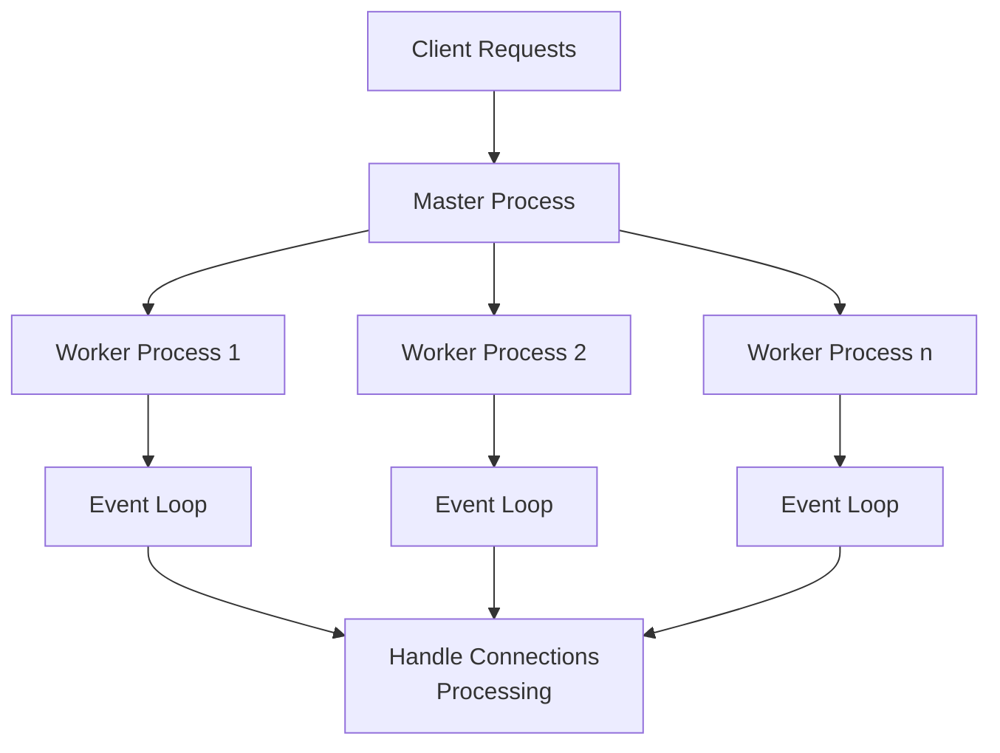
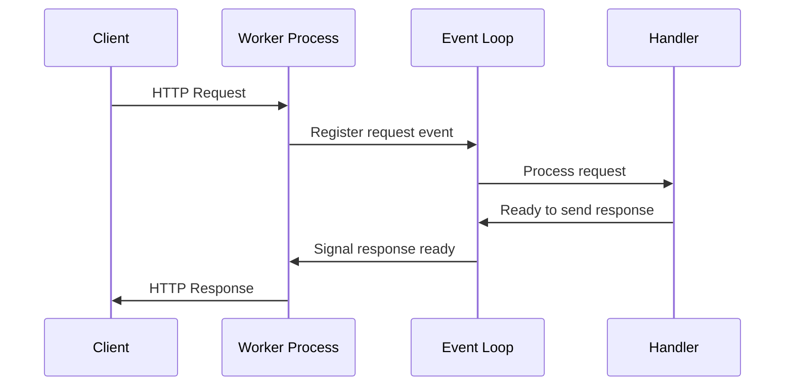

# Nginx Architecture

## Introduction

Nginx (pronounced "engine-x") is a powerful, open-source web server that has gained immense popularity due to its high performance, stability, scalability, and low resource consumption. Originally created to solve the C10K problem (handling 10,000 concurrent connections), Nginx's architecture makes it suitable for various tasks such as serving static content, reverse proxying, load balancing, and more.

In this guide, we'll explore the fundamental architecture of Nginx, understand its event-driven model, and examine how its components work together to deliver exceptional performance.

## Core Architectural Principles

### Event-Driven Architecture

Unlike traditional web servers that use a thread-based model, Nginx employs an event-driven, asynchronous architecture. This is the key to its ability to handle a large number of concurrent connections with minimal resource usage.



Traditional web servers typically create new processes or threads for each connection, which can lead to high memory usage and CPU overhead. Nginx, on the other hand, uses a more efficient approach:

1. A single master process that manages multiple worker processes
2. Worker processes that handle actual client connections
3. Each worker process contains an event loop that efficiently manages multiple connections

### Non-Blocking I/O

Nginx uses non-blocking I/O operations, which means that instead of waiting for a specific operation to complete before moving on, it can handle other tasks while waiting for I/O operations to finish. This approach dramatically improves efficiency when dealing with slow clients or when processing many concurrent connections.

## Master and Worker Processes

### Master Process

The master process in Nginx performs privileged operations such as:

- Reading configuration
- Binding to ports
- Starting worker processes

The master process doesn't handle any client connections directly. Its primary role is to manage the worker processes and apply configuration changes without service interruption.

Here's a simple way to check the master process:

```bash
ps aux | grep "nginx: master"
```

Output:
```
root  1234  0.0  0.0  12345  1234 ?  Ss  10:00  0:00 nginx: master process /usr/sbin/nginx
```

### Worker Processes

Worker processes are responsible for:
- Handling network connections
- Reading and writing content to disk
- Communicating with upstream servers (in proxy configurations)

By default, Nginx starts one worker process per CPU core, which can be configured in the `nginx.conf` file:

```nginx
worker_processes auto;  # Automatically use available CPU cores
# Or specify a number
# worker_processes 4;   # Use 4 worker processes
```

Each worker process is single-threaded but can handle thousands of concurrent connections. When a new request comes in, the operating system distributes it to one of the worker processes.

## Connection Processing

Nginx processes connections using an event loop mechanism known as the "event-driven approach":

1. Worker processes initialize and register event handlers
2. The event loop continuously checks for events (new connections, data ready to read, etc.)
3. When an event is detected, the appropriate handler processes it
4. The worker returns to the event loop to process more events

This approach is extremely efficient because workers don't block or wait for slow operations to complete. Instead, they process other requests while waiting for I/O operations to finish.

## Configuration Structure

Nginx's architecture is reflected in its configuration structure, which follows a hierarchical block-based format:

```nginx
# Main context (global configuration)
user www-data;
worker_processes auto;
error_log /var/log/nginx/error.log;
pid /var/run/nginx.pid;

# Events context (connection processing)
events {
    worker_connections 1024;
    use epoll;
}

# HTTP context
http {
    include mime.types;
    default_type application/octet-stream;
    
    # Server context
    server {
        listen 80;
        server_name example.com;
        
        # Location context
        location / {
            root /var/www/html;
            index index.html;
        }
    }
}
```

This modular configuration allows for flexible setup of different server contexts and location blocks.

## Module Architecture

Nginx's functionality is extended through modules, which are compiled into the server. These modules can be:

1. **Core modules**: Essential parts of Nginx functionality
2. **Standard modules**: Common features included in the base distribution
3. **Third-party modules**: Additional features developed by the community

This modular approach keeps the core clean and efficient while allowing for extensibility.

## Request Processing Flow

Let's examine how Nginx processes a typical HTTP request:



1. Client sends an HTTP request to Nginx
2. The request is accepted by one of the worker processes
3. The worker processes the request based on configured rules
4. If the request is for static content, Nginx serves it directly
5. For dynamic content, Nginx may proxy the request to an application server
6. The response is sent back to the client

## Real-World Example: Setting Up a Basic Server

Let's implement a simple Nginx server that serves static content and acts as a reverse proxy for a backend application:

```nginx
http {
    # Define upstream servers (backend application)
    upstream app_servers {
        server 127.0.0.1:8080;
        server 127.0.0.1:8081;
    }
    
    # Server configuration
    server {
        listen 80;
        server_name example.com;
        
        # Serve static files directly
        location /static/ {
            root /var/www;
            expires 30d;  # Enable caching
        }
        
        # Proxy requests to backend application
        location / {
            proxy_pass http://app_servers;
            proxy_set_header Host $host;
            proxy_set_header X-Real-IP $remote_addr;
        }
    }
}
```

In this configuration:
- Static files under `/static/` are served directly by Nginx
- All other requests are load-balanced between two backend servers
- Nginx adds HTTP headers to provide the backend with client information

## Performance Optimizations

Nginx's architecture allows for several performance optimizations:

### Worker Connections

You can tune the number of connections each worker can handle:

```nginx
events {
    worker_connections 2048;  # Each worker can handle 2048 connections
}
```

### Connection Keepalive

Keep connections open to reduce the overhead of creating new connections:

```nginx
http {
    keepalive_timeout 65;
    keepalive_requests 100;
}
```

### File Descriptors

Increase the limit of open file descriptors:

```nginx
worker_rlimit_nofile 65535;
```

### Buffer Sizes

Optimize various buffer sizes for different scenarios:

```nginx
http {
    client_body_buffer_size 10K;
    client_header_buffer_size 1k;
    client_max_body_size 8m;
    large_client_header_buffers 2 1k;
}
```

## Summary

Nginx's architecture is built around a few key principles:

1. **Event-Driven Model**: Using a non-blocking, asynchronous approach
2. **Worker Processes**: Distributing connections across multiple workers
3. **Efficient Resource Usage**: Minimizing memory footprint and CPU usage
4. **Modular Design**: Extending functionality through modules

These architectural choices make Nginx exceptionally well-suited for high-performance web serving, reverse proxying, and load balancing, particularly in environments with high concurrent connections.

## Exercises

1. Configure Nginx with 2 worker processes and limit each to 1024 connections. Test its performance using a tool like `ab` (Apache Bench).
2. Set up Nginx as a reverse proxy for a simple web application, adding custom headers along the way.
3. Configure Nginx to serve static files from one location and proxy dynamic requests to a backend server.
4. Implement a simple load balancer using Nginx to distribute traffic between two backend servers.

## Additional Resources

- [Nginx Official Documentation](https://nginx.org/en/docs/)
- [Understanding Nginx Configuration](https://www.nginx.com/resources/wiki/)
- [Nginx Cookbook](https://www.nginx.com/resources/library/complete-nginx-cookbook/)
- [Tuning Nginx for Performance](https://www.nginx.com/blog/tuning-nginx/)