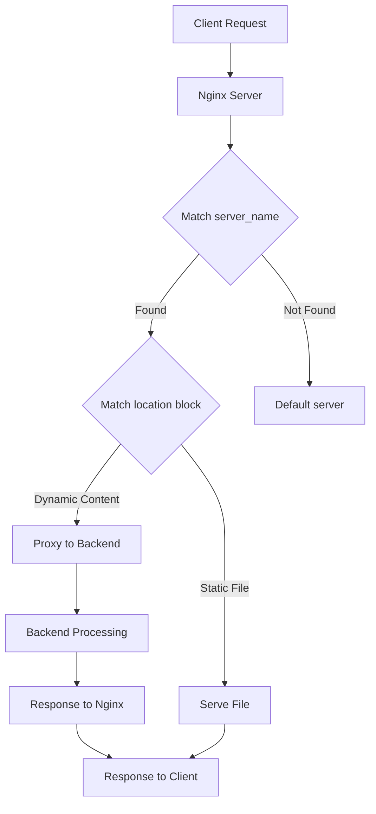

# Nginx Configuration

## Introduction

Nginx (pronounced "engine-x") is a powerful, high-performance web server, reverse proxy, and load balancer that has gained enormous popularity due to its efficiency and scalability. Proper configuration of Nginx is essential to harness its full potential and ensure your web applications run smoothly and securely.

In this guide, we'll explore the fundamentals of Nginx configuration, from basic setup to more advanced techniques. By the end, you'll understand how to configure Nginx for various scenarios and optimize it for your specific needs.

## Nginx Configuration Files Structure

Nginx uses a hierarchical configuration system that consists of multiple files organized in a specific directory structure. Understanding this structure is the first step to mastering Nginx configuration.

### Main Configuration Files

```
/etc/nginx/
├── nginx.conf           # Main configuration file
├── mime.types           # MIME type mappings
├── conf.d/              # Custom configuration directory
│   └── default.conf     # Default server configuration
└── sites-available/     # Available virtual hosts
    └── default          # Default virtual host configuration
```

The primary configuration file is `nginx.conf`, which contains global settings and includes other configuration files. Let's examine the basic structure of this file:

```nginx
user nginx;              # User that Nginx will run as
worker_processes auto;   # Number of worker processes
error_log /var/log/nginx/error.log warn;  # Error log path and level
pid /var/run/nginx.pid;  # Process ID file location

events {
    worker_connections 1024;  # Maximum connections per worker
}

http {
    include /etc/nginx/mime.types;  # Include MIME types
    default_type application/octet-stream;

    # Logging settings
    log_format main '$remote_addr - $remote_user [$time_local] "$request" '
                    '$status $body_bytes_sent "$http_referer" '
                    '"$http_user_agent" "$http_x_forwarded_for"';
    access_log /var/log/nginx/access.log main;

    # Other settings
    sendfile on;
    keepalive_timeout 65;

    # Include other configuration files
    include /etc/nginx/conf.d/*.conf;
}
```

## Basic Server Block Configuration

The fundamental building block of Nginx configuration is the **server block** (similar to Apache's virtual hosts). A server block defines how Nginx should handle requests for a specific domain or IP address.

Here's a basic server block configuration:

```nginx
server {
    listen 80;                # Port to listen on
    server_name example.com;  # Domain name

    # Root directory for serving files
    root /var/www/example.com;
    index index.html index.htm;  # Default files to serve

    # Location block for the root path
    location / {
        try_files $uri $uri/ =404;  # Try to find files, return 404 if not found
    }

    # Error pages
    error_page 404 /404.html;
    error_page 500 502 503 504 /50x.html;
}
```

### Creating a Simple Static Website Configuration

Let's create a practical configuration for a static website:

```nginx
server {
    listen 80;
    server_name mywebsite.com www.mywebsite.com;  # Handle both domains
    
    root /var/www/mywebsite;
    index index.html;
    
    # Serve static files efficiently
    location ~* \.(jpg|jpeg|png|gif|ico|css|js)$ {
        expires 30d;  # Cache static files for 30 days
        add_header Cache-Control "public, max-age=2592000";
    }
    
    # Handle 404 errors
    error_page 404 /404.html;
    location = /404.html {
        root /var/www/mywebsite;
        internal;
    }
}
```

## Location Blocks

Location blocks are one of the most powerful features in Nginx configuration. They allow you to define how Nginx processes requests for specific URI paths.

### Location Block Syntax

```nginx
location [modifier] pattern {
    # Directives here
}
```

The modifiers determine how the pattern will be matched:

- No modifier: Prefix match
- `=`: Exact match
- `~`: Case-sensitive regular expression match
- `~*`: Case-insensitive regular expression match
- `^~`: Preferential prefix match

### Location Block Priority

Nginx processes location blocks in the following order:

1. Exact match (`=`)
2. Preferential prefix match (`^~`)
3. Regular expression match (`~` and `~*`) in order of appearance
4. Prefix match (no modifier)

### Example of Location Blocks

```nginx
server {
    listen 80;
    server_name example.com;
    root /var/www/example.com;
    
    # Exact match for the home page
    location = / {
        # Special processing for the home page
    }
    
    # Preferential prefix match for admin pages
    location ^~ /admin/ {
        # Only admins should access this
        auth_basic "Admin Area";
        auth_basic_user_file /etc/nginx/htpasswd;
    }
    
    # Regular expression match for image files
    location ~* \.(png|jpg|jpeg|gif)$ {
        # Handle image files
        expires 30d;
    }
    
    # Regular prefix match (fallback)
    location / {
        try_files $uri $uri/ /index.html;
    }
}
```

## Common Configurations

Let's explore some common configuration scenarios you might encounter when working with Nginx.

### Setting Up a Reverse Proxy

One of Nginx's primary uses is as a reverse proxy, forwarding requests to backend servers:

```nginx
server {
    listen 80;
    server_name myapp.com;
    
    location / {
        proxy_pass http://localhost:3000;  # Forward to a Node.js app
        proxy_set_header Host $host;
        proxy_set_header X-Real-IP $remote_addr;
        proxy_set_header X-Forwarded-For $proxy_add_x_forwarded_for;
        proxy_set_header X-Forwarded-Proto $scheme;
    }
}
```

This configuration forwards all requests to a local application running on port 3000, adding appropriate headers to preserve client information.

### Load Balancing

Nginx can distribute traffic across multiple backend servers:

```nginx
upstream backend_servers {
    server backend1.example.com weight=3;  # Higher weight gets more traffic
    server backend2.example.com;
    server backup1.example.com backup;     # Only used when others fail
}

server {
    listen 80;
    server_name loadbalancer.example.com;
    
    location / {
        proxy_pass http://backend_servers;
        proxy_set_header Host $host;
        proxy_set_header X-Real-IP $remote_addr;
    }
}
```

### SSL/TLS Configuration

Securing your website with HTTPS is essential for modern web applications:

```nginx
server {
    listen 80;
    server_name secure.example.com;
    # Redirect all HTTP traffic to HTTPS
    return 301 https://$host$request_uri;
}

server {
    listen 443 ssl;
    server_name secure.example.com;
    
    # SSL certificates
    ssl_certificate /etc/nginx/ssl/example.com.crt;
    ssl_certificate_key /etc/nginx/ssl/example.com.key;
    
    # SSL optimization
    ssl_protocols TLSv1.2 TLSv1.3;
    ssl_prefer_server_ciphers on;
    ssl_ciphers 'ECDHE-ECDSA-AES128-GCM-SHA256:ECDHE-RSA-AES128-GCM-SHA256:ECDHE-ECDSA-AES256-GCM-SHA384:ECDHE-RSA-AES256-GCM-SHA384';
    
    # Enable HSTS
    add_header Strict-Transport-Security "max-age=31536000; includeSubDomains" always;
    
    # The rest of your server configuration
    root /var/www/secure.example.com;
    index index.html;
    
    location / {
        try_files $uri $uri/ =404;
    }
}
```

## Advanced Configuration Techniques

### Using Variables in Nginx

Nginx provides various variables that you can use to make your configuration more dynamic:

```nginx
server {
    listen 80;
    server_name example.com;
    
    # Log the user agent in a custom log
    if ($http_user_agent ~* (Googlebot|Bingbot)) {
        set $is_bot 1;
    }
    
    access_log /var/log/nginx/bots.log combined if=$is_bot;
    
    # Dynamic content handling based on query parameters
    location / {
        if ($arg_mobile = "1") {
            rewrite ^ /mobile/index.html break;
        }
    }
}
```

### Rate Limiting

Protect your server from abuse by implementing rate limiting:

```nginx
# Define a zone for limiting requests
limit_req_zone $binary_remote_addr zone=mylimit:10m rate=1r/s;

server {
    listen 80;
    server_name example.com;
    
    # Apply rate limiting to the login page
    location /login {
        limit_req zone=mylimit burst=5 nodelay;
        
        # Regular processing continues
        proxy_pass http://backend;
    }
}
```

This configuration limits requests to the login page to 1 per second per IP address, with a burst of 5 requests allowed.

### Gzip Compression

Improve load times by enabling compression:

```nginx
http {
    # Gzip Settings
    gzip on;
    gzip_disable "msie6";
    gzip_vary on;
    gzip_proxied any;
    gzip_comp_level 6;
    gzip_buffers 16 8k;
    gzip_http_version 1.1;
    gzip_types text/plain text/css application/json application/javascript text/xml application/xml application/xml+rss text/javascript;
    
    # Rest of your http configuration
}
```

## Configuring Nginx for Common Web Applications

### PHP with FastCGI

```nginx
server {
    listen 80;
    server_name phpapp.example.com;
    root /var/www/phpapp;
    index index.php index.html;
    
    location / {
        try_files $uri $uri/ /index.php?$args;
    }
    
    location ~ \.php$ {
        include fastcgi_params;
        fastcgi_param SCRIPT_FILENAME $document_root$fastcgi_script_name;
        fastcgi_pass unix:/var/run/php/php7.4-fpm.sock;  # Adjust to your PHP version
        fastcgi_index index.php;
    }
}
```

### WordPress Configuration

```nginx
server {
    listen 80;
    server_name wordpress.example.com;
    root /var/www/wordpress;
    index index.php;
    
    # WordPress permalink structure
    location / {
        try_files $uri $uri/ /index.php?$args;
    }
    
    # PHP handling
    location ~ \.php$ {
        include fastcgi_params;
        fastcgi_param SCRIPT_FILENAME $document_root$fastcgi_script_name;
        fastcgi_pass unix:/var/run/php/php7.4-fpm.sock;
    }
    
    # Deny access to sensitive files
    location ~ /\.(ht|git) {
        deny all;
    }
    
    # Cache static assets
    location ~* \.(js|css|png|jpg|jpeg|gif|ico)$ {
        expires max;
        log_not_found off;
    }
}
```

## Troubleshooting Nginx Configuration

### Testing Configuration Syntax

Before applying any changes to your Nginx configuration, you should test the syntax:

```bash
nginx -t
```

This command checks your configuration files for syntax errors without restarting the server.

### Common Errors and Solutions

1. **Permission Denied Errors**
   - Check file permissions for your web root and log directories
   - Ensure Nginx has read access to your configuration files
   
2. **404 Not Found Errors**
   - Verify the `root` directive points to the correct path
   - Check that files exist in the specified locations
   - Review `try_files` directives for errors
   
3. **502 Bad Gateway Errors**
   - Ensure your backend servers are running
   - Check upstream server connections
   - Review proxy settings and backend timeouts

### Visualizing Request Flow

Understanding how Nginx processes requests can help with troubleshooting. Here's a diagram of the typical request flow:



## Best Practices for Nginx Configuration

### Security Recommendations

1. **Hide Nginx Version**
   ```nginx
   http {
       server_tokens off;
   }
   ```

2. **Configure Security Headers**
   ```nginx
   add_header X-Content-Type-Options "nosniff" always;
   add_header X-Frame-Options "SAMEORIGIN" always;
   add_header X-XSS-Protection "1; mode=block" always;
   ```

3. **Implement Access Controls**
   ```nginx
   # Restrict access by IP
   location /admin {
       allow 192.168.1.0/24;
       deny all;
   }
   ```

### Performance Optimization

1. **Worker Processes and Connections**
   ```nginx
   worker_processes auto;  # Use one per CPU core
   
   events {
       worker_connections 1024;  # Increase for high-traffic sites
       multi_accept on;  # Accept as many connections as possible
   }
   ```

2. **File Descriptor Limits**
   
   If you're expecting high traffic, increase your system's file descriptor limits and adjust Nginx accordingly:
   
   ```nginx
   worker_rlimit_nofile 30000;  # Increase system limit first
   ```

3. **Client Request Buffering**
   ```nginx
   http {
       client_body_buffer_size 10K;
       client_header_buffer_size 1k;
       client_max_body_size 8m;  # Maximum upload size
   }
   ```

## Configuration Management Strategies

As your Nginx setup grows, consider these strategies for maintaining your configuration:

1. **Use Include Files**
   
   Break your configuration into logical chunks:
   
   ```nginx
   # In nginx.conf
   include /etc/nginx/conf.d/*.conf;
   include /etc/nginx/sites-enabled/*;
   
   # Global SSL settings
   include /etc/nginx/ssl.conf;
   ```

2. **Virtual Host Organization**
   
   Store available configurations in `sites-available` and create symlinks to `sites-enabled` for active sites:
   
   ```bash
   ln -s /etc/nginx/sites-available/example.com /etc/nginx/sites-enabled/
   ```

3. **Version Control**
   
   Track your configuration files with Git or another version control system to manage changes and roll back when needed.

## Summary

Nginx configuration can seem complex at first, but it follows a logical structure that becomes intuitive with practice. In this guide, we've covered:

- The basic structure of Nginx configuration files
- Setting up server blocks for hosting websites
- Using location blocks to control request processing
- Common configuration scenarios including reverse proxy and SSL setup
- Advanced techniques for optimization and security
- Troubleshooting and best practices

With these fundamentals, you're well on your way to mastering Nginx configuration. Remember that the key to effective Nginx administration is understanding the request processing flow and leveraging Nginx's modular architecture.

## Additional Resources

- Official Nginx documentation: nginx.org/en/docs/
- Digital Ocean's Nginx configuration guides
- Server Fault community for troubleshooting

## Practice Exercises

1. Set up a basic Nginx server to serve static files from a directory
2. Configure Nginx as a reverse proxy for a local development server
3. Implement HTTPS with a self-signed certificate for testing
4. Create a load balancer configuration for multiple backend servers
5. Optimize your Nginx configuration for performance and security