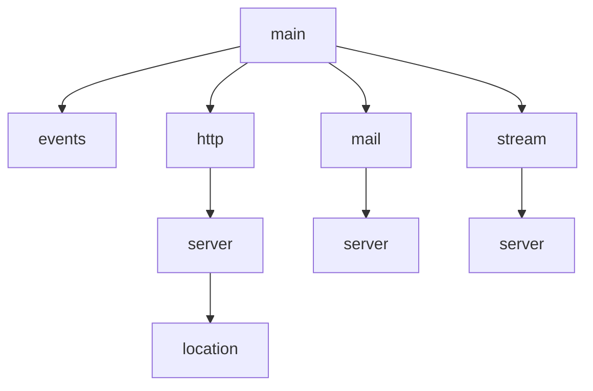

# Nginx Directives

## Introduction

Nginx configuration is built around **directives** - instructions that tell the server how to behave. Understanding directives is fundamental to mastering Nginx as they control everything from server behavior to performance optimization.

In this guide, we'll explore what Nginx directives are, how they work, their different types, and how to use them effectively in your configurations.

## What Are Nginx Directives?

Nginx directives are configuration commands that define how the server should operate. Each directive:

- Controls a specific aspect of server behavior
- Has a specific syntax and context where it can be used
- Ends with a semicolon (`;`)
- Can be simple values or complex blocks containing other directives

## Directive Syntax

Most Nginx directives follow this general syntax:

```nginx
directive_name value1 value2 ... value_n;
```

For example:

```nginx
server_name example.com www.example.com;
```

Block directives use curly braces to contain other directives:

```nginx
location /api {
    proxy_pass http://backend_servers;
    proxy_set_header Host $host;
}
```

## Directive Contexts

Directives operate in specific contexts - sections of the configuration where they are valid. Understanding these contexts is crucial for effective configuration.



The main contexts are:

1. **Main context** - global settings affecting all traffic
2. **Events context** - connection processing settings
3. **HTTP context** - HTTP traffic settings
4. **Server context** - virtual server settings
5. **Location context** - settings for specific URI patterns
6. **Mail context** - mail proxy settings
7. **Stream context** - TCP/UDP traffic settings

## Types of Directives

### 1. Simple Directives

Simple directives consist of a name and parameters, ending with a semicolon:

```nginx
gzip on;
worker_connections 1024;
```

### 2. Block Directives

Block directives contain other directives within curly braces:

```nginx
server {
    listen 80;
    server_name example.com;
    
    location / {
        root /var/www/html;
        index index.html;
    }
}
```

### 3. Action Directives

Action directives cause Nginx to perform specific actions:

```nginx
return 301 https://$host$request_uri;
rewrite ^/old-page$ /new-page permanent;
```

## Common Nginx Directives

Let's explore some of the most frequently used directives:

### Server Configuration

```nginx
server {
    listen 80;               # Port to listen on
    server_name example.com; # Domain name
    root /var/www/html;      # Document root
    index index.html;        # Default file to serve
}
```

### Location Blocks

Location blocks define how Nginx handles specific URL patterns:

```nginx
location / {
    # Handle root location
    try_files $uri $uri/ /index.html;
}

location ~* \.(jpg|jpeg|png|gif)$ {
    # Handle image files
    expires 30d;
    add_header Cache-Control "public";
}

location /api/ {
    # Proxy to backend application
    proxy_pass http://localhost:3000;
    proxy_set_header Host $host;
    proxy_set_header X-Real-IP $remote_addr;
}
```

### Serving Static Content

```nginx
location /static/ {
    alias /path/to/static/files/;
    autoindex off;
    expires 7d;
}
```

### Error Handling

```nginx
error_page 404 /404.html;
error_page 500 502 503 504 /50x.html;

location = /404.html {
    root /var/www/html/error_pages;
    internal;
}
```

## Practical Example: Complete Server Configuration

Let's build a real-world configuration for a website with static files and an API backend:

```nginx
http {
    # Basic settings
    include mime.types;
    default_type application/octet-stream;
    sendfile on;
    keepalive_timeout 65;
    
    # Gzip compression
    gzip on;
    gzip_types text/plain text/css application/json application/javascript;
    
    # Main server
    server {
        listen 80;
        server_name mywebsite.com www.mywebsite.com;
        
        # Redirect to HTTPS
        return 301 https://$host$request_uri;
    }
    
    # HTTPS server
    server {
        listen 443 ssl;
        server_name mywebsite.com www.mywebsite.com;
        
        # SSL configuration
        ssl_certificate /etc/nginx/ssl/mywebsite.com.crt;
        ssl_certificate_key /etc/nginx/ssl/mywebsite.com.key;
        ssl_protocols TLSv1.2 TLSv1.3;
        
        # Document root
        root /var/www/mywebsite;
        index index.html;
        
        # Static files
        location /assets/ {
            expires 7d;
            add_header Cache-Control "public";
        }
        
        # API requests
        location /api/ {
            # Remove /api/ prefix before passing to backend
            rewrite ^/api/(.*) /$1 break;
            
            # Proxy to backend application
            proxy_pass http://localhost:3000;
            proxy_set_header Host $host;
            proxy_set_header X-Real-IP $remote_addr;
            proxy_set_header X-Forwarded-For $proxy_add_x_forwarded_for;
            proxy_set_header X-Forwarded-Proto $scheme;
        }
        
        # Error pages
        error_page 404 /404.html;
        error_page 500 502 503 504 /50x.html;
    }
}
```

## Directive Inheritance and Overriding

Directives can be inherited from parent contexts and overridden in child contexts. For example:

```nginx
http {
    # Set global gzip settings
    gzip on;
    gzip_comp_level 6;
    
    server {
        # Inherit gzip settings from http context
        
        location /api/ {
            # Override gzip settings for this location
            gzip off;
        }
    }
}
```

## Variables in Directives

Nginx provides variables that can be used in directive values:

```nginx
log_format main '$remote_addr - $remote_user [$time_local] "$request" '
                '$status $body_bytes_sent "$http_referer" '
                '"$http_user_agent" "$http_x_forwarded_for"';

set $mobile_rewrite do_not_perform;

if ($http_user_agent ~* "(android|bb\d+|meego).+mobile|avantgo|bada\/") {
    set $mobile_rewrite perform;
}

if ($mobile_rewrite = perform) {
    rewrite ^ /mobile$uri redirect;
}
```

## Conditional Directives

The `if` directive allows for conditional processing:

```nginx
if ($request_method = POST) {
    return 405;
}

if ($http_user_agent ~ MSIE) {
    rewrite ^(.*)$ /msie/$1 break;
}
```

**Note**: Nginx documentation recommends avoiding `if` directives when possible due to potential issues. Use `location` blocks with regex matching instead when feasible.

## Testing and Debugging Directives

When working with directives, you can test your configuration before applying it:

```bash
nginx -t
```

This command validates your configuration files and reports any syntax errors.

## Best Practices for Using Directives

1. **Keep configurations modular** - Split complex configurations into multiple files using the `include` directive
   
   ```nginx
   include /etc/nginx/conf.d/*.conf;
   ```

2. **Use comments to document complex directives**
   
   ```nginx
   # This location handles API authentication
   location /api/auth {
       # ... directives
   }
   ```

3. **Be mindful of directive contexts** - Use directives only in their allowed contexts

4. **Use variables carefully** - Overuse of variables can impact performance

5. **Prefer location blocks over if statements** - More efficient and safer

6. **Understand inheritance** - Be aware of which directives are inherited and which are replaced

## Summary

Nginx directives are the building blocks of your server configuration. Understanding their syntax, contexts, and proper usage is essential for creating efficient and reliable web server setups.

In this guide, we've covered:
- What directives are and their basic syntax
- Different directive contexts and types
- Common directives for various scenarios
- A practical real-world configuration example
- Best practices for using directives effectively

By mastering Nginx directives, you can fine-tune your server's behavior to meet your specific needs, optimize performance, and ensure security.

## Additional Resources

- Official Nginx directive reference: [Nginx Documentation](http://nginx.org/en/docs/)
- Nginx Core Module directives: [Core Module](http://nginx.org/en/docs/ngx_core_module.html)
- HTTP Module directives: [HTTP Core Module](http://nginx.org/en/docs/http/ngx_http_core_module.html)

## Exercises

1. Create a basic Nginx configuration with a server block listening on port 8080 that serves files from `/var/www/html`.

2. Configure a location block that handles requests to `/api` and proxies them to a backend server running on `localhost:3000`.

3. Set up a configuration that redirects HTTP traffic to HTTPS.

4. Configure Nginx to serve different content based on the user agent (mobile vs. desktop).

5. Create a configuration that implements rate limiting for specific endpoints using the `limit_req` directive.