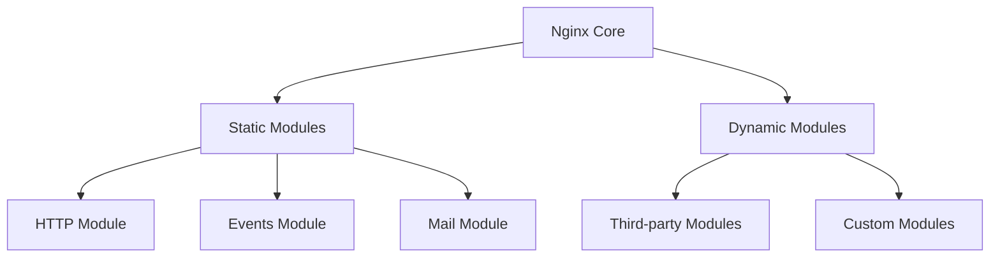

# Nginx Modules

## Introduction

Nginx (pronounced "Engine-X") is a powerful web server known for its high performance, stability, and rich feature set. One of the key reasons for Nginx's flexibility is its modular architecture. Modules are components that add specific functionality to Nginx, allowing you to customize your web server according to your needs without including unnecessary features that might consume resources.

In this guide, we'll explore Nginx modules, understand how they work, learn about different types of modules, and see how to enable and configure them in your Nginx server.

## Understanding Nginx Modules

### What Are Nginx Modules?

Nginx modules are components that add specific features or functionality to the Nginx web server. They follow a plug-in architecture that allows Nginx to remain lightweight while providing extensive customization options.



### Types of Nginx Modules

Nginx modules can be categorized into two main types:

1. **Static Modules**: These are compiled directly into the Nginx binary during installation. They're always available and loaded at startup.

2. **Dynamic Modules**: These are compiled separately and can be loaded at runtime using the `load_module` directive in the Nginx configuration.

## Core Nginx Modules

Nginx comes with several built-in modules that provide essential functionality:

### HTTP Core Module

The HTTP Core module is the foundation of Nginx's web server capabilities. It handles HTTP connections, request processing, and response generation.

Key directives include:

- `server`: Defines a virtual server for handling requests
- `location`: Defines how to process specific request URIs
- `listen`: Specifies the IP address and port to listen on

Example configuration:

```nginx
http {
    server {
        listen 80;
        server_name example.com;
        
        location / {
            root /var/www/html;
            index index.html;
        }
    }
}
```

### Events Module

The Events module configures how Nginx handles connections at a system level.

Example configuration:

```nginx
events {
    worker_connections 1024;  # Maximum connections per worker
    use epoll;                # Connection processing method
}
```

### SSL Module

The SSL module enables HTTPS support in Nginx, allowing secure encrypted connections.

Example configuration:

```nginx
server {
    listen 443 ssl;
    server_name example.com;
    
    ssl_certificate /etc/nginx/ssl/example.com.crt;
    ssl_certificate_key /etc/nginx/ssl/example.com.key;
    ssl_protocols TLSv1.2 TLSv1.3;
}
```

## Popular Nginx Modules

Let's explore some useful modules that enhance Nginx's functionality:

### 1. Nginx Rewrite Module

The Rewrite module allows you to manipulate URLs using regular expressions, redirecting users or changing URLs without their knowledge.

Example:

```nginx
location /old-page {
    rewrite ^/old-page(.*)$ /new-page$1 permanent;
}
```

This configuration redirects requests from `/old-page` to `/new-page`, preserving any additional path information.

### 2. FastCGI Module

The FastCGI module allows Nginx to communicate with FastCGI processes, typically for running dynamic content like PHP applications.

Example for PHP-FPM:

```nginx
location ~ \.php$ {
    include fastcgi_params;
    fastcgi_pass unix:/var/run/php/php8.1-fpm.sock;
    fastcgi_param SCRIPT_FILENAME $document_root$fastcgi_script_name;
}
```

### 3. Gzip Module

The Gzip module enables compression of responses, reducing bandwidth usage and improving load times.

Example:

```nginx
http {
    gzip on;
    gzip_comp_level 5;
    gzip_min_length 256;
    gzip_proxied any;
    gzip_types
        application/javascript
        application/json
        text/css
        text/plain;
}
```

### 4. Cache Module

The Cache module allows Nginx to cache content, improving performance for frequently accessed resources.

Example:

```nginx
http {
    proxy_cache_path /var/cache/nginx levels=1:2 keys_zone=my_cache:10m inactive=60m;
    
    server {
        location / {
            proxy_pass http://backend;
            proxy_cache my_cache;
            proxy_cache_valid 200 302 10m;
            proxy_cache_valid 404 1m;
        }
    }
}
```

## Working with Dynamic Modules

Dynamic modules provide a way to extend Nginx functionality without recompiling the entire server. Here's how to work with them:

### Installing Dynamic Modules

You can install dynamic modules using your package manager. For example, on Ubuntu/Debian:

```bash
sudo apt-get install nginx-module-geoip
```

### Loading Dynamic Modules

To load a dynamic module, use the `load_module` directive in the main context of your Nginx configuration:

```nginx
load_module modules/ngx_http_geoip_module.so;

http {
    # Module-specific configuration
    geoip_country /usr/share/GeoIP/GeoIP.dat;
    
    # Use the module
    server {
        location / {
            if ($geoip_country_code = "US") {
                return 302 https://us.example.com$request_uri;
            }
        }
    }
}
```

## Creating Custom Modules

For advanced users, Nginx allows you to create custom modules to implement specific functionality not available in existing modules.

### Basic Structure of a Custom Module

Here's a simplified example of what a custom Nginx module might look like:

```c
#include <ngx_config.h>
#include <ngx_core.h>
#include <ngx_http.h>

// Module configuration structure
typedef struct {
    ngx_flag_t  enable;
} ngx_http_example_loc_conf_t;

// Function declarations
static ngx_int_t ngx_http_example_handler(ngx_http_request_t *r);
static void *ngx_http_example_create_loc_conf(ngx_conf_t *cf);
static char *ngx_http_example_merge_loc_conf(ngx_conf_t *cf, void *parent, void *child);
static ngx_int_t ngx_http_example_init(ngx_conf_t *cf);

// Module directive definition
static ngx_command_t ngx_http_example_commands[] = {
    { 
        ngx_string("example"),
        NGX_HTTP_LOC_CONF|NGX_CONF_FLAG,
        ngx_conf_set_flag_slot,
        NGX_HTTP_LOC_CONF_OFFSET,
        offsetof(ngx_http_example_loc_conf_t, enable),
        NULL 
    },
    ngx_null_command
};

// Module context
static ngx_http_module_t ngx_http_example_module_ctx = {
    NULL,                               /* preconfiguration */
    ngx_http_example_init,              /* postconfiguration */
    NULL,                               /* create main configuration */
    NULL,                               /* init main configuration */
    NULL,                               /* create server configuration */
    NULL,                               /* merge server configuration */
    ngx_http_example_create_loc_conf,   /* create location configuration */
    ngx_http_example_merge_loc_conf     /* merge location configuration */
};

// Module definition
ngx_module_t ngx_http_example_module = {
    NGX_MODULE_V1,
    &ngx_http_example_module_ctx,      /* module context */
    ngx_http_example_commands,         /* module directives */
    NGX_HTTP_MODULE,                   /* module type */
    NULL,                              /* init master */
    NULL,                              /* init module */
    NULL,                              /* init process */
    NULL,                              /* init thread */
    NULL,                              /* exit thread */
    NULL,                              /* exit process */
    NULL,                              /* exit master */
    NGX_MODULE_V1_PADDING
};
```

Building and using custom modules requires familiarity with C programming and Nginx's internal API. The detailed process includes:

1. Writing the module code
2. Compiling it against Nginx sources
3. Installing the module
4. Configuring Nginx to use it

## Practical Examples

### Example 1: Setting Up a Load Balancer with Upstream Module

The Upstream module allows Nginx to distribute traffic across multiple servers:

```nginx
http {
    upstream backend_servers {
        server backend1.example.com weight=3;
        server backend2.example.com;
        server backend3.example.com backup;
    }
    
    server {
        listen 80;
        server_name example.com;
        
        location / {
            proxy_pass http://backend_servers;
            proxy_set_header Host $host;
            proxy_set_header X-Real-IP $remote_addr;
        }
    }
}
```

In this example:
- We define an upstream group called `backend_servers` with three servers
- The first server has a higher weight, receiving more traffic
- The third server is a backup, only receiving traffic if others are unavailable

### Example 2: Setting Up Rate Limiting

The Limit Req module helps protect your server from abuse by limiting request rates:

```nginx
http {
    # Define a zone to store rate limiting state
    limit_req_zone $binary_remote_addr zone=mylimit:10m rate=1r/s;
    
    server {
        listen 80;
        server_name example.com;
        
        location /login {
            # Apply rate limiting to this location
            limit_req zone=mylimit burst=5 nodelay;
            
            # Normal processing
            proxy_pass http://backend;
        }
    }
}
```

This configuration:
- Creates a rate limiting zone called `mylimit` with 10MB of memory
- Limits requests to 1 per second per client IP
- Allows a burst of 5 requests without delay
- Applies the limit to the `/login` endpoint

### Example 3: Content Caching

Setting up efficient content caching with the Proxy Cache module:

```nginx
http {
    # Define cache path and zone
    proxy_cache_path /var/cache/nginx levels=1:2 keys_zone=content_cache:10m max_size=1g inactive=60m;
    
    server {
        listen 80;
        server_name example.com;
        
        # Cache assets longer
        location ~* \.(jpg|jpeg|png|gif|ico|css|js)$ {
            proxy_pass http://backend;
            proxy_cache content_cache;
            proxy_cache_valid 200 302 304 24h;
            proxy_cache_key $scheme$host$request_uri;
            add_header X-Cache-Status $upstream_cache_status;
            expires 7d;
        }
        
        # Cache API responses briefly
        location /api/ {
            proxy_pass http://backend;
            proxy_cache content_cache;
            proxy_cache_valid 200 30s;
            proxy_cache_key $scheme$host$request_uri;
            add_header X-Cache-Status $upstream_cache_status;
        }
    }
}
```

This configuration:
- Creates a cache with multiple levels for efficient file lookup
- Caches static assets for 24 hours
- Caches API responses for only 30 seconds
- Adds a header showing cache status for debugging

## Troubleshooting Nginx Modules

When working with Nginx modules, you might encounter issues. Here are some common troubleshooting steps:

### 1. Check if the Module is Installed

```bash
nginx -V
```

This command shows Nginx version and all compiled-in modules.

### 2. Verify Module Configuration

Check for syntax errors in your configuration:

```bash
nginx -t
```

### 3. Check Logs for Module-Related Errors

```bash
tail -f /var/log/nginx/error.log
```

### 4. Debug Module Loading Issues

For dynamic modules, ensure the path is correct:

```nginx
# Correct
load_module /usr/lib/nginx/modules/ngx_http_geoip_module.so;

# Incorrect
load_module ngx_http_geoip_module.so;
```

## Summary

Nginx's modular architecture is one of its greatest strengths, allowing you to build a custom web server solution tailored to your specific needs. In this guide, we've explored:

- The concept of Nginx modules and their types
- Core modules that provide essential functionality
- Popular modules for extending Nginx capabilities
- How to work with dynamic modules
- The basics of custom module development
- Practical examples showing real-world applications

By understanding and leveraging Nginx modules, you can create efficient, secure, and powerful web server configurations that go far beyond basic static file serving.

## Additional Resources

- Official Nginx module documentation
- Books on advanced Nginx configuration
- Online tutorials for specific modules

## Exercises

1. Configure Nginx with the GeoIP module to redirect users based on their country of origin.
2. Set up a rate limiting solution to protect a login page from brute force attacks.
3. Implement a caching strategy for a website with both static assets and dynamic content.
4. Configure Nginx as a reverse proxy with load balancing for a set of application servers.
5. Research and implement a third-party Nginx module that adds functionality you find useful.