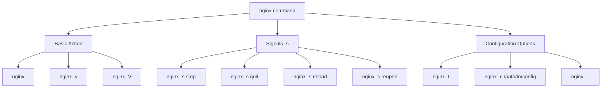

# Nginx Commands

## Introduction

Nginx (pronounced "engine-x") is a powerful, high-performance web server and reverse proxy that has gained immense popularity due to its efficiency and scalability. Whether you're deploying a simple website or managing complex microservices, understanding Nginx commands is essential for effective server management.

This guide covers the most important Nginx commands you'll need to know for day-to-day operations, configuration management, and troubleshooting. By the end, you'll be comfortable controlling Nginx from the command line and have a solid foundation for advanced server management.

## Basic Nginx Commands

### Starting and Stopping Nginx

The most fundamental commands allow you to control the Nginx service:

```bash
# Start Nginx
sudo nginx

# Stop Nginx immediately
sudo nginx -s stop

# Stop Nginx gracefully (wait for workers to finish processing)
sudo nginx -s quit

# Reload configuration without stopping service
sudo nginx -s reload

# Reopen log files
sudo nginx -s reopen
```

The `-s` flag stands for "signal" and allows you to send various control commands to the Nginx master process.

### Checking Nginx Status

Before making changes, it's often useful to check the current status of your Nginx installation:

```bash
# Check if Nginx is running
sudo systemctl status nginx

# Alternative method on non-systemd systems
ps aux | grep nginx
```

Output example:
```
● nginx.service - A high performance web server and a reverse proxy server
   Loaded: loaded (/lib/systemd/system/nginx.service; enabled; vendor preset: enabled)
   Active: active (running) since Tue 2025-03-11 07:15:22 UTC; 3 days ago
     Docs: man:nginx(8)
  Process: 1234 ExecReload=/usr/sbin/nginx -g daemon on; master_process on; -s reload (code=exited, status=0/SUCCESS)
 Main PID: 5678 (nginx)
    Tasks: 3 (limit: 4915)
   Memory: 3.5M
   CGroup: /system.slice/nginx.service
           ├─5678 nginx: master process /usr/sbin/nginx -g daemon on; master_process on;
           ├─5679 nginx: worker process
           └─5680 nginx: worker process
```

## Configuration Commands

### Testing Configuration Files

Before applying configuration changes, you should test them to prevent errors that might take down your server:

```bash
# Test the syntax of your configuration files
sudo nginx -t

# Test with a specific configuration file
sudo nginx -t -c /path/to/nginx.conf
```

A successful test outputs:
```
nginx: the configuration file /etc/nginx/nginx.conf syntax is ok
nginx: configuration file /etc/nginx/nginx.conf test is successful
```

### Showing Configuration Details

To see what configuration Nginx is currently using:

```bash
# Show compilation-time options
nginx -V

# Get all running configuration
sudo nginx -T
```

The `-V` flag output shows build information:
```
nginx version: nginx/1.24.0
built by gcc 9.4.0 (Ubuntu 9.4.0-1ubuntu1~20.04.1)
built with OpenSSL 1.1.1f  31 Mar 2020
TLS SNI support enabled
configure arguments: --prefix=/etc/nginx ...
```

## Debugging and Troubleshooting Commands

### Checking for Running Nginx Processes

If you're unsure whether Nginx is running or need to see its processes:

```bash
# Find all Nginx processes
ps aux | grep nginx

# Check which ports Nginx is listening on
sudo netstat -tulpn | grep nginx
```

Example output:
```
tcp        0      0 0.0.0.0:80              0.0.0.0:*               LISTEN      5678/nginx: master
tcp        0      0 0.0.0.0:443             0.0.0.0:*               LISTEN      5678/nginx: master
```

### Viewing Logs

Logs are crucial for troubleshooting Nginx issues:

```bash
# View access logs
sudo tail -f /var/log/nginx/access.log

# View error logs
sudo tail -f /var/log/nginx/error.log
```

## Process Control Commands

### Handling Nginx Processes

For more fine-grained control over Nginx processes:

```bash
# Get the master process ID
cat /var/run/nginx.pid

# Send custom signals to Nginx
sudo kill -s SIGNAL $(cat /var/run/nginx.pid)
```

Common signals include:
- `HUP`: Reload configuration, start new worker processes
- `TERM`: Shut down gracefully
- `USR1`: Reopen log files
- `USR2`: Upgrade executable on the fly
- `WINCH`: Gracefully shut down worker processes

## Practical Examples

### Example 1: Safe Configuration Updates

When updating your Nginx configuration, follow this safe procedure:

```bash
# Edit the configuration file
sudo nano /etc/nginx/nginx.conf

# Test the new configuration
sudo nginx -t

# If test is successful, reload Nginx
sudo nginx -s reload
```

### Example 2: Upgrading Nginx Without Downtime

This process allows you to upgrade Nginx while keeping your site online:

```bash
# Install the new version but don't restart
sudo apt-get install nginx-core

# Get the current Nginx PID
old_pid=$(cat /var/run/nginx.pid)

# Upgrade the binary on the fly
sudo kill -USR2 $old_pid

# Gracefully shut down old worker processes
sudo kill -WINCH $old_pid
```

### Example 3: Debugging a Failed Start

If Nginx fails to start, use these commands to troubleshoot:

```bash
# Check for syntax errors
sudo nginx -t

# Look for specific errors in logs
sudo tail -n 50 /var/log/nginx/error.log

# Check if something else is using Nginx's ports
sudo netstat -tulpn | grep ':80'
```

## The Nginx Command Structure

Let's visualize the basic command structure:



This diagram shows how Nginx commands branch into three main categories: basic actions, signals, and configuration options.

## Summary

Understanding Nginx commands is essential for effective web server management. We've covered:

- Basic service control (start, stop, reload)
- Configuration testing and validation
- Troubleshooting techniques
- Process management
- Practical examples for common scenarios

With these commands in your toolkit, you'll be able to manage Nginx servers with confidence, whether for development or production environments.

## Additional Resources

To deepen your Nginx knowledge:

- Official Nginx documentation: [https://nginx.org/en/docs/](https://nginx.org/en/docs/)
- Nginx command-line parameters: [https://nginx.org/en/docs/switches.html](https://nginx.org/en/docs/switches.html)
- Nginx admin guide: [https://docs.nginx.com/nginx/admin-guide/](https://docs.nginx.com/nginx/admin-guide/)

## Exercises

1. **Basic Control**: Install Nginx, then practice starting, stopping, and reloading it.
2. **Configuration Test**: Intentionally make a syntax error in your configuration file, then use the test command to find it.
3. **Log Analysis**: Create a simple website, generate some traffic, and analyze the resulting access logs.
4. **Custom Configuration**: Create a new server block for a test domain and reload Nginx to apply it.
5. **Zero-Downtime Practice**: Set up a test environment and practice upgrading Nginx without service interruption.