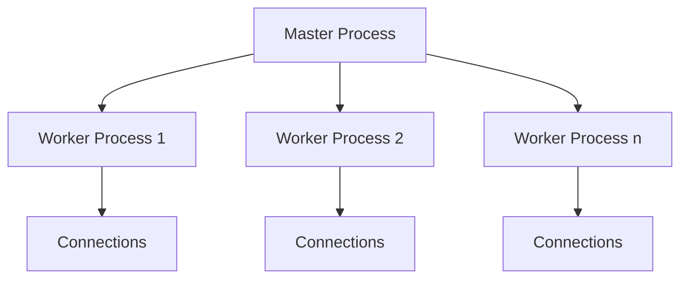

# Nginx Processes

## Introduction

Nginx (pronounced "engine-x") is a powerful web server that's known for its high performance, stability, and low resource consumption. One of the key factors behind Nginx's efficiency is its process architecture. Understanding how Nginx manages its processes is fundamental to optimizing your web server deployment.

In this guide, we'll explore the Nginx process model, how master and worker processes function, and how to configure them for optimal performance.

## The Nginx Process Architecture

Nginx follows an asynchronous, event-driven architecture that uses a master-worker process model. This design is one of the reasons Nginx can handle thousands of concurrent connections with minimal resources.



### Master Process

The master process in Nginx performs privileged operations such as:

- Reading and validating configuration
- Binding to ports
- Starting and maintaining worker processes
- Upgrading binary on the fly (for zero-downtime upgrades)

The master process runs with root privileges to perform these critical operations, but it doesn't handle any client connections directly.

### Worker Processes

Worker processes are responsible for handling all the actual processing of connections:

- Accepting new connections
- Processing client requests
- Communicating with upstream servers
- Serving content to clients

Each worker process is a single-threaded process that runs as an unprivileged user (typically `nginx` or `www-data`). This separation of privileges enhances security.

## Examining Nginx Processes

Let's see how to check Nginx processes on your system:

```bash
ps -ef | grep nginx
```

You might see output similar to:

```
root     12345     1  0 10:00 ?        00:00:00 nginx: master process /usr/sbin/nginx
www-data 12346 12345  0 10:00 ?        00:00:00 nginx: worker process
www-data 12347 12345  0 10:00 ?        00:00:00 nginx: worker process
www-data 12348 12345  0 10:00 ?        00:00:00 nginx: worker process
www-data 12349 12345  0 10:00 ?        00:00:00 nginx: worker process
```

You can also check the Nginx process status with:

```bash
nginx -t
```

Which should return something like:

```
nginx: the configuration file /etc/nginx/nginx.conf syntax is ok
nginx: configuration file /etc/nginx/nginx.conf test is successful
```

## Configuring Worker Processes

The number of worker processes can be configured in the `nginx.conf` file. Here's how you can set it:

```nginx
# in the main context (outside http, events, etc. blocks)
worker_processes 4;
```

### Auto-detection

Nginx can automatically detect the optimal number of worker processes based on the number of CPU cores:

```nginx
worker_processes auto;
```

This is often the best setting for most deployments, as it aligns the number of worker processes with your available CPU resources.

### Fine-tuning Worker Connections

Each worker process can handle a certain number of simultaneous connections, configured with the `worker_connections` directive:

```nginx
events {
    worker_connections 1024;
}
```

The maximum number of clients that Nginx can serve simultaneously is approximately:

```
max_clients = worker_processes × worker_connections
```

For a reverse proxy setup, each client connection might require 2 connections (one to the client and one to the backend server), so the formula becomes:

```
max_clients = worker_processes × worker_connections / 2
```

## Process Control Directives

Nginx offers several directives to control its process behavior:

### Worker Process User and Group

```nginx
user www-data;
```

This directive sets the user and group credentials for worker processes.

### Worker Process Priority

```nginx
worker_priority -10;
```

This sets the priority of worker processes. Values range from -20 (highest priority) to 19 (lowest priority).

### CPU Affinity

```nginx
worker_cpu_affinity 0001 0010 0100 1000;
```

This binds each worker process to specific CPU cores, which can improve performance by increasing CPU cache hit ratio.

## Practical Example: Optimizing for a 4-Core Server

Here's a practical example of Nginx process configuration for a server with 4 CPU cores:

```nginx
# Main context configuration
user www-data;
worker_processes 4;
worker_cpu_affinity 0001 0010 0100 1000;
worker_priority 0;

events {
    worker_connections 1024;
    use epoll;
    multi_accept on;
}

http {
    # http context configuration
    # ...
}
```

Let's break down this configuration:

1. `user www-data` - Worker processes run as the www-data user for security
2. `worker_processes 4` - One worker process per CPU core
3. `worker_cpu_affinity` - Each worker is bound to a specific CPU core
4. `worker_connections 1024` - Each worker can handle up to 1024 connections
5. `use epoll` - Using the efficient epoll event processing method (Linux)
6. `multi_accept on` - Each worker can accept multiple connections at once

## Managing Nginx Processes

### Starting Nginx

```bash
sudo systemctl start nginx
# or
sudo service nginx start
# or traditional
sudo /etc/init.d/nginx start
```

### Stopping Nginx

```bash
sudo systemctl stop nginx
# or
sudo service nginx stop
# or traditional
sudo /etc/init.d/nginx stop
```

### Reloading Configuration (Without Downtime)

```bash
sudo systemctl reload nginx
# or
sudo service nginx reload
# or
sudo nginx -s reload
```

When you reload Nginx, the master process reloads the configuration, and then gracefully replaces worker processes one by one, ensuring zero downtime.

### Restarting Completely

```bash
sudo systemctl restart nginx
# or
sudo service nginx restart
```

This completely stops and starts Nginx, which may cause a brief downtime.

## Advanced Process Features

### Worker Process Shutdown Timeout

```nginx
worker_shutdown_timeout 10s;
```

This directive sets a timeout for graceful worker process shutdown. If a worker is still processing connections after this time, it will be forcefully terminated.

### Thread Pools for Blocking Operations

In more recent versions of Nginx, you can configure thread pools to handle blocking operations without affecting the worker process's ability to handle other connections:

```nginx
thread_pool default threads=32 max_queue=65536;

http {
    server {
        location /download/ {
            aio threads;
            # ...
        }
    }
}
```

This configuration creates a thread pool that worker processes can use for blocking I/O operations like reading large files from disk.

## Monitoring Nginx Processes

To monitor Nginx process status and performance, you can enable the stub status module:

```nginx
http {
    server {
        location /nginx_status {
            stub_status on;
            allow 127.0.0.1;
            deny all;
        }
    }
}
```

This provides basic statistics about the nginx server, including the number of active connections, total connections handled, and more.

Once configured, you can access it from localhost:

```bash
curl http://localhost/nginx_status
```

The output might look like:

```
Active connections: 43 
server accepts handled requests
 7368 7368 10993 
Reading: 0 Writing: 5 Waiting: 38
```

## Common Process-Related Issues and Solutions

### Too Many Worker Processes

**Issue**: Configuring more worker processes than you have CPU cores can lead to excessive context switching and reduced performance.

**Solution**: Use `worker_processes auto;` or set it to match your number of CPU cores.

### Worker Connections Exhaustion

**Issue**: Running out of available connections per worker.

**Solution**: Increase `worker_connections` value after ensuring your system file descriptor limits are also increased:

```bash
# Check current limits
ulimit -n

# Set higher limits in /etc/security/limits.conf
www-data soft nofile 30000
www-data hard nofile 30000
```

### Process Crashes

**Issue**: Worker processes crashing under high load.

**Solution**: Check error logs at `/var/log/nginx/error.log` and adjust configuration. You might need to increase system limits or optimize your Nginx configuration.

## Summary

Nginx's process architecture, with its master-worker model, is a key component of its high performance and efficiency. Understanding how these processes work together allows you to:

1. Optimize server performance through proper configuration
2. Achieve zero-downtime upgrades and configuration reloads
3. Better troubleshoot issues when they arise
4. Scale your web services effectively

The master process handles privileged operations and manages worker processes, while the workers handle all client connections using an efficient, non-blocking event-driven approach.

For most deployments, letting Nginx automatically determine the number of worker processes (`worker_processes auto;`) and setting appropriate worker connections will provide excellent performance.

## Additional Resources

For further learning about Nginx processes:

- Explore the official [Nginx documentation](https://nginx.org/en/docs/)
- Learn about Nginx's [event processing methods](https://nginx.org/en/docs/events.html)
- Consider advanced modules like [thread pools](https://nginx.org/en/docs/ngx_core_module.html#thread_pool)

## Exercises

1. Set up Nginx on your development machine and experiment with different `worker_processes` settings. Monitor the impact on performance.

2. Configure and access the stub status page to monitor Nginx process metrics.

3. Practice a zero-downtime configuration reload and observe how the master process manages the worker processes during this operation.

4. Benchmark your Nginx server using tools like `ab` (Apache Benchmark) or `wrk` with different process configurations.

5. Implement CPU affinity settings on a multi-core system and test if it improves performance under high load.