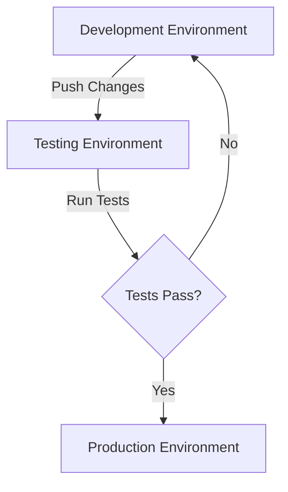

# Nginx Testing

## Introduction

Testing is a critical aspect of working with Nginx that ensures your web server performs reliably in production environments. In this guide, we'll explore various methods to test your Nginx configurations, validate syntax, check performance, and troubleshoot common issues. By implementing proper testing procedures, you can prevent configuration errors, security vulnerabilities, and performance bottlenecks before they affect your users.

## Why Test Your Nginx Configuration?

Before diving into specific testing methods, let's understand why testing Nginx configurations is important:

- **Prevent downtime**: Catch configuration errors before they reach production
- **Ensure security**: Validate that your security settings work as expected
- **Optimize performance**: Identify and resolve bottlenecks
- **Verify behavior**: Confirm that routing, redirection, and load balancing work properly
- **Document system state**: Create reproducible tests that serve as documentation

## Basic Configuration Testing

### Syntax Validation

The most fundamental test is validating your Nginx configuration syntax. Nginx provides a built-in tool for this purpose.

```bash
# Test configuration syntax without applying changes
sudo nginx -t

# Sample output:
# nginx: the configuration file /etc/nginx/nginx.conf syntax is ok
# nginx: configuration file /etc/nginx/nginx.conf test is successful
```

When you run this command, Nginx parses your configuration files and checks for syntax errors without actually applying the changes. This is a safe way to validate your configuration before reloading or restarting the server.

### Testing Specific Configuration Files

You can also test a specific configuration file by providing its path:

```bash
sudo nginx -t -c /path/to/your/nginx.conf
```

### Practical Example: Development Workflow

Here's a practical workflow for safely making changes to your Nginx configuration:

1. Make changes to your configuration file (e.g., `/etc/nginx/sites-available/mysite.conf`)
2. Test the syntax: `sudo nginx -t`
3. If the test passes, reload Nginx: `sudo nginx -s reload`
4. If the test fails, fix the errors and repeat steps 2-3

## Advanced Configuration Testing

### Creating a Testing Environment

For more complex testing, it's best to set up a separate testing environment that mimics your production setup.



### Using Docker for Isolated Testing

Docker provides an isolated environment to test your Nginx configurations without affecting your main system.

```bash
# Create a Docker container with your Nginx configuration
docker run --name nginx-test -v $(pwd)/nginx.conf:/etc/nginx/nginx.conf:ro -d nginx

# Check if the container started successfully
docker ps | grep nginx-test

# If the container is running, your configuration is valid
# If not, check the logs for errors
docker logs nginx-test
```

## Load and Performance Testing

### Using Apache Bench (ab)

Apache Bench is a simple command-line tool for benchmarking HTTP servers.

```bash
# Install Apache Bench
sudo apt-get install apache2-utils

# Run a basic benchmark (10 concurrent requests, 1000 total requests)
ab -n 1000 -c 10 http://your-nginx-server/

# Sample output:
# Concurrency Level:      10
# Time taken for tests:   1.234 seconds
# Complete requests:      1000
# Failed requests:        0
# Requests per second:    810.37 [#/sec] (mean)
# Time per request:       12.340 [ms] (mean)
# Time per request:       1.234 [ms] (mean, across all concurrent requests)
```

### Using Siege for Realistic Load Testing

Siege simulates multiple users accessing your site simultaneously.

```bash
# Install Siege
sudo apt-get install siege

# Run a test with 25 concurrent users for 1 minute
siege -c25 -t1M http://your-nginx-server/
```

### Practical Example: Testing a Rate Limit Configuration

Let's say you've implemented rate limiting in your Nginx configuration:

```nginx
http {
    limit_req_zone $binary_remote_addr zone=mylimit:10m rate=10r/s;
    
    server {
        location /api/ {
            limit_req zone=mylimit burst=20 nodelay;
            # Rest of your configuration...
        }
    }
}
```

To test if this rate limit is working correctly:

```bash
# Send 30 requests in quick succession
for i in {1..30}; do curl -s -o /dev/null -w "%{http_code}
" http://your-nginx-server/api/; done

# You should see 200 responses for the first ~20 requests (due to burst)
# followed by 503 responses once the rate limit is exceeded
```

## Testing Specific Nginx Features

### Testing Redirects

To verify that your redirects are working correctly:

```bash
# Check redirect using curl
curl -I http://your-nginx-server/old-page

# Sample output for a redirect:
# HTTP/1.1 301 Moved Permanently
# Server: nginx/1.18.0
# Location: http://your-nginx-server/new-page
```

### Testing SSL Configuration

SSL configuration can be tested using online tools or the OpenSSL command-line tool:

```bash
# Test SSL handshake and certificate
openssl s_client -connect your-nginx-server:443

# Test specific SSL/TLS protocol versions
openssl s_client -connect your-nginx-server:443 -tls1_2
```

For a more comprehensive SSL test, you can use online tools like SSL Labs (though this guide won't include external links).

### Testing Load Balancing

If you're using Nginx for load balancing, you'll want to test that requests are properly distributed among your backend servers. Set up a simple test page on each backend server that identifies which server responded:

```nginx
# Backend server configuration
server {
    listen 80;
    
    location / {
        return 200 "Response from backend server 1
";
    }
}
```

Then test with multiple requests:

```bash
# Make 10 requests and count responses from each backend
for i in {1..10}; do curl http://your-load-balancer/; done | sort | uniq -c
```

## Integration Testing

### Creating a Test Suite with Shell Scripts

You can create a simple test suite using shell scripts to automate your testing process.

```bash
#!/bin/bash
# nginx_test_suite.sh

echo "Testing Nginx configuration syntax..."
nginx -t

echo "Testing basic connectivity..."
curl -s -o /dev/null -w "%{http_code}
" http://localhost/

echo "Testing SSL connectivity..."
curl -s -o /dev/null -w "%{http_code}
" https://localhost/

echo "Testing rate limits..."
# Add your rate limit tests here

echo "Testing redirects..."
# Add your redirect tests here

echo "All tests completed!"
```

### Using Continuous Integration

For more advanced setups, incorporate Nginx testing into your CI/CD pipeline:

```yaml
# Example configuration for a CI system
test_nginx:
  stage: test
  script:
    - docker build -t nginx-test .
    - docker run --name nginx-test -d nginx-test
    - ./run_nginx_tests.sh
    - docker stop nginx-test
```

## Debugging Nginx

### Using Debug Mode

Nginx provides a debug mode for troubleshooting:

```bash
# Enable debug logging temporarily
sudo nginx -t -d

# For more verbose output
sudo nginx -t -d -V
```

### Checking Logs

Log files are essential for troubleshooting Nginx issues:

```bash
# Check error logs
sudo tail -f /var/log/nginx/error.log

# Check access logs
sudo tail -f /var/log/nginx/access.log
```

### Using curl for Detailed Request Information

The curl tool can provide detailed information about requests and responses:

```bash
# Get detailed information about a request
curl -v http://your-nginx-server/

# Sample output:
# * Trying 192.168.1.1...
# * Connected to your-nginx-server (192.168.1.1) port 80 (#0)
# > GET / HTTP/1.1
# > Host: your-nginx-server
# > User-Agent: curl/7.58.0
# > Accept: */*
# >
# < HTTP/1.1 200 OK
# < Server: nginx/1.18.0
# < Date: Wed, 01 Mar 2023 12:00:00 GMT
# < Content-Type: text/html
# < Content-Length: 1234
# < Connection: keep-alive
# <
# <!DOCTYPE html>
# ...
```

## Real-World Testing Scenarios

### Testing a Caching Configuration

If you've implemented caching in Nginx, you can test it by looking for the `X-Cache` header:

```bash
# First request (cache miss)
curl -I http://your-nginx-server/cached-content

# Second request (should be cache hit)
curl -I http://your-nginx-server/cached-content

# Look for headers like:
# X-Cache: MISS
# X-Cache: HIT
```

### Testing a Microservices Architecture

For a microservices setup where Nginx serves as the API gateway:

```bash
# Test routing to different microservices
curl http://your-nginx-server/service1/api
curl http://your-nginx-server/service2/api

# Test authentication middleware
curl -H "Authorization: Bearer your-token" http://your-nginx-server/protected/api
```

## Best Practices for Nginx Testing

1. **Test incrementally**: Make small changes and test after each change
2. **Version control**: Keep your Nginx configurations in a version control system
3. **Automate testing**: Create scripts to run tests automatically
4. **Test in isolation**: Use Docker or virtual machines to isolate tests
5. **Monitor metrics**: Look at response times, error rates, and resource usage
6. **Document tests**: Keep a record of test cases and expected results
7. **Test realistic scenarios**: Simulate real user patterns in your tests
8. **Test failure modes**: Confirm that your setup handles failures gracefully

## Practical Exercises

1. **Basic Configuration Test**: Create an Nginx configuration with a virtual host and test its syntax
2. **Performance Benchmark**: Set up a simple static site and benchmark its performance with Apache Bench
3. **Load Balancing Test**: Configure Nginx as a load balancer for two backend servers and verify even distribution
4. **Rate Limiting Test**: Implement and test a rate limiting configuration
5. **Fail-over Test**: Set up multiple backend servers and test what happens when one fails

## Summary

Testing is an integral part of working with Nginx that ensures reliable, secure, and high-performance web services. By incorporating different testing methods—from basic syntax validation to advanced load testing—you can build confidence in your Nginx deployments and prevent issues before they affect users.

In this guide, we've covered:
- Basic configuration testing with `nginx -t`
- Advanced testing using Docker and dedicated environments
- Load and performance testing with tools like Apache Bench and Siege
- Testing specific Nginx features including redirects, SSL, and load balancing
- Creating automated test suites and integrating with CI/CD pipelines
- Debugging techniques and best practices

Remember that testing should be an ongoing process throughout the development and deployment lifecycle. By investing time in testing, you'll save countless hours of troubleshooting and ensure a better experience for your users.