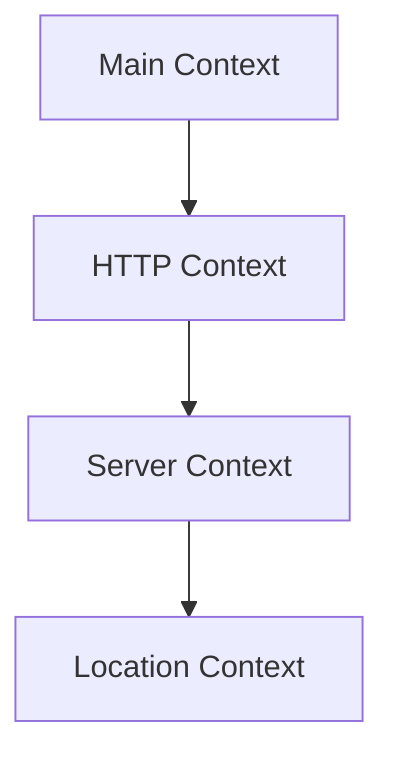

# Nginx Logs

## Introduction

Logs are a vital component of any web server, and Nginx is no exception. They provide a window into the server's operations, recording everything from user requests to server errors. Understanding Nginx logs is essential for debugging issues, monitoring server performance, and maintaining the health of your web applications.

In this tutorial, we'll explore how Nginx handles logging, the different types of logs it generates, how to configure them for your specific needs, and how to analyze them effectively.

## Nginx Log Types

Nginx primarily uses two types of logs:

1. **Access Logs** - Records information about each visitor request
2. **Error Logs** - Records problems and errors encountered by the server

Let's examine each in detail.

## Access Logs

Access logs record information about each request made to the server. By default, these logs are stored in `/var/log/nginx/access.log` (on Linux systems).

### Default Access Log Format

The default access log format in Nginx looks like this:

```
log_format combined '$remote_addr - $remote_user [$time_local] '
                    '"$request" $status $body_bytes_sent '
                    '"$http_referer" "$http_user_agent"';
```

A sample log entry might appear as:

```
192.168.1.1 - - [14/Mar/2025:13:55:36 +0000] "GET /index.html HTTP/1.1" 200 2326 "http://example.com/home" "Mozilla/5.0 (Windows NT 10.0; Win64; x64) AppleWebKit/537.36"
```

### Understanding Access Log Fields

Let's break down the components of this log entry:

- `$remote_addr`: Client IP address (`192.168.1.1`)
- `$remote_user`: Client identity if HTTP authentication is used (usually `-` if not authenticated)
- `$time_local`: Local server time when the request was received (`[14/Mar/2025:13:55:36 +0000]`)
- `$request`: The request line from the client (`"GET /index.html HTTP/1.1"`)
- `$status`: HTTP response status code (`200`)
- `$body_bytes_sent`: Number of bytes sent to the client (`2326`)
- `$http_referer`: The referring website (`"http://example.com/home"`)
- `$http_user_agent`: Client browser information (`"Mozilla/5.0..."`)

## Error Logs

Error logs record problems or errors Nginx encounters. By default, these logs are stored in `/var/log/nginx/error.log`.

### Default Error Log Format

A typical error log entry looks like:

```
2025/03/14 13:57:42 [error] 12345#0: *67 open() "/usr/share/nginx/html/missing-page.html" failed (2: No such file or directory), client: 192.168.1.1, server: example.com, request: "GET /missing-page.html HTTP/1.1", host: "example.com"
```

### Understanding Error Log Fields

Let's break down this error log entry:

- Date and time: `2025/03/14 13:57:42`
- Log level: `[error]`
- Process ID: `12345#0`
- Connection counter: `*67`
- Error message: `open() "/usr/share/nginx/html/missing-page.html" failed (2: No such file or directory)`
- Client IP: `client: 192.168.1.1`
- Server name: `server: example.com`
- Request: `request: "GET /missing-page.html HTTP/1.1"`
- Host header: `host: "example.com"`

## Configuring Nginx Logs

You can customize Nginx logging behavior by modifying the configuration files.

### Log Configuration Locations

Nginx log settings can be configured at different levels:



Each level inherits settings from its parent, but can override them as needed.

### Configuring Access Logs

You can configure access logs in your Nginx configuration file:

```nginx
http {
    # Define a custom log format
    log_format detailed '$remote_addr - $remote_user [$time_local] '
                        '"$request" $status $body_bytes_sent '
                        '"$http_referer" "$http_user_agent" '
                        '$request_time $upstream_response_time';
    
    server {
        # Use the custom format for this server
        access_log /var/log/nginx/example_access.log detailed;
        
        location /api/ {
            # Disable access logs for API endpoints
            access_log off;
        }
    }
}
```

### Configuring Error Logs

Error logs can be configured like this:

```nginx
# In the main context
error_log /var/log/nginx/main_error.log warn;

http {
    # In the http context
    error_log /var/log/nginx/http_error.log notice;
    
    server {
        # In a server context
        error_log /var/log/nginx/example_error.log error;
    }
}
```

### Log Levels

Nginx error logs support different severity levels:

1. `debug` - Most verbose, for debugging only
2. `info` - Informational messages
3. `notice` - Normal but significant conditions
4. `warn` - Warning conditions
5. `error` - Error conditions
6. `crit` - Critical conditions
7. `alert` - Action must be taken immediately
8. `emerg` - System is unusable

Each level includes all higher levels. For example, the `error` level will include `error`, `crit`, `alert`, and `emerg` messages.

## Log Rotation

To prevent log files from consuming all available disk space, we need to implement log rotation. This is typically handled by the `logrotate` utility on Linux systems.

### Sample logrotate Configuration

Create a file in `/etc/logrotate.d/nginx` with the following content:

```
/var/log/nginx/*.log {
    daily
    missingok
    rotate 14
    compress
    delaycompress
    notifempty
    create 640 nginx adm
    sharedscripts
    postrotate
        [ -f /var/run/nginx.pid ] && kill -USR1 `cat /var/run/nginx.pid`
    endscript
}
```

This configuration:
- Rotates logs daily
- Keeps 14 days of logs
- Compresses old logs to save space
- Signals Nginx to reopen log files after rotation

## Analyzing Nginx Logs

Now that we understand how to configure Nginx logs, let's explore how to analyze them effectively.

### Basic Log Analysis with Common Unix Tools

1. **Count the number of requests**:

```bash
wc -l /var/log/nginx/access.log
```

2. **Find the most frequently accessed pages**:

```bash
awk '{print $7}' /var/log/nginx/access.log | sort | uniq -c | sort -rn | head -10
```

3. **Count requests by HTTP status code**:

```bash
awk '{print $9}' /var/log/nginx/access.log | sort | uniq -c | sort -rn
```

4. **Find the most frequent visitors (IP addresses)**:

```bash
awk '{print $1}' /var/log/nginx/access.log | sort | uniq -c | sort -rn | head -10
```

5. **Extract 404 (Not Found) errors**:

```bash
grep ' 404 ' /var/log/nginx/access.log
```

### Advanced Analysis with External Tools

For more comprehensive log analysis, several specialized tools are available:

1. **GoAccess** - A real-time web log analyzer that runs in the terminal:

```bash
goaccess /var/log/nginx/access.log -c
```

2. **ELK Stack** (Elasticsearch, Logstash, Kibana) - A powerful set of tools for collecting, processing, and visualizing log data.

3. **Nginx Amplify** - Nginx's own monitoring tool that provides insights based on log analysis.

## Real-World Example: Troubleshooting with Nginx Logs

Let's walk through a practical example of using Nginx logs to troubleshoot a common issue.

### Scenario: Investigating 504 Gateway Timeout Errors

A user reports that they occasionally receive 504 Gateway Timeout errors when using your application.

#### Step 1: Find the relevant error logs

```bash
grep "504" /var/log/nginx/access.log
```

This might yield entries like:

```
192.168.1.10 - - [14/Mar/2025:14:30:22 +0000] "POST /api/upload HTTP/1.1" 504 167 "http://example.com/upload" "Mozilla/5.0" 60.123 60.000
```

#### Step 2: Check for patterns

Looking at the results, we notice:
- The errors only happen on `/api/upload` endpoint
- The request time (`$request_time`) is consistently high (60+ seconds)
- The upstream response time matches the request time

#### Step 3: Check error logs for more details

```bash
grep "/api/upload" /var/log/nginx/error.log
```

This might reveal:

```
2025/03/14 14:30:22 [error] 12345#0: *123 upstream timed out (110: Connection timed out) while reading response header from upstream, client: 192.168.1.10, server: example.com, request: "POST /api/upload HTTP/1.1", upstream: "http://127.0.0.1:8080/api/upload", host: "example.com"
```

#### Step 4: Fix the issue

Based on our log analysis, the problem is that the upstream server (running on port 8080) is taking too long to respond. We could:

1. Increase the timeout settings in Nginx:

```nginx
location /api/upload {
    proxy_pass http://127.0.0.1:8080;
    proxy_read_timeout 300s;  # Increase from default 60s to 300s
}
```

2. Optimize the upload endpoint in our application to handle large files more efficiently.

## Implementing Structured Logging with JSON

For more sophisticated environments, structured logging in JSON format can make log processing easier:

```nginx
http {
    log_format json_combined escape=json '{'
                              '"time_local":"$time_local",'
                              '"remote_addr":"$remote_addr",'
                              '"remote_user":"$remote_user",'
                              '"request":"$request",'
                              '"status": "$status",'
                              '"body_bytes_sent":"$body_bytes_sent",'
                              '"request_time":"$request_time",'
                              '"http_referrer":"$http_referer",'
                              '"http_user_agent":"$http_user_agent"'
                              '}';
                              
    access_log /var/log/nginx/access.log json_combined;
}
```

This produces logs in a JSON format that can be easily parsed by log processing tools:

```json
{"time_local":"14/Mar/2025:15:00:22 +0000","remote_addr":"192.168.1.1","remote_user":"-","request":"GET /index.html HTTP/1.1","status": "200","body_bytes_sent":"2326","request_time":"0.005","http_referrer":"http://example.com/home","http_user_agent":"Mozilla/5.0 (Windows NT 10.0; Win64; x64) AppleWebKit/537.36"}
```

## Summary

Nginx logs are an invaluable resource for monitoring and troubleshooting your web server. In this tutorial, we've covered:

- The two primary types of Nginx logs: access logs and error logs
- How to understand the default log formats
- Configuring custom log formats and locations
- Log rotation to manage disk space
- Basic and advanced techniques for log analysis
- A practical troubleshooting example using log analysis
- Implementing structured logging with JSON

By mastering Nginx logs, you'll be better equipped to diagnose issues, monitor performance, and ensure the smooth operation of your web applications.

## Additional Resources

Here are some exercises to reinforce your understanding of Nginx logs:

1. **Exercise 1**: Configure a custom log format that includes response time and upstream response time.
2. **Exercise 2**: Set up different logging configurations for different virtual hosts.
3. **Exercise 3**: Write a simple bash script that extracts the top 10 slowest requests from your access logs.
4. **Exercise 4**: Configure JSON-format logging and set up a basic ELK stack to visualize your logs.

## Next Steps

Now that you understand Nginx logs, consider learning about:

- Nginx metrics and monitoring
- Security hardening with Nginx
- Advanced proxy and caching configurations