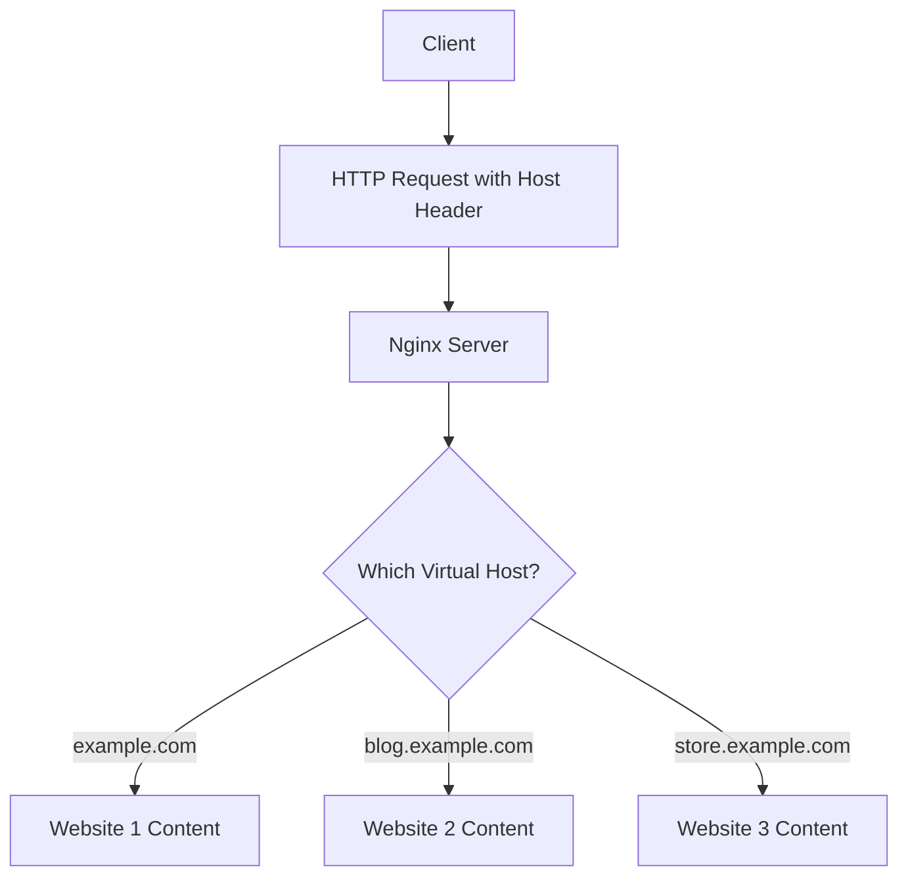

# Nginx Virtual Hosts

## Introduction

Virtual hosts in Nginx allow you to serve multiple websites or applications from a single server using a single IP address. Rather than setting up separate servers for each website, you can configure Nginx to direct traffic to different website content based on the domain name requested by the client.

This powerful feature enables you to:
- Host multiple websites on one server
- Save on infrastructure costs
- Efficiently manage server resources
- Separate different applications logically while keeping them on the same physical machine

By the end of this tutorial, you'll understand how virtual hosts work and be able to set up your own on an Nginx server.

## Understanding Virtual Hosts

In web hosting terminology, a virtual host (or vhost) refers to the practice of serving multiple websites from a single server. When a client makes a request to the server, Nginx examines the `Host` header in the HTTP request and routes the request to the appropriate website configuration.



There are two primary types of virtual hosts:

1. **Name-based virtual hosting**: Multiple domain names point to the same IP address, and the server differentiates between them based on the domain name in the request.

2. **IP-based virtual hosting**: Each website has its own dedicated IP address, and the server routes traffic based on the destination IP.

Name-based virtual hosting is more common and resource-efficient, so we'll focus on that in this tutorial.

## Prerequisites

Before setting up virtual hosts, make sure you have:

- A server with Nginx installed
- Root or sudo access to the server
- Domain names configured to point to your server's IP address
- Basic understanding of Nginx configuration syntax

## Basic Virtual Host Configuration

Let's start by creating a simple virtual host configuration for two different websites: `example.com` and `blog.example.com`.

### Step 1: Create the Directory Structure

First, let's create directories for each website:

```bash
sudo mkdir -p /var/www/example.com/html
sudo mkdir -p /var/www/blog.example.com/html
```

### Step 2: Set Permissions

Set the appropriate ownership and permissions:

```bash
sudo chown -R $USER:$USER /var/www/example.com/html
sudo chown -R $USER:$USER /var/www/blog.example.com/html
sudo chmod -R 755 /var/www
```

### Step 3: Create Sample Pages

Let's create a sample `index.html` for each site:

For example.com:

```bash
echo '<html>
  <head>
    <title>Welcome to example.com</title>
  </head>
  <body>
    <h1>Success! The example.com virtual host is working!</h1>
  </body>
</html>' > /var/www/example.com/html/index.html
```

For blog.example.com:

```bash
echo '<html>
  <head>
    <title>Welcome to blog.example.com</title>
  </head>
  <body>
    <h1>Success! The blog.example.com virtual host is working!</h1>
  </body>
</html>' > /var/www/blog.example.com/html/index.html
```

### Step 4: Create Server Block Files

In Nginx, virtual hosts are configured using server blocks. Let's create configuration files for each domain:

For example.com:

```bash
sudo nano /etc/nginx/sites-available/example.com
```

Add the following content:

```nginx
server {
    listen 80;
    listen [::]:80;

    server_name example.com www.example.com;
    root /var/www/example.com/html;
    index index.html index.htm index.nginx-debian.html;

    location / {
        try_files $uri $uri/ =404;
    }
}
```

For blog.example.com:

```bash
sudo nano /etc/nginx/sites-available/blog.example.com
```

Add the following content:

```nginx
server {
    listen 80;
    listen [::]:80;

    server_name blog.example.com;
    root /var/www/blog.example.com/html;
    index index.html index.htm index.nginx-debian.html;

    location / {
        try_files $uri $uri/ =404;
    }
}
```

### Step 5: Enable the Server Blocks

Create symbolic links from the sites-available directory to the sites-enabled directory:

```bash
sudo ln -s /etc/nginx/sites-available/example.com /etc/nginx/sites-enabled/
sudo ln -s /etc/nginx/sites-available/blog.example.com /etc/nginx/sites-enabled/
```

### Step 6: Test and Restart Nginx

Check if your configuration is valid:

```bash
sudo nginx -t
```

If there are no errors, restart Nginx:

```bash
sudo systemctl restart nginx
```

Now, when you visit `example.com` or `blog.example.com` in your browser, you should see the appropriate website content.

## Understanding the Server Block Configuration

Let's break down the server block configuration we just created:

```nginx
server {
    listen 80;            # Listen on port 80 (HTTP)
    listen [::]:80;       # Listen on IPv6 address too

    server_name example.com www.example.com;  # Domain names this block responds to
    
    root /var/www/example.com/html;           # Document root directory
    index index.html index.htm;               # Default index files
    
    location / {                              # Configuration for root location
        try_files $uri $uri/ =404;            # Try to serve the requested URI, then 404
    }
}
```

Key components explained:

- **server**: Defines a server block (virtual host)
- **listen**: Specifies the port and optionally the IP address to listen on
- **server_name**: The domain names this server block will respond to
- **root**: The directory where website files are stored
- **index**: The default files to serve when a directory is requested
- **location**: Configures how Nginx handles requests for specific paths
- **try_files**: Tries to serve files in the specified order

## Advanced Virtual Host Configurations

Let's explore some more advanced configurations for virtual hosts.

### Adding SSL/TLS Support

To secure your virtual host with SSL/TLS:

```nginx
server {
    listen 80;
    listen [::]:80;
    server_name secure.example.com;
    
    # Redirect all HTTP requests to HTTPS
    return 301 https://$host$request_uri;
}

server {
    listen 443 ssl http2;
    listen [::]:443 ssl http2;
    server_name secure.example.com;
    
    ssl_certificate /etc/nginx/ssl/secure.example.com.crt;
    ssl_certificate_key /etc/nginx/ssl/secure.example.com.key;
    
    # SSL configuration
    ssl_protocols TLSv1.2 TLSv1.3;
    ssl_prefer_server_ciphers on;
    ssl_ciphers ECDHE-RSA-AES256-GCM-SHA512:DHE-RSA-AES256-GCM-SHA512:ECDHE-RSA-AES256-GCM-SHA384:DHE-RSA-AES256-GCM-SHA384;
    
    root /var/www/secure.example.com/html;
    index index.html index.htm;
    
    location / {
        try_files $uri $uri/ =404;
    }
}
```

### PHP Processing

To handle PHP files in your virtual host:

```nginx
server {
    listen 80;
    server_name php.example.com;
    root /var/www/php.example.com/html;
    index index.php index.html index.htm;
    
    location / {
        try_files $uri $uri/ =404;
    }
    
    location ~ \.php$ {
        include snippets/fastcgi-php.conf;
        fastcgi_pass unix:/var/run/php/php7.4-fpm.sock;
    }
    
    location ~ /\.ht {
        deny all;
    }
}
```

### Reverse Proxy Configuration

To use Nginx as a reverse proxy for an application running on another port:

```nginx
server {
    listen 80;
    server_name app.example.com;
    
    location / {
        proxy_pass http://localhost:3000;
        proxy_http_version 1.1;
        proxy_set_header Upgrade $http_upgrade;
        proxy_set_header Connection 'upgrade';
        proxy_set_header Host $host;
        proxy_cache_bypass $http_upgrade;
    }
}
```

### Load Balancing Multiple Backends

To distribute traffic among multiple backend servers:

```nginx
upstream backend_servers {
    server 192.168.1.101:8080;
    server 192.168.1.102:8080;
    server 192.168.1.103:8080;
}

server {
    listen 80;
    server_name loadbalanced.example.com;
    
    location / {
        proxy_pass http://backend_servers;
        proxy_set_header Host $host;
        proxy_set_header X-Real-IP $remote_addr;
    }
}
```

## Troubleshooting Virtual Hosts

If you encounter issues with your virtual host configuration, try these troubleshooting steps:

1. **Check Nginx syntax**:
   ```bash
   sudo nginx -t
   ```

2. **Verify domain DNS**:
   ```bash
   nslookup example.com
   ```

3. **Check server logs**:
   ```bash
   sudo tail -f /var/log/nginx/access.log
   sudo tail -f /var/log/nginx/error.log
   ```

4. **Verify file permissions**:
   ```bash
   ls -la /var/www/example.com/html/
   ```

5. **Test with curl**:
   ```bash
   curl -H "Host: example.com" http://your_server_ip
   ```

## Default Server and Server Block Order

When Nginx receives a request for a domain that doesn't match any configured `server_name`, it will use the default server. By default, this is the first server block in the configuration.

You can explicitly set a default server:

```nginx
server {
    listen 80 default_server;
    listen [::]:80 default_server;
    
    server_name _;
    
    root /var/www/default/html;
    index index.html;
    
    location / {
        try_files $uri $uri/ =404;
    }
}
```

## Best Practices for Virtual Hosts

Follow these best practices when configuring virtual hosts:

1. **Keep configurations separate**: Store each virtual host configuration in its own file
2. **Use meaningful file names**: Name configuration files after the domains they serve
3. **Implement SSL/TLS**: Secure your websites with HTTPS
4. **Set proper permissions**: Ensure your web content has appropriate ownership and permissions
5. **Include common configurations**: Use Nginx's `include` directive for reusable configurations
6. **Regular backups**: Back up your configuration files regularly
7. **Monitor logs**: Check your access and error logs for issues
8. **Use server_name matching efficiently**: List specific names before wildcard patterns

## Practical Example: Full Stack Application

Let's create a complete example of a virtual host configuration for a full-stack application with a frontend, backend API, and static assets:

```nginx
# Frontend application
server {
    listen 80;
    server_name myapp.example.com;
    
    root /var/www/myapp/frontend/dist;
    index index.html;
    
    # Handle SPA routing
    location / {
        try_files $uri $uri/ /index.html;
    }
    
    # Proxy API requests to backend
    location /api/ {
        proxy_pass http://localhost:3000;
        proxy_http_version 1.1;
        proxy_set_header Upgrade $http_upgrade;
        proxy_set_header Connection 'upgrade';
        proxy_set_header Host $host;
        proxy_cache_bypass $http_upgrade;
    }
    
    # Serve static assets with cache headers
    location /assets/ {
        alias /var/www/myapp/assets/;
        expires 30d;
        add_header Cache-Control "public, max-age=2592000";
    }
    
    # Deny access to hidden files
    location ~ /\. {
        deny all;
    }
}
```

## Summary

In this tutorial, we've covered:

- What virtual hosts are and why they're useful
- How to set up basic virtual host configurations
- Advanced configurations including SSL, PHP processing, and reverse proxying
- Troubleshooting techniques
- Best practices for managing virtual hosts

Virtual hosts are a powerful feature of Nginx that allow you to efficiently serve multiple websites from a single server. By understanding how to configure them properly, you can optimize your server infrastructure and simplify your website management.

## Additional Resources and Exercises

### Additional Resources

- [Official Nginx Documentation](https://nginx.org/en/docs/)
- [Nginx Beginner's Guide](https://nginx.org/en/docs/beginners_guide.html)
- [Digital Ocean's Nginx Configuration Guide](https://www.digitalocean.com/community/tutorials/how-to-set-up-nginx-server-blocks-virtual-hosts-on-ubuntu-16-04)

### Exercises

1. **Basic Setup**: Configure virtual hosts for two different domains pointing to different content directories.

2. **SSL Configuration**: Add SSL certificates (you can use self-signed certificates for testing) to one of your virtual hosts.

3. **Reverse Proxy**: Set up a virtual host that proxies requests to a Node.js application running on port 3000.

4. **Load Balancing**: Configure a virtual host that distributes traffic between two backend servers (you can simulate this with two different ports on localhost).

5. **Advanced Routing**: Create a virtual host that handles different paths differently (e.g., serving static files, proxying API requests, and handling a single-page application).

By completing these exercises, you'll gain practical experience with Nginx virtual hosts and be well-prepared to manage complex web hosting scenarios.