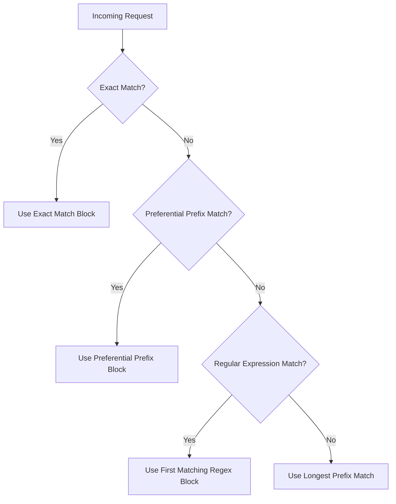

# Nginx Location Blocks

## Introduction

Location blocks are one of the most powerful and fundamental features of Nginx. They allow you to define how the server responds to specific URL patterns, enabling you to create sophisticated routing rules for your web applications. Whether you want to serve static files, proxy requests to application servers, or set up redirects, location blocks are the primary tool you'll use in Nginx configurations.

In this guide, we'll explore how location blocks work, the different matching modifiers available, how Nginx prioritizes overlapping location blocks, and practical examples to apply these concepts in real-world scenarios.

## Understanding Location Blocks

Location blocks are defined within a `server` block in your Nginx configuration and determine how specific URL paths are handled. They follow this basic syntax:

```nginx
server {
    # Server configuration
    
    location [modifier] pattern {
        # Directives specific to this location
    }
}
```

Where:
- `modifier` (optional) changes how the pattern is interpreted
- `pattern` is the URL path to match against
- Directives inside the block specify what to do when a request matches the pattern

## Location Block Modifiers

Nginx provides several modifiers that change how patterns are matched:

| Modifier | Description | Example |
|----------|-------------|---------|
| (none) | Prefix match - matches beginning of the URI | `location /api/ { ... }` |
| `=` | Exact match - URI must be exactly the pattern | `location = /exact/path { ... }` |
| `~` | Case-sensitive regex match | `location ~ \.php$ { ... }` |
| `~*` | Case-insensitive regex match | `location ~* \.(jpg\|jpeg\|png)$ { ... }` |
| `^~` | Preferential prefix match | `location ^~ /images/ { ... }` |

Let's explore each modifier with examples:

### Prefix Match (No Modifier)

The most basic form is a prefix match, which will match any URI starting with the specified pattern:

```nginx
location /api/ {
    # Matches /api/, /api/users, /api/posts/123, etc.
    return 200 "This is the API section";
}
```

### Exact Match (`=` Modifier)

The exact match requires the URI to match the pattern exactly:

```nginx
location = /api {
    # Matches ONLY /api, not /api/ or /api/users
    return 200 "API home page";
}
```

### Regular Expression Match (`~` and `~*` Modifiers)

These allow you to match URIs using regular expressions:

```nginx
# Case-sensitive match for .php files
location ~ \.php$ {
    # Handles PHP processing
    fastcgi_pass unix:/var/run/php-fpm.sock;
    fastcgi_param SCRIPT_FILENAME $document_root$fastcgi_script_name;
    include fastcgi_params;
}

# Case-insensitive match for image files
location ~* \.(jpg|jpeg|png|gif)$ {
    # Image handling directives
    expires 30d;
}
```

### Preferential Prefix Match (`^~` Modifier)

This is similar to a prefix match, but it has higher priority than regular expressions:

```nginx
location ^~ /assets/ {
    # This will take precedence over regex matches for URIs starting with /assets/
    expires 30d;
}
```

## Location Block Matching Priority

Understanding the priority order of location blocks is crucial, as a request could potentially match multiple location blocks. Nginx follows this order when selecting which location block to use:

1. Exact match (`=`) - highest priority
2. Preferential prefix match (`^~`)
3. Regular expression match (`~` and `~*`) - in order of appearance
4. Prefix match (no modifier) - lowest priority

Let's visualize this priority order:



## Practical Examples

Let's explore some real-world examples to see how location blocks can be used effectively:

### 1. Serving Static Files

```nginx
server {
    listen 80;
    server_name example.com;
    root /var/www/example;

    # Handle static assets with caching
    location ^~ /assets/ {
        expires 30d;
        add_header Cache-Control "public, no-transform";
    }

    # Handle HTML files
    location ~* \.html$ {
        expires 1h;
    }

    # Default handler
    location / {
        try_files $uri $uri/ /index.html;
    }
}
```

### 2. Proxying to Application Servers

```nginx
server {
    listen 80;
    server_name api.example.com;

    # API versioning
    location /v1/ {
        proxy_pass http://api_servers_v1;
        proxy_set_header Host $host;
        proxy_set_header X-Real-IP $remote_addr;
    }

    location /v2/ {
        proxy_pass http://api_servers_v2;
        proxy_set_header Host $host;
        proxy_set_header X-Real-IP $remote_addr;
    }

    # Admin panel with exact match
    location = /admin {
        return 301 /admin/;
    }

    location /admin/ {
        proxy_pass http://admin_servers;
        proxy_set_header Host $host;
        proxy_set_header X-Real-IP $remote_addr;
    }
}
```

### 3. Handling Different File Types

```nginx
server {
    listen 80;
    server_name files.example.com;
    root /var/www/files;

    # Handle image files
    location ~* \.(jpg|jpeg|png|gif)$ {
        expires 30d;
        access_log off;
        add_header Cache-Control "public";
    }

    # Handle JavaScript and CSS files
    location ~* \.(js|css)$ {
        expires 7d;
        add_header Cache-Control "public";
    }

    # Block access to .hidden files
    location ~ /\. {
        deny all;
    }
}
```

### 4. Creating a Simple API Gateway

```nginx
server {
    listen 80;
    server_name gateway.example.com;

    # User service
    location /users/ {
        proxy_pass http://user-service;
        proxy_set_header Host $host;
        proxy_set_header X-Real-IP $remote_addr;
    }

    # Product service
    location /products/ {
        proxy_pass http://product-service;
        proxy_set_header Host $host;
        proxy_set_header X-Real-IP $remote_addr;
    }

    # Order service
    location /orders/ {
        proxy_pass http://order-service;
        proxy_set_header Host $host;
        proxy_set_header X-Real-IP $remote_addr;
    }

    # Default route
    location / {
        return 404;
    }
}
```

## Nested Location Blocks

Nginx does not officially support nested location blocks, but you can achieve similar functionality by carefully structuring your location patterns:

```nginx
# Instead of nesting (which doesn't work as expected):
location /api/ {
    # This would NOT work as intended:
    # location /users/ { ... }
}

# Use this approach instead:
location /api/ {
    # Common API directives
}

location /api/users/ {
    # User-specific API directives
}

location /api/products/ {
    # Product-specific API directives
}
```

## Common Pitfalls and Best Practices

### 1. The Trailing Slash

A common source of confusion is the trailing slash in location patterns:

```nginx
# These are different:
location /api {
    # Matches /api, /apiserver, /api/users
}

location /api/ {
    # Matches /api/, /api/users, but NOT /apiserver
}
```

### 2. Order Matters for Regular Expressions

For regex location blocks, the order in the configuration file determines which one Nginx will use if multiple patterns match:

```nginx
# The first matching regex wins
location ~ \.php$ {
    # Handles PHP files
}

# This will never be reached for .php files
location ~ \.(php|html)$ {
    # Handles PHP and HTML files
}
```

### 3. Using Variables in Location Blocks

You can use variables in the directives inside location blocks, but not in the location pattern itself:

```nginx
# This works:
location /api/ {
    return 200 $uri;
}

# This does NOT work:
# location /$variable_name/ { ... }
```

### 4. The `try_files` Directive

One of the most useful directives within location blocks is `try_files`, which attempts to serve files in the specified order:

```nginx
location / {
    try_files $uri $uri/ /index.html;
}
```

This tries to:
1. Serve the exact URI as a file
2. Serve the URI as a directory
3. Fall back to /index.html if neither exists

## Advanced Location Block Techniques

### Using Named Locations

You can create named location blocks that can only be accessed internally using the `@` symbol:

```nginx
location / {
    try_files $uri $uri/ @fallback;
}

location @fallback {
    proxy_pass http://backend;
}
```

### Rewriting URLs

Location blocks often work with the `rewrite` directive to modify URLs:

```nginx
location /old-site/ {
    rewrite ^/old-site/(.*)$ /new-site/$1 permanent;
}
```

### Conditional Location Processing

You can use `if` statements inside location blocks, though it's generally recommended to avoid them when possible:

```nginx
location /downloads/ {
    if ($remote_addr = "192.168.1.1") {
        return 403;
    }
    
    try_files $uri =404;
}
```

## Summary

Nginx location blocks are a powerful feature that give you precise control over how different URL patterns are handled. We've covered:

- The syntax and basic structure of location blocks
- Different matching modifiers (`=`, `~`, `~*`, `^~`) and what they do
- How Nginx prioritizes location blocks when multiple could match
- Practical examples for common web server configurations
- Common pitfalls and best practices

By mastering location blocks, you can create sophisticated routing rules for your web applications, efficiently serve different types of content, and build powerful API gateways and reverse proxies.

## Additional Resources

To further enhance your understanding of Nginx location blocks:

- Practice creating different location block patterns and test them with `curl` or your browser
- Review the [official Nginx documentation](http://nginx.org/en/docs/http/ngx_http_core_module.html#location) for the most up-to-date information
- Try debugging location block matching using the `nginx -T` command to test your configuration

## Exercises

1. Create a configuration that serves static files from a `/static/` directory with appropriate caching headers for different file types.
2. Build a simple API gateway that routes requests to three different backend services based on the URL path.
3. Implement a configuration that redirects all HTTP requests to HTTPS while preserving the original URL path.
4. Create a configuration that handles both www and non-www domains, redirecting one to the other for consistent SEO.