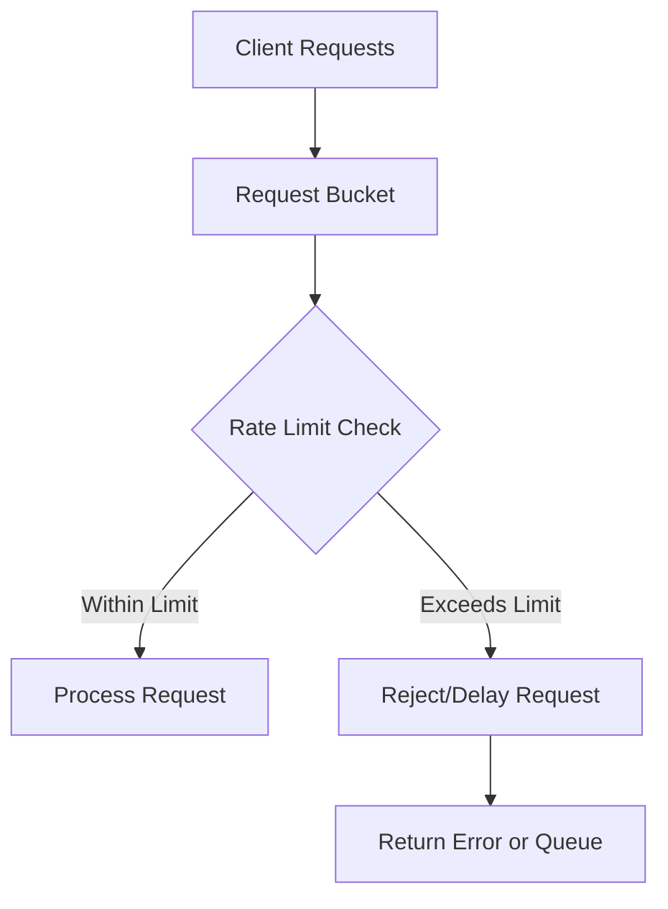

# Nginx Rate Limiting

## Introduction

Rate limiting is a crucial technique for controlling the amount of traffic your web server handles. In the context of Nginx, rate limiting allows you to restrict the number of requests a client can make to your server within a specified time period. This feature helps to:

- Protect your server from being overwhelmed by too many requests
- Prevent abuse of your API or services
- Mitigate DDoS (Distributed Denial of Service) attacks
- Ensure fair resource distribution among users

In this tutorial, we'll explore how Nginx implements rate limiting, understand its key concepts, and learn how to configure it for various scenarios.

## Understanding Rate Limiting Concepts

Before diving into configuration, let's understand the core concepts of Nginx rate limiting:

### Key Directives

Nginx provides several directives for implementing rate limiting:

1. **`limit_req_zone`**: Defines parameters for rate limiting
2. **`limit_req`**: Applies the rate limiting to a specific location
3. **`limit_req_status`**: Sets the HTTP status code returned when limiting
4. **`limit_req_log_level`**: Configures logging level for limited requests

### How Rate Limiting Works in Nginx

Nginx uses the "leaky bucket" algorithm for rate limiting, which works as follows:



The algorithm processes requests at a constant rate. If requests come in faster than they can be processed, they're either queued (if a burst is configured) or rejected.

## Basic Rate Limiting Configuration

Let's start with a basic rate limiting configuration:

```nginx
# Define a rate limiting zone
http {
    # Create a zone that allows 1 request per second
    limit_req_zone $binary_remote_addr zone=mylimit:10m rate=1r/s;
    
    server {
        location /api/ {
            # Apply the rate limit to this location
            limit_req zone=mylimit;
            
            # Your location configuration...
            proxy_pass http://my_upstream;
        }
    }
}
```

In this example:

- We create a zone named `mylimit` with 10MB of memory
- The rate is set to 1 request per second (1r/s)
- We're using `$binary_remote_addr` as the key, which means rate limiting is applied per client IP address
- The limit is applied to all requests to the `/api/` location

### Testing the Configuration

Let's see what happens when we try to access our rate-limited API multiple times in quick succession:

**Client request:**
```bash
for i in {1..5}; do curl -I http://localhost/api/data; done
```

**Output:**
```
HTTP/1.1 200 OK
...

HTTP/1.1 503 Service Temporarily Unavailable
...

HTTP/1.1 503 Service Temporarily Unavailable
...

HTTP/1.1 503 Service Temporarily Unavailable
...

HTTP/1.1 503 Service Temporarily Unavailable
...
```

As you can see, the first request succeeds, but subsequent requests receive a 503 error because they exceed our rate limit of 1 request per second.

## Advanced Rate Limiting Techniques

### Allowing Bursts

In real-world scenarios, it's common to have bursts of traffic. Nginx provides the `burst` parameter to handle these situations:

```nginx
http {
    limit_req_zone $binary_remote_addr zone=mylimit:10m rate=1r/s;
    
    server {
        location /api/ {
            # Allow a burst of 5 requests
            limit_req zone=mylimit burst=5;
            
            proxy_pass http://my_upstream;
        }
    }
}
```

With this configuration, Nginx will queue up to 5 additional requests beyond the defined rate. The extra requests will be processed at the configured rate (1 per second in this case).

### Delayed Processing with nodelay

If you want to process burst requests immediately rather than queuing them, you can add the `nodelay` parameter:

```nginx
http {
    limit_req_zone $binary_remote_addr zone=mylimit:10m rate=1r/s;
    
    server {
        location /api/ {
            # Process up to 5 extra requests immediately without delay
            limit_req zone=mylimit burst=5 nodelay;
            
            proxy_pass http://my_upstream;
        }
    }
}
```

With `nodelay`, Nginx will immediately process burst requests (up to the specified burst size) and then enforce the rate limit for subsequent requests.

### Custom Error Responses

You can customize the HTTP status code returned when rate limiting is triggered:

```nginx
http {
    limit_req_zone $binary_remote_addr zone=mylimit:10m rate=1r/s;
    
    server {
        location /api/ {
            limit_req zone=mylimit burst=5 nodelay;
            # Use 429 (Too Many Requests) instead of default 503
            limit_req_status 429;
            
            # Custom error page
            error_page 429 /rate_limited.html;
            
            proxy_pass http://my_upstream;
        }
        
        location = /rate_limited.html {
            root /usr/share/nginx/html;
            internal;
        }
    }
}
```

## Real-World Use Cases

### Protecting Login Pages

Login pages are common targets for brute force attacks. Here's how to protect them:

```nginx
http {
    # Stricter limit for login attempts
    limit_req_zone $binary_remote_addr zone=login:10m rate=1r/m;
    
    server {
        location /login {
            limit_req zone=login burst=5 nodelay;
            limit_req_status 429;
            
            # Login page configuration
            proxy_pass http://auth_backend;
        }
    }
}
```

This allows only 1 login attempt per minute from the same IP address, with a burst of 5 requests.

### Tiered API Rate Limiting

For APIs with different tiers of access:

```nginx
http {
    # Different zones for different API tiers
    limit_req_zone $binary_remote_addr zone=api_basic:10m rate=10r/s;
    limit_req_zone $binary_remote_addr zone=api_premium:10m rate=50r/s;
    
    map $http_api_key $api_tier {
        default                 "basic";
        "premium_key_example"   "premium";
    }
    
    server {
        location /api/ {
            # Apply different rate limits based on API key
            if ($api_tier = "premium") {
                limit_req zone=api_premium burst=20 nodelay;
            }
            if ($api_tier = "basic") {
                limit_req zone=api_basic burst=5 nodelay;
            }
            
            proxy_pass http://api_backend;
        }
    }
}
```

### Global Rate Limiting with Location-Specific Overrides

For site-wide protection with specific rules for certain paths:

```nginx
http {
    # Global rate limit zone
    limit_req_zone $binary_remote_addr zone=global:10m rate=5r/s;
    # More permissive zone for static content
    limit_req_zone $binary_remote_addr zone=static:10m rate=30r/s;
    
    server {
        # Apply global rate limiting to all locations
        limit_req zone=global burst=10 nodelay;
        
        # Override for static content
        location ~* \.(css|js|jpg|jpeg|png|gif)$ {
            limit_req zone=static burst=20 nodelay;
            root /var/www/static;
        }
        
        # Override for API
        location /api/ {
            # Stricter limits for API
            limit_req zone=global burst=5;
            proxy_pass http://api_backend;
        }
    }
}
```

## Monitoring and Troubleshooting

### Logging Rate-Limited Requests

Configure detailed logging for rate-limited requests:

```nginx
http {
    limit_req_zone $binary_remote_addr zone=mylimit:10m rate=1r/s;
    
    server {
        location /api/ {
            limit_req zone=mylimit burst=5;
            # Set log level for rate limiting events
            limit_req_log_level warn;
            
            proxy_pass http://my_upstream;
        }
    }
}
```

You can set the log level to `info`, `notice`, `warn`, or `error` depending on how prominently you want rate-limiting events to appear in your logs.

### Checking Active Rate Limiting

To check the current state of your rate limiting zones, you can use the Nginx status module:

```nginx
http {
    # ... rate limiting configuration
    
    server {
        location /nginx_status {
            stub_status on;
            allow 127.0.0.1;
            deny all;
        }
    }
}
```

Then run:

```bash
curl http://localhost/nginx_status
```

## Common Pitfalls and Gotchas

1. **Shared IPs**: If your users share IP addresses (e.g., behind a corporate firewall), they'll also share rate limits.

2. **Proxy Issues**: If your server is behind a proxy, use the real client IP:

   ```nginx
   limit_req_zone $http_x_forwarded_for zone=mylimit:10m rate=1r/s;
   ```

3. **Memory Consumption**: Monitor memory usage of your rate limiting zones, especially for high-traffic sites.

4. **Rate vs. Connection Limits**: Don't confuse rate limiting with connection limiting. Rate limiting controls requests per time unit, while connection limiting (`limit_conn`) controls simultaneous connections.

## Summary

Nginx rate limiting is a powerful tool for protecting your web applications from excessive traffic, whether malicious or unintentional. By implementing proper rate limiting, you can:

- Ensure your server remains responsive even under heavy load
- Protect against brute force attacks and other malicious traffic patterns
- Manage resources effectively for different types of content and users
- Create tiered access systems for APIs and special content

The key to effective rate limiting is finding the right balance between security and usability. Start with conservative limits and adjust based on your application's needs and traffic patterns.

## Additional Resources

- Nginx official documentation on [rate limiting](http://nginx.org/en/docs/http/ngx_http_limit_req_module.html)
- Learn about complementary techniques like [connection limiting](http://nginx.org/en/docs/http/ngx_http_limit_conn_module.html)

## Exercises

1. Configure rate limiting for a WordPress login page to prevent brute force attacks.
2. Set up different rate limits for various sections of your website based on resource requirements.
3. Implement a rate limiting system with custom error pages that inform users when they've hit their limit.
4. Create a tiered rate limiting system that identifies users by cookies instead of IP addresses.
5. Configure logging to monitor and analyze rate-limited requests to tune your configuration.