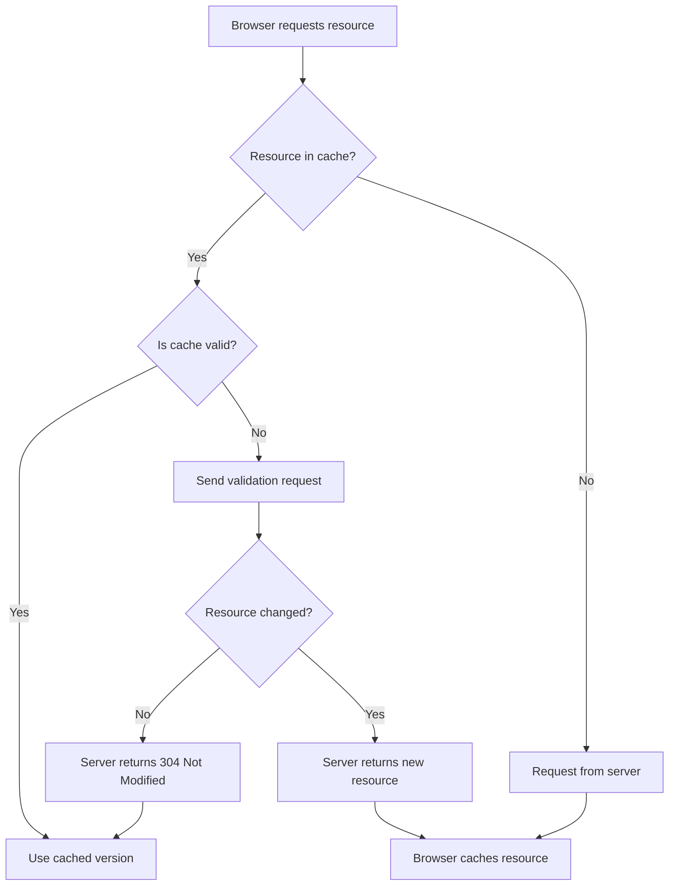

# Nginx Browser Caching

## Introduction

Browser caching is a powerful technique that can significantly improve your website's performance. When properly configured, it allows browsers to store static resources like images, CSS files, and JavaScript locally, reducing the need to download these resources on subsequent visits to your site.

In this tutorial, we'll explore how to implement browser caching using Nginx, one of the most popular web servers. By the end, you'll understand how browser caching works and be able to configure Nginx to take full advantage of this performance optimization technique.

## What is Browser Caching?

Browser caching works on a simple principle: why download something again if it hasn't changed?

When a browser requests a resource (like an image or CSS file), the server can include HTTP headers that instruct the browser to:
1. Store a copy of the resource locally
2. Keep this copy for a specified period
3. Use the local copy instead of requesting it again until it expires

<br />

This process significantly reduces:
- Bandwidth usage (saving money and resources)
- Server load (allowing your server to handle more traffic)
- Page load times (improving user experience)

Let's visualize the browser caching flow:



## Implementing Browser Caching in Nginx

### Basic Configuration

To enable browser caching in Nginx, we need to add directives to our server configuration. Let's start with a basic example:

```nginx
server {
    listen 80;
    server_name example.com www.example.com;
    
    location ~* \.(jpg|jpeg|png|gif|ico|css|js)$ {
        expires 30d;
        add_header Cache-Control "public, no-transform";
    }
    
    # ... rest of your configuration
}
```

This configuration:
1. Matches common static file extensions using a regular expression
2. Sets an expiration time of 30 days
3. Adds a Cache-Control header with additional directives

When a browser requests a matching file, Nginx will add headers like:

```
Expires: Thu, 14 Apr 2025 12:00:00 GMT
Cache-Control: public, no-transform
```

These headers tell the browser to cache the file for 30 days.

### Advanced Configuration

For production websites, you'll want more fine-grained control over caching different types of resources:

```nginx
server {
    listen 80;
    server_name example.com www.example.com;
    
    # CSS and JavaScript files
    location ~* \.(?:css|js)$ {
        expires 1y;
        add_header Cache-Control "public, immutable";
        access_log off;
    }
    
    # Images, icons, video, audio, HTC
    location ~* \.(?:jpg|jpeg|gif|png|ico|cur|gz|svg|mp4|ogg|ogv|webm|htc)$ {
        expires 1M;
        add_header Cache-Control "public";
        access_log off;
    }
    
    # WebFonts
    location ~* \.(?:ttf|ttc|otf|eot|woff|woff2)$ {
        expires 1M;
        add_header Cache-Control "public";
        access_log off;
    }
    
    # Data files
    location ~* \.(?:json|xml)$ {
        expires 5m;
        add_header Cache-Control "public";
    }
    
    # Everything else
    location / {
        expires 0;
        add_header Cache-Control "public, must-revalidate, proxy-revalidate";
    }
}
```

This configuration applies different caching strategies based on file type:
- Long-term caching (1 year) for CSS and JS with the `immutable` flag
- Medium-term caching (1 month) for images and fonts
- Short-term caching (5 minutes) for data files
- No caching for dynamic content

### Understanding Cache-Control Directives

The `Cache-Control` header provides fine-grained control over caching behavior. Here are some common directives:

| Directive | Description |
|-----------|-------------|
| `public` | Can be cached by browsers and intermediary proxies |
| `private` | Can only be cached by browsers, not shared caches |
| `no-cache` | Must revalidate with server before using cached copy |
| `no-store` | Don't cache at all (for sensitive data) |
| `max-age=<seconds>` | How long the resource is fresh |
| `immutable` | Resource won't change during its freshness lifetime |
| `must-revalidate` | Must verify cached version is still valid when expired |

## Handling Cache Busting

What happens when you update a file that's cached for a long time? Browsers won't know it changed until their cache expires.

The solution is "cache busting" - changing the URL when the content changes:

### Method 1: Query strings

```nginx
# In your HTML/templating system:
<link rel="stylesheet" href="styles.css?v=1.2.3">
```

### Method 2: Filename versioning

```nginx
# In your HTML/templating system:
<link rel="stylesheet" href="styles.1.2.3.css">

# In Nginx:
location ~* \.(css|js|png|jpg|jpeg|gif|ico)$ {
    expires max;
    add_header Cache-Control "public, immutable";
    
    # Optional: handle versioned filenames
    location ~ ^.+\.\d+\.(css|js|png|jpg|jpeg|gif|ico)$ {
        try_files $uri $uri/ /${uri%.\\d+.\\w+}.${uri##*.};
    }
}
```

## Testing Your Cache Configuration

To verify your caching is working correctly, you can use browser developer tools:

1. Open your browser's developer tools (F12 in most browsers)
2. Go to the Network tab
3. Load your website
4. Look for resources with a "Size" column showing "disk cache" or "memory cache"
5. Check the response headers to confirm your cache settings are applied

You can also use online tools like:
- [PageGym](https://pagegym.com/)
- [GTmetrix](https://gtmetrix.com/)
- [Google PageSpeed Insights](https://pagespeed.web.dev/)

## Practical Example: Complete Nginx Configuration

Here's a complete Nginx configuration for a typical website with optimized caching:

```nginx
server {
    listen 80;
    server_name example.com www.example.com;
    root /var/www/example.com;
    index index.html index.htm;

    # Gzip compression
    gzip on;
    gzip_comp_level 5;
    gzip_min_length 256;
    gzip_proxied any;
    gzip_vary on;
    gzip_types
        application/javascript
        application/json
        application/xml
        application/xml+rss
        text/css
        text/javascript
        text/plain
        text/xml;
    
    # CSS, JavaScript, and Web Fonts
    location ~* \.(?:css|js|woff2?|ttf|otf|eot)$ {
        expires 1y;
        add_header Cache-Control "public, immutable";
        access_log off;
    }
    
    # Media files
    location ~* \.(?:jpg|jpeg|gif|png|ico|cur|svg|svgz|mp4|webm)$ {
        expires 1M;
        add_header Cache-Control "public";
        access_log off;
        
        # If you use asset versioning, uncomment this:
        # try_files $uri $uri/ /${uri%.\\d+.\\w+}.${uri##*.};
    }
    
    # HTML and data files (shorter cache)
    location ~* \.(?:html|htm|xml|json)$ {
        expires 1h;
        add_header Cache-Control "public";
    }
    
    # Default handling for dynamic content
    location / {
        try_files $uri $uri/ /index.html;
        expires -1;
        add_header Cache-Control "no-store";
    }
}
```

This configuration provides:
- Long-term caching for static assets
- Medium-term caching for media files
- Short-term caching for HTML and data files
- No caching for dynamic content
- Gzip compression to further reduce file sizes

## Common Caching Issues and Solutions

### Issue: Changes not appearing after updates

**Solution:**
- Implement cache busting strategies
- Use versioned filenames or query parameters
- For critical updates, consider changing the file path

### Issue: Some users seeing old content, others seeing new content

**Solution:**
- Make sure proxy servers and CDNs respect your cache headers
- Add `Vary: Accept-Encoding` header if you use compression
- Consider using staggered cache timeouts

### Issue: Too aggressive caching causing stale data

**Solution:**
- Use shorter expiration times for frequently changing resources
- Implement proper cache validation (ETags or Last-Modified)
- Use appropriate Cache-Control directives (like no-cache for dynamic content)

## Best Practices

1. **Match caching duration to content update frequency**
   - Static assets (images, CSS, JS): Long duration (months to years)
   - Template files (HTML): Short duration (hours to days)
   - Dynamic data (JSON/XML): Very short duration (minutes) or no caching

2. **Use fingerprinting/versioning for long-cached resources**
   - Add version numbers or content hashes to filenames
   - Update references when content changes

3. **Combine caching with other performance techniques**
   - Gzip compression
   - HTTP/2
   - Content Delivery Networks (CDNs)

4. **Test thoroughly across different browsers and devices**
   - Caching behavior can vary between browsers
   - Mobile devices may handle caching differently than desktops

5. **Monitor and adjust based on performance metrics**
   - Use analytics to track load times
   - Adjust caching strategy based on real-world performance

## Summary

Nginx browser caching is a powerful and essential technique for optimizing website performance. By properly configuring caching headers, you can:

1. Significantly reduce page load times
2. Decrease server load and bandwidth usage
3. Improve user experience, especially for repeat visitors

The key is finding the right balance between caching duration and content freshness, using appropriate Cache-Control directives, and implementing cache-busting strategies for updated resources.

## Exercises

1. Configure Nginx to cache CSS and JS files for 1 year, images for 1 month, and HTML files for 1 day.
2. Implement a cache-busting strategy using file versioning in your Nginx configuration.
3. Set up different caching policies for authenticated and non-authenticated users.
4. Use browser developer tools to verify that your caching configuration is working correctly.
5. Create a testing plan to ensure cached resources are properly updated when their content changes.

## Additional Resources

- [MDN Web Docs: HTTP Caching](https://developer.mozilla.org/en-US/docs/Web/HTTP/Caching)
- [Nginx Documentation: ngx_http_headers_module](https://nginx.org/en/docs/http/ngx_http_headers_module.html)
- [Web.dev: HTTP Caching](https://web.dev/http-cache/)
- [Jake Archibald: Caching Best Practices](https://jakearchibald.com/2016/caching-best-practices/)
