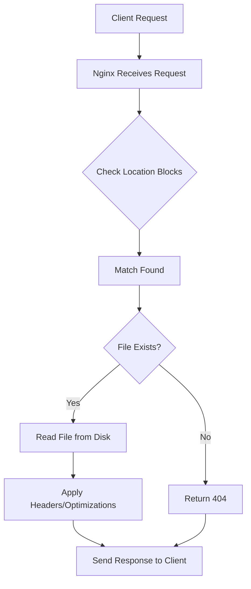

# Nginx Static Content

## Introduction

Static content refers to files that don't change frequently and can be served directly by the web server without processing - things like HTML files, images, CSS stylesheets, JavaScript files, PDFs, and videos. Nginx excels at efficiently serving static content, which is one of the reasons it's widely used as a web server and content delivery solution.

In this guide, we'll explore how to configure Nginx to serve static content efficiently, apply best practices, and optimize performance for your websites and applications.

## Basic Static Content Configuration

### Setting Up a Simple Static Server

At its core, serving static content with Nginx is straightforward. Let's start with a basic configuration:

```nginx
server {
    listen 80;
    server_name example.com www.example.com;
    
    # Root directory for static files
    root /var/www/html;
    
    # Default file to serve
    index index.html;
    
    # Location block for serving static content
    location / {
        try_files $uri $uri/ =404;
    }
}
```

This configuration:
- Listens on port 80
- Serves content for example.com domain
- Sets document root to `/var/www/html`
- Tries to serve the requested URI or returns a 404 error if not found

### Testing Your Configuration

After setting up your configuration and placing files in the specified root directory, reload Nginx:

```bash
sudo nginx -t        # Test the configuration syntax
sudo systemctl reload nginx  # Apply the configuration
```

Now if you visit `http://example.com/image.jpg`, Nginx will serve that file directly from the `/var/www/html` directory.

## Location Blocks for Different Content Types

You can use different location blocks to handle various types of static content:

```nginx
server {
    listen 80;
    server_name example.com;
    root /var/www/html;
    
    location / {
        try_files $uri $uri/ =404;
    }
    
    # Serve static images
    location ~* \.(jpg|jpeg|png|gif|ico|webp)$ {
        expires 30d;
        add_header Cache-Control "public, no-transform";
    }
    
    # Serve static CSS, JavaScript files
    location ~* \.(css|js)$ {
        expires 7d;
        add_header Cache-Control "public, no-transform";
    }
    
    # Serve static document files
    location ~* \.(pdf|doc|docx|txt)$ {
        expires 7d;
        add_header Cache-Control "public";
    }
}
```

This configuration:
- Uses regular expressions to match file extensions
- Sets different expiration times for different content types
- Adds appropriate Cache-Control headers

## Performance Optimization for Static Content

Nginx offers several features to optimize static content delivery:

### 1. Enabling Compression

Compress text-based files to reduce transfer size:

```nginx
server {
    # Previous configuration...
    
    # Enable gzip compression
    gzip on;
    gzip_vary on;
    gzip_min_length 1000;
    gzip_comp_level 6;
    gzip_types text/plain text/css application/json application/javascript text/xml application/xml application/xml+rss text/javascript;
}
```

With this configuration:
- `gzip on` enables compression
- `gzip_types` specifies which MIME types to compress
- `gzip_min_length` sets a minimum size for compression
- `gzip_comp_level` defines the compression level (higher = more compression but more CPU)

### 2. Configuring Browser Caching

Proper caching directives help browsers store static content locally:

```nginx
server {
    # Previous configuration...
    
    # Set global cache settings for static content
    location ~* \.(jpg|jpeg|png|gif|ico|css|js|pdf|txt|woff|woff2|ttf|svg|eot)$ {
        expires 1y;
        add_header Cache-Control "public, no-transform";
        etag off;
        access_log off;
    }
}
```

This configuration:
- Sets a long expiration time for static assets
- Disables ETag generation to reduce header size
- Turns off access logging for static files to reduce disk I/O

### 3. Implementing HTTP/2

HTTP/2 improves performance for static content through multiplexing and header compression:

```nginx
server {
    listen 443 ssl http2;
    server_name example.com;
    
    ssl_certificate /etc/nginx/ssl/example.com.crt;
    ssl_certificate_key /etc/nginx/ssl/example.com.key;
    
    # Rest of your configuration...
}
```

## Real-World Examples

### Example 1: Static Website

Let's configure a complete static website with optimizations:

```nginx
server {
    listen 80;
    listen [::]:80;
    server_name example.com www.example.com;
    
    # Redirect to HTTPS
    return 301 https://$host$request_uri;
}

server {
    listen 443 ssl http2;
    listen [::]:443 ssl http2;
    server_name example.com www.example.com;
    
    ssl_certificate /etc/nginx/ssl/example.com.crt;
    ssl_certificate_key /etc/nginx/ssl/example.com.key;
    
    root /var/www/example.com;
    index index.html;
    
    # Enable compression
    gzip on;
    gzip_vary on;
    gzip_min_length 1000;
    gzip_comp_level 6;
    gzip_types text/plain text/css application/json application/javascript text/xml application/xml text/javascript;
    
    # Cache static files
    location ~* \.(jpg|jpeg|png|gif|ico|css|js)$ {
        expires 1y;
        add_header Cache-Control "public, no-transform";
        access_log off;
    }
    
    # Handle 404 errors
    error_page 404 /404.html;
    
    # Serve the main content
    location / {
        try_files $uri $uri/ =404;
    }
}
```

### Example 2: Static Asset Server for a Web Application

This example shows how to set up Nginx as a dedicated static asset server:

```nginx
server {
    listen 80;
    server_name static.example.com;
    
    root /var/www/static;
    
    # Security headers
    add_header X-Content-Type-Options "nosniff";
    add_header X-Frame-Options "SAMEORIGIN";
    add_header X-XSS-Protection "1; mode=block";
    
    # CORS settings for using assets on other domains
    location / {
        add_header Access-Control-Allow-Origin "https://example.com";
        add_header Access-Control-Allow-Methods "GET, OPTIONS";
        add_header Access-Control-Allow-Headers "DNT,User-Agent,X-Requested-With,If-Modified-Since,Cache-Control,Content-Type,Range";
        
        if ($request_method = 'OPTIONS') {
            add_header 'Access-Control-Max-Age' 1728000;
            add_header 'Content-Type' 'text/plain charset=UTF-8';
            add_header 'Content-Length' 0;
            return 204;
        }
        
        try_files $uri =404;
    }
    
    # Optimized image serving
    location ~* \.(jpg|jpeg|png|gif|webp|svg)$ {
        expires 30d;
        add_header Cache-Control "public, no-transform";
        try_files $uri =404;
    }
    
    # Optimized CSS and JS
    location ~* \.(css|js)$ {
        expires 7d;
        add_header Cache-Control "public, no-transform";
        try_files $uri =404;
    }
}
```

## Advanced Configuration

### 1. Serving Static Content from Multiple Directories

You can serve static content from multiple directories using the `alias` directive:

```nginx
server {
    listen 80;
    server_name example.com;
    
    # Main content
    location / {
        root /var/www/html;
        try_files $uri $uri/ =404;
    }
    
    # Assets from a different directory
    location /assets/ {
        alias /var/www/assets/;
        expires 30d;
    }
    
    # Documentation files
    location /docs/ {
        alias /var/www/documentation/;
        index index.html;
    }
}
```

The key difference between `root` and `alias`:
- With `root`, Nginx appends the location path to the root path
- With `alias`, Nginx replaces the location path with the alias path

### 2. Rate Limiting for Static Content

To protect your server from excessive requests:

```nginx
http {
    # Define a zone for limiting requests
    limit_req_zone $binary_remote_addr zone=static_limit:10m rate=10r/s;
    
    server {
        # Previous configuration...
        
        # Apply rate limiting to images
        location ~* \.(jpg|jpeg|png|gif)$ {
            limit_req zone=static_limit burst=20 nodelay;
            expires 30d;
        }
    }
}
```

This configuration:
- Creates a 10MB zone tracking client IP addresses
- Limits requests to 10 per second
- Allows a burst of 20 requests with no delay

### 3. Using a Content Delivery Network (CDN)

For production websites, you might want to use a CDN. In this case, Nginx needs to set the correct headers:

```nginx
server {
    # Previous configuration...
    
    location ~* \.(jpg|jpeg|png|gif|ico|css|js)$ {
        expires 1y;
        add_header Cache-Control "public, no-transform";
        add_header X-Cache-Status $upstream_cache_status;
        
        # Allow the CDN to cache the content
        add_header Access-Control-Allow-Origin "*";
    }
}
```

## Understanding How Nginx Processes Static Content Requests

Let's visualize how Nginx handles a request for static content:



## Common Issues and Troubleshooting

### 1. Permission Problems

If Nginx returns 403 Forbidden errors, check file permissions:

```bash
# Make sure the nginx user can read the files
sudo chown -R www-data:www-data /var/www/html
sudo chmod -R 755 /var/www/html
```

### 2. Large File Transfer Issues

For large file transfers, adjust client and server timeouts:

```nginx
http {
    # Increase timeouts
    client_body_timeout 60s;
    client_header_timeout 60s;
    keepalive_timeout 65s;
    send_timeout 60s;
    
    # Increase buffer sizes for large files
    client_max_body_size 100m;
    client_body_buffer_size 128k;
}
```

### 3. MIME Type Issues

Ensure Nginx identifies file types correctly:

```nginx
server {
    # Include MIME types
    include mime.types;
    default_type application/octet-stream;
    
    # Add any custom MIME types
    types {
        text/yaml yml yaml;
        application/vnd.ms-fontobject eot;
        font/ttf ttf;
        font/woff woff;
        font/woff2 woff2;
    }
}
```

## Summary

Nginx is a powerful tool for serving static content with excellent performance. In this guide, we've covered:

- Basic configuration for serving static files
- Performance optimizations including compression and caching
- Advanced configurations for different scenarios
- Real-world examples and troubleshooting tips

By implementing these techniques, you can significantly improve the performance and efficiency of your web applications when serving static content.

## Additional Resources

- Practice configuring a static website with different optimization techniques
- Try setting up a rate-limited image server
- Experiment with different cache settings and measure performance

## Exercises

1. Create an Nginx configuration that serves different cache times for different image formats (JPG, PNG, SVG)
2. Set up a local development environment with Nginx serving static content and measure the performance
3. Configure Nginx to serve static content with proper CORS headers to allow access from specific domains
4. Implement a fallback mechanism for missing static files that redirects to a default image