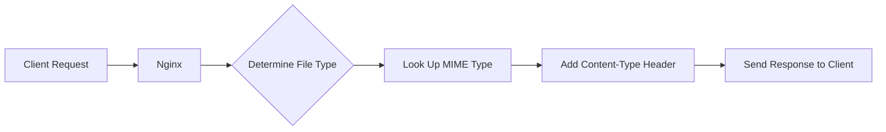

# Nginx MIME Types

## Introduction

When serving files through a web server like Nginx, it's crucial that browsers understand what type of content they're receiving. Is it HTML? JavaScript? A PDF? An image? This is where MIME types (Multipurpose Internet Mail Extensions) come into play. Originally developed for email systems, MIME types have become the standard way of identifying file formats on the web.

In this tutorial, we'll explore how Nginx handles MIME types, why they're important, and how to configure them properly to ensure your web applications function correctly.

## What are MIME Types?

MIME types are a standardized way to indicate the nature and format of a document. They follow a simple format:

```
type/subtype
```

For example:
- `text/html` - HTML documents
- `text/css` - CSS stylesheets
- `application/javascript` - JavaScript files
- `image/jpeg` - JPEG images
- `application/pdf` - PDF documents

When Nginx serves a file, it includes a `Content-Type` HTTP header with the appropriate MIME type. This tells the browser how to interpret and render the content.



## Why MIME Types Matter

Incorrect MIME types can cause various issues:

1. **Security Risks**: Browsers may interpret files incorrectly, potentially enabling cross-site scripting attacks.
2. **Broken Functionality**: JavaScript or CSS files served with wrong MIME types may not execute or apply.
3. **Download Instead of Display**: Files might be downloaded instead of displayed in-browser.
4. **Character Encoding Issues**: Text files might display with incorrect character encoding.

## Default Nginx MIME Type Configuration

Nginx comes with a default MIME type configuration file located at `/etc/nginx/mime.types`. This file maps file extensions to their corresponding MIME types.

Here's a snippet from the default configuration:

```nginx
types {
    text/html                             html htm shtml;
    text/css                              css;
    text/xml                              xml;
    image/gif                             gif;
    image/jpeg                            jpeg jpg;
    application/javascript                js;
    application/atom+xml                  atom;
    application/rss+xml                   rss;
    # ... many more mappings ...
}
```

When a client requests a file, Nginx examines its extension and uses this mapping to determine the appropriate `Content-Type` header.

## Configuring MIME Types in Nginx

### Basic Configuration

To enable MIME type support in Nginx, include the following directive in your server configuration:

```nginx
include mime.types;
```

This is typically included in the `http` context of your main `nginx.conf` file:

```nginx
http {
    include mime.types;
    default_type application/octet-stream;
    
    # Other directives...
    
    server {
        # Server configuration...
    }
}
```

The `default_type` directive specifies what MIME type to use when Nginx can't determine the file type. `application/octet-stream` instructs browsers to download the file rather than try to display it.

### Adding Custom MIME Types

To add support for additional file types, you can either:

1. Edit the main `mime.types` file (not recommended as updates might overwrite your changes)
2. Define custom types in your server or http context

Here's how to add custom MIME types in your Nginx configuration:

```nginx
http {
    include mime.types;
    default_type application/octet-stream;
    
    # Custom MIME types
    types {
        text/markdown                     md markdown;
        application/wasm                  wasm;
        font/woff2                        woff2;
    }
    
    # Rest of configuration...
}
```

You can also add MIME types for a specific server or location:

```nginx
server {
    listen 80;
    server_name example.com;
    
    # Custom MIME types for this server only
    types {
        application/x-my-custom-type      mycustom;
    }
    
    location / {
        root /var/www/html;
        # Rest of configuration...
    }
}
```

## Practical Examples

### Example 1: Configuring for Modern Web Applications

Modern web applications often use newer file formats. Here's how to configure Nginx for a typical frontend project:

```nginx
server {
    listen 80;
    server_name app.example.com;
    root /var/www/myapp;
    
    # Include default MIME types
    include mime.types;
    
    # Add modern web MIME types
    types {
        application/wasm                  wasm;
        application/manifest+json         webmanifest;
        application/javascript            mjs;
        font/woff2                        woff2;
        text/javascript                   jsx;
    }
    
    # Set charset for text files
    charset utf-8;
    
    location / {
        try_files $uri $uri/ /index.html;
    }
}
```

### Example 2: Serving API Documentation

For an API documentation site that serves various document formats:

```nginx
server {
    listen 80;
    server_name docs.example.com;
    root /var/www/api-docs;
    
    include mime.types;
    default_type application/octet-stream;
    
    # Custom document formats
    types {
        text/markdown                     md markdown;
        application/vnd.openxmlformats-officedocument.wordprocessingml.document docx;
        application/vnd.openxmlformats-officedocument.spreadsheetml.sheet xlsx;
        application/vnd.openxmlformats-officedocument.presentationml.presentation pptx;
    }
    
    location / {
        try_files $uri $uri/ /index.html;
    }
    
    # Cache static assets but not documents
    location ~* \.(jpg|jpeg|png|gif|ico|css|js)$ {
        expires 30d;
    }
    
    location ~* \.(pdf|doc|docx|xlsx|pptx)$ {
        expires -1;
        add_header Cache-Control "no-store, no-cache, must-revalidate";
    }
}
```

### Example 3: Troubleshooting MIME Types

If you're having issues with files being interpreted incorrectly, you can use Nginx's `add_header` directive to debug:

```nginx
location ~* \.js$ {
    add_header X-Content-Type-Debug "Serving JavaScript file: $request_filename" always;
    add_header Content-Type application/javascript always;
}
```

This forces JavaScript files to use the correct MIME type and adds a debug header you can check in your browser's developer tools.

## Common MIME Type Issues and Solutions

### Issue 1: CSS or JavaScript Not Working

**Problem**: Your styles or scripts don't apply properly in the browser.
**Solution**: Check that Nginx is serving them with the correct MIME types:

```nginx
location ~* \.css$ {
    add_header Content-Type text/css;
}

location ~* \.js$ {
    add_header Content-Type application/javascript;
}
```

### Issue 2: SVG Images Not Displaying Properly

**Problem**: SVG images download instead of displaying inline.
**Solution**: Ensure SVG files have the correct MIME type:

```nginx
types {
    image/svg+xml                 svg svgz;
}

# For compressed SVG files
location ~* \.svgz$ {
    add_header Content-Encoding gzip;
}
```

### Issue 3: Handling New File Formats

**Problem**: Your web application uses newer file formats not included in the default configuration.
**Solution**: Add custom MIME types for these formats:

```nginx
types {
    application/wasm              wasm;
    application/json              json map;
    application/manifest+json     webmanifest;
    text/typescript               ts;
    text/jsx                      jsx;
    text/tsx                      tsx;
}
```

## Security Considerations

Proper MIME type configuration is important for security:

1. **X-Content-Type-Options**: Prevent MIME-sniffing attacks by adding:

```nginx
add_header X-Content-Type-Options nosniff;
```

2. **Strict MIME Types for Executable Content**: Be especially careful with executable content:

```nginx
location ~* \.(html|js|css)$ {
    # Force strict MIME types
    add_header X-Content-Type-Options nosniff;
}
```

3. **Avoid Serving Unexpected File Types**: Restrict what files can be served:

```nginx
location ~* \.(php|pl|py|jsp|asp|sh|cgi)$ {
    deny all;
    return 403;
}
```

## Summary

MIME types are essential for proper web content delivery. In Nginx:

- MIME types tell browsers how to interpret different file formats
- Nginx's default configuration covers most common file types
- Custom MIME types can be added for specialized formats
- Incorrect MIME types can cause functionality and security issues
- The `default_type` directive handles unknown file types

By properly configuring MIME types in Nginx, you ensure that your web applications deliver content correctly and securely to users.

## Additional Resources

- [Official Nginx Documentation on MIME Types](http://nginx.org/en/docs/http/ngx_http_core_module.html#types)
- [MDN Web Docs: MIME types](https://developer.mozilla.org/en-US/docs/Web/HTTP/Basics_of_HTTP/MIME_types)
- [IANA Media Types Registry](https://www.iana.org/assignments/media-types/media-types.xhtml)

## Exercises

1. Configure Nginx to serve `.md` files as `text/markdown` instead of the default `text/plain`.
2. Set up a location block that serves all font files (`.woff`, `.woff2`, `.ttf`, `.eot`) with appropriate MIME types and caching headers.
3. Create an Nginx configuration for a REST API that ensures all JSON responses have the correct `application/json` MIME type.
4. Configure Nginx to serve WebAssembly (`.wasm`) files with the proper MIME type and required security headers.
5. Use the `curl -I` command to check the Content-Type headers your Nginx server is sending for different file types.