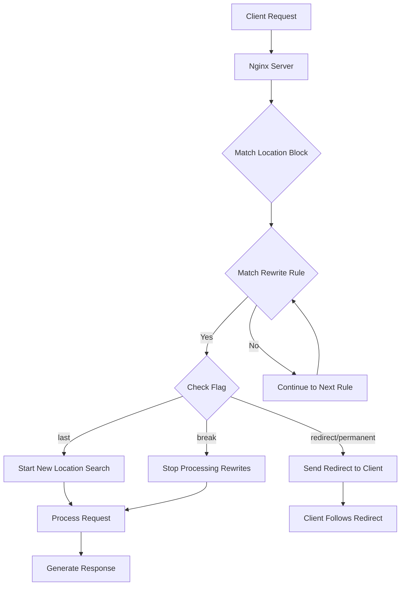

# Nginx Rewrites

## Introduction

URL rewriting is a powerful feature in Nginx that allows you to modify incoming request URLs before they're processed. This enables you to create cleaner, more user-friendly URLs, redirect old URLs to new locations, or modify requests before they reach your application.

In this tutorial, we'll explore Nginx's rewrite capabilities in depth, covering:
- How rewriting works in Nginx
- The `rewrite` directive syntax and flags
- Common use cases and patterns
- Performance considerations

## Understanding URL Rewriting

URL rewriting allows a web server to map one URL to another, changing what the server sees without affecting what the client typed in the browser. This creates a layer of abstraction between the URLs users interact with and your actual application structure.

### Why Use Rewrites?

- **SEO and User-Friendliness**: Convert complex URLs with query parameters into clean, readable paths
- **Maintenance**: Preserve old URLs when restructuring your site
- **Security**: Hide implementation details and file extensions
- **Flexibility**: Route requests to different applications or handlers based on patterns

## The Nginx Rewrite Directive

The primary tool for URL rewriting in Nginx is the `rewrite` directive:

```nginx
rewrite regex replacement [flag];
```

Let's break down each component:

- **regex**: A regular expression pattern to match against the request URI
- **replacement**: The string that will replace the matched URI
- **flag** (optional): Controls the behavior after the rewrite occurs

### Available Flags

- **last**: Stops processing the current set of rewrite directives and starts a search for a new location match
- **break**: Stops processing the current set of rewrite directives
- **redirect**: Returns a temporary redirect (302) with the rewritten URL
- **permanent**: Returns a permanent redirect (301) with the rewritten URL

## Basic Rewrite Examples

Let's start with some simple examples to understand how rewrites work in practice.

### Simple URL Rewrite

```nginx
location /api/ {
    rewrite ^/api/users/([0-9]+)$ /api/v1/users/$1 break;
    proxy_pass http://backend_server;
}
```

**What happens:**
- A request to `/api/users/123` 
- Gets internally rewritten to `/api/v1/users/123`
- The request is then processed according to the location block rules

### Redirecting Old URLs to New Ones

```nginx
server {
    listen 80;
    server_name example.com;
    
    # Redirect old product URLs to new structure
    rewrite ^/products/([0-9]+)$ /shop/item/$1 permanent;
}
```

**What happens:**
- A request to `example.com/products/42`
- Browser receives a 301 (permanent) redirect to `example.com/shop/item/42`
- The browser automatically navigates to the new URL

## Working with Rewrite Conditions

Often, you'll want to apply rewrites conditionally. Nginx provides the `if` directive for this purpose:

```nginx
server {
    listen 80;
    server_name example.com;
    
    # Only apply rewrite for mobile devices
    if ($http_user_agent ~* mobile) {
        rewrite ^/(.*)$ /mobile/$1 last;
    }
}
```

**What happens:**
- If the user agent contains "mobile"
- A request to `/about` would be rewritten to `/mobile/about`

> **Note:** The `if` directive in Nginx has some limitations and potential issues. It's generally better to use `location` blocks where possible.

## Advanced Rewrite Patterns

Let's explore some more complex examples for common use cases.

### Creating a Clean URL Structure

```nginx
server {
    listen 80;
    server_name example.com;
    
    # Rewrite /blog/my-post-title to /blog.php?post=my-post-title
    location /blog/ {
        rewrite ^/blog/(.+)$ /blog.php?post=$1 last;
    }
}
```

### Handling File Extensions Transparently

```nginx
server {
    listen 80;
    server_name example.com;
    
    # Hide PHP extensions
    location / {
        # Rewrite /page to /page.php
        if (!-e $request_filename) {
            rewrite ^/(.*)$ /$1.php last;
        }
    }
}
```

### Capturing and Using Multiple Path Segments

```nginx
server {
    listen 80;
    server_name example.com;
    
    # Rewrite /category/subcategory/product-name to /product.php?cat=category&subcat=subcategory&product=product-name
    location / {
        rewrite ^/([^/]+)/([^/]+)/([^/]+)$ /product.php?cat=$1&subcat=$2&product=$3 last;
    }
}
```

## Visualizing Rewrite Flow

Here's a visual representation of how Nginx processes rewrites:



## Performance Considerations

Rewrite rules are processed for every request, so it's important to keep them efficient:

1. **Be Specific**: Use location blocks to narrow down where rewrites apply
2. **Optimize Regular Expressions**: Avoid costly backtracking and capture only what you need
3. **Use try_files When Possible**: For simple file existence checks, `try_files` is more efficient than rewrites
4. **Consider Caching**: For frequently accessed URLs, consider using proxy caching

## Common Use Cases

Let's explore some real-world applications of Nginx rewrites:

### Single Page Application (SPA) Support

```nginx
server {
    listen 80;
    server_name app.example.com;
    root /var/www/spa;
    
    location / {
        try_files $uri $uri/ /index.html;
    }
}
```

This configuration ensures that all routes in a SPA are properly handled by redirecting non-existent paths back to the main `index.html` file.

### WordPress Pretty URLs

```nginx
server {
    listen 80;
    server_name blog.example.com;
    root /var/www/wordpress;
    
    location / {
        try_files $uri $uri/ /index.php?$args;
    }
}
```

This setup allows WordPress to handle pretty permalinks by forwarding requests to `index.php` when the requested file doesn't exist.

### API Version Routing

```nginx
server {
    listen 80;
    server_name api.example.com;
    
    # Default to latest API version
    location /api/ {
        rewrite ^/api/(.*)$ /api/v2/$1 last;
    }
    
    # Handle specific API versions
    location ~ ^/api/v[0-9]+/ {
        proxy_pass http://backend_servers;
    }
}
```

## Debugging Rewrite Rules

When your rewrite rules aren't working as expected, Nginx provides debugging tools:

1. **Enable Rewrite Logging**:

```nginx
server {
    # ... other configuration
    
    # Enable rewrite logging
    rewrite_log on;
    error_log /var/log/nginx/rewrite.log notice;
}
```

2. **Test with `curl`**:

```bash
curl -I http://example.com/test/path
```

The `-I` flag shows only the headers, which is useful for checking redirect status codes.

## Summary

Nginx rewrites are a powerful tool for manipulating URLs and controlling how requests are processed. We've covered:

- The basic syntax and operation of the `rewrite` directive
- How to use different flags to control rewrite behavior
- Conditional rewrites using the `if` directive
- Common patterns and real-world examples
- Performance considerations and debugging techniques

With these skills, you can create clean, user-friendly URLs while maintaining flexibility in your application's structure.

## Additional Resources

To deepen your understanding of Nginx rewrites:

1. The official [Nginx documentation on rewrite module](http://nginx.org/en/docs/http/ngx_http_rewrite_module.html)
2. Learn more about regular expressions for more powerful matching patterns
3. Explore the `try_files` directive as a complement to rewrites

## Practice Exercises

1. Create a rewrite rule that maps `/articles/YYYY/MM/title` to `/article.php?year=YYYY&month=MM&title=title`
2. Implement a rule that redirects HTTP requests to HTTPS with a permanent redirect
3. Set up a rule that handles both `/product/123` and `/product/123.html` to the same backend resource