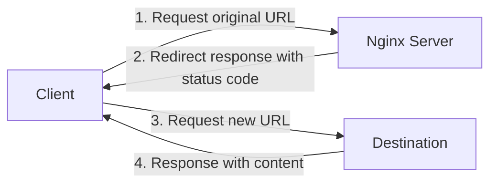

# Nginx Redirects

## Introduction

Redirects are a fundamental concept in web servers that allow you to send users and search engines from one URL to another. In Nginx, redirects are powerful tools that help you manage website migrations, create friendly URLs, handle deprecated content, and ensure secure connections through HTTPS.

This guide will walk you through implementing different types of redirects in Nginx, explain the underlying concepts, and showcase practical examples that you can apply to your own web projects.

## Understanding HTTP Redirects

Before diving into Nginx-specific configurations, let's understand what HTTP redirects are and the different types you might use.

### What is an HTTP Redirect?

An HTTP redirect is a response sent by a server to a client (usually a web browser) instructing it to go to a different URL than the one originally requested. When a browser receives a redirect response, it automatically makes a new request to the specified URL.

### Common Redirect Status Codes

Nginx can issue different types of redirects using HTTP status codes:

| Status Code | Type | Description |
|-------------|------|-------------|
| 301 | Permanent Redirect | Indicates that the resource has been permanently moved to a new URL |
| 302 | Temporary Redirect | Indicates that the resource is temporarily located at a different URL |
| 307 | Temporary Redirect | Similar to 302 but guarantees the request method will not change |
| 308 | Permanent Redirect | Similar to 301 but guarantees the request method will not change |



## Basic Nginx Redirect Configuration

Now let's look at how to implement redirects in Nginx configurations.

### Simple Redirect Syntax

The basic syntax for creating redirects in Nginx uses the `return` directive:

```nginx
server {
    listen 80;
    server_name example.com;
    
    return 301 https://newdomain.com$request_uri;
}
```

In this example:
- `return` is the Nginx directive that generates an HTTP response
- `301` is the HTTP status code (permanent redirect)
- `https://newdomain.com$request_uri` is the destination URL, with `$request_uri` preserving the path and query parameters

### Using the rewrite Directive

Another way to create redirects is with the `rewrite` directive:

```nginx
server {
    listen 80;
    server_name example.com;
    
    rewrite ^/old-page$ /new-page permanent;
}
```

In this example:
- `^/old-page$` is a regular expression matching exactly `/old-page`
- `/new-page` is the new URL path
- `permanent` specifies a 301 (permanent) redirect

## Common Redirect Scenarios

Let's explore some real-world scenarios where you might need redirects.

### HTTP to HTTPS Redirect

One of the most common use cases is redirecting HTTP traffic to HTTPS:

```nginx
server {
    listen 80;
    server_name example.com www.example.com;
    
    return 301 https://$host$request_uri;
}

server {
    listen 443 ssl;
    server_name example.com www.example.com;
    
    # SSL configuration goes here
    
    # Rest of your HTTPS server configuration
}
```

### Domain Name Redirect (www vs non-www)

Another common scenario is standardizing on either the www or non-www version of your domain:

```nginx
# Redirect www to non-www
server {
    listen 80;
    listen 443 ssl;
    server_name www.example.com;
    
    return 301 $scheme://example.com$request_uri;
}

server {
    listen 80;
    listen 443 ssl;
    server_name example.com;
    
    # Regular server configuration
}
```

### Redirecting Specific Pages

When restructuring your website, you might need to redirect specific pages:

```nginx
server {
    listen 80;
    server_name example.com;
    
    # Redirect a single page
    location = /old-contact {
        return 301 /contact-us;
    }
    
    # Redirect an entire section
    location /old-blog/ {
        return 301 /articles/;
    }
    
    # Regular server configuration
}
```

### Redirect with Path Preservation

Often you'll want to redirect while preserving the path structure:

```nginx
server {
    listen 80;
    server_name old-domain.com;
    
    return 301 $scheme://new-domain.com$request_uri;
}
```

In this example, a request to `http://old-domain.com/some/path?query=value` would redirect to `http://new-domain.com/some/path?query=value`.

## Advanced Redirect Techniques

Let's explore some more advanced redirect scenarios.

### Conditional Redirects

You can create redirects that only apply under certain conditions:

```nginx
server {
    listen 80;
    server_name example.com;
    
    # Only redirect if a certain query parameter exists
    if ($arg_redirect = "true") {
        return 302 /special-page;
    }
    
    # Only redirect a specific user agent
    if ($http_user_agent ~* "Googlebot") {
        return 302 /bot-friendly-page;
    }
}
```

> **Note**: Nginx documentation recommends avoiding `if` statements when possible due to potential unexpected behavior. Use the `map` directive for complex conditions.

### Using map for Complex Redirects

The `map` directive is more efficient for complex redirect rules:

```nginx
# In http context
map $uri $redirect_uri {
    /legacy/page1    /new/page1;
    /legacy/page2    /new/page2;
    /legacy/section  /new/section;
    default          "";
}

server {
    listen 80;
    server_name example.com;
    
    if ($redirect_uri != "") {
        return 301 $redirect_uri;
    }
    
    # Rest of configuration
}
```

### Wildcard and Regex-Based Redirects

For more complex patterns, you can use regular expressions:

```nginx
server {
    listen 80;
    server_name example.com;
    
    # Match URLs like /product/123 and redirect to /items/123
    rewrite ^/product/(\d+)$ /items/$1 permanent;
    
    # Redirect all URLs under a directory while preserving the path
    location /old-directory/ {
        rewrite ^/old-directory/(.*)$ /new-directory/$1 permanent;
    }
}
```

## Performance Considerations

Redirects add extra HTTP requests, which can impact performance. Here are some best practices:

1. **Minimize redirect chains**: Avoid having redirects that point to other redirects.
2. **Use permanent (301) redirects** for content that has moved permanently to benefit from browser caching.
3. **Consider using the `return` directive** instead of `rewrite` when possible, as it's more efficient.
4. **Place the most common redirects first** in your configuration for better performance.

## Debugging Redirects

When your redirects aren't working as expected, here are some troubleshooting steps:

1. **Check Nginx error logs**: Look for configuration errors.
2. **Use curl to test redirects**:
   ```bash
   curl -I http://example.com/old-page
   ```
   The `-I` flag shows headers, including redirect information.

3. **Temporarily change 301s to 302s**: This prevents excessive caching during testing.
4. **Verify regular expressions** using tools like [regex101.com](https://regex101.com) before implementing.

## Real-world Example: Site Migration

Let's see a comprehensive example of redirects during a site migration:

```nginx
# HTTP to HTTPS redirect
server {
    listen 80;
    server_name old-domain.com new-domain.com;
    return 301 https://$host$request_uri;
}

# old-domain.com to new-domain.com redirect
server {
    listen 443 ssl;
    server_name old-domain.com;
    
    # SSL configuration for old-domain.com
    
    # Redirect specific paths with new structure
    location ~ ^/old-products/([0-9]+)/details$ {
        return 301 https://new-domain.com/products/$1;
    }
    
    # Redirect blog posts with new URL format
    location ~ ^/blog/([0-9]{4})/([0-9]{2})/(.+)$ {
        return 301 https://new-domain.com/articles/$3;
    }
    
    # Default catch-all redirect
    location / {
        return 301 https://new-domain.com$request_uri;
    }
}

# New domain main server block
server {
    listen 443 ssl;
    server_name new-domain.com;
    
    # SSL configuration for new-domain.com
    
    # Rest of your server configuration
}
```

## Summary

Nginx redirects are powerful tools for managing how users navigate your websites. In this guide, we've covered:

- The different types of HTTP redirects and their status codes
- Basic redirect syntax using `return` and `rewrite` directives
- Common redirect scenarios like HTTP to HTTPS and domain canonicalization
- Advanced techniques including conditional redirects and regex-based redirects
- Performance considerations and debugging tips
- A real-world example of site migration using redirects

With this knowledge, you should be able to implement efficient and effective redirect strategies for your web projects using Nginx.

## Additional Resources

- [Nginx Official Documentation on Redirects](https://nginx.org/en/docs/http/ngx_http_rewrite_module.html)
- [HTTP Status Code Specifications](https://tools.ietf.org/html/rfc7231#section-6.4)

## Exercises

1. Create an Nginx configuration that redirects all traffic from `http://example.com` to `https://www.example.com` while preserving the path.
2. Implement a redirect that changes URLs from a format like `/categories/items/123` to `/products/123`.
3. Set up a temporary (302) redirect for a page that's under maintenance, but only for non-admin users.