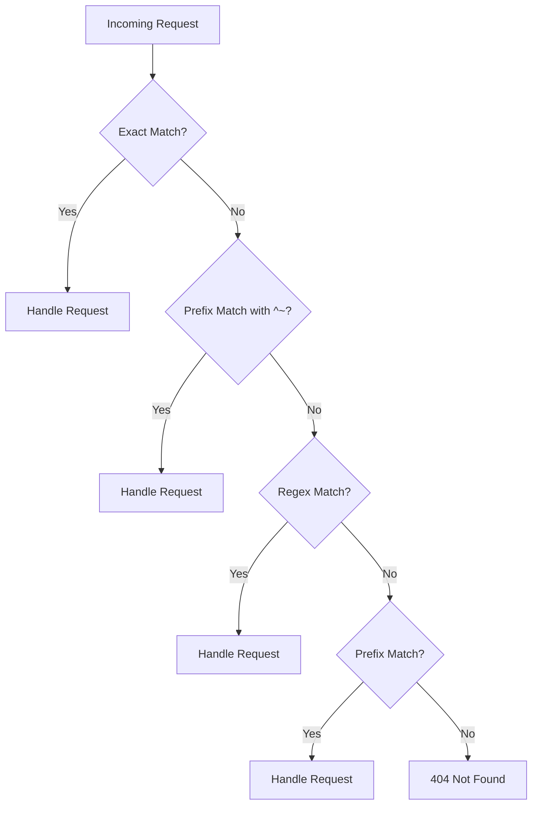

# Nginx URL Mapping

## Introduction

URL mapping is a fundamental concept in Nginx that determines how the server processes incoming HTTP requests. It allows you to define rules that match specific URL patterns and direct them to different resources, applications, or processing logic. This capability makes Nginx powerful for tasks like serving static content, proxying requests to application servers, and implementing URL redirects.

In this guide, we'll explore how Nginx maps URLs to resources through its configuration system, focusing particularly on the `location` directive which is at the heart of Nginx's URL mapping functionality.

## Understanding the Basics

### What is URL Mapping?

URL mapping (also called URL routing) is the process of determining what should happen when a client requests a specific URL. When a request arrives at Nginx, the server needs to decide:

1. Which content to serve in response
2. Where to find this content
3. How to process the request before sending a response

Nginx accomplishes this primarily through `location` blocks in its configuration files.

## Location Blocks

The `location` directive is the main tool for URL mapping in Nginx. It defines how Nginx processes specific sets of URIs (Uniform Resource Identifiers).

### Basic Syntax

```nginx
location [modifier] pattern {
    # Directives to handle matching requests
}
```

Where:
- `modifier` (optional) affects how the pattern is interpreted
- `pattern` is the URI pattern to match
- Directives inside the block determine what happens to matching requests

### Location Matching Modifiers

Nginx offers several modifiers that change how patterns are matched:

| Modifier | Description | Example |
|----------|-------------|---------|
| (none) | Prefix match - matches beginning of URI | `location /api/` |
| `=` | Exact match - matches the URI exactly | `location = /api/status` |
| `~` | Case-sensitive regex match | `location ~ \.php$` |
| `~*` | Case-insensitive regex match | `location ~* \.(jpg\|jpeg\|png)$` |
| `^~` | Prioritized prefix match | `location ^~ /images/` |

### Location Matching Order

Understanding the order in which Nginx evaluates location blocks is crucial:

1. Exact match (`=`) locations are checked first
2. Prefix locations with `^~` modifier are checked
3. Regular expression locations (`~` and `~*`) are checked in order of appearance
4. Prefix locations without modifiers are checked

Once a match is found, Nginx generally stops searching for other matches.

## Basic URL Mapping Examples

Let's look at some common URL mapping scenarios:

### Serving Static Files

```nginx
location /static/ {
    root /var/www/myapp;
}
```

This configuration maps requests for URIs starting with `/static/` to files in the `/var/www/myapp/static/` directory.

For example:
- Request: `http://example.com/static/logo.png` 
- File served: `/var/www/myapp/static/logo.png`

### Exact Matching

```nginx
location = /favicon.ico {
    log_not_found off;
    access_log off;
}
```

This maps requests for exactly `/favicon.ico` and optimizes logging for this specific resource.

### Regular Expression Matching

```nginx
location ~* \.(jpg|jpeg|png|gif)$ {
    expires 30d;
}
```

This maps requests for image files (with extensions .jpg, .jpeg, .png, or .gif) and sets a 30-day expiration header for caching.

## Advanced URL Mapping

### Nested Locations

Nginx allows nesting location blocks for more complex routing scenarios:

```nginx
location /api/ {
    # General API settings
    
    location /api/v1/ {
        # v1 API specific settings
    }
    
    location /api/v2/ {
        # v2 API specific settings
    }
}
```

### Named Locations

You can create named locations for internal redirects:

```nginx
location / {
    try_files $uri $uri/ @app;
}

location @app {
    proxy_pass http://localhost:8080;
}
```

The `@app` is a named location that's only used for internal redirects.

## Practical Applications

### Proxying Requests to Application Servers

One of the most common uses of URL mapping is to forward requests to application servers:

```nginx
location / {
    proxy_pass http://localhost:3000;
    proxy_set_header Host $host;
    proxy_set_header X-Real-IP $remote_addr;
}
```

This configuration proxies all requests to a Node.js application running on port 3000.

### URL Rewriting

URL mapping often involves rewriting URLs:

```nginx
location /old-page/ {
    rewrite ^/old-page/(.*)$ /new-page/$1 permanent;
}
```

This permanently redirects requests from `/old-page/anything` to `/new-page/anything`.

### Load Balancing

URL mapping can direct traffic to multiple backend servers:

```nginx
upstream backend_servers {
    server backend1.example.com;
    server backend2.example.com;
    server backend3.example.com;
}

location /api/ {
    proxy_pass http://backend_servers;
}
```

This distributes API requests across multiple backend servers.

### Conditional Mapping

You can use variables and conditions in URL mapping:

```nginx
location / {
    if ($request_method = POST) {
        return 307 https://api.example.com$request_uri;
    }
    
    # Handle other requests
}
```

This redirects POST requests to a different server.

## Step-by-Step Example: Building a Complete URL Mapping Configuration

Let's build a comprehensive example for a web application with different components:

```nginx
server {
    listen 80;
    server_name example.com;
    root /var/www/myapp;
    
    # Exact match for homepage optimization
    location = / {
        index index.html;
    }
    
    # Static assets with caching
    location ~* \.(css|js|jpg|jpeg|png|gif|ico|svg)$ {
        expires 7d;
        add_header Cache-Control "public, max-age=604800";
    }
    
    # API requests to backend application
    location /api/ {
        proxy_pass http://localhost:8080;
        proxy_set_header Host $host;
        proxy_set_header X-Real-IP $remote_addr;
        proxy_set_header X-Forwarded-For $proxy_add_x_forwarded_for;
        proxy_set_header X-Forwarded-Proto $scheme;
    }
    
    # Admin panel with specific handling
    location ^~ /admin/ {
        # Basic auth for additional security
        auth_basic "Admin Area";
        auth_basic_user_file /etc/nginx/htpasswd;
        
        # Try to serve static files first, then proxy
        try_files $uri @admin_app;
    }
    
    location @admin_app {
        proxy_pass http://localhost:8081;
        proxy_set_header Host $host;
        proxy_set_header X-Real-IP $remote_addr;
    }
    
    # Default handler for HTML files
    location / {
        try_files $uri $uri/ /index.html;
    }
}
```

This configuration:
1. Optimizes the homepage with an exact match
2. Sets caching headers for static assets
3. Proxies API requests to a backend service
4. Secures admin panel access with basic authentication
5. Implements a fallback for client-side routing

## Visualizing URL Mapping Flow



## Common Pitfalls and Troubleshooting

### Overlapping Locations

When location blocks overlap, the matching order becomes critical. Consider:

```nginx
location /api/ {
    # API handling
}

location ~* ^/api/v1/.+\.json$ {
    # Special JSON handling
}
```

Requests like `/api/v1/users.json` will match both locations. Understanding the matching priority ensures predictable behavior.

### Missing Try_Files

A common mistake is forgetting to use `try_files` for client-side routing:

```nginx
location / {
    # Missing try_files directive
    root /var/www/myapp;
    index index.html;
}
```

Without `try_files $uri $uri/ /index.html;`, client-side routes like `/products/123` would return 404 errors.

### Incorrect Root and Alias Usage

Confusion between `root` and `alias` directives can cause path resolution issues:

```nginx
# With root:
location /images/ {
    root /var/www/static;
    # /var/www/static/images/logo.png
}

# With alias:
location /images/ {
    alias /var/www/static/;
    # /var/www/static/logo.png
}
```

The `root` directive appends the matched URI part, while `alias` replaces it.

## Best Practices

1. **Start with specific matches**: Place exact matches and specific patterns before broader ones
2. **Use location blocks judiciously**: Too many location blocks can impact performance
3. **Leverage named locations**: They make configurations more readable and maintainable
4. **Test configurations**: Always test with `nginx -t` before reloading
5. **Document complex mappings**: Add comments explaining non-obvious routing logic

## Summary

Nginx URL mapping through location blocks provides powerful control over how requests are processed. We've explored how to:

- Match URLs using different pattern types
- Understand location matching priority
- Serve static content efficiently
- Proxy requests to application servers
- Implement redirects and rewrites
- Create complex routing configurations

With these techniques, you can build sophisticated web server setups that efficiently route traffic according to your application's needs.

## Additional Resources

- [Nginx Official Documentation on Location](http://nginx.org/en/docs/http/ngx_http_core_module.html#location)
- [Understanding Nginx Server and Location Block Selection Algorithms](http://nginx.org/en/docs/http/request_processing.html)

## Exercises

1. Create an Nginx configuration that serves different content based on device type (mobile vs. desktop) using the User-Agent header.
2. Implement a configuration that redirects all HTTP requests to HTTPS while preserving the original URL path.
3. Design a URL mapping scheme for a multi-tenant application where each tenant has their own subdomain.
4. Configure Nginx to serve a maintenance page for all requests except those from specific IP addresses.