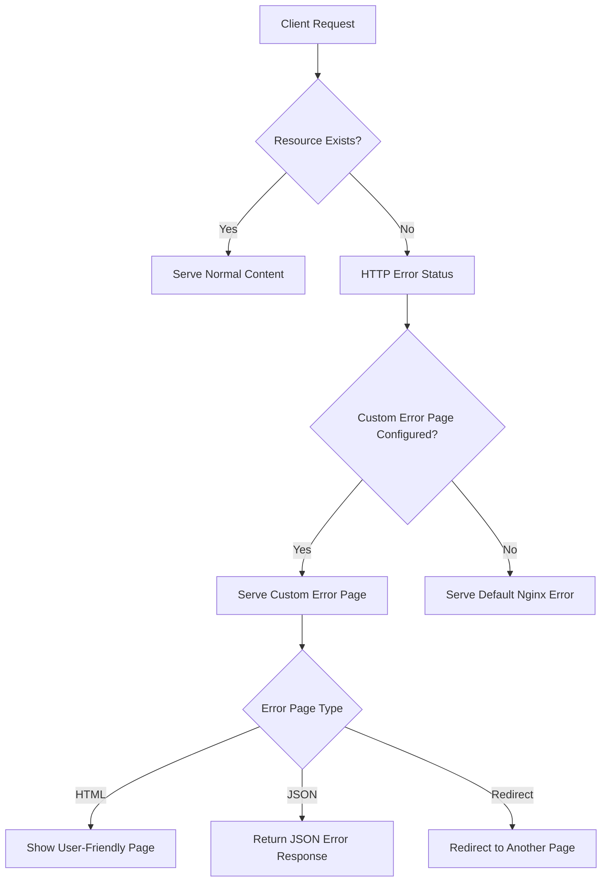

# Nginx Error Pages

When running a web server, errors are inevitable. Whether it's a missing page (404), a server issue (500), or unauthorized access (403), how your site presents these errors can significantly impact user experience. Nginx offers various ways to customize error pages, providing helpful information to users while maintaining your site's look and feel.

## Understanding HTTP Error Codes

Before diving into customization, let's understand some common HTTP error codes that you might want to customize:

| Error Code | Description | Common Cause |
|------------|-------------|--------------|
| 400 | Bad Request | Malformed request syntax |
| 401 | Unauthorized | Authentication required |
| 403 | Forbidden | Server understood but refuses to authorize |
| 404 | Not Found | Requested resource doesn't exist |
| 500 | Internal Server Error | Unexpected server-side condition |
| 502 | Bad Gateway | Invalid response from upstream server |
| 503 | Service Unavailable | Server temporarily unavailable |
| 504 | Gateway Timeout | Upstream server didn't respond in time |

## Default Nginx Error Pages

By default, Nginx serves plain error pages that look something like this:

```
404 Not Found

nginx/1.20.1
```

While functional, these default pages:
- Look unprofessional
- Provide minimal information to users
- Break the visual flow of your website
- May confuse or frustrate users

## Custom Error Pages: Basic Configuration

Let's start by creating a simple custom error page for the common 404 error:

### Step 1: Create a custom HTML error page

Create a file named `404.html` in your Nginx document root (e.g., `/usr/share/nginx/html/`):

```html
<!DOCTYPE html>
<html>
<head>
    <title>Page Not Found</title>
    <style>
        body {
            font-family: Arial, sans-serif;
            text-align: center;
            padding: 50px;
            background: #f5f5f5;
        }
        .container {
            background: white;
            border-radius: 10px;
            padding: 30px;
            max-width: 600px;
            margin: 0 auto;
            box-shadow: 0 4px 6px rgba(0, 0, 0, 0.1);
        }
        h1 { color: #e74c3c; }
        p { line-height: 1.6; }
        .back-button {
            display: inline-block;
            background: #3498db;
            color: white;
            padding: 10px 20px;
            border-radius: 5px;
            text-decoration: none;
            margin-top: 20px;
        }
    </style>
</head>
<body>
    <div class="container">
        <h1>404 - Page Not Found</h1>
        <p>The page you are looking for might have been removed, had its name changed, or is temporarily unavailable.</p>
        <a href="/" class="back-button">Return to Homepage</a>
    </div>
</body>
</html>
```

### Step 2: Configure Nginx to use your custom error page

Edit your Nginx configuration file (typically `/etc/nginx/nginx.conf` or a site-specific config in `/etc/nginx/sites-available/`):

```nginx
server {
    listen 80;
    server_name example.com;
    
    root /usr/share/nginx/html;
    
    # Custom error page for 404
    error_page 404 /404.html;
    
    # Other server configuration...
}
```

### Step 3: Test your configuration and reload Nginx

```bash
sudo nginx -t
sudo systemctl reload nginx
```

## Handling Multiple Error Codes

You can configure different error pages for different error codes or use the same page for multiple errors:

```nginx
# Different pages for different errors
error_page 404 /404.html;
error_page 500 /500.html;
error_page 403 /403.html;

# OR use the same page for multiple errors
error_page 500 502 503 504 /50x.html;
```

## Advanced Error Page Configuration

### Using a Dedicated Location Block

For more control, you can use a location block with the `@` syntax:

```nginx
server {
    # Server configuration...
    
    # Define custom error page
    error_page 404 @notfound;
    
    # Handle the error with a location block
    location @notfound {
        # You can add headers, logging, or other processing here
        add_header Content-Type text/html;
        return 404 '<html><body><h1>Page Not Found</h1><p>The requested page could not be found.</p></body></html>';
    }
}
```

### Dynamic Error Pages with Variables

Nginx allows you to use variables in error pages, making them more informative:

```nginx
server {
    # Server configuration...
    
    # Use a custom error page with variables
    error_page 404 /error.html;
    
    location = /error.html {
        # Make the error code available to the error page
        ssi on;
        internal;
        root /usr/share/nginx/html;
        
        # You can add other variables too
        set $error_code $status;
        set $request_uri_value $request_uri;
    }
}
```

Then in your `error.html` file, you can use Server Side Includes (SSI):

```html
<!DOCTYPE html>
<html>
<head>
    <title>Error</title>
</head>
<body>
    <h1>Error <!--# echo var="status" --></h1>
    <p>Sorry, the page <!--# echo var="request_uri" --> returned an error.</p>
</body>
</html>
```

### Redirecting Instead of Showing an Error Page

Sometimes you might want to redirect users to another page:

```nginx
server {
    # Server configuration...
    
    # Redirect 404 errors to homepage
    error_page 404 =301 /;
    
    # Redirect to a specific error page
    error_page 500 =302 /maintenance.html;
}
```

## Customizing Error Responses for APIs

For API endpoints, you might want to return JSON instead of HTML:

```nginx
server {
    # Server configuration...
    
    location /api/ {
        # API-specific error handling
        error_page 404 = @api_error;
    }
    
    location @api_error {
        default_type application/json;
        return 404 '{"status": "error", "code": 404, "message": "Resource not found"}';
    }
}
```

## Real-World Example: A Complete Setup

Here's a comprehensive example showing a complete error handling solution:

```nginx
server {
    listen 80;
    server_name example.com;
    
    root /var/www/html;
    index index.html;
    
    # Standard web pages get HTML error pages
    error_page 404 /custom_errors/404.html;
    error_page 500 502 503 504 /custom_errors/50x.html;
    
    # Ensure error pages are accessible
    location ^~ /custom_errors/ {
        internal;
        root /var/www/html;
    }
    
    # API endpoints get JSON error responses
    location /api/ {
        # API configuration...
        error_page 404 @api_not_found;
        error_page 500 @api_server_error;
    }
    
    location @api_not_found {
        default_type application/json;
        return 404 '{"error": "Not Found", "status": 404, "message": "The requested resource was not found"}';
    }
    
    location @api_server_error {
        default_type application/json;
        return 500 '{"error": "Server Error", "status": 500, "message": "An unexpected error occurred"}';
    }
    
    # Specific handling for maintenance mode
    location @maintenance {
        return 503 '<!DOCTYPE html><html><head><title>Maintenance</title></head><body><h1>Under Maintenance</h1><p>We\'ll be back shortly.</p></body></html>';
        add_header Content-Type text/html;
        add_header Retry-After 3600;
    }
}
```

## Advanced Concepts: Using Templates

For more dynamic error pages, you can use Nginx's proxy module to send error requests to a backend application that can render templates:

```nginx
server {
    # Server configuration...
    
    # Proxy error handling to a backend
    error_page 404 = @error_handler;
    
    location @error_handler {
        # Proxy to a Node.js/PHP/Python application that renders error templates
        proxy_pass http://localhost:8000/error-handler;
        proxy_set_header X-Original-URI $request_uri;
        proxy_set_header X-Error-Code $status;
    }
}
```

The backend application can then use these headers to render an appropriate template.

## Error Page Flow Diagram



## Best Practices for Error Pages

1. **Be Clear and Honest**: Clearly explain what went wrong
2. **Provide Navigation Options**: Help users continue their journey
3. **Match Your Brand**: Keep your site's look and feel consistent
4. **Include Search Functionality**: Help users find what they're looking for
5. **Log Error Details**: Monitor errors to fix underlying issues
6. **Different Formats for Different Clients**: HTML for browsers, JSON for APIs
7. **Keep it Light**: A touch of humor can help (but not for critical errors)
8. **Provide Contact Information**: For critical errors, give users a way to report

## Testing Your Error Pages

To test your custom error pages, you can:

1. Try accessing non-existent URLs
2. Temporarily modify your Nginx config to force certain errors
3. Use tools like `curl` to see the responses:

```bash
# Test a 404 error
curl -i http://yourdomain.com/nonexistent-page

# Test how your API responds to errors
curl -i http://yourdomain.com/api/nonexistent-endpoint
```

## Summary

Custom error pages in Nginx allow you to:
- Improve user experience during error situations
- Maintain your site's brand identity throughout the user journey
- Provide helpful information and next steps to users
- Return appropriate responses for different types of clients (browsers vs. APIs)

By implementing thoughtful error pages, you can turn potential frustration points into opportunities to guide users and demonstrate professionalism.

## Additional Resources

- [Nginx Official Documentation on Error Pages](http://nginx.org/en/docs/http/ngx_http_core_module.html#error_page)
- [Mozilla Web Docs: HTTP Status Codes](https://developer.mozilla.org/en-US/docs/Web/HTTP/Status)

## Exercises

1. Create a custom 404 page for your website that includes a search form to help users find what they're looking for.
2. Set up different error responses for API endpoints that return JSON instead of HTML.
3. Implement a system that logs the URLs that trigger 404 errors so you can identify and fix broken links.
4. Create a maintenance mode page and configure Nginx to show it for all requests when maintenance is needed.