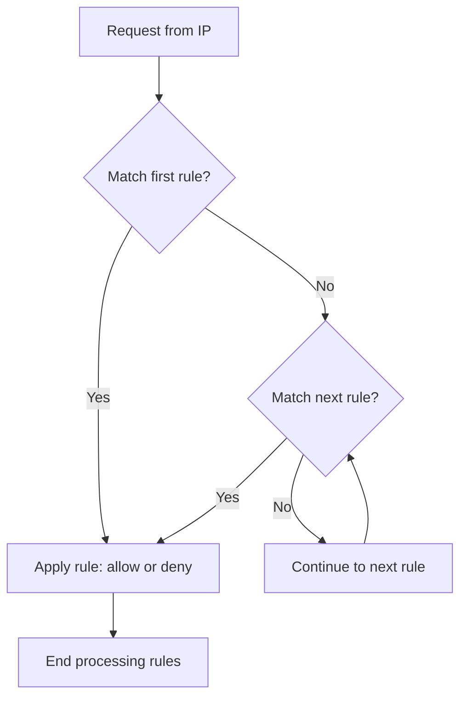

# Nginx Access Control

## Introduction

Access control is a fundamental aspect of web server security. It allows you to determine who can access your server resources and under what conditions. In Nginx, you have several methods to implement access control, ranging from simple IP-based restrictions to more complex authentication mechanisms.

This guide will walk you through the various access control options in Nginx, providing practical examples and best practices for securing your web applications.

## Basic Access Control with IP Restrictions

One of the simplest forms of access control is limiting access based on IP addresses. This approach is useful for restricting administrative interfaces or sensitive areas of your site.

### Allowing Specific IP Addresses

To allow access only from specific IP addresses, you can use the `allow` and `deny` directives:

```nginx
server {
    listen 80;
    server_name example.com;
    
    location /admin/ {
        allow 192.168.1.1;     # Allow a specific IP
        allow 10.0.0.0/24;     # Allow an IP range
        deny all;              # Deny everyone else
        
        # Your configuration here
    }
}
```

This configuration only allows access to the `/admin/` location from the IP address 192.168.1.1 and the network range 10.0.0.0/24, while blocking all other visitors.

### Blocking Specific IP Addresses

Conversely, you can block specific IP addresses while allowing everyone else:

```nginx
server {
    listen 80;
    server_name example.com;
    
    location / {
        deny 192.168.1.2;      # Block a specific IP
        deny 10.0.0.0/24;      # Block an IP range
        allow all;             # Allow everyone else
        
        # Your configuration here
    }
}
```

### How IP-based Access Control Works

When Nginx processes a request, it evaluates the `allow` and `deny` directives in order from top to bottom:



## Basic Authentication

When IP-based restrictions aren't sufficient, you can implement HTTP Basic Authentication, which requires users to enter a username and password.

### Setting Up Basic Authentication

1. First, create a password file using the `htpasswd` utility from Apache:

```bash
# Install htpasswd if needed
sudo apt-get install apache2-utils

# Create a new password file with a user
sudo htpasswd -c /etc/nginx/.htpasswd user1

# Add additional users to an existing file (omit the -c)
sudo htpasswd /etc/nginx/.htpasswd user2
```

2. Configure Nginx to use this password file:

```nginx
server {
    listen 80;
    server_name example.com;
    
    location /secure/ {
        auth_basic "Restricted Area";
        auth_basic_user_file /etc/nginx/.htpasswd;
        
        # Your configuration here
    }
}
```

The `auth_basic` directive enables Basic Authentication with a custom realm name that will be displayed in the login prompt. The `auth_basic_user_file` directive specifies the location of the password file.

### Combining Authentication with IP Restrictions

For enhanced security, you can combine both methods:

```nginx
server {
    listen 80;
    server_name example.com;
    
    location /very-secure/ {
        # IP restriction
        allow 192.168.1.0/24;
        deny all;
        
        # Password authentication
        auth_basic "Highly Restricted Area";
        auth_basic_user_file /etc/nginx/.htpasswd;
        
        # Your configuration here
    }
}
```

This configuration requires both the correct IP address and valid credentials.

## Access Control Based on Request Characteristics

Nginx allows you to control access based on various request attributes using the `map` directive and variables.

### Restricting Access Based on User Agent

You can block or allow access based on the user agent string:

```nginx
# Define a map to categorize user agents
map $http_user_agent $is_banned_agent {
    default 0;
    ~*bot 1;
    ~*crawler 1;
    ~*spider 1;
}

server {
    listen 80;
    server_name example.com;
    
    # Block access if the user agent is banned
    if ($is_banned_agent) {
        return 403;
    }
    
    # Continue with normal configuration
    location / {
        # Your configuration here
    }
}
```

### Limiting Access Based on Request Methods

You can restrict which HTTP methods are allowed:

```nginx
server {
    listen 80;
    server_name example.com;
    
    location /api/ {
        # Only allow GET, POST, and OPTIONS methods
        limit_except GET POST OPTIONS {
            deny all;
        }
        
        # Your configuration here
    }
}
```

## Rate Limiting for Access Control

Rate limiting can be an effective access control mechanism to prevent abuse or DDoS attacks.

### Basic Rate Limiting Configuration

```nginx
# Define a rate limit zone
limit_req_zone $binary_remote_addr zone=mylimit:10m rate=1r/s;

server {
    listen 80;
    server_name example.com;
    
    location /login/ {
        # Apply rate limiting
        limit_req zone=mylimit burst=5;
        
        # Your configuration here
    }
}
```

This configuration limits requests to `/login/` to 1 request per second with a burst of 5 requests. The `$binary_remote_addr` variable uses the client's IP address as the key, and the zone size is set to 10MB.

### Different Rate Limits for Different Paths

You can apply different rate limits to different locations:

```nginx
# Define rate limit zones
limit_req_zone $binary_remote_addr zone=api:10m rate=5r/s;
limit_req_zone $binary_remote_addr zone=login:10m rate=1r/s;

server {
    listen 80;
    server_name example.com;
    
    location /api/ {
        limit_req zone=api burst=10;
        # Your configuration here
    }
    
    location /login/ {
        limit_req zone=login burst=3;
        # Your configuration here
    }
}
```

## Advanced Access Control with JWT Authentication

For modern web applications, JSON Web Token (JWT) authentication provides a stateless, secure method of access control. Nginx can validate JWTs using the `nginx-jwt` module.

### Setting Up JWT Validation

First, you need to install the JWT module. If you're using Nginx Plus, it comes included. For open-source Nginx, you'll need to compile it with the module.

```nginx
server {
    listen 80;
    server_name example.com;
    
    location /api/ {
        auth_jwt "API Access";
        auth_jwt_key_file /etc/nginx/jwt_key.pem;
        
        # Your configuration here
    }
}
```

This configuration will validate JWTs in the `Authorization` header and deny access if the token is invalid or missing.

## Using Access Control with Proxies

Nginx is commonly used as a reverse proxy. Here's how to apply access controls in this scenario:

```nginx
server {
    listen 80;
    server_name example.com;
    
    # Protect the admin area
    location /admin/ {
        allow 192.168.1.0/24;
        deny all;
        
        proxy_pass http://backend_server/admin/;
        proxy_set_header Host $host;
        proxy_set_header X-Real-IP $remote_addr;
    }
    
    # Public area
    location / {
        proxy_pass http://backend_server/;
        proxy_set_header Host $host;
        proxy_set_header X-Real-IP $remote_addr;
    }
}
```

## Real-World Example: Securing a WordPress Admin Area

Let's apply what we've learned to secure a WordPress admin area:

```nginx
server {
    listen 80;
    server_name blog.example.com;
    
    root /var/www/wordpress;
    index index.php;
    
    # Protect wp-admin and wp-login.php
    location ~ ^/(wp-admin|wp-login.php) {
        # Only allow specific IPs
        allow 192.168.1.100;
        allow 10.0.0.5;
        deny all;
        
        # Apply rate limiting
        limit_req zone=wp_admin burst=5;
        
        # Basic authentication as an additional layer
        auth_basic "WordPress Admin";
        auth_basic_user_file /etc/nginx/.htpasswd;
        
        # Standard PHP handling
        include snippets/fastcgi-php.conf;
        fastcgi_pass unix:/run/php/php8.0-fpm.sock;
    }
    
    # Regular PHP handling for other requests
    location ~ \.php$ {
        include snippets/fastcgi-php.conf;
        fastcgi_pass unix:/run/php/php8.0-fpm.sock;
    }
    
    # Other configuration...
}

# Define rate limit zone at the http context level
limit_req_zone $binary_remote_addr zone=wp_admin:10m rate=2r/s;
```

This configuration applies multiple layers of protection to the WordPress admin area:
1. IP-based restriction to specific trusted addresses
2. Rate limiting to prevent brute force attacks
3. Basic authentication as an additional security layer

## Best Practices for Nginx Access Control

1. **Apply Defense in Depth**: Use multiple layers of access control for critical areas.
2. **Be Specific with IP Restrictions**: Narrow down allowed IP ranges as much as possible.
3. **Use HTTPS**: Always use HTTPS for transmitting credentials and sensitive data.
4. **Keep Password Files Secure**: Store password files outside the web root and restrict permissions.
5. **Monitor Logs**: Regularly review access logs to detect unauthorized access attempts.
6. **Use Environment-Specific Configurations**: Apply stricter controls in production than in development.
7. **Regularly Update Access Lists**: Remove IP addresses and users that no longer need access.
8. **Test Your Configuration**: Verify that your access control measures work as expected.

## Common Issues and Troubleshooting

### Access Denied When It Shouldn't Be

If legitimate users are being denied access, check:
- The order of your `allow` and `deny` directives
- Whether the user's IP address is correct
- Whether the password file has the correct entries

### Authentication Prompt Appears Repeatedly

If the authentication dialog keeps reappearing even with correct credentials:
- Check the path to the password file
- Verify the file permissions (should be readable by Nginx)
- Ensure there are no syntax errors in the file

### Changes Not Taking Effect

If your access control changes don't seem to have any effect:
- Make sure you've reloaded or restarted Nginx
- Check the Nginx error log for any syntax issues
- Verify the location block is actually being matched

## Summary

Nginx provides a robust set of tools for implementing access control in your web applications. From simple IP-based restrictions to complex authentication systems, you can create layered security that meets your specific needs.

In this guide, we've covered:
- Basic IP-based access control
- HTTP Basic Authentication
- Access control based on request characteristics
- Rate limiting for preventing abuse
- JWT authentication for modern web applications
- Real-world examples and best practices

By properly implementing these techniques, you can significantly improve the security of your web applications while still providing appropriate access to legitimate users.

## Additional Resources

For further learning on Nginx access control:

- The official [Nginx documentation](https://nginx.org/en/docs/)
- The [Nginx Cookbook](https://www.nginx.com/resources/library/complete-nginx-cookbook/)
- The [Mozilla Web Security Guidelines](https://infosec.mozilla.org/guidelines/web_security)

## Exercises

1. Set up IP-based access control that allows only your local network to access a specific page.
2. Implement basic authentication for a directory and create at least two users with different passwords.
3. Create a rate-limiting configuration that allows 10 requests per minute per IP address for your API endpoint.
4. Configure a combined access control system that requires both the correct IP address and valid credentials for accessing an admin area.
5. Implement method-based access control that only allows GET and POST requests to your website, blocking all other HTTP methods.