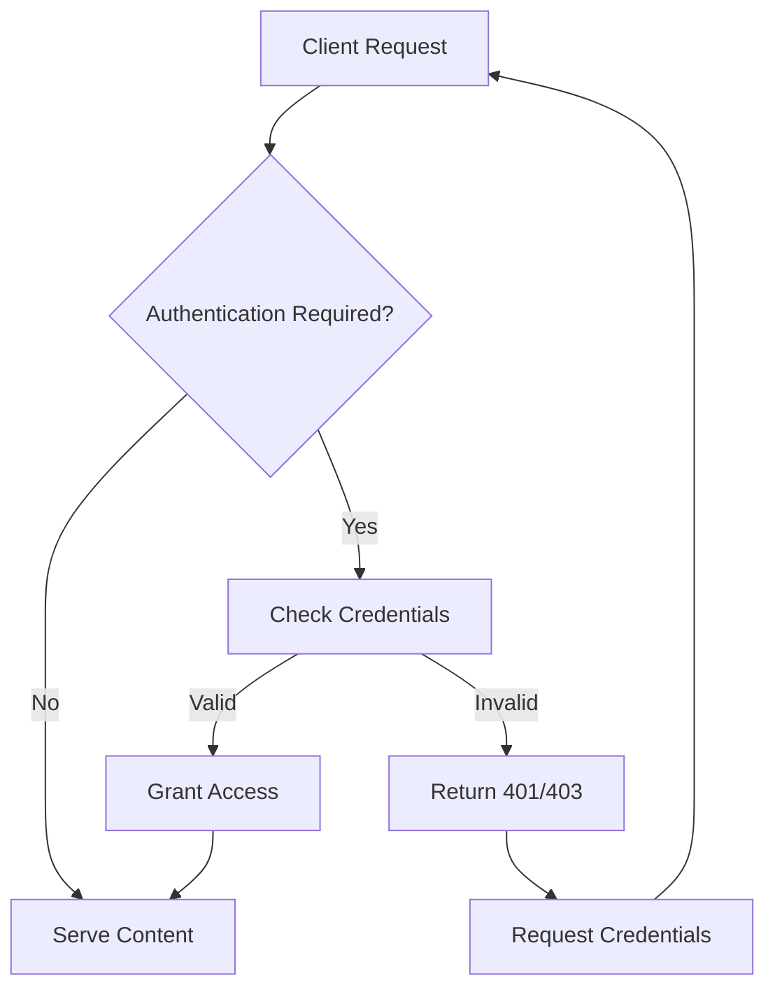

# Nginx Authentication

## Introduction

Authentication is a critical aspect of web security that verifies the identity of users or systems attempting to access resources. Nginx, as a powerful web server and reverse proxy, offers various authentication mechanisms to protect your web applications and APIs from unauthorized access.

In this guide, we'll explore different authentication methods available in Nginx, from simple HTTP Basic Authentication to more complex setups involving LDAP, JWT tokens, and OAuth integration. By the end of this tutorial, you'll understand how to implement authentication solutions that match your security requirements.

## Understanding Authentication in Nginx

Nginx handles authentication primarily through modules that can be configured in your server blocks. The authentication process typically follows these steps:



Authentication configurations in Nginx can be applied at different levels:
- Server-wide (in the `http` context)
- Per virtual host (in the `server` context)
- Per location (in the `location` context)

## HTTP Basic Authentication

HTTP Basic Authentication is the simplest form of authentication in Nginx. It prompts users with a browser dialog to enter a username and password.

### Setting Up HTTP Basic Authentication

1. First, create a password file using the `htpasswd` utility (from Apache HTTP Server utilities):

```bash
# Install htpasswd if needed
sudo apt-get install apache2-utils

# Create a new password file with a user
sudo htpasswd -c /etc/nginx/.htpasswd user1

# Add additional users (without -c flag)
sudo htpasswd /etc/nginx/.htpasswd user2
```

2. Configure Nginx to use this password file:

```nginx
server {
    listen 80;
    server_name example.com;

    location / {
        auth_basic "Restricted Area";
        auth_basic_user_file /etc/nginx/.htpasswd;
        
        root /var/www/html;
        index index.html;
    }
}
```

3. Test your configuration and reload Nginx:

```bash
sudo nginx -t
sudo systemctl reload nginx
```

When a user accesses your site, they'll see a login prompt:

![HTTP Basic Auth Prompt]

#### Pros and Cons of HTTP Basic Auth

**Pros:**
- Simple to set up
- Widely supported across browsers
- Low overhead

**Cons:**
- Credentials sent with every request (Base64 encoded, not encrypted)
- No built-in session management
- Limited user experience

## Authentication Subrequests

Nginx can delegate authentication to another service or application through subrequests, which is useful when you need more complex authentication logic.

### Example: Authentication with a Backend Service

```nginx
server {
    listen 80;
    server_name example.com;
    
    location / {
        auth_request /auth;
        auth_request_set $auth_status $upstream_status;
        
        root /var/www/html;
        index index.html;
    }
    
    location = /auth {
        internal;
        proxy_pass http://auth-service:8080/validate;
        proxy_pass_request_body off;
        proxy_set_header Content-Length "";
        proxy_set_header X-Original-URI $request_uri;
    }
}
```

In this example:
- The `auth_request` directive specifies a location that will handle authentication
- Nginx makes a subrequest to this location before allowing access to the protected content
- The authentication service should return:
  - 200 status for successful authentication
  - 401 or 403 for authentication failure

## LDAP Authentication

For organizations using LDAP directories (like Active Directory), Nginx can authenticate against these systems using the `nginx-auth-ldap` module.

### Installing the LDAP Module

```bash
# Install dependencies
sudo apt-get install libldap2-dev libssl-dev

# Clone the module repository
git clone https://github.com/kvspb/nginx-auth-ldap.git

# Recompile Nginx with the module
# (This process varies based on your installation method)
```

### Configuring LDAP Authentication

```nginx
# In the http context, configure the LDAP server
ldap_server ldap1 {
    url ldap://ldap.example.com:389/dc=example,dc=com?uid?sub?(objectClass=person);
    binddn "cn=serviceaccount,dc=example,dc=com";
    binddn_passwd "service_account_password";
    group_attribute member;
    group_attribute_is_dn on;
    require valid_user;
}

server {
    listen 80;
    server_name example.com;
    
    location / {
        auth_ldap "LDAP Authentication";
        auth_ldap_servers ldap1;
        
        root /var/www/html;
        index index.html;
    }
}
```

## JWT Authentication

JSON Web Tokens (JWT) provide a modern approach to authentication, especially for APIs and microservices. The `nginx-jwt-module` can validate JWTs.

### Setting Up JWT Authentication

1. Install the module:

```bash
# Clone the repository
git clone https://github.com/TeslaGov/ngx-http-auth-jwt-module.git

# Compile Nginx with the module
# (Instructions vary based on your installation)
```

2. Configure Nginx to validate JWTs:

```nginx
server {
    listen 80;
    server_name api.example.com;
    
    location /api/ {
        auth_jwt "API Authentication";
        auth_jwt_key_file /etc/nginx/jwt_secret.key;
        
        proxy_pass http://backend-service:8080/;
    }
}
```

3. Example JWT validation with specific claims:

```nginx
location /admin/ {
    auth_jwt "Admin API";
    auth_jwt_key_file /etc/nginx/jwt_secret.key;
    auth_jwt_claim_set $jwt_role role;
    
    if ($jwt_role != "admin") {
        return 403;
    }
    
    proxy_pass http://admin-service:8080/;
}
```

## OAuth2 Integration

For a comprehensive authentication solution, you can integrate Nginx with OAuth2 providers using the `oauth2-nginx-module` or through subrequests to an OAuth-aware service.

### Example Using Vouch Proxy

[Vouch Proxy](https://github.com/vouch/vouch-proxy) is an external service that handles OAuth authentication and can be integrated with Nginx:

1. Set up Vouch Proxy with your OAuth provider (Google, GitHub, etc.)

2. Configure Nginx:

```nginx
server {
    listen 443 ssl;
    server_name secure.example.com;
    
    ssl_certificate /etc/nginx/ssl/cert.pem;
    ssl_certificate_key /etc/nginx/ssl/key.pem;
    
    # Vouch Proxy authentication endpoint
    location /vouch/ {
        proxy_pass http://vouch-proxy:9090/;
        proxy_set_header Host $host;
        proxy_set_header X-Real-IP $remote_addr;
    }
    
    # Protected content
    location / {
        auth_request /vouch/validate;
        
        # Forward user information
        auth_request_set $auth_user $upstream_http_x_vouch_user;
        proxy_set_header X-User $auth_user;
        
        # If authentication fails
        error_page 401 = /vouch/login?url=$scheme://$host$request_uri;
        
        root /var/www/html;
        index index.html;
    }
}
```

## Multiple Authentication Methods

Nginx allows combining different authentication methods for enhanced security or flexibility:

```nginx
server {
    listen 80;
    server_name example.com;
    
    # Public area - no authentication
    location /public/ {
        root /var/www/html;
    }
    
    # Basic auth for general restricted area
    location /restricted/ {
        auth_basic "Restricted Area";
        auth_basic_user_file /etc/nginx/.htpasswd;
        root /var/www/html/restricted;
    }
    
    # JWT auth for API
    location /api/ {
        auth_jwt "API Authentication";
        auth_jwt_key_file /etc/nginx/jwt_secret.key;
        proxy_pass http://api-service:8080/;
    }
    
    # LDAP auth for admin area
    location /admin/ {
        auth_ldap "Admin Authentication";
        auth_ldap_servers ldap1;
        root /var/www/html/admin;
    }
}
```

## Practical Example: Protecting a Development Environment

Let's create a practical example of protecting a development environment with HTTP Basic Authentication while allowing certain IP addresses without authentication:

```nginx
server {
    listen 80;
    server_name dev.example.com;
    
    # Allow office IP range without authentication
    satisfy any;
    allow 192.168.1.0/24;  # Office IP range
    deny all;
    
    auth_basic "Development Environment";
    auth_basic_user_file /etc/nginx/.htpasswd;
    
    location / {
        proxy_pass http://dev-app:3000;
        proxy_set_header Host $host;
        proxy_set_header X-Real-IP $remote_addr;
    }
}
```

This configuration:
- Allows access from the office IP range without requiring credentials
- Requires HTTP Basic Authentication for all other IP addresses
- Proxies the requests to a development application server

## Troubleshooting Authentication Issues

Common authentication issues and their solutions:

### 1. Incorrect File Permissions

If authentication isn't working, check permissions on your password file:

```bash
# Password file should be readable by nginx user
sudo chown www-data:www-data /etc/nginx/.htpasswd
sudo chmod 600 /etc/nginx/.htpasswd
```

### 2. Debugging Authentication

Enable debug logging to trace authentication issues:

```nginx
error_log /var/log/nginx/error.log debug;
```

### 3. Authentication Bypassing Unexpectedly

If authentication is being bypassed unexpectedly, check for:
- Conflicting `satisfy` directives
- Location blocks that might override the authentication settings
- Missing `auth_*` directives in the specific context you expect

## Security Best Practices

When implementing authentication in Nginx:

1. **Always use HTTPS** for authentication - HTTP Basic Auth sends credentials as Base64 encoded text
2. **Restrict access to authentication files** with proper permissions
3. **Use strong passwords** and consider password rotation policies
4. **Implement rate limiting** to prevent brute force attacks:

```nginx
# In http context
limit_req_zone $binary_remote_addr zone=login:10m rate=1r/s;

# In server or location context where authentication happens
limit_req zone=login burst=5 nodelay;
```

5. **Consider multi-factor authentication** for highly sensitive systems

## Summary

Nginx provides flexible and powerful authentication mechanisms to secure your web applications and services. In this guide, we've covered:

- HTTP Basic Authentication for simple password protection
- Authentication subrequests for delegating authentication to external services
- LDAP integration for enterprise directory authentication
- JWT validation for modern API security
- OAuth2 integration for comprehensive authentication flows
- Combining multiple authentication methods
- Practical examples and troubleshooting tips

By understanding these authentication options, you can implement appropriate security measures for your specific needs, balancing security requirements with user experience.

## Additional Resources

For further learning:

- [Nginx Official Documentation on Authentication](https://nginx.org/en/docs/)
- [Nginx HTTP Auth Request Module](https://nginx.org/en/docs/http/ngx_http_auth_request_module.html)
- [LDAP Authentication Module](https://github.com/kvspb/nginx-auth-ldap)
- [JWT Authentication Module](https://github.com/TeslaGov/ngx-http-auth-jwt-module)
- [Vouch Proxy for OAuth](https://github.com/vouch/vouch-proxy)

## Exercises

1. Set up HTTP Basic Authentication for a simple static website and test access.
2. Configure authentication for specific endpoints (e.g., `/admin/`) while keeping others public.
3. Implement IP-based access control combined with password authentication.
4. Set up a test environment with JWT authentication for an API.
5. Create a configuration that uses different authentication methods for different parts of your website.