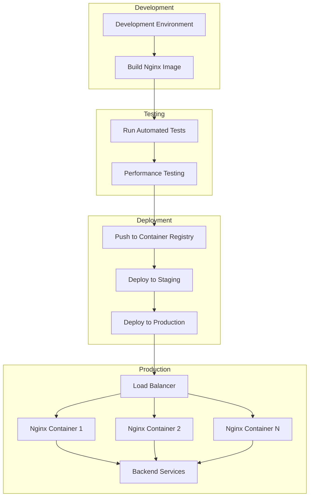

# Nginx Docker Containers

## Introduction

Containerizing Nginx with Docker provides a powerful way to deploy web servers in a consistent, isolated, and portable manner. Docker containers package applications and their dependencies, making them easy to deploy across different environments. By combining Nginx's performance and efficiency with Docker's containerization benefits, you can create lightweight, scalable web server deployments that are perfect for modern cloud infrastructures.

In this tutorial, we'll explore how to create, configure, and deploy Nginx using Docker containers. We'll cover basic concepts, work through practical examples, and examine real-world scenarios to help you understand how these technologies work together.

## Prerequisites

Before we begin, you should have:

- Basic understanding of web servers and Nginx
- Docker installed on your system
- Basic familiarity with command line operations
- Text editor for configuration files

## Understanding Docker and Nginx

### What is Docker?

Docker is a platform that enables developers to package applications into containers—standardized executable components that combine application source code with all the operating system libraries and dependencies required to run the code in any environment.

### Why Containerize Nginx?

Containerizing Nginx offers several advantages:

- **Consistency**: The same Nginx configuration works across development, testing, and production environments
- **Isolation**: Container-specific configurations won't interfere with other applications
- **Scalability**: Easily deploy multiple Nginx instances with identical configurations
- **Versioning**: Track changes with container versioning
- **Portability**: Deploy anywhere Docker runs without worrying about system dependencies

## Getting Started with Nginx in Docker

### Basic Nginx Container

Let's start by running a basic Nginx container:

```bash
docker run --name basic-nginx -p 80:80 -d nginx
```

This command:
- Pulls the official Nginx image from Docker Hub (if not already present)
- Creates a container named `basic-nginx`
- Maps port 80 on your host to port 80 in the container
- Runs the container in detached mode (in the background)

You can now access Nginx by opening `http://localhost` in your browser. You should see the default Nginx welcome page.

### Checking Container Status

To verify your container is running:

```bash
docker ps
```

Output example:
```
CONTAINER ID   IMAGE     COMMAND                  CREATED          STATUS          PORTS                               NAMES
a7d3e45f9d07   nginx     "/docker-entrypoint.…"   10 seconds ago   Up 9 seconds    0.0.0.0:80->80/tcp, :::80->80/tcp   basic-nginx
```

## Custom Nginx Configuration

The default Nginx image is useful, but real-world applications require customization. Let's create a custom Nginx configuration.

### Creating a Custom Configuration File

First, let's create a directory for our custom configuration:

```bash
mkdir -p nginx-docker-demo/conf
```

Now, create a custom configuration file:

```bash
nano nginx-docker-demo/conf/default.conf
```

Add this configuration:

```nginx
server {
    listen       80;
    server_name  localhost;

    location / {
        root   /usr/share/nginx/html;
        index  index.html index.htm;
    }

    # Custom error page
    error_page   500 502 503 504  /50x.html;
    location = /50x.html {
        root   /usr/share/nginx/html;
    }

    # Add a custom location
    location /api {
        return 200 '{"message": "Welcome to our API"}';
        add_header Content-Type application/json;
    }
}
```

### Creating Custom HTML Content

Create a directory for HTML content:

```bash
mkdir -p nginx-docker-demo/html
```

Create a custom index.html file:

```bash
nano nginx-docker-demo/html/index.html
```

Add some content:

```html
<!DOCTYPE html>
<html>
<head>
    <title>Nginx Docker Example</title>
    <style>
        body {
            font-family: Arial, sans-serif;
            max-width: 800px;
            margin: 0 auto;
            padding: 20px;
            line-height: 1.6;
        }
        h1 {
            color: #2196F3;
        }
    </style>
</head>
<body>
    <h1>Welcome to Nginx Docker!</h1>
    <p>If you see this page, your Nginx container is working correctly.</p>
    <p>This is a custom page served from a Docker volume.</p>
</body>
</html>
```

### Running Nginx with Custom Configuration

Now let's start a container with our custom configuration:

```bash
docker run --name custom-nginx \
  -p 8080:80 \
  -v $(pwd)/nginx-docker-demo/html:/usr/share/nginx/html \
  -v $(pwd)/nginx-docker-demo/conf/default.conf:/etc/nginx/conf.d/default.conf \
  -d nginx
```

This command:
- Names the container `custom-nginx`
- Maps port 8080 on the host to port 80 in the container
- Mounts our custom HTML directory to the Nginx document root
- Mounts our custom configuration file to the Nginx configuration directory
- Runs the container in detached mode

Access your custom Nginx setup at `http://localhost:8080` and try the API endpoint at `http://localhost:8080/api`.

## Building a Custom Nginx Docker Image

Instead of mounting volumes, we can build a custom Docker image with our configurations and content baked in.

### Creating a Dockerfile

In your project directory, create a Dockerfile:

```bash
nano nginx-docker-demo/Dockerfile
```

Add the following content:

```dockerfile
FROM nginx:latest

# Copy custom configuration
COPY conf/default.conf /etc/nginx/conf.d/default.conf

# Copy custom content
COPY html/ /usr/share/nginx/html/

# Expose port 80
EXPOSE 80

# Start Nginx when the container launches
CMD ["nginx", "-g", "daemon off;"]
```

### Building the Image

Build your custom image:

```bash
cd nginx-docker-demo
docker build -t my-nginx-image .
```

### Running Your Custom Image

Run a container using your custom image:

```bash
docker run --name nginx-from-image -p 8081:80 -d my-nginx-image
```

Access your custom Nginx at `http://localhost:8081`.

## Multi-Container Setup with Docker Compose

Real-world applications often involve multiple containers working together. Docker Compose makes it easy to define and run multi-container applications.

### Creating a Docker Compose File

Create a docker-compose.yml file:

```bash
nano nginx-docker-demo/docker-compose.yml
```

Add this configuration for a simple web setup with Nginx as a reverse proxy and a backend service:

```yaml
version: '3'

services:
  nginx:
    image: nginx:latest
    ports:
      - "8082:80"
    volumes:
      - ./conf/nginx-proxy.conf:/etc/nginx/conf.d/default.conf
    depends_on:
      - backend
    networks:
      - app-network

  backend:
    image: node:14-alpine
    working_dir: /app
    volumes:
      - ./backend:/app
    command: sh -c "npm install && npm start"
    networks:
      - app-network

networks:
  app-network:
    driver: bridge
```

### Create a Backend Service

Create a simple Node.js backend:

```bash
mkdir -p nginx-docker-demo/backend
nano nginx-docker-demo/backend/package.json
```

Add content:

```json
{
  "name": "backend-api",
  "version": "1.0.0",
  "main": "index.js",
  "scripts": {
    "start": "node index.js"
  },
  "dependencies": {
    "express": "^4.17.1"
  }
}
```

Create the Node.js server:

```bash
nano nginx-docker-demo/backend/index.js
```

Add content:

```javascript
const express = require('express');
const app = express();
const port = 3000;

app.get('/', (req, res) => {
  res.json({ message: 'Backend API is running!' });
});

app.get('/users', (req, res) => {
  res.json([
    { id: 1, name: 'John Doe' },
    { id: 2, name: 'Jane Smith' }
  ]);
});

app.listen(port, () => {
  console.log(`Backend API listening at http://localhost:${port}`);
});
```

### Create Nginx Proxy Configuration

Create a proxy configuration for Nginx:

```bash
mkdir -p nginx-docker-demo/conf
nano nginx-docker-demo/conf/nginx-proxy.conf
```

Add content:

```nginx
server {
    listen 80;
    server_name localhost;

    location / {
        proxy_pass http://backend:3000;
        proxy_set_header Host $host;
        proxy_set_header X-Real-IP $remote_addr;
        proxy_set_header X-Forwarded-For $proxy_add_x_forwarded_for;
        proxy_set_header X-Forwarded-Proto $scheme;
    }
}
```

### Running the Docker Compose Setup

Start the multi-container application:

```bash
cd nginx-docker-demo
docker-compose up -d
```

Access your application at `http://localhost:8082`. The request will be sent to Nginx, which will proxy it to the Node.js backend.

## Nginx Docker Configuration Patterns

Let's look at some common patterns and best practices for using Nginx in Docker.

### Load Balancing Multiple Backends

When you need to distribute traffic across multiple backend servers, Nginx can act as a load balancer.

Create a load-balancing configuration:

```nginx
upstream backend_servers {
    server backend1:3000;
    server backend2:3000;
    server backend3:3000;
}

server {
    listen 80;
    server_name localhost;

    location / {
        proxy_pass http://backend_servers;
        proxy_set_header Host $host;
        proxy_set_header X-Real-IP $remote_addr;
    }
}
```

### SSL/TLS Termination

For secure connections, Nginx can handle SSL/TLS termination:

```nginx
server {
    listen 443 ssl;
    server_name example.com;

    ssl_certificate /etc/nginx/ssl/example.com.crt;
    ssl_certificate_key /etc/nginx/ssl/example.com.key;
    ssl_protocols TLSv1.2 TLSv1.3;
    ssl_ciphers HIGH:!aNULL:!MD5;

    location / {
        proxy_pass http://backend:3000;
        proxy_set_header Host $host;
        proxy_set_header X-Real-IP $remote_addr;
    }
}
```

### Rate Limiting

To protect your application from abuse, add rate limiting:

```nginx
http {
    limit_req_zone $binary_remote_addr zone=mylimit:10m rate=10r/s;

    server {
        listen 80;
        server_name localhost;

        location / {
            limit_req zone=mylimit burst=20 nodelay;
            proxy_pass http://backend:3000;
        }
    }
}
```

## Production Considerations

When deploying Nginx containers in production, consider these important factors:

### Security

- Always use the latest Nginx Docker image or specify a fixed version that's regularly updated
- Implement HTTPS with strong SSL/TLS settings
- Use non-root users inside containers
- Implement proper request filtering and rate limiting

### Performance

- Use worker processes and connections aligned with available CPU cores
- Enable compression for text-based content
- Configure caching appropriately
- Use connection keep-alive settings

### Monitoring

- Expose Nginx status endpoints
- Implement health checks
- Set up logging to standard output for container logging systems

### High Availability

- Deploy multiple Nginx instances behind a load balancer
- Use Docker Swarm or Kubernetes for orchestration
- Implement proper restart policies

## Deployment Flow Visualization

Here's a visualization of how Nginx Docker containers fit into a typical deployment pipeline:



## Summary

In this guide, we've explored how to use Nginx with Docker containers, covering:

- Basic Nginx container deployment
- Custom configuration and content
- Building custom Nginx Docker images
- Multi-container setups with Docker Compose
- Common configuration patterns for production use
- Important considerations for production deployments

Containerizing Nginx provides flexibility, consistency, and scalability for your web applications. By leveraging the combination of Nginx's powerful web server capabilities and Docker's containerization benefits, you can create robust, portable web server deployments suitable for modern cloud environments.

## Further Resources

To continue learning about Nginx Docker containers:

- [Official Nginx Docker Image Documentation](https://hub.docker.com/_/nginx)
- [Nginx Official Documentation](https://nginx.org/en/docs/)
- [Docker Documentation](https://docs.docker.com/)
- [Docker Compose Documentation](https://docs.docker.com/compose/)

## Exercises

1. Create an Nginx container that serves multiple websites using server blocks.
2. Implement a rate-limiting configuration to protect your application from abuse.
3. Set up an Nginx container with caching for a backend application.
4. Create a Docker Compose configuration that includes Nginx, a backend API, and a database.
5. Implement a CI/CD pipeline that builds and deploys your custom Nginx image.