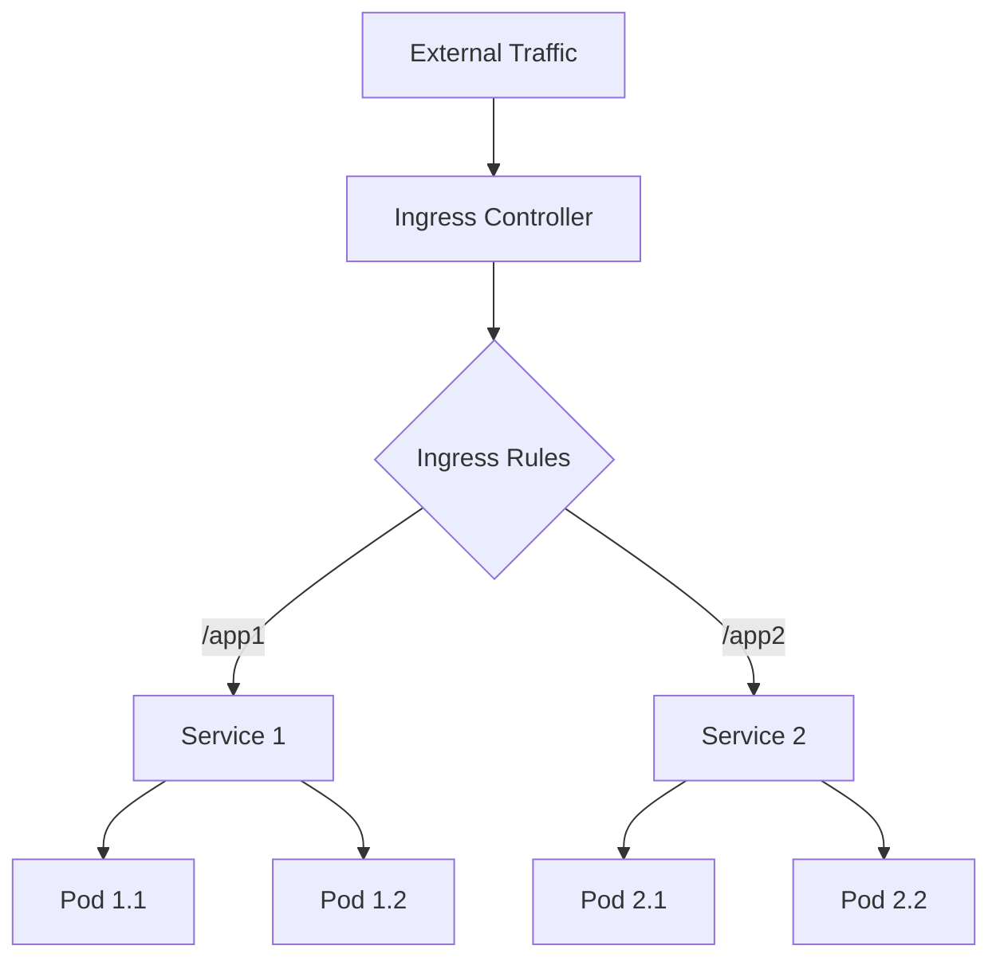

# Nginx Kubernetes Ingress

## Introduction

When deploying applications in Kubernetes, one of the key challenges is exposing these applications to the outside world. While Kubernetes Services provide internal networking capabilities, accessing these services from outside the cluster requires additional configuration. This is where **Ingress** comes into play.

An **Ingress** is a Kubernetes resource that manages external access to services within a cluster, typically through HTTP/HTTPS. It provides features like load balancing, SSL termination, and name-based virtual hosting.

The **Nginx Ingress Controller** is one of the most popular implementations of the Kubernetes Ingress specification. It uses Nginx as a reverse proxy and load balancer to route external traffic to your internal services.

In this guide, we'll explore how to set up and configure Nginx Kubernetes Ingress for your applications.

## Prerequisites

Before we begin, you should have:

- A running Kubernetes cluster
- `kubectl` installed and configured
- Basic understanding of Kubernetes concepts (Pods, Services, Deployments)
- Helm (optional but recommended for installation)

## Understanding Ingress Architecture

Let's first understand how Ingress works in Kubernetes:



In this architecture:

1. External traffic hits the Ingress Controller
2. The Ingress Controller uses Ingress Rules to determine where to route the traffic
3. Traffic is forwarded to the appropriate Service
4. The Service distributes traffic to the Pods

## Installing Nginx Ingress Controller

There are several ways to install the Nginx Ingress Controller. Let's look at the two most common methods:

### Method 1: Using Helm

Helm is a package manager for Kubernetes that makes it easy to install and manage applications.

```bash
# Add the Nginx Ingress repository
helm repo add ingress-nginx https://kubernetes.github.io/ingress-nginx

# Update the repository
helm repo update

# Install Nginx Ingress Controller
helm install nginx-ingress ingress-nginx/ingress-nginx
```

### Method 2: Using Kubernetes Manifests

If you prefer not to use Helm, you can install the Nginx Ingress Controller using kubectl and YAML manifests:

```bash
# Apply the mandatory manifests
kubectl apply -f https://raw.githubusercontent.com/kubernetes/ingress-nginx/controller-v1.8.1/deploy/static/provider/cloud/deploy.yaml
```

After installation, verify that the Nginx Ingress Controller is running:

```bash
kubectl get pods -n ingress-nginx
```

You should see something like:

```
NAME                                        READY   STATUS    RESTARTS   AGE
ingress-nginx-controller-5c8d66c76d-xj8t2   1/1     Running   0          45s
```

## Creating Your First Ingress Resource

Let's set up a simple application and expose it using Nginx Ingress:

### Step 1: Deploy Sample Applications

First, let's create two sample applications:

```yaml
# app1-deployment.yaml
apiVersion: apps/v1
kind: Deployment
metadata:
  name: app1
spec:
  replicas: 2
  selector:
    matchLabels:
      app: app1
  template:
    metadata:
      labels:
        app: app1
    spec:
      containers:
      - name: app1
        image: nginx
        ports:
        - containerPort: 80
---
apiVersion: v1
kind: Service
metadata:
  name: app1-service
spec:
  selector:
    app: app1
  ports:
  - port: 80
    targetPort: 80
```

```yaml
# app2-deployment.yaml
apiVersion: apps/v1
kind: Deployment
metadata:
  name: app2
spec:
  replicas: 2
  selector:
    matchLabels:
      app: app2
  template:
    metadata:
      labels:
        app: app2
    spec:
      containers:
      - name: app2
        image: httpd
        ports:
        - containerPort: 80
---
apiVersion: v1
kind: Service
metadata:
  name: app2-service
spec:
  selector:
    app: app2
  ports:
  - port: 80
    targetPort: 80
```

Apply these configurations:

```bash
kubectl apply -f app1-deployment.yaml
kubectl apply -f app2-deployment.yaml
```

### Step 2: Create an Ingress Resource

Now, let's create an Ingress resource to route traffic to these services:

```yaml
# my-ingress.yaml
apiVersion: networking.k8s.io/v1
kind: Ingress
metadata:
  name: my-ingress
  annotations:
    nginx.ingress.kubernetes.io/rewrite-target: /
spec:
  ingressClassName: nginx
  rules:
  - http:
      paths:
      - path: /app1
        pathType: Prefix
        backend:
          service:
            name: app1-service
            port:
              number: 80
      - path: /app2
        pathType: Prefix
        backend:
          service:
            name: app2-service
            port:
              number: 80
```

Apply the Ingress resource:

```bash
kubectl apply -f my-ingress.yaml
```

### Step 3: Verify the Ingress

Check if the Ingress resource was created:

```bash
kubectl get ingress
```

Output should be:

```
NAME         CLASS   HOSTS   ADDRESS         PORTS   AGE
my-ingress   nginx   *       192.168.1.240   80      30s
```

Now you can access your applications through the Ingress Controller's external IP:
- `http://<INGRESS_IP>/app1` will take you to the first application
- `http://<INGRESS_IP>/app2` will take you to the second application

## Advanced Ingress Configurations

Now that you have basic Ingress working, let's explore some advanced configurations:

### Path-Based Routing

We've already demonstrated path-based routing in our first example. The Ingress Controller routes traffic based on the URL path.

### Host-Based Routing

You can also route traffic based on the hostname:

```yaml
apiVersion: networking.k8s.io/v1
kind: Ingress
metadata:
  name: host-based-ingress
spec:
  ingressClassName: nginx
  rules:
  - host: app1.example.com
    http:
      paths:
      - path: /
        pathType: Prefix
        backend:
          service:
            name: app1-service
            port:
              number: 80
  - host: app2.example.com
    http:
      paths:
      - path: /
        pathType: Prefix
        backend:
          service:
            name: app2-service
            port:
              number: 80
```

### TLS/SSL Configuration

To enable HTTPS, you need to create a Secret with your TLS certificate and key:

```bash
kubectl create secret tls example-tls --key tls.key --cert tls.crt
```

Then, update your Ingress resource to use this Secret:

```yaml
apiVersion: networking.k8s.io/v1
kind: Ingress
metadata:
  name: tls-ingress
spec:
  ingressClassName: nginx
  tls:
  - hosts:
    - secure-app.example.com
    secretName: example-tls
  rules:
  - host: secure-app.example.com
    http:
      paths:
      - path: /
        pathType: Prefix
        backend:
          service:
            name: app1-service
            port:
              number: 80
```

### Rate Limiting

You can configure rate limiting to protect your services from being overwhelmed:

```yaml
apiVersion: networking.k8s.io/v1
kind: Ingress
metadata:
  name: rate-limited-ingress
  annotations:
    nginx.ingress.kubernetes.io/limit-rps: "10"
    nginx.ingress.kubernetes.io/limit-connections: "5"
spec:
  ingressClassName: nginx
  rules:
  - http:
      paths:
      - path: /app1
        pathType: Prefix
        backend:
          service:
            name: app1-service
            port:
              number: 80
```

### Session Affinity

Enable session affinity (sticky sessions) to route requests from the same client to the same pod:

```yaml
apiVersion: networking.k8s.io/v1
kind: Ingress
metadata:
  name: sticky-ingress
  annotations:
    nginx.ingress.kubernetes.io/affinity: "cookie"
    nginx.ingress.kubernetes.io/session-cookie-name: "route"
    nginx.ingress.kubernetes.io/session-cookie-expires: "172800"
    nginx.ingress.kubernetes.io/session-cookie-max-age: "172800"
spec:
  ingressClassName: nginx
  rules:
  - http:
      paths:
      - path: /app1
        pathType: Prefix
        backend:
          service:
            name: app1-service
            port:
              number: 80
```

## Practical Example: Running a Web Application with Backend API

Let's create a more realistic example with a frontend application and a backend API:

### Step 1: Deploy Frontend and Backend

```yaml
# frontend-deployment.yaml
apiVersion: apps/v1
kind: Deployment
metadata:
  name: frontend
spec:
  replicas: 2
  selector:
    matchLabels:
      app: frontend
  template:
    metadata:
      labels:
        app: frontend
    spec:
      containers:
      - name: frontend
        image: nginx
        ports:
        - containerPort: 80
---
apiVersion: v1
kind: Service
metadata:
  name: frontend-service
spec:
  selector:
    app: frontend
  ports:
  - port: 80
    targetPort: 80
```

```yaml
# backend-deployment.yaml
apiVersion: apps/v1
kind: Deployment
metadata:
  name: backend
spec:
  replicas: 2
  selector:
    matchLabels:
      app: backend
  template:
    metadata:
      labels:
        app: backend
    spec:
      containers:
      - name: backend
        image: nginx
        ports:
        - containerPort: 80
---
apiVersion: v1
kind: Service
metadata:
  name: backend-service
spec:
  selector:
    app: backend
  ports:
  - port: 80
    targetPort: 80
```

Apply these configurations:

```bash
kubectl apply -f frontend-deployment.yaml
kubectl apply -f backend-deployment.yaml
```

### Step 2: Create Ingress for Both Services

```yaml
# app-ingress.yaml
apiVersion: networking.k8s.io/v1
kind: Ingress
metadata:
  name: app-ingress
  annotations:
    nginx.ingress.kubernetes.io/rewrite-target: /$2
spec:
  ingressClassName: nginx
  rules:
  - host: myapp.example.com
    http:
      paths:
      - path: /(/|$)(.*)
        pathType: Prefix
        backend:
          service:
            name: frontend-service
            port:
              number: 80
      - path: /api(/|$)(.*)
        pathType: Prefix
        backend:
          service:
            name: backend-service
            port:
              number: 80
```

Apply this Ingress:

```bash
kubectl apply -f app-ingress.yaml
```

Now, requests to `myapp.example.com` will be routed to the frontend service, while requests to `myapp.example.com/api` will be routed to the backend service.

## Monitoring and Troubleshooting

### Viewing Ingress Controller Logs

```bash
kubectl logs -n ingress-nginx -l app.kubernetes.io/name=ingress-nginx
```

### Checking Ingress Status

```bash
kubectl describe ingress my-ingress
```

### Common Issues and Solutions

1. **Ingress Not Working**
   - Check if the Ingress Controller is running
   - Verify the Ingress resource configuration
   - Ensure your services are running and reachable

2. **SSL/TLS Issues**
   - Verify your certificate and key are correct
   - Check the TLS Secret is properly referenced in the Ingress

3. **Path Routing Issues**
   - Confirm path rules are correctly defined
   - Check if your rewrite annotations are configured properly

## Best Practices

1. **Use Namespaces**: Organize your resources using Kubernetes namespaces for better isolation and management.

2. **Implement HTTPS**: Always use TLS for production environments to secure your applications.

3. **Configure Health Checks**: Set up proper health checks to ensure traffic is only sent to healthy pods.

4. **Set Resource Limits**: Define CPU and memory limits for the Ingress Controller to ensure stability.

5. **Regular Updates**: Keep your Nginx Ingress Controller updated to benefit from security patches and new features.

## Summary

In this guide, we've explored how to set up and configure Nginx Kubernetes Ingress for your applications. We've covered:

- Basic concepts of Ingress in Kubernetes
- Installing the Nginx Ingress Controller
- Creating and configuring Ingress resources
- Advanced configurations including TLS, rate limiting, and session affinity
- A practical example of routing traffic to frontend and backend services
- Troubleshooting and best practices

The Nginx Ingress Controller provides a powerful and flexible way to manage external access to your Kubernetes services. By following the practices outlined in this guide, you can effectively expose your applications while maintaining security and performance.

## Additional Resources

- [Kubernetes Ingress Documentation](https://kubernetes.io/docs/concepts/services-networking/ingress/)
- [Nginx Ingress Controller GitHub Repository](https://github.com/kubernetes/ingress-nginx)
- [Nginx Ingress Controller Annotations](https://kubernetes.github.io/ingress-nginx/user-guide/nginx-configuration/annotations/)

## Practice Exercises

1. Set up an Ingress resource that routes traffic to three different services based on paths.
2. Configure a wildcard TLS certificate for multiple hosts in your Ingress.
3. Implement rate limiting and basic authentication for a service exposed through Ingress.
4. Create an Ingress that handles URL rewrites for a complex application structure.
5. Set up a blue/green deployment strategy using Ingress for traffic switching.