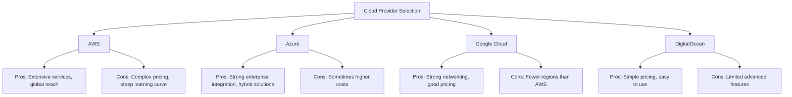

# Nginx Cloud Providers

## Introduction

When deploying Nginx for production applications, choosing the right cloud provider is a crucial decision that impacts performance, cost, and maintenance. This guide explores the major cloud providers that support Nginx deployments, their unique features, pricing models, and integration capabilities.

Nginx (pronounced "engine-x") is a popular web server, reverse proxy, and load balancer that can be deployed across various cloud environments. Each cloud provider offers different ways to deploy, manage, and scale Nginx, from simple virtual machines to fully managed services.

## Major Cloud Providers for Nginx Deployment

### Amazon Web Services (AWS)

AWS provides multiple options for deploying Nginx:

#### 1. Amazon EC2 (Elastic Compute Cloud)

EC2 allows you to deploy Nginx on virtual machines with complete control over configuration.

**Example: Launching an EC2 instance with Nginx**

```bash
# Connect to your EC2 instance
ssh -i your-key.pem ec2-user@your-instance-ip

# Install Nginx on Amazon Linux 2
sudo amazon-linux-extras install nginx1
sudo systemctl start nginx
sudo systemctl enable nginx

# Verify Nginx is running
curl http://localhost
```

#### 2. AWS Elastic Beanstalk

Beanstalk provides a platform for deploying applications without managing the infrastructure.

**Example: Configuring Nginx in Elastic Beanstalk**

Create a `.ebextensions/nginx.config` file in your application root:

```yaml
files:
  "/etc/nginx/conf.d/proxy.conf":
    mode: "000644"
    owner: root
    group: root
    content: |
      upstream nodejs {
        server 127.0.0.1:8081;
        keepalive 256;
      }

      server {
        listen 8080;

        location / {
          proxy_pass http://nodejs;
          proxy_set_header Connection "";
          proxy_http_version 1.1;
          proxy_set_header Host $host;
          proxy_set_header X-Real-IP $remote_addr;
          proxy_set_header X-Forwarded-For $proxy_add_x_forwarded_for;
        }
      }
```

#### 3. Amazon ECS/EKS with Nginx containers

Run Nginx as a container using AWS container services.

**Example: Nginx container definition for ECS**

```json
{
  "family": "nginx-service",
  "containerDefinitions": [
    {
      "name": "nginx",
      "image": "nginx:latest",
      "essential": true,
      "portMappings": [
        {
          "containerPort": 80,
          "hostPort": 80
        }
      ],
      "memory": 512,
      "cpu": 256
    }
  ]
}
```

### Microsoft Azure

Azure offers several options for Nginx deployment:

#### 1. Azure Virtual Machines

Similar to AWS EC2, deploy Nginx on Azure VMs with full control.

**Example: Installing Nginx on an Azure VM**

```bash
# Connect to your Azure VM
ssh username@your-vm-ip

# Install Nginx on Ubuntu
sudo apt update
sudo apt install -y nginx
sudo systemctl enable nginx
sudo systemctl start nginx

# Open port 80 in Azure Network Security Group (if not already open)
az network nsg rule create --resource-group myResourceGroup \
  --nsg-name myNetworkSecurityGroup --name nginx-rule \
  --protocol tcp --direction inbound --priority 1001 \
  --source-address-prefix '*' --source-port-range '*' \
  --destination-address-prefix '*' --destination-port-range 80 \
  --access allow
```

#### 2. Azure App Service

Deploy Nginx as part of a containerized application.

**Example: Creating a custom Nginx container for App Service**

1. Create a Dockerfile:

```dockerfile
FROM nginx:latest
COPY ./nginx.conf /etc/nginx/nginx.conf
COPY ./www /usr/share/nginx/html
EXPOSE 80
```

2. Deploy to Azure App Service:

```bash
# Build and push the container to Azure Container Registry
az acr build --registry myRegistry --image nginx-app:latest .

# Create and deploy to App Service
az webapp create --resource-group myResourceGroup \
  --plan myAppServicePlan --name myNginxApp \
  --deployment-container-image-name myRegistry.azurecr.io/nginx-app:latest
```

### Google Cloud Platform (GCP)

GCP provides these deployment options for Nginx:

#### 1. Google Compute Engine (GCE)

Similar to AWS EC2 and Azure VMs, deploy Nginx on virtual machines.

**Example: Setting up Nginx on Compute Engine**

```bash
# Connect to your GCE instance
gcloud compute ssh instance-name

# Install Nginx on Debian/Ubuntu
sudo apt update
sudo apt install -y nginx
sudo systemctl enable nginx
sudo systemctl start nginx

# Create a firewall rule to allow HTTP traffic
gcloud compute firewall-rules create allow-http \
  --allow tcp:80 --target-tags=http-server
```

#### 2. Google Kubernetes Engine (GKE)

Run Nginx as part of a Kubernetes deployment.

**Example: Deploying Nginx on GKE**

```yaml
# nginx-deployment.yaml
apiVersion: apps/v1
kind: Deployment
metadata:
  name: nginx-deployment
spec:
  selector:
    matchLabels:
      app: nginx
  replicas: 3
  template:
    metadata:
      labels:
        app: nginx
    spec:
      containers:
      - name: nginx
        image: nginx:latest
        ports:
        - containerPort: 80
---
apiVersion: v1
kind: Service
metadata:
  name: nginx-service
spec:
  selector:
    app: nginx
  ports:
  - port: 80
    targetPort: 80
  type: LoadBalancer
```

Deploy with:

```bash
kubectl apply -f nginx-deployment.yaml
```

### DigitalOcean

DigitalOcean offers a more straightforward approach:

#### 1. DigitalOcean Droplets

Deploy Nginx on virtual machines (Droplets) with pre-configured images.

**Example: Creating a Droplet with Nginx**

```bash
# Using doctl CLI
doctl compute droplet create nginx-server \
  --size s-1vcpu-1gb \
  --image ubuntu-20-04-x64 \
  --region nyc1

# After creation, SSH into the Droplet
ssh root@droplet-ip

# Install Nginx
apt update
apt install -y nginx
```

#### 2. DigitalOcean Kubernetes (DOKS)

Similar to GKE, deploy Nginx on managed Kubernetes.

## Comparing Cloud Providers for Nginx

Let's compare these providers based on key metrics:



### Cost Comparison

| Provider | Entry VM Cost | Load Balancer | Bandwidth Costs | Managed Services |
|----------|--------------|---------------|-----------------|------------------|
| AWS | $5-10/month (t4g.nano) | $18/month + hourly | Tiered, complex | High |
| Azure | $5-13/month (B1s) | $18/month + hourly | Tiered, outbound charged | High |
| GCP | $5-10/month (e2-micro) | $18/month + hourly | Tiered, some free | Medium |
| DigitalOcean | $5/month (Basic) | $10/month | Included, simple | Low |

*Note: Prices are approximate and may change. Always check the provider's current pricing.*

## Best Practices for Nginx Deployment on Cloud

### 1. Security Considerations

When deploying Nginx to any cloud provider, follow these security best practices:

```nginx
# In your nginx.conf:

# Hide Nginx version
server_tokens off;

# Add security headers
add_header X-Content-Type-Options nosniff;
add_header X-Frame-Options SAMEORIGIN;
add_header X-XSS-Protection "1; mode=block";
add_header Content-Security-Policy "default-src 'self'";

# Configure SSL properly
ssl_protocols TLSv1.2 TLSv1.3;
ssl_prefer_server_ciphers on;
ssl_ciphers "EECDH+AESGCM:EDH+AESGCM";
ssl_session_cache shared:SSL:10m;
```

### 2. Performance Optimization

Optimize Nginx for cloud environments:

```nginx
# Worker configuration
worker_processes auto;
worker_rlimit_nofile 65535;

# Connection settings
events {
    worker_connections 4096;
    multi_accept on;
    use epoll;
}

# Timeouts
http {
    keepalive_timeout 65;
    client_body_timeout 12;
    client_header_timeout 12;
    send_timeout 10;
}
```

### 3. High Availability Setup

For critical applications, implement high availability:

1. Deploy multiple Nginx instances across availability zones
2. Use cloud load balancers
3. Implement health checks
4. Set up auto-scaling

**Example: AWS Auto Scaling Group Configuration**

```yaml
# CloudFormation snippet
Resources:
  NginxLaunchConfig:
    Type: AWS::AutoScaling::LaunchConfiguration
    Properties:
      ImageId: ami-12345678
      InstanceType: t3.small
      SecurityGroups:
        - !Ref NginxSecurityGroup
      UserData:
        Fn::Base64: |
          #!/bin/bash
          yum update -y
          amazon-linux-extras install nginx1
          systemctl start nginx
          systemctl enable nginx
          
  NginxAutoScalingGroup:
    Type: AWS::AutoScaling::AutoScalingGroup
    Properties:
      LaunchConfigurationName: !Ref NginxLaunchConfig
      MinSize: 2
      MaxSize: 10
      DesiredCapacity: 2
      AvailabilityZones:
        - us-east-1a
        - us-east-1b
```

## Real-World Use Cases

### 1. Content Delivery Network (CDN)

Nginx can serve as an edge server in a global CDN:

```nginx
# Set caching
proxy_cache_path /var/cache/nginx levels=1:2 keys_zone=cdn_cache:10m max_size=10g inactive=60m;

server {
    listen 80;
    server_name cdn.example.com;
    
    location ~* \.(jpg|jpeg|png|gif|ico|css|js)$ {
        proxy_cache cdn_cache;
        proxy_cache_valid 200 302 60m;
        proxy_cache_valid 404 1m;
        proxy_pass http://origin-server;
        add_header X-Cache-Status $upstream_cache_status;
        expires 1y;
    }
}
```

### 2. Microservices API Gateway

Use Nginx as an API gateway for microservices:

```nginx
upstream auth_service {
    server auth-service:8000;
}

upstream user_service {
    server user-service:8001;
}

upstream product_service {
    server product-service:8002;
}

server {
    listen 80;
    
    location /api/auth/ {
        proxy_pass http://auth_service/;
        proxy_set_header Host $host;
        proxy_set_header X-Real-IP $remote_addr;
    }
    
    location /api/users/ {
        proxy_pass http://user_service/;
        proxy_set_header Host $host;
        proxy_set_header X-Real-IP $remote_addr;
    }
    
    location /api/products/ {
        proxy_pass http://product_service/;
        proxy_set_header Host $host;
        proxy_set_header X-Real-IP $remote_addr;
    }
}
```

### 3. Load Balancing for High-Traffic Websites

Configure Nginx for distributing traffic across multiple application servers:

```nginx
upstream web_backend {
    least_conn;
    server web1.example.com weight=3;
    server web2.example.com weight=3;
    server backup1.example.com backup;
    keepalive 64;
}

server {
    listen 80;
    server_name www.example.com;
    
    location / {
        proxy_pass http://web_backend;
        proxy_http_version 1.1;
        proxy_set_header Connection "";
        proxy_set_header Host $host;
        proxy_set_header X-Real-IP $remote_addr;
        proxy_next_upstream error timeout http_500;
    }
}
```

## Decision Framework for Choosing a Cloud Provider

When selecting a cloud provider for your Nginx deployment, consider:

1. **Budget constraints**
   - For startups: Consider DigitalOcean or AWS Lightsail
   - For enterprises: AWS, Azure, or GCP offer more comprehensive services

2. **Technical requirements**
   - Need for managed Kubernetes? GKE or EKS
   - Windows integration? Azure
   - ML/AI integration? GCP

3. **Geographic distribution**
   - Global presence? AWS or Azure
   - Specific regions? Check provider coverage

4. **Compliance requirements**
   - Healthcare (HIPAA)? AWS and Azure have strong compliance programs
   - EU data (GDPR)? All major providers have EU regions

## Summary

Deploying Nginx across different cloud providers requires understanding each platform's unique features, strengths, and limitations. This guide covered:

- The main cloud providers supporting Nginx deployments (AWS, Azure, GCP, DigitalOcean)
- Specific deployment options for each provider
- Cost comparisons and considerations
- Best practices for security, performance, and high availability
- Real-world use cases demonstrating Nginx's versatility in cloud environments

The right choice depends on your specific needs, budget, and technical requirements. For beginners, DigitalOcean offers the simplest path to getting started, while larger applications might benefit from the extensive ecosystem of AWS, Azure, or GCP.

## Additional Resources

- [Official Nginx Documentation](https://nginx.org/en/docs/)
- [AWS Nginx Deployment Patterns](https://aws.amazon.com/getting-started/hands-on/)
- [Azure Web App Documentation](https://docs.microsoft.com/en-us/azure/app-service/)
- [Google Cloud Load Balancing](https://cloud.google.com/load-balancing)
- [DigitalOcean Nginx Guides](https://www.digitalocean.com/community/tutorials)

## Exercises

1. **Basic Deployment**: Deploy Nginx on a free tier instance of AWS EC2 or Azure VM. Configure it to serve a simple HTML page.

2. **Load Balancer Setup**: Set up an Nginx load balancer on one cloud provider that distributes traffic to two backend web servers.

3. **Multi-Cloud Challenge**: Deploy the same Nginx configuration on two different cloud providers. Compare performance, cost, and ease of management.

4. **Container Deployment**: Create a Dockerfile for Nginx that includes a custom configuration, then deploy it to a container service like AWS ECS or GKE.

5. **High Availability Configuration**: Design and implement a highly available Nginx setup on your preferred cloud provider using their auto-scaling features.