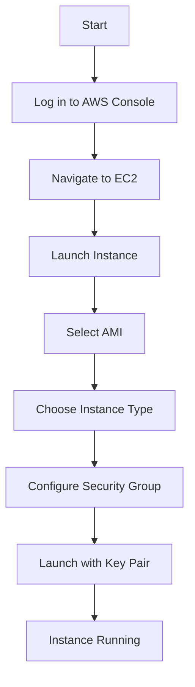
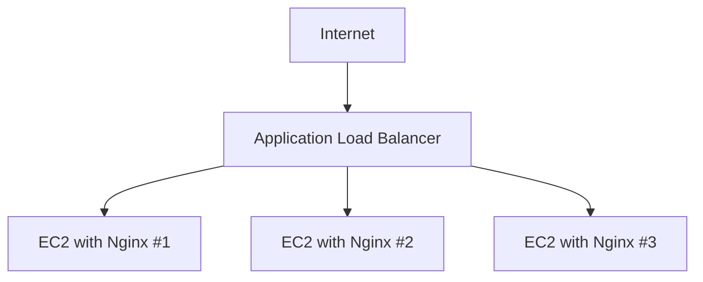

# Nginx AWS Deployment

## Introduction

Deploying Nginx on Amazon Web Services (AWS) combines the power of one of the world's most popular web servers with the flexibility and scalability of cloud infrastructure. This guide will walk you through the process of setting up Nginx on AWS, from launching your first EC2 instance to configuring advanced features like load balancing and automatic scaling.

Nginx (pronounced "engine-x") is a high-performance web server that can also function as a reverse proxy, load balancer, and HTTP cache. AWS provides a robust platform where you can deploy Nginx in various configurations to serve websites, APIs, and applications with optimal performance and reliability.

## Prerequisites

Before we begin, you should have:

- An AWS account
- Basic understanding of Linux commands
- Familiarity with web servers and HTTP concepts
- AWS CLI installed and configured (optional but recommended)

## Basic Nginx Deployment on EC2

### Step 1: Launch an EC2 Instance

Let's start by launching a basic EC2 instance where we'll install Nginx:

1. Log in to the AWS Management Console
2. Navigate to EC2 service
3. Click "Launch Instance"
4. Choose an Amazon Linux 2 or Ubuntu Server AMI
5. Select t2.micro instance type (free tier eligible)
6. Configure instance details as needed
7. Add storage (default is usually sufficient)
8. Add tags (optional)
9. Configure security group:
   - Allow SSH (port 22) from your IP
   - Allow HTTP (port 80) from anywhere
   - Allow HTTPS (port 443) from anywhere
10. Review and launch with your key pair



### Step 2: Connect to Your Instance

Connect to your instance using SSH:

```bash
ssh -i /path/to/your-key.pem ec2-user@your-instance-public-dns
```

For Ubuntu:

```bash
ssh -i /path/to/your-key.pem ubuntu@your-instance-public-dns
```

### Step 3: Install Nginx

For Amazon Linux 2:

```bash
# Update system packages
sudo yum update -y

# Install Nginx
sudo amazon-linux-extras install nginx1 -y

# Start Nginx
sudo systemctl start nginx

# Enable Nginx to start on boot
sudo systemctl enable nginx

# Check status
sudo systemctl status nginx
```

For Ubuntu:

```bash
# Update system packages
sudo apt update
sudo apt upgrade -y

# Install Nginx
sudo apt install nginx -y

# Start Nginx
sudo systemctl start nginx

# Enable Nginx to start on boot
sudo systemctl enable nginx

# Check status
sudo systemctl status nginx
```

### Step 4: Verify Installation

You can verify that Nginx is running by:

1. Checking the service status:
   ```bash
   sudo systemctl status nginx
   ```

2. Testing with curl:
   ```bash
   curl http://localhost
   ```

3. Opening your instance's public DNS in a web browser:
   ```
   http://your-instance-public-dns
   ```

You should see the Nginx welcome page.

## Configuring Nginx on AWS

### Basic Configuration

The main Nginx configuration file is located at `/etc/nginx/nginx.conf`. Let's create a simple website configuration:

1. Create a directory for your website:
   ```bash
   sudo mkdir -p /var/www/mywebsite
   ```

2. Create a sample HTML file:
   ```bash
   sudo nano /var/www/mywebsite/index.html
   ```

3. Add some HTML content:
   ```html
   <!DOCTYPE html>
   <html>
   <head>
       <title>My AWS Nginx Website</title>
   </head>
   <body>
       <h1>Hello from AWS!</h1>
       <p>This is my first Nginx website deployed on AWS.</p>
   </body>
   </html>
   ```

4. Create a server block configuration:
   ```bash
   sudo nano /etc/nginx/conf.d/mywebsite.conf
   ```

5. Add the following configuration:
   ```nginx
   server {
       listen 80;
       server_name _;
       
       root /var/www/mywebsite;
       index index.html;
       
       location / {
           try_files $uri $uri/ =404;
       }
   }
   ```

6. Test the configuration:
   ```bash
   sudo nginx -t
   ```

7. Reload Nginx:
   ```bash
   sudo systemctl reload nginx
   ```

8. Visit your website at your instance's public DNS.

### Setting Up a Domain Name

To use a custom domain:

1. Register a domain through Route 53 or any domain registrar
2. Create a Route 53 hosted zone for your domain
3. Create an A record pointing to your EC2 instance's public IP
4. Update your Nginx server block:
   ```nginx
   server {
       listen 80;
       server_name yourdomain.com www.yourdomain.com;
       
       root /var/www/mywebsite;
       index index.html;
       
       location / {
           try_files $uri $uri/ =404;
       }
   }
   ```

5. Reload Nginx:
   ```bash
   sudo nginx -t
   sudo systemctl reload nginx
   ```

## Securing Nginx with SSL/TLS

### Using AWS Certificate Manager (ACM)

1. Request a certificate in ACM
2. Create an Application Load Balancer (ALB)
3. Configure HTTPS listener with your certificate
4. Point ALB to your EC2 instance

### Using Let's Encrypt with Certbot

For direct EC2 setup:

```bash
# Amazon Linux 2
sudo amazon-linux-extras install epel -y
sudo yum install certbot python2-certbot-nginx -y

# Ubuntu
sudo apt install certbot python3-certbot-nginx -y
```

Obtain and install certificate:

```bash
sudo certbot --nginx -d yourdomain.com -d www.yourdomain.com
```

Certbot will automatically modify your Nginx configuration.

## Advanced AWS Deployments

### Load Balancing with Nginx and AWS ELB

For high-availability setups:

1. Launch multiple EC2 instances with Nginx
2. Create an Application Load Balancer (ALB)
3. Create a target group with your instances
4. Configure health checks
5. Set up listeners for HTTP/HTTPS traffic



### Auto Scaling Nginx on AWS

Create an Auto Scaling Group (ASG):

1. Create a launch template or configuration with Nginx installation
2. Configure an ASG with desired capacity
3. Set up scaling policies based on CPU usage or request count
4. Attach the ASG to your load balancer target group

Example User Data script for your launch template:

```bash
#!/bin/bash
yum update -y
amazon-linux-extras install nginx1 -y
systemctl start nginx
systemctl enable nginx

cat > /var/www/html/index.html << 'EOF'
<!DOCTYPE html>
<html>
<head>
    <title>Auto Scaled Nginx on AWS</title>
</head>
<body>
    <h1>Hello from Auto Scaling Group!</h1>
    <p>This server was launched automatically by AWS Auto Scaling.</p>
    <p>Server ID: $(hostname)</p>
</body>
</html>
EOF
```

### Deploying Nginx with AWS Elastic Beanstalk

For a fully managed solution:

1. Create a `.ebextensions` directory in your project
2. Create a configuration file `.ebextensions/nginx.config`:

```yaml
packages:
  yum:
    nginx: []

files:
  "/etc/nginx/conf.d/custom.conf":
    mode: "000644"
    owner: root
    group: root
    content: |
      server {
          listen 80;
          server_name localhost;
          
          location / {
              root /var/www/html;
              index index.html;
          }
      }

commands:
  01_create_html:
    command: |
      mkdir -p /var/www/html
      echo "<h1>Elastic Beanstalk Nginx</h1>" > /var/www/html/index.html

services:
  sysvinit:
    nginx:
      enabled: true
      ensureRunning: true
```

3. Create a `Procfile`:

```
web: nginx -g "daemon off;"
```

4. Deploy using the EB CLI:

```bash
eb init
eb create
eb deploy
```

## Monitoring Nginx on AWS

### CloudWatch Integration

Monitor your Nginx instances with CloudWatch:

1. Install CloudWatch agent:
   ```bash
   sudo yum install amazon-cloudwatch-agent -y
   ```

2. Create CloudWatch config for Nginx logs:
   ```bash
   sudo nano /opt/aws/amazon-cloudwatch-agent/etc/amazon-cloudwatch-agent.json
   ```

3. Add configuration:
   ```json
   {
     "logs": {
       "logs_collected": {
         "files": {
           "collect_list": [
             {
               "file_path": "/var/log/nginx/access.log",
               "log_group_name": "nginx-access-logs",
               "log_stream_name": "{instance_id}-access-log"
             },
             {
               "file_path": "/var/log/nginx/error.log",
               "log_group_name": "nginx-error-logs",
               "log_stream_name": "{instance_id}-error-log"
             }
           ]
         }
       }
     },
     "metrics": {
       "metrics_collected": {
         "mem": {
           "measurement": ["mem_used_percent"]
         },
         "swap": {
           "measurement": ["swap_used_percent"]
         }
       }
     }
   }
   ```

4. Start the CloudWatch agent:
   ```bash
   sudo systemctl start amazon-cloudwatch-agent
   sudo systemctl enable amazon-cloudwatch-agent
   ```

### Setting Up Alarms

Create CloudWatch alarms for:
- High CPU utilization
- Memory usage
- HTTP 5xx errors
- Response time

## Performance Tuning for AWS

### Nginx Worker Optimization

Edit `/etc/nginx/nginx.conf`:

```nginx
worker_processes auto;
worker_rlimit_nofile 30000;

events {
    worker_connections 1024;
    multi_accept on;
    use epoll;
}

http {
    # ... other settings ...
    
    keepalive_timeout 65;
    keepalive_requests 100000;
    sendfile on;
    tcp_nopush on;
    tcp_nodelay on;
    
    # Cache settings
    open_file_cache max=200000 inactive=20s;
    open_file_cache_valid 30s;
    open_file_cache_min_uses 2;
    open_file_cache_errors on;
    
    # Gzip settings
    gzip on;
    gzip_comp_level 5;
    gzip_min_length 256;
    gzip_proxied any;
    gzip_vary on;
    gzip_types
        application/javascript
        application/json
        application/xml
        application/xml+rss
        text/css
        text/javascript
        text/plain
        text/xml;
}
```

### EC2 Instance Optimization

Choose the right instance type:
- C5 instances for compute-intensive workloads
- R5 instances for memory-intensive applications
- T3 instances for variable workloads

### EBS Optimization

Use gp3 or io2 volumes for better performance with Nginx serving static content.

## Deploying a Full Stack Application

### Example: Node.js Application with Nginx

1. Install Node.js:
   ```bash
   curl -sL https://rpm.nodesource.com/setup_14.x | sudo bash -
   sudo yum install -y nodejs
   ```

2. Clone your application:
   ```bash
   git clone https://github.com/yourusername/your-app.git
   cd your-app
   npm install
   npm start
   ```

3. Configure Nginx as reverse proxy:
   ```nginx
   server {
       listen 80;
       server_name yourdomain.com;
       
       location / {
           proxy_pass http://localhost:3000;
           proxy_http_version 1.1;
           proxy_set_header Upgrade $http_upgrade;
           proxy_set_header Connection 'upgrade';
           proxy_set_header Host $host;
           proxy_cache_bypass $http_upgrade;
       }
   }
   ```

4. Set up PM2 for process management:
   ```bash
   sudo npm install -g pm2
   pm2 start app.js
   pm2 startup
   pm2 save
   ```

## Advanced Topics

### Nginx as a Load Balancer on AWS

You can use Nginx for load balancing across multiple EC2 instances:

```nginx
http {
    upstream backend {
        server backend1.example.com weight=5;
        server backend2.example.com;
        server 192.0.0.1 backup;
    }
    
    server {
        listen 80;
        
        location / {
            proxy_pass http://backend;
        }
    }
}
```

### Setting Up Caching

Configure Nginx for caching static content:

```nginx
http {
    proxy_cache_path /var/cache/nginx levels=1:2 keys_zone=my_cache:10m max_size=10g inactive=60m;
    
    server {
        listen 80;
        server_name yourdomain.com;
        
        location ~* \.(jpg|jpeg|png|gif|ico|css|js)$ {
            expires 30d;
            add_header Cache-Control "public, no-transform";
        }
        
        location / {
            proxy_pass http://backend;
            proxy_cache my_cache;
            proxy_cache_valid 200 302 10m;
            proxy_cache_valid 404 1m;
        }
    }
}
```

## Infrastructure as Code for Nginx on AWS

### Using AWS CloudFormation

Create a CloudFormation template for your Nginx deployment:

```yaml
AWSTemplateFormatVersion: '2010-09-09'
Resources:
  NginxInstance:
    Type: AWS::EC2::Instance
    Properties:
      InstanceType: t2.micro
      ImageId: ami-0c55b159cbfafe1f0  # Amazon Linux 2 AMI
      SecurityGroups:
        - !Ref NginxSecurityGroup
      UserData:
        Fn::Base64: !Sub |
          #!/bin/bash -xe
          yum update -y
          amazon-linux-extras install nginx1 -y
          systemctl start nginx
          systemctl enable nginx
          
  NginxSecurityGroup:
    Type: AWS::EC2::SecurityGroup
    Properties:
      GroupDescription: Allow HTTP/HTTPS and SSH
      SecurityGroupIngress:
        - IpProtocol: tcp
          FromPort: 80
          ToPort: 80
          CidrIp: 0.0.0.0/0
        - IpProtocol: tcp
          FromPort: 443
          ToPort: 443
          CidrIp: 0.0.0.0/0
        - IpProtocol: tcp
          FromPort: 22
          ToPort: 22
          CidrIp: 0.0.0.0/0
```

### Using Terraform

```hcl
provider "aws" {
  region = "us-east-1"
}

resource "aws_instance" "nginx" {
  ami           = "ami-0c55b159cbfafe1f0"
  instance_type = "t2.micro"
  
  user_data = <<-EOF
    #!/bin/bash
    yum update -y
    amazon-linux-extras install nginx1 -y
    systemctl start nginx
    systemctl enable nginx
  EOF
  
  vpc_security_group_ids = [aws_security_group.nginx.id]
  
  tags = {
    Name = "nginx-server"
  }
}

resource "aws_security_group" "nginx" {
  name        = "nginx-sg"
  description = "Allow HTTP/HTTPS and SSH traffic"
  
  ingress {
    from_port   = 80
    to_port     = 80
    protocol    = "tcp"
    cidr_blocks = ["0.0.0.0/0"]
  }
  
  ingress {
    from_port   = 443
    to_port     = 443
    protocol    = "tcp"
    cidr_blocks = ["0.0.0.0/0"]
  }
  
  ingress {
    from_port   = 22
    to_port     = 22
    protocol    = "tcp"
    cidr_blocks = ["0.0.0.0/0"]
  }
  
  egress {
    from_port   = 0
    to_port     = 0
    protocol    = "-1"
    cidr_blocks = ["0.0.0.0/0"]
  }
}
```

## Troubleshooting Nginx on AWS

### Common Issues and Solutions

1. **Nginx won't start**
   ```bash
   # Check error logs
   sudo journalctl -u nginx.service
   sudo cat /var/log/nginx/error.log
   
   # Check configuration
   sudo nginx -t
   ```

2. **Permission issues**
   ```bash
   # Fix permissions
   sudo chown -R nginx:nginx /var/www/
   sudo chmod -R 755 /var/www/
   ```

3. **Connection refused**
   ```bash
   # Check if Nginx is running
   sudo systemctl status nginx
   
   # Check security groups
   # Verify ports 80/443 are open in AWS console
   ```

4. **High CPU/Memory usage**
   ```bash
   # Check worker processes
   grep worker_processes /etc/nginx/nginx.conf
   
   # Monitor resource usage
   top
   ```

## Summary

In this guide, we've covered:

1. Basic Nginx installation on AWS EC2
2. Configuration of Nginx for web hosting
3. Setting up domain names and SSL/TLS
4. Advanced deployments using AWS services
5. Monitoring and performance tuning
6. Full-stack application deployment
7. Infrastructure as Code approaches
8. Troubleshooting common issues

Nginx on AWS provides a powerful, scalable solution for web hosting needs. By following this guide, you should be able to deploy and manage Nginx effectively on the AWS cloud platform.

## Additional Resources

- [Nginx Official Documentation](https://nginx.org/en/docs/)
- [AWS EC2 Documentation](https://docs.aws.amazon.com/ec2/)
- [AWS Elastic Beanstalk Documentation](https://docs.aws.amazon.com/elasticbeanstalk/)

## Practice Exercises

1. Deploy Nginx on a t2.micro instance and host a simple personal website.
2. Set up a load-balanced Nginx deployment with at least two EC2 instances.
3. Configure Nginx with SSL/TLS using Let's Encrypt.
4. Create a CloudFormation template for your Nginx deployment.
5. Set up Nginx as a reverse proxy for a containerized application.