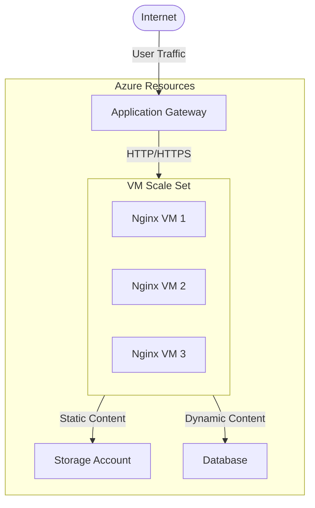

# Nginx Azure Deployment

## Introduction

Deploying Nginx on Microsoft Azure provides a powerful combination of a high-performance web server with the scalability and reliability of cloud infrastructure. This guide will walk you through the process of deploying Nginx on Azure, from creating the virtual machine to configuring it for optimal performance and security.

Nginx (pronounced "engine-x") is a popular web server known for its high performance, stability, load balancing capabilities, and low resource consumption. Microsoft Azure is a comprehensive cloud platform offering services such as virtual machines, databases, and content delivery networks. Combining these technologies allows you to build robust, scalable web applications.

## Prerequisites

Before you begin, ensure you have:

- An active Microsoft Azure account
- Basic knowledge of Linux commands
- Familiarity with web servers and HTTP concepts
- Azure CLI installed (optional, for command-line deployment)

## Setting Up Nginx on Azure

### Step 1: Create an Azure Virtual Machine

First, we need to create a virtual machine in Azure that will host our Nginx server.

#### Using Azure Portal

1. Log in to the [Azure Portal](https://portal.azure.com)
2. Click on "Create a resource"
3. Search for "Ubuntu Server" and select it
4. Click "Create"
5. Fill in the basic configuration:

```
Resource Group: nginx-demo-group
Virtual Machine Name: nginx-web-server
Region: (Select your nearest region)
Image: Ubuntu Server 22.04 LTS
Size: Standard_B2s (2vCPUs, 4GiB memory)
Authentication type: SSH public key
Username: azureuser
```

6. Configure networking:
   - Create a new Virtual Network or use an existing one
   - Allow inbound ports: SSH (22), HTTP (80), HTTPS (443)

7. Review + create
   - Verify your settings and click "Create"

#### Using Azure CLI

You can also create the VM using the Azure CLI with the following commands:

```bash
# Create a resource group
az group create --name nginx-demo-group --location eastus

# Create the VM with Ubuntu and open necessary ports
az vm create \
  --resource-group nginx-demo-group \
  --name nginx-web-server \
  --image UbuntuLTS \
  --admin-username azureuser \
  --generate-ssh-keys \
  --size Standard_B2s

# Open ports 80 and 443 for web traffic
az vm open-port \
  --resource-group nginx-demo-group \
  --name nginx-web-server \
  --port 80,443
```

### Step 2: Connect to Your VM

Once your VM is created, you can connect to it using SSH:

```bash
ssh azureuser@<your-vm-public-ip>
```

Replace `<your-vm-public-ip>` with the public IP address of your VM, which you can find on the VM overview page in the Azure portal.

### Step 3: Install Nginx

Once connected to your VM, update the package lists and install Nginx:

```bash
# Update package lists
sudo apt update

# Install Nginx
sudo apt install nginx -y

# Start Nginx and enable it to start on boot
sudo systemctl start nginx
sudo systemctl enable nginx
```

### Step 4: Verify Installation

Check that Nginx is running properly:

```bash
sudo systemctl status nginx
```

The output should indicate that Nginx is active (running). You can also test it by visiting your VM's public IP address in a web browser. You should see the default Nginx welcome page.

```bash
# Output example
● nginx.service - A high performance web server and a reverse proxy server
     Loaded: loaded (/lib/systemd/system/nginx.service; enabled; vendor preset: enabled)
     Active: active (running) since Tue 2023-01-10 12:34:56 UTC; 5s ago
       Docs: man:nginx(8)
   Main PID: 12345 (nginx)
      Tasks: 2 (limit: 4915)
     Memory: 3.9M
        CPU: 40ms
     CGroup: /system.slice/nginx.service
             ├─12345 "nginx: master process /usr/sbin/nginx -g daemon on; master_process on;"
             └─12346 "nginx: worker process"
```

## Basic Nginx Configuration on Azure

Now that Nginx is installed, let's look at some basic configurations.

### Understanding Nginx Configuration Files

The main Nginx configuration files are located in `/etc/nginx/`:

- `/etc/nginx/nginx.conf` - The main configuration file
- `/etc/nginx/sites-available/` - Directory containing available site configurations
- `/etc/nginx/sites-enabled/` - Directory containing enabled site configurations (symlinks to sites-available)
- `/etc/nginx/conf.d/` - Additional configuration files

### Creating a Basic Website

Let's create a simple website:

1. Create a new directory for your website:

```bash
sudo mkdir -p /var/www/mywebsite
```

2. Create a sample HTML file:

```bash
sudo bash -c 'cat > /var/www/mywebsite/index.html << EOL
<!DOCTYPE html>
<html>
<head>
    <title>Welcome to My Azure Nginx Website</title>
    <style>
        body {
            width: 35em;
            margin: 0 auto;
            font-family: Tahoma, Verdana, Arial, sans-serif;
        }
    </style>
</head>
<body>
    <h1>Success! Nginx is running on Azure!</h1>
    <p>If you see this page, you have successfully deployed Nginx on Microsoft Azure.</p>
</body>
</html>
EOL'
```

3. Create a new server block configuration:

```bash
sudo bash -c 'cat > /etc/nginx/sites-available/mywebsite << EOL
server {
    listen 80;
    server_name _;

    root /var/www/mywebsite;
    index index.html index.htm;

    location / {
        try_files \$uri \$uri/ =404;
    }
}
EOL'
```

4. Enable the site by creating a symlink:

```bash
sudo ln -s /etc/nginx/sites-available/mywebsite /etc/nginx/sites-enabled/
```

5. Remove the default symbolic link (optional):

```bash
sudo rm /etc/nginx/sites-enabled/default
```

6. Test the configuration and reload Nginx:

```bash
sudo nginx -t
sudo systemctl reload nginx
```

Now, when you visit your VM's IP address, you should see your custom webpage instead of the default Nginx page.

## Advanced Configurations

### Setting Up SSL with Let's Encrypt

To secure your website with HTTPS:

1. Install Certbot (Let's Encrypt client):

```bash
sudo apt install certbot python3-certbot-nginx -y
```

2. Obtain and install an SSL certificate:

```bash
sudo certbot --nginx -d yourdomain.com -d www.yourdomain.com
```

Replace `yourdomain.com` with your actual domain name. Note that you'll need to have your domain's DNS records pointing to your Azure VM's IP address for this to work.

3. Certbot will automatically update your Nginx configuration to use the new certificate. Test your configuration:

```bash
sudo nginx -t
sudo systemctl reload nginx
```

### Setting Up Load Balancing

Nginx can be configured as a load balancer to distribute traffic among multiple backend servers:

```bash
sudo bash -c 'cat > /etc/nginx/conf.d/load-balancer.conf << EOL
upstream backend {
    server backend1.example.com;
    server backend2.example.com;
    server backend3.example.com;
}

server {
    listen 80;
    server_name loadbalancer.example.com;

    location / {
        proxy_pass http://backend;
        proxy_set_header Host \$host;
        proxy_set_header X-Real-IP \$remote_addr;
        proxy_set_header X-Forwarded-For \$proxy_add_x_forwarded_for;
        proxy_set_header X-Forwarded-Proto \$scheme;
    }
}
EOL'
```

Remember to replace `backend1.example.com`, etc., with your actual backend server addresses.

## Scaling Your Nginx Deployment on Azure

Azure provides several options for scaling your Nginx deployment:

### Using Azure Virtual Machine Scale Sets

VM Scale Sets allow you to create and manage a group of identical, load-balanced VMs:

1. In the Azure portal, go to "Create a resource" and search for "Virtual Machine Scale Set"
2. Configure your scale set with:
   - Ubuntu Server as the base image
   - A custom script extension to install and configure Nginx
   - Load balancing rules for HTTP/HTTPS traffic
   - Autoscaling rules based on CPU usage or other metrics

### Using Azure Application Gateway

For more advanced load balancing:

1. Create an Application Gateway in the Azure portal
2. Configure it with backend pools pointing to your Nginx servers
3. Set up HTTP settings, listeners, and rules
4. Optionally, configure Web Application Firewall (WAF) for additional security

### Architecture Diagram

Here's a visualization of a scalable Nginx deployment on Azure:



## Performance Tuning for Nginx on Azure

### Optimizing Nginx Worker Processes

Edit `/etc/nginx/nginx.conf` to optimize worker processes:

```bash
sudo bash -c 'cat > /etc/nginx/nginx.conf << EOL
user www-data;
worker_processes auto;
pid /run/nginx.pid;
include /etc/nginx/modules-enabled/*.conf;

events {
    worker_connections 1024;
    multi_accept on;
}

http {
    # Basic settings
    sendfile on;
    tcp_nopush on;
    tcp_nodelay on;
    keepalive_timeout 65;
    types_hash_max_size 2048;

    # Gzip settings
    gzip on;
    gzip_disable "msie6";
    gzip_vary on;
    gzip_proxied any;
    gzip_comp_level 6;
    gzip_buffers 16 8k;
    gzip_http_version 1.1;
    gzip_types text/plain text/css application/json application/javascript text/xml application/xml application/xml+rss text/javascript;

    # Virtual Host Configs
    include /etc/nginx/conf.d/*.conf;
    include /etc/nginx/sites-enabled/*;
}
EOL'
```

### Configuring Azure VM for Better Performance

Ensure your Azure VM is properly sized:

1. Monitor your VM's performance using Azure Monitor
2. Resize the VM if necessary based on CPU, memory, and network usage
3. Consider using Azure premium storage for better I/O performance

## Security Best Practices

### Configuring a Firewall

Use Azure Network Security Groups (NSGs) to control traffic:

1. In the Azure portal, navigate to your VM
2. Click on "Networking"
3. Configure inbound security rules to:
   - Allow HTTP (port 80) and HTTPS (port 443)
   - Allow SSH (port 22) only from trusted IP addresses
   - Deny all other inbound traffic

### Hardening Nginx Configuration

Update your Nginx configuration to enhance security:

```bash
sudo bash -c 'cat > /etc/nginx/conf.d/security.conf << EOL
# Hide nginx version information
server_tokens off;

# Configure SSL/TLS
ssl_protocols TLSv1.2 TLSv1.3;
ssl_prefer_server_ciphers on;
ssl_ciphers "EECDH+AESGCM:EDH+AESGCM:AES256+EECDH:AES256+EDH";
ssl_session_cache shared:SSL:10m;
ssl_session_timeout 10m;

# Add security headers
add_header X-Frame-Options SAMEORIGIN;
add_header X-Content-Type-Options nosniff;
add_header X-XSS-Protection "1; mode=block";
add_header Content-Security-Policy "default-src 'self'";
add_header Strict-Transport-Security "max-age=31536000; includeSubDomains" always;
EOL'
```

After making these changes, test and reload Nginx:

```bash
sudo nginx -t
sudo systemctl reload nginx
```

## Monitoring and Logging

### Configuring Azure Monitor

1. In the Azure portal, navigate to your VM
2. Click on "Monitoring" and then "Metrics"
3. Create custom dashboards to monitor:
   - CPU usage
   - Memory usage
   - Network traffic
   - Disk I/O

### Configuring Nginx Logging

Enhance Nginx logging for better insights:

```bash
sudo bash -c 'cat > /etc/nginx/conf.d/logging.conf << EOL
log_format detailed '\$remote_addr - \$remote_user [\$time_local] '
                    '"\$request" \$status \$body_bytes_sent '
                    '"\$http_referer" "\$http_user_agent" '
                    '\$request_time \$upstream_response_time \$pipe';

access_log /var/log/nginx/access.log detailed;
error_log /var/log/nginx/error.log warn;
EOL'
```

### Setting Up Log Analytics

To analyze Nginx logs in Azure:

1. Create a Log Analytics Workspace in Azure
2. Install the Azure Log Analytics agent on your VM
3. Configure the agent to collect Nginx logs
4. Create custom queries to analyze traffic patterns and identify issues

## Common Issues and Troubleshooting

### Connectivity Issues

If you can't connect to your Nginx server:

1. Verify that Nginx is running:
   ```bash
   sudo systemctl status nginx
   ```

2. Check that ports are open in Azure NSG:
   ```bash
   az network nsg rule show --resource-group nginx-demo-group --nsg-name nginx-web-server-nsg --name default-allow-http
   ```

3. Verify that your VM's public IP hasn't changed

### Configuration Errors

If you encounter configuration errors:

1. Test your Nginx configuration:
   ```bash
   sudo nginx -t
   ```

2. Check Nginx error logs:
   ```bash
   sudo tail -f /var/log/nginx/error.log
   ```

3. Verify file permissions:
   ```bash
   sudo ls -la /etc/nginx/sites-available/
   sudo ls -la /var/www/mywebsite/
   ```

## Real-World Application: A Complete Example

Let's put everything together to deploy a scalable, secure web application:

### Scenario: Deploying a WordPress Site on Azure with Nginx

1. Create an Azure VM Scale Set with Ubuntu
2. Install Nginx, PHP, and MySQL on each VM
3. Configure Nginx as a reverse proxy for PHP-FPM
4. Set up SSL with Let's Encrypt
5. Configure Azure Application Gateway for load balancing and WAF
6. Implement Azure Backup for data protection

#### Nginx Configuration for WordPress

```bash
sudo bash -c 'cat > /etc/nginx/sites-available/wordpress << EOL
server {
    listen 80;
    server_name yourdomain.com www.yourdomain.com;
    return 301 https://\$host\$request_uri;
}

server {
    listen 443 ssl;
    server_name yourdomain.com www.yourdomain.com;

    ssl_certificate /etc/letsencrypt/live/yourdomain.com/fullchain.pem;
    ssl_certificate_key /etc/letsencrypt/live/yourdomain.com/privkey.pem;
    
    root /var/www/wordpress;
    index index.php index.html;

    location / {
        try_files \$uri \$uri/ /index.php?\$args;
    }

    location ~ \.php$ {
        include snippets/fastcgi-php.conf;
        fastcgi_pass unix:/run/php/php8.1-fpm.sock;
    }

    location ~* \.(js|css|png|jpg|jpeg|gif|ico)$ {
        expires max;
        log_not_found off;
    }
}
EOL'
```

## Summary

In this guide, we've covered how to deploy and configure Nginx on Microsoft Azure. We've explored:

- Creating an Azure VM and installing Nginx
- Basic and advanced Nginx configurations
- Securing your deployment with SSL and proper firewall settings
- Scaling options including VM Scale Sets and Application Gateway
- Performance tuning and monitoring
- Troubleshooting common issues
- A real-world example of deploying WordPress with Nginx on Azure

By following these steps, you can create a robust, scalable, and secure web hosting environment on Azure using Nginx.

## Additional Resources

- [Nginx Official Documentation](https://nginx.org/en/docs/)
- [Microsoft Azure Documentation](https://docs.microsoft.com/en-us/azure/)
- [Let's Encrypt Documentation](https://letsencrypt.org/docs/)

## Practice Exercises

1. Deploy Nginx on an Azure VM and create a simple website
2. Configure a second VM and set up Nginx as a load balancer between the two
3. Secure your deployment with Let's Encrypt SSL certificates
4. Implement a caching strategy for static content
5. Set up monitoring and create a dashboard in Azure to track your Nginx server's performance