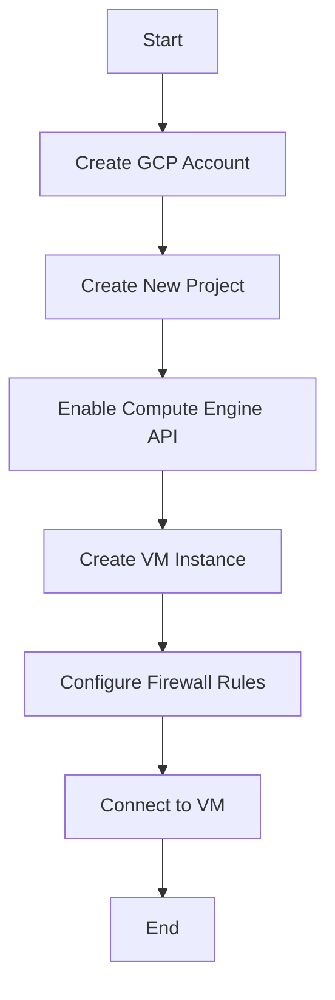

# Nginx GCP Deployment

## Introduction

Deploying Nginx on Google Cloud Platform (GCP) allows you to leverage the reliability, scalability, and security features of GCP while using one of the most popular web servers available. Nginx (pronounced "engine-x") is known for its high performance, stability, and rich feature set, making it an excellent choice for serving web content, reverse proxying, load balancing, and more.

In this tutorial, we'll walk through the process of deploying Nginx on GCP, from creating a virtual machine instance to configuring your Nginx server for production use. This guide is designed for beginners who are familiar with basic web concepts but may be new to cloud deployment.

## Prerequisites

Before we begin, you should have:

- A Google Cloud Platform account
- Basic knowledge of Linux commands
- Familiarity with web servers and HTTP concepts
- Google Cloud SDK installed (optional but recommended)

## Step 1: Creating a GCP Virtual Machine Instance

Let's start by creating a virtual machine (VM) instance on GCP where we'll install Nginx.

1. Navigate to the [Google Cloud Console](https://console.cloud.google.com/)
2. Create or select a project
3. Go to "Compute Engine" > "VM instances"
4. Click "Create Instance"

Configure your instance with these recommended settings:

- **Name**: nginx-server
- **Region/Zone**: Choose one close to your target audience
- **Machine Type**: e2-small (2 vCPU, 2 GB memory) is sufficient for starting
- **Boot Disk**: Ubuntu 20.04 LTS
- **Firewall**: Allow HTTP and HTTPS traffic

Click "Create" to provision your VM. This might take a minute or two.



## Step 2: Connecting to Your VM Instance

Once your VM is running, you can connect to it using SSH:

1. In the VM instances list, click the "SSH" button next to your instance
2. This will open a browser-based SSH terminal

Alternatively, if you have the Google Cloud SDK installed, you can use this command:

```bash
gcloud compute ssh nginx-server --project=your-project-id
```

## Step 3: Installing Nginx

Now that we're connected to our VM, let's install Nginx:

```bash
# Update package lists
sudo apt update

# Install Nginx
sudo apt install nginx -y

# Start Nginx service
sudo systemctl start nginx

# Enable Nginx to start on boot
sudo systemctl enable nginx
```

Let's check if Nginx is running correctly:

```bash
sudo systemctl status nginx
```

You should see output indicating that Nginx is active and running:

```
● nginx.service - A high performance web server and a reverse proxy server
     Loaded: loaded (/lib/systemd/system/nginx.service; enabled; vendor preset: enabled)
     Active: active (running) since Mon 2023-01-01 12:00:00 UTC; 10s ago
       Docs: man:nginx(8)
   Main PID: 12345 (nginx)
      Tasks: 2 (limit: 4915)
     Memory: 5.5M
     CGroup: /system.slice/nginx.service
             ├─12345 nginx: master process /usr/sbin/nginx -g daemon on; master_process on;
             └─12346 nginx: worker process
```

## Step 4: Testing Your Nginx Installation

At this point, Nginx should be installed and running. You can verify this by:

1. Finding your VM's external IP address in the VM instances list
2. Opening a web browser and navigating to `http://YOUR_EXTERNAL_IP`

You should see the default Nginx welcome page, which confirms that Nginx is running correctly.

## Step 5: Configuring Nginx

Now let's configure Nginx for a basic website. First, let's create a simple HTML file:

```bash
# Create a directory for our website
sudo mkdir -p /var/www/mysite

# Create an index.html file
sudo nano /var/www/mysite/index.html
```

Add the following HTML content:

```html
<!DOCTYPE html>
<html>
<head>
    <title>My GCP Nginx Website</title>
    <style>
        body {
            font-family: Arial, sans-serif;
            margin: 40px;
            line-height: 1.6;
        }
        h1 {
            color: #0F9D58;
        }
    </style>
</head>
<body>
    <h1>Welcome to My GCP Nginx Website!</h1>
    <p>This site is hosted on Google Cloud Platform using Nginx.</p>
    <p>Current time on the server: <strong><?php echo date('Y-m-d H:i:s'); ?></strong></p>
</body>
</html>
```

Save and exit the editor (Ctrl+X, then Y, then Enter in nano).

Next, let's create an Nginx server block configuration:

```bash
# Create a new server block configuration
sudo nano /etc/nginx/sites-available/mysite
```

Add the following configuration:

```nginx
server {
    listen 80;
    listen [::]:80;
    
    root /var/www/mysite;
    index index.html index.htm index.nginx-debian.html;
    
    server_name _;  # Matches any hostname
    
    location / {
        try_files $uri $uri/ =404;
    }
}
```

Save and exit. Now, let's enable this configuration:

```bash
# Create a symbolic link to enable the site
sudo ln -s /etc/nginx/sites-available/mysite /etc/nginx/sites-enabled/

# Test Nginx configuration for syntax errors
sudo nginx -t
```

If the test is successful, restart Nginx:

```bash
sudo systemctl restart nginx
```

Now, visiting your VM's external IP address should display your custom webpage instead of the default Nginx page.

## Step 6: Securing Your Nginx Server

Security is crucial for any web server. Let's implement some basic security configurations:

### 6.1 Install and Configure a Firewall

```bash
# Install UFW (Uncomplicated Firewall)
sudo apt install ufw -y

# Allow SSH, HTTP, and HTTPS
sudo ufw allow ssh
sudo ufw allow 'Nginx Full'

# Enable the firewall
sudo ufw enable
```

### 6.2 Securing Nginx Configuration

Let's edit the main Nginx configuration file to improve security:

```bash
sudo nano /etc/nginx/nginx.conf
```

Find the `http` block and add these lines:

```nginx
http {
    # Existing configuration...
    
    # Hide Nginx version information
    server_tokens off;
    
    # Configure SSL protocols and ciphers
    ssl_protocols TLSv1.2 TLSv1.3;
    ssl_prefer_server_ciphers on;
    ssl_ciphers 'ECDHE-ECDSA-AES128-GCM-SHA256:ECDHE-RSA-AES128-GCM-SHA256:ECDHE-ECDSA-AES256-GCM-SHA384:ECDHE-RSA-AES256-GCM-SHA384';
    
    # Add security headers
    add_header X-Content-Type-Options nosniff;
    add_header X-Frame-Options SAMEORIGIN;
    add_header X-XSS-Protection "1; mode=block";
    
    # Configure timeouts
    client_body_timeout 10;
    client_header_timeout 10;
    keepalive_timeout 5 5;
    send_timeout 10;
}
```

Save and test the configuration:

```bash
sudo nginx -t
sudo systemctl restart nginx
```

## Step 7: Setting Up HTTPS with Let's Encrypt

To secure your website with HTTPS, we'll use Let's Encrypt to obtain a free SSL certificate:

```bash
# Install Certbot
sudo apt install certbot python3-certbot-nginx -y
```

Before running Certbot, you'll need a domain name pointing to your VM's IP address. Once you have this set up, update your Nginx configuration to include the domain name:

```bash
sudo nano /etc/nginx/sites-available/mysite
```

Change the `server_name` line to include your domain:

```nginx
server_name yourdomain.com www.yourdomain.com;
```

Save, test, and restart Nginx:

```bash
sudo nginx -t
sudo systemctl restart nginx
```

Now, run Certbot to obtain and configure your SSL certificate:

```bash
sudo certbot --nginx -d yourdomain.com -d www.yourdomain.com
```

Follow the prompts to complete the setup. Certbot will automatically update your Nginx configuration to redirect HTTP to HTTPS and use the SSL certificate.

## Step 8: Performance Optimization

Let's optimize Nginx for better performance:

```bash
sudo nano /etc/nginx/nginx.conf
```

Add or modify these settings in the appropriate blocks:

```nginx
http {
    # Existing configuration...
    
    # Enable Gzip compression
    gzip on;
    gzip_vary on;
    gzip_proxied any;
    gzip_comp_level 6;
    gzip_types text/plain text/css text/xml application/json application/javascript application/xml+rss application/atom+xml image/svg+xml;
    
    # Configure worker processes
    worker_processes auto;
    
    # File cache settings
    open_file_cache max=1000 inactive=20s;
    open_file_cache_valid 30s;
    open_file_cache_min_uses 2;
    open_file_cache_errors on;
}
```

Save, test, and restart Nginx:

```bash
sudo nginx -t
sudo systemctl restart nginx
```

## Step 9: Setting Up Logging and Monitoring

Proper logging is essential for monitoring and troubleshooting:

```bash
sudo nano /etc/nginx/nginx.conf
```

Add or modify the following in the appropriate blocks:

```nginx
http {
    # Existing configuration...
    
    # Define log formats
    log_format detailed '$remote_addr - $remote_user [$time_local] '
                       '"$request" $status $body_bytes_sent '
                       '"$http_referer" "$http_user_agent" '
                       '$request_time $upstream_response_time $pipe';
    
    # Access log location and format
    access_log /var/log/nginx/access.log detailed;
    
    # Error log location and level
    error_log /var/log/nginx/error.log error;
}
```

Now update your server block to use these log settings:

```bash
sudo nano /etc/nginx/sites-available/mysite
```

Add these lines inside your server block:

```nginx
server {
    # Existing configuration...
    
    # Custom log files for this site
    access_log /var/log/nginx/mysite-access.log detailed;
    error_log /var/log/nginx/mysite-error.log error;
}
```

Save, test, and restart Nginx:

```bash
sudo nginx -t
sudo systemctl restart nginx
```

To view logs:

```bash
# View access logs
sudo tail -f /var/log/nginx/mysite-access.log

# View error logs
sudo tail -f /var/log/nginx/mysite-error.log
```

## Step 10: Setting Up Auto-Scaling on GCP (Advanced)

For high-traffic websites, you might want to set up auto-scaling. This is an advanced topic, but here's a brief overview of the process:

1. Create an instance template:
   - Go to "Compute Engine" > "Instance templates"
   - Create a template based on your current Nginx setup

2. Create a managed instance group:
   - Go to "Compute Engine" > "Instance groups"
   - Create a new managed instance group using your template
   - Configure auto-scaling parameters based on CPU usage or other metrics

3. Set up a load balancer:
   - Go to "Network Services" > "Load balancing"
   - Create an HTTP(S) load balancer
   - Point it to your managed instance group

This setup will automatically scale your Nginx instances based on traffic demands.

## Summary

In this tutorial, we've covered:

1. Creating a VM instance on Google Cloud Platform
2. Installing and configuring Nginx
3. Setting up a basic website
4. Securing the server with UFW and HTTPS
5. Optimizing Nginx for performance
6. Configuring logging and monitoring
7. Introduction to auto-scaling (advanced)

By following these steps, you've successfully deployed Nginx on GCP and configured it for production use. You now have a solid foundation for hosting websites, serving APIs, or acting as a reverse proxy for your applications.

## Next Steps and Additional Resources

To further enhance your Nginx on GCP setup, consider exploring:

- **Load balancing**: Configure Nginx as a load balancer for multiple application servers
- **Reverse proxying**: Set up Nginx to serve as a reverse proxy for Node.js, Python, or other application servers
- **Content caching**: Configure Nginx's caching capabilities to improve performance
- **GCP Cloud CDN**: Integrate with Google's Content Delivery Network for even better performance

### Exercises for Practice

1. Set up Nginx to serve multiple websites using server blocks
2. Configure Nginx as a reverse proxy for a simple Node.js application
3. Implement rate limiting to protect your website from potential DDoS attacks
4. Set up a staging environment alongside your production environment

### Useful Resources

- [Official Nginx Documentation](https://nginx.org/en/docs/)
- [Google Cloud Platform Documentation](https://cloud.google.com/docs)
- [Nginx Cookbook](https://www.nginx.com/resources/library/complete-nginx-cookbook/)
- [Let's Encrypt Documentation](https://letsencrypt.org/docs/)

With these resources and your new knowledge, you're well on your way to becoming proficient in deploying and managing Nginx on Google Cloud Platform!