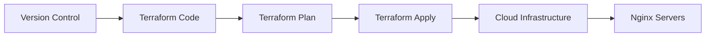
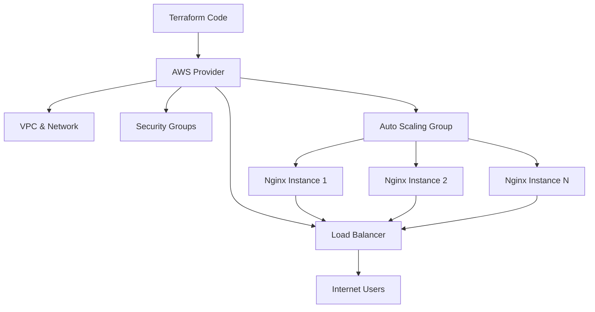

# Nginx Terraform Automation

## Introduction

Deploying and managing Nginx servers in cloud environments can be a complex and time-consuming task, especially when you need to ensure consistency across multiple environments or scale your infrastructure. This is where Terraform comes in - a powerful Infrastructure as Code (IaC) tool that allows you to define, provision, and manage cloud resources using declarative configuration files.

In this tutorial, we'll explore how to automate Nginx deployments in the cloud using Terraform. By the end, you'll understand how to:

- Define Nginx infrastructure as code
- Provision cloud resources for Nginx
- Automate configuration management
- Implement scalable and repeatable deployments

## Prerequisites

Before we dive in, you should have:

- Basic understanding of Nginx web server
- Familiarity with cloud concepts (we'll use AWS in our examples)
- Terraform installed on your local machine
- AWS CLI configured with appropriate credentials
- Basic knowledge of YAML and HCL (HashiCorp Configuration Language)

## Understanding Infrastructure as Code

Infrastructure as Code (IaC) is an approach where you manage your infrastructure using configuration files rather than manual processes. Terraform allows you to write declarative configurations that describe your desired infrastructure state.



## Setting Up Your Terraform Project

Let's create a basic project structure for our Nginx Terraform automation:

```
nginx-terraform/
├── main.tf         # Main Terraform configuration
├── variables.tf    # Input variables
├── outputs.tf      # Output values
├── providers.tf    # Provider configuration
└── files/
    └── nginx.conf  # Nginx configuration template
```

### Defining the Provider

First, let's set up our AWS provider in `providers.tf`:

```hcl
terraform {
  required_providers {
    aws = {
      source  = "hashicorp/aws"
      version = "~> 4.0"
    }
  }
}

provider "aws" {
  region = var.aws_region
}
```

### Defining Variables

In `variables.tf`, we'll define the variables we need:

```hcl
variable "aws_region" {
  description = "AWS region to deploy resources"
  type        = string
  default     = "us-west-2"
}

variable "instance_type" {
  description = "EC2 instance type for Nginx server"
  type        = string
  default     = "t2.micro"
}

variable "vpc_id" {
  description = "VPC ID where Nginx will be deployed"
  type        = string
}

variable "subnet_ids" {
  description = "Subnet IDs for Nginx deployment"
  type        = list(string)
}

variable "nginx_count" {
  description = "Number of Nginx servers to deploy"
  type        = number
  default     = 2
}

variable "nginx_port" {
  description = "Port on which Nginx will listen"
  type        = number
  default     = 80
}
```

## Creating Nginx Infrastructure

Now, let's define our Nginx infrastructure in `main.tf`:

```hcl
# Security Group for Nginx
resource "aws_security_group" "nginx_sg" {
  name        = "nginx-security-group"
  description = "Allow HTTP/HTTPS traffic"
  vpc_id      = var.vpc_id

  ingress {
    from_port   = var.nginx_port
    to_port     = var.nginx_port
    protocol    = "tcp"
    cidr_blocks = ["0.0.0.0/0"]
    description = "HTTP"
  }

  ingress {
    from_port   = 443
    to_port     = 443
    protocol    = "tcp"
    cidr_blocks = ["0.0.0.0/0"]
    description = "HTTPS"
  }

  ingress {
    from_port   = 22
    to_port     = 22
    protocol    = "tcp"
    cidr_blocks = ["0.0.0.0/0"]
    description = "SSH"
  }

  egress {
    from_port   = 0
    to_port     = 0
    protocol    = "-1"
    cidr_blocks = ["0.0.0.0/0"]
  }

  tags = {
    Name = "nginx-sg"
  }
}

# Fetch latest Amazon Linux 2 AMI
data "aws_ami" "amazon_linux" {
  most_recent = true
  owners      = ["amazon"]

  filter {
    name   = "name"
    values = ["amzn2-ami-hvm-*-x86_64-gp2"]
  }
}

# EC2 Instance for Nginx
resource "aws_instance" "nginx" {
  count         = var.nginx_count
  ami           = data.aws_ami.amazon_linux.id
  instance_type = var.instance_type
  subnet_id     = element(var.subnet_ids, count.index % length(var.subnet_ids))

  vpc_security_group_ids = [aws_security_group.nginx_sg.id]
  
  user_data = <<-EOF
              #!/bin/bash
              amazon-linux-extras install nginx1 -y
              systemctl start nginx
              systemctl enable nginx
              
              # Basic Nginx configuration
              cat > /etc/nginx/nginx.conf <<'NGINX_CONF'
              user nginx;
              worker_processes auto;
              error_log /var/log/nginx/error.log;
              pid /run/nginx.pid;

              events {
                worker_connections 1024;
              }

              http {
                include             /etc/nginx/mime.types;
                default_type        application/octet-stream;
                log_format  main    '$remote_addr - $remote_user [$time_local] "$request" '
                                    '$status $body_bytes_sent "$http_referer" '
                                    '"$http_user_agent" "$http_x_forwarded_for"';
                access_log          /var/log/nginx/access.log  main;
                sendfile            on;
                tcp_nopush          on;
                tcp_nodelay         on;
                keepalive_timeout   65;
                types_hash_max_size 4096;

                include /etc/nginx/conf.d/*.conf;

                server {
                  listen       80;
                  listen       [::]:80;
                  server_name  _;
                  root         /usr/share/nginx/html;

                  location / {
                    index index.html;
                  }
                }
              }
              NGINX_CONF

              # Create a custom index page
              cat > /usr/share/nginx/html/index.html <<HTML
              <!DOCTYPE html>
              <html>
              <head>
                <title>Welcome to Nginx</title>
                <style>
                  body {
                    width: 35em;
                    margin: 0 auto;
                    font-family: Tahoma, Verdana, Arial, sans-serif;
                  }
                </style>
              </head>
              <body>
                <h1>Welcome to Nginx!</h1>
                <p>This Nginx server was deployed using Terraform.</p>
                <p>Instance ID: $(curl -s http://169.254.169.254/latest/meta-data/instance-id)</p>
                <p>Availability Zone: $(curl -s http://169.254.169.254/latest/meta-data/placement/availability-zone)</p>
              </body>
              </html>
              HTML

              # Restart Nginx to apply configuration
              systemctl restart nginx
              EOF

  tags = {
    Name = "nginx-server-${count.index + 1}"
  }
}

# Create a load balancer for the Nginx instances
resource "aws_lb" "nginx_lb" {
  name               = "nginx-load-balancer"
  internal           = false
  load_balancer_type = "application"
  security_groups    = [aws_security_group.nginx_sg.id]
  subnets            = var.subnet_ids

  enable_deletion_protection = false

  tags = {
    Name = "nginx-lb"
  }
}

# Create a target group for the load balancer
resource "aws_lb_target_group" "nginx_tg" {
  name     = "nginx-target-group"
  port     = var.nginx_port
  protocol = "HTTP"
  vpc_id   = var.vpc_id
  
  health_check {
    enabled             = true
    interval            = 30
    path                = "/"
    port                = "traffic-port"
    healthy_threshold   = 3
    unhealthy_threshold = 3
    timeout             = 5
    protocol            = "HTTP"
  }
}

# Attach the Nginx instances to the target group
resource "aws_lb_target_group_attachment" "nginx_tg_attachment" {
  count            = var.nginx_count
  target_group_arn = aws_lb_target_group.nginx_tg.arn
  target_id        = aws_instance.nginx[count.index].id
  port             = var.nginx_port
}

# Create a listener for the load balancer
resource "aws_lb_listener" "nginx_listener" {
  load_balancer_arn = aws_lb.nginx_lb.arn
  port              = var.nginx_port
  protocol          = "HTTP"

  default_action {
    type             = "forward"
    target_group_arn = aws_lb_target_group.nginx_tg.arn
  }
}
```

### Defining Outputs

In `outputs.tf`, we'll define useful output values:

```hcl
output "nginx_instance_ids" {
  description = "IDs of the Nginx instances"
  value       = aws_instance.nginx[*].id
}

output "nginx_public_ips" {
  description = "Public IPs of the Nginx instances"
  value       = aws_instance.nginx[*].public_ip
}

output "nginx_load_balancer_dns" {
  description = "DNS name of the Nginx load balancer"
  value       = aws_lb.nginx_lb.dns_name
}
```

## Deploying the Infrastructure

Now that we have defined our infrastructure, let's deploy it:

1. Initialize Terraform:

```bash
terraform init
```

Output:
```
Initializing the backend...

Initializing provider plugins...
- Finding hashicorp/aws versions matching "~> 4.0"...
- Installing hashicorp/aws v4.67.0...
- Installed hashicorp/aws v4.67.0 (signed by HashiCorp)

Terraform has been successfully initialized!
```

2. Plan the deployment:

```bash
terraform plan -var="vpc_id=vpc-12345678" -var="subnet_ids=['subnet-12345678', 'subnet-87654321']"
```

Output:
```
Terraform will perform the following actions:

  # aws_instance.nginx[0] will be created
  # aws_instance.nginx[1] will be created
  # aws_lb.nginx_lb will be created
  # aws_lb_listener.nginx_listener will be created
  # aws_lb_target_group.nginx_tg will be created
  # aws_lb_target_group_attachment.nginx_tg_attachment[0] will be created
  # aws_lb_target_group_attachment.nginx_tg_attachment[1] will be created
  # aws_security_group.nginx_sg will be created

Plan: 8 to add, 0 to change, 0 to destroy.
```

3. Apply the changes:

```bash
terraform apply -var="vpc_id=vpc-12345678" -var="subnet_ids=['subnet-12345678', 'subnet-87654321']"
```

## Advanced Nginx Configurations with Terraform

Let's enhance our setup with more advanced configurations.

### Using Terraform Templates for Nginx Configuration

We can use Terraform's template feature to generate Nginx configurations:

```hcl
# In variables.tf, add:
variable "nginx_config" {
  description = "Nginx server configuration"
  type = object({
    worker_processes  = number
    worker_connections = number
  })
  default = {
    worker_processes  = 2
    worker_connections = 1024
  }
}

# In main.tf, modify the user_data section:
data "template_file" "nginx_config" {
  template = <<-EOF
  user nginx;
  worker_processes ${var.nginx_config.worker_processes};
  error_log /var/log/nginx/error.log;
  pid /run/nginx.pid;

  events {
    worker_connections ${var.nginx_config.worker_connections};
  }

  http {
    include             /etc/nginx/mime.types;
    default_type        application/octet-stream;
    log_format  main    '$remote_addr - $remote_user [$time_local] "$request" '
                        '$status $body_bytes_sent "$http_referer" '
                        '"$http_user_agent" "$http_x_forwarded_for"';
    access_log          /var/log/nginx/access.log  main;
    sendfile            on;
    tcp_nopush          on;
    tcp_nodelay         on;
    keepalive_timeout   65;
    types_hash_max_size 4096;
    
    # Include server configurations
    include /etc/nginx/conf.d/*.conf;
  }
  EOF
}

# Then in the user_data script, replace the nginx.conf with:
cat > /etc/nginx/nginx.conf <<'NGINX_CONF'
${data.template_file.nginx_config.rendered}
NGINX_CONF
```

### Creating Terraform Modules for Reusable Components

To make our Nginx deployment even more flexible and reusable, let's organize it into a Terraform module:

```
nginx-terraform-module/
├── main.tf
├── variables.tf
├── outputs.tf
├── README.md
└── examples/
    └── basic-nginx/
        ├── main.tf
        ├── variables.tf
        └── outputs.tf
```

In the module's `main.tf`, we would include all the resources we defined earlier. Then, in the example usage:

```hcl
module "nginx" {
  source = "../../"
  
  aws_region    = "us-west-2"
  vpc_id        = "vpc-12345678"
  subnet_ids    = ["subnet-12345678", "subnet-87654321"]
  nginx_count   = 2
  instance_type = "t2.small"
  
  nginx_config = {
    worker_processes  = 4
    worker_connections = 2048
  }
}

output "load_balancer_dns" {
  value = module.nginx.nginx_load_balancer_dns
}
```

## Scaling and Managing Nginx with Terraform

### Auto Scaling Nginx Servers

Instead of defining a fixed number of Nginx instances, we can use AWS Auto Scaling Groups:

```hcl
resource "aws_launch_configuration" "nginx_launch_config" {
  name_prefix     = "nginx-launch-config-"
  image_id        = data.aws_ami.amazon_linux.id
  instance_type   = var.instance_type
  security_groups = [aws_security_group.nginx_sg.id]
  
  user_data = <<-EOF
  #!/bin/bash
  amazon-linux-extras install nginx1 -y
  systemctl start nginx
  systemctl enable nginx
  # Rest of the configuration...
  EOF
  
  lifecycle {
    create_before_destroy = true
  }
}

resource "aws_autoscaling_group" "nginx_asg" {
  name                 = "nginx-asg"
  launch_configuration = aws_launch_configuration.nginx_launch_config.name
  min_size             = 2
  max_size             = 10
  desired_capacity     = 2
  vpc_zone_identifier  = var.subnet_ids
  
  target_group_arns    = [aws_lb_target_group.nginx_tg.arn]
  
  tag {
    key                 = "Name"
    value               = "nginx-server-asg"
    propagate_at_launch = true
  }
  
  lifecycle {
    create_before_destroy = true
  }
}

resource "aws_autoscaling_policy" "nginx_scaling_policy" {
  name                   = "nginx-scaling-policy"
  policy_type            = "TargetTrackingScaling"
  autoscaling_group_name = aws_autoscaling_group.nginx_asg.name
  
  target_tracking_configuration {
    predefined_metric_specification {
      predefined_metric_type = "ASGAverageCPUUtilization"
    }
    target_value = 70.0
  }
}
```

### Using Terraform Workspaces for Multiple Environments

Terraform workspaces allow you to manage multiple deployments with the same configuration:

```bash
# Create and switch to a development workspace
terraform workspace new dev
terraform apply -var-file=dev.tfvars

# Switch to production
terraform workspace new prod
terraform apply -var-file=prod.tfvars
```

In your configuration, you can use workspace-specific logic:

```hcl
locals {
  environment = terraform.workspace
  
  instance_count = {
    dev  = 1,
    test = 2,
    prod = 3
  }
  
  instance_type = {
    dev  = "t2.micro",
    test = "t2.small",
    prod = "t2.medium"
  }
}

# Then use these variables
resource "aws_instance" "nginx" {
  count         = local.instance_count[local.environment]
  instance_type = local.instance_type[local.environment]
  # ...
}
```

## Real-World Example: Complete Nginx Load Balancing Solution

Let's put everything together into a complete solution for deploying a load-balanced Nginx cluster in AWS:



Here's a simplified version of the complete solution:

```hcl
module "nginx_cluster" {
  source = "./modules/nginx-cluster"
  
  # VPC configuration
  vpc_id     = module.vpc.vpc_id
  subnet_ids = module.vpc.public_subnets
  
  # Load balancer configuration
  enable_https           = true
  certificate_arn        = aws_acm_certificate.cert.arn
  domain_name            = "example.com"
  
  # Nginx configuration
  nginx_config = {
    worker_processes   = 4
    worker_connections = 2048
    keepalive_timeout  = 65
    gzip_enabled       = true
  }
  
  # Auto scaling configuration
  min_instances     = 2
  max_instances     = 10
  desired_instances = 2
  
  # Instance configuration
  instance_type = "t2.small"
  
  # Tags
  tags = {
    Environment = terraform.workspace
    Project     = "nginx-deployment"
    Terraform   = "true"
  }
}
```

## Maintaining and Updating Nginx Infrastructure

One of the key benefits of using Terraform for Nginx deployment is the ability to easily update and maintain your infrastructure:

### Updating Nginx Configuration

To update your Nginx configuration:

1. Modify the configuration in your Terraform files
2. Run `terraform plan` to see the changes
3. Apply the changes with `terraform apply`

Terraform will handle the updates by replacing or modifying resources as needed.

### State Management

Terraform maintains a state file that tracks the resources it manages. For production environments, it's recommended to use remote state storage:

```hcl
terraform {
  backend "s3" {
    bucket = "my-terraform-state"
    key    = "nginx/terraform.tfstate"
    region = "us-west-2"
    dynamodb_table = "terraform-locks"
  }
}
```

This allows for team collaboration and safer state management.

## Best Practices for Nginx Terraform Automation

1. **Version Control**: Always keep your Terraform code in version control (Git)
2. **Module Organization**: Use modules for reusable components
3. **State Management**: Use remote state for production environments
4. **Variable Definitions**: Use `.tfvars` files for environment-specific variables
5. **Secrets Management**: Never hardcode sensitive information; use AWS Secrets Manager or environment variables
6. **Tagging Resources**: Tag all resources for better tracking and management
7. **Documentation**: Document your modules and configurations

## Troubleshooting Common Issues

### Instance Connectivity Issues

If you can't connect to your Nginx instances:

1. Check security group rules
2. Verify instance health status
3. Check Nginx service status with:
   ```bash
   terraform output nginx_public_ips
   ssh ec2-user@<IP_ADDRESS>
   sudo systemctl status nginx
   ```

### Load Balancer Health Check Failures

If your load balancer reports unhealthy instances:

1. Verify that Nginx is running on the instances
2. Check the health check path and port configuration
3. Check security group rules allow health check traffic
4. Review the Nginx access and error logs

## Summary

In this tutorial, we've learned how to:

1. Set up Terraform for Nginx deployments
2. Create infrastructure for Nginx servers in AWS
3. Configure load balancing and auto-scaling
4. Implement modular and reusable infrastructure code
5. Manage multiple environments using workspaces
6. Apply best practices for Terraform and Nginx

By automating your Nginx deployments with Terraform, you gain consistency, repeatability, and scalability for your web infrastructure.

## Additional Resources

- [Terraform Documentation](https://www.terraform.io/docs/index.html)
- [AWS Provider Documentation](https://registry.terraform.io/providers/hashicorp/aws/latest/docs)
- [Nginx Official Documentation](https://nginx.org/en/docs/)
- [Terraform Best Practices](https://www.terraform-best-practices.com/)

## Exercises

1. Extend the basic Nginx configuration to include HTTPS support with a self-signed certificate
2. Create a Terraform module that deploys Nginx with custom configurations for different environments
3. Add CloudWatch monitoring and alerting for your Nginx instances
4. Implement a blue/green deployment strategy for Nginx updates
5. Create a CI/CD pipeline that automatically applies Terraform changes when you push to your repository