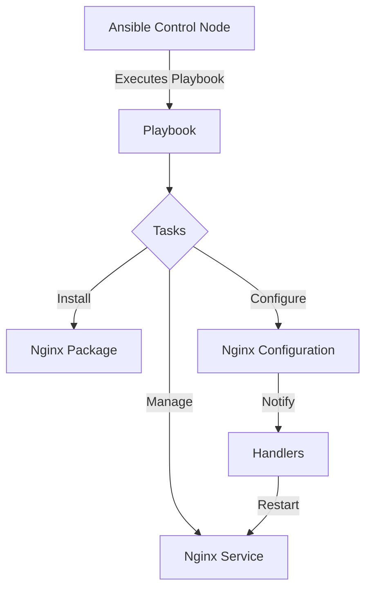

# Nginx Ansible Deployment

## Introduction

Deploying Nginx manually on multiple servers can be time-consuming and error-prone. Ansible, an open-source automation tool, provides a powerful solution to this challenge by allowing you to define your infrastructure as code and automate the deployment process. This guide will walk you through how to deploy Nginx using Ansible, making your infrastructure management more efficient, consistent, and scalable.

## Prerequisites

Before we begin, make sure you have:

- Basic knowledge of Linux commands
- Ansible installed on your control machine (version 2.9+)
- Target servers accessible via SSH
- Basic understanding of YAML syntax

## Understanding Ansible for Nginx Deployment

Ansible uses a declarative approach to define the desired state of your servers. For Nginx deployment, this means:

1. **Playbooks**: YAML files that define what tasks to execute on which hosts
2. **Roles**: Reusable collections of tasks for specific functions (like installing Nginx)
3. **Inventory**: A list of target servers organized into groups
4. **Handlers**: Tasks that only run when notified by other tasks (e.g., restarting Nginx after config changes)



## Setting Up Your Ansible Environment

### 1. Create Your Project Structure

Let's start by setting up a proper project structure:

```bash
mkdir -p nginx-ansible-deployment/roles/nginx/{tasks,handlers,templates,defaults}
cd nginx-ansible-deployment
touch inventory.ini ansible.cfg playbook.yml
touch roles/nginx/tasks/main.yml
touch roles/nginx/handlers/main.yml
touch roles/nginx/templates/nginx.conf.j2
touch roles/nginx/defaults/main.yml
```

### 2. Configure Ansible

Create basic configuration in `ansible.cfg`:

```ini
[defaults]
inventory = inventory.ini
host_key_checking = False
roles_path = ./roles
```

### 3. Define Your Inventory

Create your inventory file (`inventory.ini`) with your target servers:

```ini
[webservers]
web1 ansible_host=192.168.1.101
web2 ansible_host=192.168.1.102

[loadbalancers]
lb1 ansible_host=192.168.1.103

[all:vars]
ansible_user=ubuntu
ansible_ssh_private_key_file=~/.ssh/id_rsa
```

## Creating the Nginx Role

### 1. Define Default Variables

In `roles/nginx/defaults/main.yml`, set default values:

```yaml
---
# Nginx version and installation options
nginx_package_name: nginx
nginx_service_name: nginx
nginx_service_state: started
nginx_service_enabled: yes

# Configuration options
nginx_worker_processes: auto
nginx_worker_connections: 1024
nginx_keepalive_timeout: 65
nginx_client_max_body_size: 1m

# HTTP configuration
nginx_http_port: 80
nginx_https_port: 443
nginx_enable_https: false

# Directories
nginx_conf_dir: /etc/nginx
nginx_log_dir: /var/log/nginx

# Default website
nginx_default_site_enabled: yes
nginx_default_site_template: default.conf.j2
```

### 2. Create Tasks

In `roles/nginx/tasks/main.yml`, define installation and configuration tasks:

```yaml
---
# Install Nginx
- name: Install Nginx package
  apt:
    name: "{{ nginx_package_name }}"
    state: present
    update_cache: yes
  become: yes
  tags: 
    - nginx
    - install

# Ensure directories exist
- name: Ensure Nginx configuration directories exist
  file:
    path: "{{ item }}"
    state: directory
    owner: root
    group: root
    mode: 0755
  with_items:
    - "{{ nginx_conf_dir }}"
    - "{{ nginx_conf_dir }}/sites-available"
    - "{{ nginx_conf_dir }}/sites-enabled"
    - "{{ nginx_conf_dir }}/conf.d"
  become: yes
  tags:
    - nginx
    - configuration

# Configure Nginx main configuration
- name: Configure Nginx main configuration
  template:
    src: nginx.conf.j2
    dest: "{{ nginx_conf_dir }}/nginx.conf"
    owner: root
    group: root
    mode: 0644
  become: yes
  notify: restart nginx
  tags:
    - nginx
    - configuration

# Configure default site
- name: Configure default site
  template:
    src: "{{ nginx_default_site_template }}"
    dest: "{{ nginx_conf_dir }}/sites-available/default"
    owner: root
    group: root
    mode: 0644
  when: nginx_default_site_enabled
  become: yes
  notify: restart nginx
  tags:
    - nginx
    - configuration

# Enable default site
- name: Enable default site
  file:
    src: "{{ nginx_conf_dir }}/sites-available/default"
    dest: "{{ nginx_conf_dir }}/sites-enabled/default"
    state: link
  when: nginx_default_site_enabled
  become: yes
  notify: restart nginx
  tags:
    - nginx
    - configuration

# Start and enable Nginx service
- name: Ensure Nginx service is running and enabled
  service:
    name: "{{ nginx_service_name }}"
    state: "{{ nginx_service_state }}"
    enabled: "{{ nginx_service_enabled }}"
  become: yes
  tags:
    - nginx
    - service
```

### 3. Define Handlers

In `roles/nginx/handlers/main.yml`, create handlers for service management:

```yaml
---
- name: restart nginx
  service:
    name: "{{ nginx_service_name }}"
    state: restarted
  become: yes

- name: reload nginx
  service:
    name: "{{ nginx_service_name }}"
    state: reloaded
  become: yes
```

### 4. Create Templates

In `roles/nginx/templates/nginx.conf.j2`, create a Jinja2 template for the Nginx configuration:

```nginx
user www-data;
worker_processes {{ nginx_worker_processes }};
pid /run/nginx.pid;

events {
    worker_connections {{ nginx_worker_connections }};
    # multi_accept on;
}

http {
    # Basic Settings
    sendfile on;
    tcp_nopush on;
    tcp_nodelay on;
    keepalive_timeout {{ nginx_keepalive_timeout }};
    types_hash_max_size 2048;
    client_max_body_size {{ nginx_client_max_body_size }};

    include /etc/nginx/mime.types;
    default_type application/octet-stream;

    # Logging Settings
    access_log {{ nginx_log_dir }}/access.log;
    error_log {{ nginx_log_dir }}/error.log;

    # Gzip Settings
    gzip on;
    gzip_disable "msie6";

    # Virtual Host Configs
    include /etc/nginx/conf.d/*.conf;
    include /etc/nginx/sites-enabled/*;
}
```

Also, create a default site template (`roles/nginx/templates/default.conf.j2`):

```nginx
server {
    listen {{ nginx_http_port }} default_server;
    listen [::]:{{ nginx_http_port }} default_server;

    root /var/www/html;
    index index.html index.htm;

    server_name _;

    location / {
        try_files $uri $uri/ =404;
    }
}
```

## Creating Your Playbook

Now, let's create the main playbook to tie everything together. In `playbook.yml`:

```yaml
---
- name: Deploy Nginx to webservers
  hosts: webservers
  become: yes
  roles:
    - nginx

- name: Deploy Nginx as load balancer
  hosts: loadbalancers
  become: yes
  vars:
    nginx_default_site_template: loadbalancer.conf.j2
  roles:
    - nginx
  tasks:
    - name: Create load balancer configuration
      template:
        src: templates/loadbalancer.conf.j2
        dest: "{{ nginx_conf_dir }}/sites-available/loadbalancer"
        owner: root
        group: root
        mode: 0644
      notify: restart nginx

    - name: Enable load balancer configuration
      file:
        src: "{{ nginx_conf_dir }}/sites-available/loadbalancer"
        dest: "{{ nginx_conf_dir }}/sites-enabled/loadbalancer"
        state: link
      notify: restart nginx
```

Create a load balancer configuration template (`templates/loadbalancer.conf.j2`):

```nginx
upstream backend {

    server {{ hostvars[host]['ansible_host'] }}:{{ nginx_http_port }};

}

server {
    listen {{ nginx_http_port }};
    server_name _;

    location / {
        proxy_pass http://backend;
        proxy_set_header Host $host;
        proxy_set_header X-Real-IP $remote_addr;
        proxy_set_header X-Forwarded-For $proxy_add_x_forwarded_for;
        proxy_set_header X-Forwarded-Proto $scheme;
    }
}
```

## Running Your Ansible Deployment

Now you're ready to deploy Nginx using Ansible:

```bash
# Check syntax
ansible-playbook playbook.yml --syntax-check

# Dry run to see what changes would be made
ansible-playbook playbook.yml --check

# Run the actual deployment
ansible-playbook playbook.yml
```

### Example Output

```
PLAY [Deploy Nginx to webservers] ********************************************

TASK [Gathering Facts] *******************************************************
ok: [web1]
ok: [web2]

TASK [nginx : Install Nginx package] *****************************************
changed: [web1]
changed: [web2]

TASK [nginx : Ensure Nginx configuration directories exist] ******************
ok: [web1] => (item=/etc/nginx)
ok: [web2] => (item=/etc/nginx)
...

TASK [nginx : Configure Nginx main configuration] ****************************
changed: [web1]
changed: [web2]

TASK [nginx : Configure default site] ****************************************
changed: [web1]
changed: [web2]

TASK [nginx : Enable default site] *******************************************
ok: [web1]
ok: [web2]

TASK [nginx : Ensure Nginx service is running and enabled] ******************
changed: [web1]
changed: [web2]

RUNNING HANDLER [nginx : restart nginx] *************************************
changed: [web1]
changed: [web2]

PLAY [Deploy Nginx as load balancer] ****************************************
...

PLAY RECAP *****************************************************************
web1         : ok=7    changed=5    unreachable=0    failed=0    skipped=0
web2         : ok=7    changed=5    unreachable=0    failed=0    skipped=0
lb1          : ok=9    changed=7    unreachable=0    failed=0    skipped=0
```

## Advanced Configurations

### Custom Nginx Configurations

To add custom Nginx configurations, you can create additional templates and tasks:

```yaml
# In your playbook or role
- name: Configure custom Nginx settings
  template:
    src: custom_nginx.conf.j2
    dest: "{{ nginx_conf_dir }}/conf.d/custom.conf"
    owner: root
    group: root
    mode: 0644
  notify: restart nginx
```

### Securing Nginx with SSL/TLS

To enable HTTPS, create an SSL configuration template and adjust your role:

```yaml
# In defaults/main.yml
nginx_enable_https: true
nginx_ssl_certificate: /etc/nginx/ssl/nginx.crt
nginx_ssl_certificate_key: /etc/nginx/ssl/nginx.key

# Add tasks to generate or copy SSL certificates
- name: Ensure SSL directory exists
  file:
    path: /etc/nginx/ssl
    state: directory
    owner: root
    group: root
    mode: 0700
  when: nginx_enable_https
  
# Create a template for HTTPS configuration
```

## Troubleshooting Common Issues

### Nginx Service Won't Start

If Nginx fails to start, check:

1. Configuration syntax:
```bash
ansible webservers -m command -a "nginx -t" -b
```

2. Port conflicts:
```bash
ansible webservers -m command -a "netstat -tulpn | grep 80" -b
```

### Permission Issues

If you encounter permission errors:

```bash
ansible webservers -m command -a "ls -la /var/log/nginx" -b
ansible webservers -m file -a "path=/var/log/nginx state=directory owner=www-data group=www-data recurse=yes" -b
```

## Real-World Example: Multi-Environment Deployment

In real-world scenarios, you might need to deploy to different environments:

```
environments/
├── production/
│   ├── inventory.ini
│   └── group_vars/
│       ├── all.yml
│       ├── webservers.yml
│       └── loadbalancers.yml
├── staging/
│   ├── inventory.ini
│   └── group_vars/
│       ├── all.yml
│       ├── webservers.yml
│       └── loadbalancers.yml
```

Example deployment to staging:

```bash
ansible-playbook -i environments/staging/inventory.ini playbook.yml
```

## Summary

In this guide, we've learned:

1. How to structure an Ansible project for Nginx deployment
2. Creating reusable Nginx roles with tasks, handlers, and templates
3. Configuring Nginx for both web servers and load balancers
4. Executing and troubleshooting Ansible deployments
5. Advanced configuration options for real-world scenarios

By automating Nginx deployment with Ansible, you've gained the ability to:
- Deploy consistently across multiple servers
- Quickly update configurations when needed
- Document your infrastructure as code
- Scale your deployment process efficiently

## Additional Resources

### Further Learning

- [Ansible Documentation](https://docs.ansible.com/)
- [Nginx Documentation](https://nginx.org/en/docs/)
- [Jinja2 Templating](https://jinja.palletsprojects.com/)

### Exercises

1. **Basic Exercise**: Modify the Nginx configuration to change the worker connections to 2048.
2. **Intermediate Exercise**: Add a new virtual host for a specific domain with custom logging.
3. **Advanced Exercise**: Configure Nginx with HTTPS using Let's Encrypt certificates.

### Next Steps

Now that you understand Nginx deployment with Ansible, you can:
- Integrate this process into your CI/CD pipeline
- Explore Ansible Galaxy for more Nginx roles
- Create a more complex load balancing setup with SSL termination