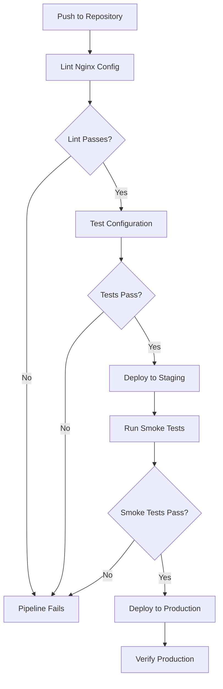
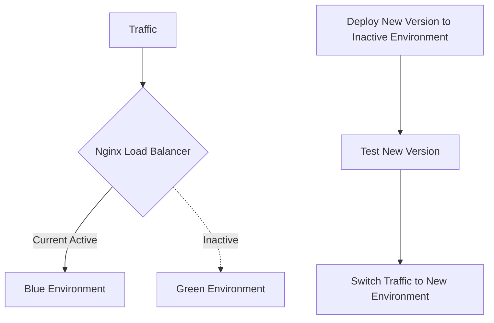

# Nginx CI/CD Integration

## Introduction

Continuous Integration and Continuous Deployment (CI/CD) has revolutionized how we build, test, and deploy applications. Integrating Nginx—a powerful web server and reverse proxy—with modern CI/CD pipelines allows for automated, consistent, and reliable deployments of your web infrastructure.

In this guide, we'll explore how to effectively integrate Nginx configurations into your CI/CD workflows, enabling you to treat your infrastructure as code and deploy changes with confidence.

## Why Integrate Nginx with CI/CD?

Before diving into implementation, let's understand the benefits:

- **Configuration as Code**: Manage Nginx configurations in version control
- **Automated Testing**: Test configuration changes before deployment
- **Consistent Environments**: Ensure identical Nginx setups across development, staging, and production
- **Rapid Deployment**: Deploy Nginx configuration changes quickly and reliably
- **Rollback Capability**: Easily revert to previous configurations if issues arise

## Prerequisites

To follow along, you should have:
- Basic understanding of Nginx configuration
- Familiarity with Git
- Access to a CI/CD platform (GitHub Actions, GitLab CI, Jenkins, etc.)
- A cloud environment for deployment (AWS, Azure, GCP, etc.)

## Setting Up Your Nginx Configuration Repository

The first step in CI/CD integration is maintaining your Nginx configurations in a version-controlled repository.

### Basic Repository Structure

```
nginx-config/
├── README.md
├── conf.d/
│   ├── default.conf
│   └── api.conf
├── nginx.conf
├── ssl/
│   ├── certificate.crt
│   └── private.key
└── scripts/
    ├── test_config.sh
    └── deploy.sh
```

### Sample Nginx Configuration File

Here's a basic `nginx.conf` file that you can start with:

```nginx
user nginx;
worker_processes auto;
error_log /var/log/nginx/error.log warn;
pid /var/run/nginx.pid;

events {
    worker_connections 1024;
}

http {
    include /etc/nginx/mime.types;
    default_type application/octet-stream;
    
    log_format main '$remote_addr - $remote_user [$time_local] "$request" '
                     '$status $body_bytes_sent "$http_referer" '
                     '"$http_user_agent" "$http_x_forwarded_for"';
    
    access_log /var/log/nginx/access.log main;
    
    sendfile on;
    keepalive_timeout 65;
    
    include /etc/nginx/conf.d/*.conf;
}
```

## Creating a CI/CD Pipeline for Nginx

Let's implement a CI/CD pipeline that validates, tests, and deploys Nginx configurations.

### Pipeline Workflow Overview



## Implementing the Pipeline

Let's create examples for different CI/CD platforms:

### GitHub Actions Example

Create a file named `.github/workflows/nginx-deployment.yml`:

```yaml
name: Nginx CI/CD Pipeline

on:
  push:
    branches: [ main, develop ]
  pull_request:
    branches: [ main ]

jobs:
  lint:
    runs-on: ubuntu-latest
    steps:
      - uses: actions/checkout@v2
      
      - name: Set up Docker
        uses: docker/setup-buildx-action@v1
      
      - name: Lint Nginx configuration
        run: |
          docker run --rm -v $(pwd):/etc/nginx nginx:latest nginx -t -c /etc/nginx/nginx.conf
  
  test:
    needs: lint
    runs-on: ubuntu-latest
    steps:
      - uses: actions/checkout@v2
      
      - name: Test Nginx configuration
        run: |
          docker-compose -f docker-compose.test.yml up -d
          ./scripts/test_config.sh
          docker-compose -f docker-compose.test.yml down
  
  deploy-staging:
    if: github.ref == 'refs/heads/develop'
    needs: test
    runs-on: ubuntu-latest
    environment: staging
    steps:
      - uses: actions/checkout@v2
      
      - name: Configure AWS credentials
        uses: aws-actions/configure-aws-credentials@v1
        with:
          aws-access-key-id: ${{ secrets.AWS_ACCESS_KEY_ID }}
          aws-secret-access-key: ${{ secrets.AWS_SECRET_ACCESS_KEY }}
          aws-region: us-east-1
      
      - name: Deploy to Staging
        run: |
          ./scripts/deploy.sh staging
  
  deploy-production:
    if: github.ref == 'refs/heads/main'
    needs: test
    runs-on: ubuntu-latest
    environment: production
    steps:
      - uses: actions/checkout@v2
      
      - name: Configure AWS credentials
        uses: aws-actions/configure-aws-credentials@v1
        with:
          aws-access-key-id: ${{ secrets.AWS_ACCESS_KEY_ID }}
          aws-secret-access-key: ${{ secrets.AWS_SECRET_ACCESS_KEY }}
          aws-region: us-east-1
      
      - name: Deploy to Production
        run: |
          ./scripts/deploy.sh production
```

### Testing Script Example

Create a file named `scripts/test_config.sh`:

```bash
#!/bin/bash
set -e

# Wait for Nginx to start
sleep 2

# Test 1: Verify Nginx is running
echo "Testing if Nginx is running..."
curl -s -o /dev/null -w "%{http_code}" http://localhost:80
if [ $? -ne 0 ]; then
  echo "Error: Nginx is not running properly"
  exit 1
fi

# Test 2: Verify specific routes
echo "Testing routes..."
STATUS=$(curl -s -o /dev/null -w "%{http_code}" http://localhost:80/api)
if [ "$STATUS" != "200" ]; then
  echo "Error: API route not responding correctly"
  exit 1
fi

echo "All tests passed!"
exit 0
```

### Deployment Script Example

Create a file named `scripts/deploy.sh`:

```bash
#!/bin/bash
set -e

# Get environment from arguments
ENVIRONMENT=$1

if [ "$ENVIRONMENT" != "staging" ] && [ "$ENVIRONMENT" != "production" ]; then
  echo "Error: Environment must be 'staging' or 'production'"
  exit 1
fi

echo "Deploying Nginx configurations to $ENVIRONMENT environment..."

# Example: Deploy to AWS EC2 instances in an Auto Scaling Group
INSTANCE_IDS=$(aws ec2 describe-instances \
  --filters "Name=tag:Environment,Values=$ENVIRONMENT" "Name=instance-state-name,Values=running" \
  --query "Reservations[].Instances[].InstanceId" \
  --output text)

for INSTANCE_ID in $INSTANCE_IDS; do
  echo "Deploying to instance $INSTANCE_ID..."
  
  # Copy configuration files
  aws ssm send-command \
    --instance-ids "$INSTANCE_ID" \
    --document-name "AWS-RunShellScript" \
    --parameters "commands=[
      'aws s3 cp s3://my-nginx-configs/$ENVIRONMENT/ /etc/nginx/ --recursive',
      'nginx -t',
      'systemctl reload nginx'
    ]" \
    --output text
    
  echo "Deployment to $INSTANCE_ID complete"
done

echo "Deployment to $ENVIRONMENT complete!"
```

## Docker-Compose for Testing

Create a file named `docker-compose.test.yml`:

```yaml
version: '3'

services:
  nginx:
    image: nginx:latest
    ports:
      - "80:80"
      - "443:443"
    volumes:
      - ./nginx.conf:/etc/nginx/nginx.conf
      - ./conf.d:/etc/nginx/conf.d
    networks:
      - nginx-net

  api-mock:
    image: mockserver/mockserver
    ports:
      - "1080:1080"
    environment:
      MOCKSERVER_INITIALIZATION_JSON_PATH: /config/mockserver.json
    volumes:
      - ./test/mockserver.json:/config/mockserver.json
    networks:
      - nginx-net

networks:
  nginx-net:
```

## Advanced CI/CD Integration Techniques

### Canary Deployments with Nginx

Canary deployments involve gradually rolling out changes to a small subset of servers before deploying to the entire infrastructure:

```nginx
upstream backend {
    server backend-v1.example.com weight=9;
    server backend-v2.example.com weight=1;  # 10% of traffic to new version
}

server {
    listen 80;
    server_name example.com;

    location / {
        proxy_pass http://backend;
        proxy_set_header Host $host;
        proxy_set_header X-Real-IP $remote_addr;
    }
}
```

In your CI/CD pipeline, you can gradually update the weights as confidence in the new deployment grows.

### Blue-Green Deployments

Blue-green deployment strategy involves maintaining two identical production environments:



Implementing this in your Nginx configuration might look like:

```nginx
# This file is managed by CI/CD - do not edit manually

upstream production {
    server blue.example.com;  # Active environment
    # server green.example.com;  # Commented out until switch
}

server {
    listen 80;
    server_name example.com;

    location / {
        proxy_pass http://production;
        proxy_set_header Host $host;
        proxy_set_header X-Real-IP $remote_addr;
    }
}
```

Your CI/CD pipeline would update this file, switching between blue and green environments by uncommenting/commenting the appropriate server lines.

## Automated Testing Strategies

### Syntax Validation

Always validate your Nginx configuration in the CI pipeline:

```bash
nginx -t -c /path/to/nginx.conf
```

### Load Testing

Incorporate load testing to ensure your configuration can handle expected traffic:

```bash
# Using Apache Benchmark
ab -n 1000 -c 100 https://staging.example.com/

# Or with wrk
wrk -t12 -c400 -d30s https://staging.example.com/
```

### Security Testing

Include automated security scans for your Nginx configuration:

```bash
# Example using gixy (Nginx configuration static analyzer)
pip install gixy
gixy /path/to/nginx.conf
```

## Real-World Example: Complete CI/CD for Microservices

Let's look at a practical example of integrating Nginx in a microservices architecture:

```nginx
# api-gateway.conf
server {
    listen 80;
    server_name api.example.com;

    location /users {
        proxy_pass http://users-service;
        proxy_set_header Host $host;
        proxy_set_header X-Real-IP $remote_addr;
    }

    location /products {
        proxy_pass http://products-service;
        proxy_set_header Host $host;
        proxy_set_header X-Real-IP $remote_addr;
    }

    location /orders {
        proxy_pass http://orders-service;
        proxy_set_header Host $host;
        proxy_set_header X-Real-IP $remote_addr;
    }
}
```

In this setup, the CI/CD pipeline would:

1. Update service endpoints when new versions are deployed
2. Test each routing configuration separately
3. Apply rate limiting or security rules as needed
4. Deploy the configuration to the Nginx instances

## Best Practices for Nginx in CI/CD

1. **Version Everything**: Keep all Nginx configuration files, including certificates (encrypted) in version control.

2. **Environment Variables**: Use templating to inject environment-specific values:

```nginx
server {
    listen 80;
    server_name ${NGINX_SERVER_NAME};
    
    location / {
        proxy_pass ${BACKEND_SERVICE_URL};
    }
}
```

3. **Immutable Infrastructure**: Deploy Nginx with containers or immutable virtual machines:

```yaml
# docker-compose.yml
version: '3'

services:
  nginx:
    image: nginx:latest
    volumes:
      - ./nginx.conf:/etc/nginx/nginx.conf:ro
      - ./conf.d:/etc/nginx/conf.d:ro
    ports:
      - "80:80"
      - "443:443"
```

4. **Automate Certificate Management**: Integrate Let's Encrypt for automatic SSL certificate renewal.

5. **Monitor Deployments**: Add health checks and monitoring to detect issues early.

## Integration with Kubernetes

If you're using Kubernetes, you might use Nginx Ingress Controller:

```yaml
# ingress.yaml
apiVersion: networking.k8s.io/v1
kind: Ingress
metadata:
  name: example-ingress
  annotations:
    nginx.ingress.kubernetes.io/rewrite-target: /
spec:
  rules:
  - host: example.com
    http:
      paths:
      - path: /api
        pathType: Prefix
        backend:
          service:
            name: api-service
            port:
              number: 80
```

The CI/CD pipeline would:
1. Update the Ingress resource when service changes are needed
2. Apply the changes to the Kubernetes cluster
3. Verify the routing works as expected

## Summary

Integrating Nginx with CI/CD pipelines enables automated, reliable deployments of your web infrastructure. By treating your Nginx configurations as code, you gain the benefits of version control, automated testing, and consistent environments.

Key takeaways:
- Store Nginx configurations in version control
- Implement automated testing for configurations
- Use deployment strategies like canary or blue-green
- Leverage containerization for consistency
- Implement monitoring and observability

## Further Exercises

1. Set up a complete CI/CD pipeline for an Nginx configuration
2. Implement a blue-green deployment strategy using Nginx
3. Automate SSL certificate renewal with Let's Encrypt in your pipeline
4. Create a dynamic configuration system that updates Nginx based on service discovery
5. Implement advanced monitoring for your Nginx deployments

## Additional Resources

- [Nginx Documentation](https://nginx.org/en/docs/)
- [GitHub Actions Documentation](https://docs.github.com/en/actions)
- [GitLab CI Documentation](https://docs.gitlab.com/ee/ci/)
- [Jenkins Documentation](https://www.jenkins.io/doc/)
- [Nginx Ingress Controller for Kubernetes](https://kubernetes.github.io/ingress-nginx/)