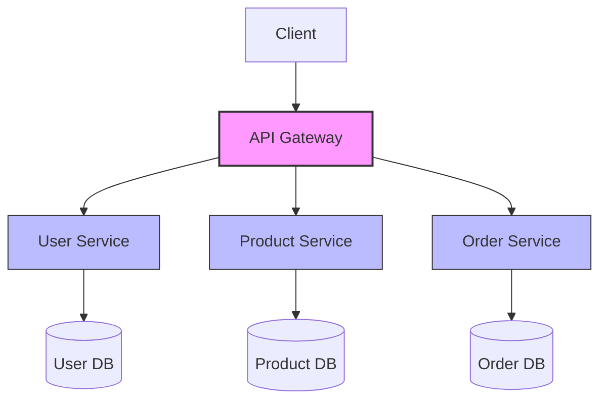

# Nginx Microservices

## Introduction

Microservices architecture has revolutionized how we build and deploy applications, breaking down monolithic applications into smaller, independently deployable services. However, this architectural shift introduces challenges in service communication, load balancing, and request routing. This is where Nginx shines as a powerful tool in the microservices ecosystem.

In this tutorial, we'll explore how Nginx serves as a critical component in microservices deployments, acting as a reverse proxy, load balancer, API gateway, and more. We'll learn how to configure Nginx to effectively manage traffic between microservices, ensure high availability, and optimize performance in cloud environments.

## What are Microservices?

Before diving into Nginx's role, let's understand what microservices are:

Microservices are an architectural style that structures an application as a collection of small, loosely coupled services. Each service:

- Focuses on a specific business capability
- Can be developed, deployed, and scaled independently
- Usually communicates via HTTP/REST APIs or lightweight messaging
- Often has its own database or data store



## Nginx's Role in Microservices Architecture

Nginx can serve multiple critical functions in a microservices architecture:

1. **Reverse Proxy**: Routes client requests to appropriate backend services
2. **Load Balancer**: Distributes traffic across multiple instances of the same service
3. **API Gateway**: Centralizes cross-cutting concerns like authentication and rate limiting
4. **Service Discovery Integration**: Works with service discovery tools to locate services
5. **SSL Termination**: Handles HTTPS encryption/decryption to simplify backend services

Let's explore each of these roles with practical examples.

## Setting Up Nginx as a Reverse Proxy for Microservices

### Basic Configuration

Here's a simple Nginx configuration to proxy requests to different microservices:

```nginx
http {
    server {
        listen 80;
        server_name example.com;
        
        # User service
        location /api/users {
            proxy_pass http://user-service:8001;
            proxy_set_header Host $host;
            proxy_set_header X-Real-IP $remote_addr;
        }
        
        # Product service
        location /api/products {
            proxy_pass http://product-service:8002;
            proxy_set_header Host $host;
            proxy_set_header X-Real-IP $remote_addr;
        }
        
        # Order service
        location /api/orders {
            proxy_pass http://order-service:8003;
            proxy_set_header Host $host;
            proxy_set_header X-Real-IP $remote_addr;
        }
    }
}
```

In this configuration:
- We've defined a server block listening on port 80
- We've created three location blocks, each routing to a different microservice
- We're passing the original host and IP information to each service

## Load Balancing Microservices with Nginx

When you need to scale your microservices horizontally (adding more instances), Nginx can distribute the load:

```nginx
http {
    # Define upstream (backend) servers
    upstream user-service {
        server user-service-1:8001;
        server user-service-2:8001;
        server user-service-3:8001;
    }
    
    server {
        listen 80;
        server_name example.com;
        
        location /api/users {
            proxy_pass http://user-service;
            proxy_set_header Host $host;
            proxy_set_header X-Real-IP $remote_addr;
        }
        
        # Other service locations...
    }
}
```

### Advanced Load Balancing Methods

Nginx offers several load balancing algorithms:

```nginx
upstream product-service {
    # Round Robin (default) - requests distributed evenly
    server product-service-1:8002;
    server product-service-2:8002;
    
    # Least connections - sends request to server with fewest active connections
    least_conn;
    
    # IP Hash - ensures clients stick to the same server
    ip_hash;
    
    # Weighted - give some servers more traffic
    server product-service-1:8002 weight=3;
    server product-service-2:8002 weight=1;
}
```

## Creating an API Gateway with Nginx

An API gateway centralizes common functionality like authentication, rate limiting, and monitoring:

```nginx
http {
    limit_req_zone $binary_remote_addr zone=api_limit:10m rate=5r/s;
    
    server {
        listen 80;
        server_name api.example.com;
        
        # API key validation
        set $api_key "";
        if ($http_x_api_key) {
            set $api_key $http_x_api_key;
        }
        
        # Global rate limiting
        limit_req zone=api_limit burst=10 nodelay;
        
        # Authentication middleware
        location /api/ {
            if ($api_key = "") {
                return 401 '{"error": "API key required"}';
            }
            
            # Continue processing if API key is present
            proxy_set_header X-API-KEY $api_key;
            
            # JWT validation could be added here with auth_request module
            
            # Other global middleware...
        }
        
        # Service-specific routes
        location /api/users {
            # Add service-specific middleware
            proxy_pass http://user-service;
        }
        
        # More services...
    }
}
```

This configuration:
1. Creates a rate limit zone for all clients
2. Validates the presence of an API key
3. Applies global rate limiting
4. Forwards the authenticated request to the appropriate service

## Service Discovery Integration

In dynamic cloud environments, services may scale up/down or move. Nginx can integrate with service discovery tools:

### Static Configuration with DNS

```nginx
http {
    # Rely on DNS for service discovery
    resolver 10.0.0.2 valid=5s;
    
    server {
        listen 80;
        
        location /api/users {
            set $backend "http://user-service";
            proxy_pass $backend;
        }
    }
}
```

### Dynamic Configuration with Nginx Plus API

With Nginx Plus, you can dynamically update upstream servers:

```nginx
http {
    upstream user-service {
        zone backend 64k;
        # Empty initially, will be populated via API
    }
    
    server {
        listen 80;
        
        location /api/users {
            proxy_pass http://user-service;
        }
        
        # Admin API for dynamic reconfiguration
        location /api/6/http/upstreams {
            api write=on;
        }
    }
}
```

Then, you can update upstreams dynamically:

```bash
curl -X POST -d '{
    "server": "10.0.0.42:8001"
}' http://nginx-admin/api/6/http/upstreams/user-service/servers
```

## Health Checks for Microservices

To ensure Nginx only routes to healthy services:

```nginx
http {
    upstream order-service {
        server order-service-1:8003 max_fails=3 fail_timeout=30s;
        server order-service-2:8003 max_fails=3 fail_timeout=30s;
    }
    
    # With Nginx Plus, active health checks are available
    upstream product-service {
        zone upstream_product 64k;
        
        server product-service-1:8002;
        server product-service-2:8002;
        
        # Active health check
        health_check uri=/health interval=5s fails=3 passes=2;
    }
}
```

## Practical Example: Complete Microservices Setup

Let's tie everything together with a practical example of a complete e-commerce microservices setup:

```nginx
http {
    # Resolver for DNS-based service discovery
    resolver 10.0.0.2 valid=10s;
    
    # Rate limiting zones
    limit_req_zone $binary_remote_addr zone=api_limit:10m rate=10r/s;
    limit_req_zone $binary_remote_addr zone=auth_limit:10m rate=5r/s;
    
    # Upstreams for load balancing
    upstream auth-service {
        server auth-service-1:8000;
        server auth-service-2:8000;
        least_conn;
    }
    
    upstream user-service {
        server user-service-1:8001;
        server user-service-2:8001;
    }
    
    upstream product-service {
        server product-service-1:8002;
        server product-service-2:8002;
        server product-service-3:8002;
    }
    
    upstream order-service {
        server order-service-1:8003;
        server order-service-2:8003;
    }
    
    # Cache configuration for static content
    proxy_cache_path /var/cache/nginx levels=1:2 keys_zone=static_cache:10m 
                     max_size=1g inactive=60m;
    
    # Main server block
    server {
        listen 80;
        server_name api.example.com;
        
        # Redirect to HTTPS
        return 301 https://$host$request_uri;
    }
    
    # HTTPS server
    server {
        listen 443 ssl;
        server_name api.example.com;
        
        # SSL configuration
        ssl_certificate /etc/nginx/ssl/example.com.crt;
        ssl_certificate_key /etc/nginx/ssl/example.com.key;
        ssl_protocols TLSv1.2 TLSv1.3;
        
        # Security headers
        add_header Strict-Transport-Security "max-age=31536000; includeSubDomains" always;
        add_header X-Content-Type-Options "nosniff" always;
        add_header X-Frame-Options "SAMEORIGIN" always;
        
        # Logging
        access_log /var/log/nginx/api_access.log combined;
        error_log /var/log/nginx/api_error.log;
        
        # Authentication Service
        location /api/auth {
            limit_req zone=auth_limit burst=5 nodelay;
            proxy_pass http://auth-service;
            proxy_set_header Host $host;
            proxy_set_header X-Real-IP $remote_addr;
        }
        
        # User Service
        location /api/users {
            limit_req zone=api_limit burst=10 nodelay;
            
            # Check authentication token
            auth_request /auth_verify;
            
            proxy_pass http://user-service;
            proxy_set_header Host $host;
            proxy_set_header X-Real-IP $remote_addr;
            proxy_set_header X-User-ID $upstream_http_x_user_id;
        }
        
        # Product Service with caching
        location /api/products {
            proxy_cache static_cache;
            proxy_cache_valid 200 10m;
            proxy_cache_methods GET HEAD;
            proxy_cache_key $scheme$proxy_host$request_uri;
            
            proxy_pass http://product-service;
            proxy_set_header Host $host;
            proxy_set_header X-Real-IP $remote_addr;
            
            # Cache bypass if requested
            proxy_cache_bypass $http_cache_control;
        }
        
        # Order Service
        location /api/orders {
            # Require authentication
            auth_request /auth_verify;
            
            # Only allow specific methods
            limit_except GET POST PUT DELETE {
                deny all;
            }
            
            proxy_pass http://order-service;
            proxy_set_header Host $host;
            proxy_set_header X-Real-IP $remote_addr;
            proxy_set_header X-User-ID $upstream_http_x_user_id;
        }
        
        # Internal authentication verification endpoint
        location = /auth_verify {
            internal;
            proxy_pass http://auth-service/verify;
            proxy_pass_request_body off;
            proxy_set_header Content-Length "";
            proxy_set_header X-Original-URI $request_uri;
            proxy_set_header Authorization $http_authorization;
        }
        
        # Health check endpoint
        location = /health {
            access_log off;
            return 200 '{"status":"healthy"}';
        }
        
        # Metrics endpoint for monitoring
        location = /metrics {
            stub_status on;
            allow 127.0.0.1;
            deny all;
        }
    }
}
```

This comprehensive configuration:

1. Implements SSL termination
2. Enforces rate limiting for different endpoints
3. Adds authentication verification
4. Includes caching for product information
5. Provides health check and monitoring endpoints
6. Implements security headers
7. Sets up proper logging

## Deploying Microservices with Docker and Nginx

Nginx works exceptionally well with containerized microservices. Here's an example Docker Compose file that sets up a basic microservices environment with Nginx:

```yaml
version: '3'

services:
  nginx:
    image: nginx:latest
    ports:
      - "80:80"
      - "443:443"
    volumes:
      - ./nginx.conf:/etc/nginx/nginx.conf
      - ./ssl:/etc/nginx/ssl
    depends_on:
      - auth-service
      - user-service
      - product-service
      - order-service
    networks:
      - microservice-network

  auth-service:
    build: ./auth-service
    expose:
      - "8000"
    networks:
      - microservice-network
    deploy:
      replicas: 2

  user-service:
    build: ./user-service
    expose:
      - "8001"
    networks:
      - microservice-network
    deploy:
      replicas: 2

  product-service:
    build: ./product-service
    expose:
      - "8002"
    networks:
      - microservice-network
    deploy:
      replicas: 3

  order-service:
    build: ./order-service
    expose:
      - "8003"
    networks:
      - microservice-network
    deploy:
      replicas: 2

networks:
  microservice-network:
    driver: bridge
```

## Performance Tuning Nginx for Microservices

When dealing with many microservices, optimizing Nginx's performance becomes crucial:

```nginx
# Optimize worker processes and connections
worker_processes auto;
worker_rlimit_nofile 65535;

events {
    worker_connections 10240;
    multi_accept on;
    use epoll;
}

http {
    # Buffer sizes
    client_body_buffer_size 10K;
    client_header_buffer_size 1k;
    client_max_body_size 8m;
    large_client_header_buffers 2 1k;
    
    # Timeouts
    client_body_timeout 12;
    client_header_timeout 12;
    keepalive_timeout 15;
    send_timeout 10;
    
    # File descriptors
    open_file_cache max=1000 inactive=20s;
    open_file_cache_valid 30s;
    open_file_cache_min_uses 2;
    open_file_cache_errors on;
    
    # Compression
    gzip on;
    gzip_comp_level 5;
    gzip_min_length 256;
    gzip_proxied any;
    gzip_types
        application/javascript
        application/json
        application/xml
        text/css
        text/plain
        text/xml;
    
    # Other optimizations...
}
```

## Common Challenges and Solutions

### 1. Cross-Origin Resource Sharing (CORS)

Microservices often need to handle CORS for browser clients:

```nginx
# Add CORS headers
location /api/ {
    if ($request_method = 'OPTIONS') {
        add_header 'Access-Control-Allow-Origin' '*';
        add_header 'Access-Control-Allow-Methods' 'GET, POST, PUT, DELETE, OPTIONS';
        add_header 'Access-Control-Allow-Headers' 'DNT,User-Agent,X-Requested-With,If-Modified-Since,Cache-Control,Content-Type,Range,Authorization';
        add_header 'Access-Control-Max-Age' 1728000;
        add_header 'Content-Type' 'text/plain; charset=utf-8';
        add_header 'Content-Length' 0;
        return 204;
    }
    
    add_header 'Access-Control-Allow-Origin' '*' always;
    add_header 'Access-Control-Allow-Methods' 'GET, POST, PUT, DELETE, OPTIONS' always;
    add_header 'Access-Control-Allow-Headers' 'DNT,User-Agent,X-Requested-With,If-Modified-Since,Cache-Control,Content-Type,Range,Authorization' always;
    
    # Continue processing...
}
```

### 2. Handling WebSockets

For real-time communication between services or clients:

```nginx
location /api/notifications {
    proxy_pass http://notification-service;
    proxy_http_version 1.1;
    proxy_set_header Upgrade $http_upgrade;
    proxy_set_header Connection "upgrade";
    proxy_set_header Host $host;
}
```

### 3. Request Tracing

Implementing distributed tracing for debugging microservices:

```nginx
http {
    # Generate trace ID if not present
    map $http_x_request_id $trace_id {
        default $http_x_request_id;
        "" $request_id;
    }
    
    server {
        # Pass trace ID to services
        proxy_set_header X-Request-ID $trace_id;
        proxy_set_header X-Trace-ID $trace_id;
        
        # Enable request ID generation
        add_header X-Request-ID $trace_id always;
        
        # Log with trace ID
        log_format traced '$remote_addr - $remote_user [$time_local] "$request" '
                      '$status $body_bytes_sent "$http_referer" '
                      '"$http_user_agent" "$trace_id"';
        
        access_log /var/log/nginx/access.log traced;
    }
}
```

## Summary

In this tutorial, we've explored how Nginx serves as a fundamental component in microservices architecture:

1. **Reverse Proxy**: Routing requests to appropriate services
2. **Load Balancer**: Distributing traffic across service instances
3. **API Gateway**: Centralizing cross-cutting concerns
4. **Service Discovery**: Working with dynamic service locations
5. **Performance Optimization**: Ensuring efficient communication

Nginx provides the glue that holds microservices together, handling the complex networking challenges so your services can focus on their specific business logic. By implementing patterns like API gateways and centralized authentication, you can build more maintainable and scalable microservices architectures.

## Additional Resources

To further deepen your knowledge about Nginx and microservices:

1. [Official Nginx Documentation](https://nginx.org/en/docs/)
2. [Nginx Blog: Microservices Reference Architecture](https://www.nginx.com/blog/microservices-reference-architecture-nginx-proxy-model/)
3. [Building Microservices](https://samnewman.io/books/building_microservices/) by Sam Newman
4. [Nginx Cookbook](https://www.nginx.com/resources/library/complete-nginx-cookbook/)

## Exercises

To reinforce your learning:

1. Set up a basic three-service application (e.g., users, products, orders) with Nginx as a reverse proxy.
2. Configure Nginx to load balance between multiple instances of a service.
3. Implement a simple API gateway pattern with authentication using Nginx.
4. Create a Docker Compose file that starts a microservices environment with Nginx.
5. Configure CORS and WebSocket support for your microservices.