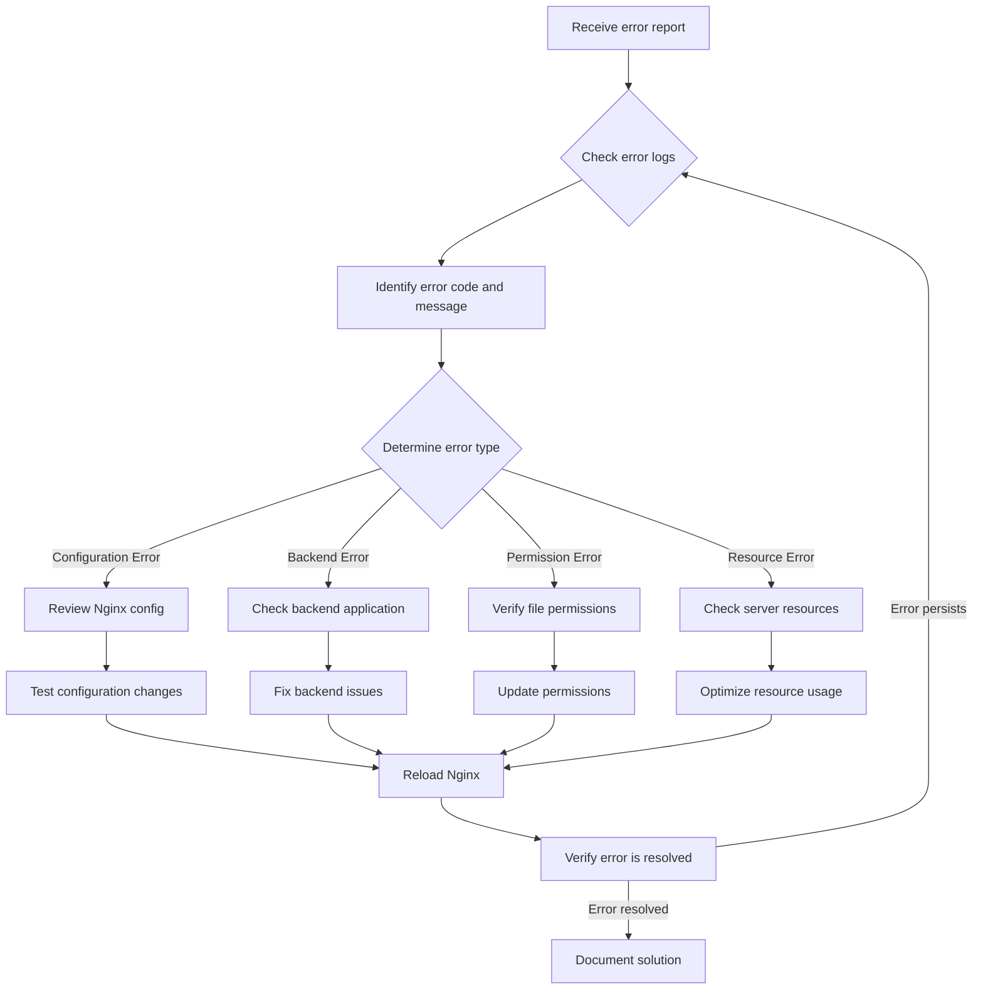

# Nginx Error Analysis

## Introduction

When working with Nginx, one of the most popular web servers, you'll inevitably encounter errors. Understanding how to analyze and resolve these errors is a crucial skill for any web developer or system administrator. This guide will walk you through the process of identifying, understanding, and fixing common Nginx errors, with practical examples that you'll encounter in real-world scenarios.

Nginx error analysis involves:
- Locating error logs
- Understanding error codes
- Diagnosing configuration issues
- Implementing effective solutions

By the end of this guide, you'll be equipped with the knowledge to troubleshoot Nginx problems efficiently and maintain a stable web server environment.

## Locating Nginx Error Logs

Before you can analyze errors, you need to know where to find them. Nginx logs are your primary source of information when troubleshooting.

### Default Log Locations

Nginx typically stores its logs in these locations:

```bash
# Error logs
/var/log/nginx/error.log

# Access logs
/var/log/nginx/access.log
```

### Custom Log Locations

If you've customized your Nginx configuration, logs might be in different locations specified in your configuration files:

```nginx
http {
    error_log /custom/path/to/error.log;
    
    server {
        access_log /custom/path/to/access.log;
    }
}
```

### Checking Log Configuration

To verify where your logs are stored:

```bash
grep -r "error_log\|access_log" /etc/nginx/
```

## Understanding Common Nginx Error Codes

Nginx uses HTTP status codes to indicate errors. Let's explore the most common ones:

### Client Error Codes (4xx)

| Status Code | Description | Common Causes |
|-------------|-------------|--------------|
| 400 | Bad Request | Malformed HTTP request, invalid headers |
| 403 | Forbidden | Insufficient file permissions, restrictive rules |
| 404 | Not Found | File doesn't exist, incorrect path in configuration |
| 413 | Request Entity Too Large | Client uploaded a file larger than allowed |
| 429 | Too Many Requests | Rate limiting triggered |

### Server Error Codes (5xx)

| Status Code | Description | Common Causes |
|-------------|-------------|--------------|
| 500 | Internal Server Error | Issues with backend applications (PHP, Python, etc.) |
| 502 | Bad Gateway | Backend server unavailable or responding incorrectly |
| 503 | Service Unavailable | Server overloaded or under maintenance |
| 504 | Gateway Timeout | Backend server timed out |

## Error Log Format and Analysis

Nginx error logs follow a specific format that provides key information for diagnosis:

```
[time] [level] [process_id#thread_id] [connection_id] [message]
```

Example error log entry:

```
2023/05/15 10:23:45 [error] 1234#0: *5678 open() "/usr/share/nginx/html/missing.html" failed (2: No such file or directory), client: 192.168.1.10, server: example.com, request: "GET /missing.html HTTP/1.1", host: "example.com"
```

Let's break down this entry:
- **Time**: 2023/05/15 10:23:45
- **Level**: error
- **Process ID**: 1234
- **Connection ID**: 5678
- **Error**: File not found
- **Client IP**: 192.168.1.10
- **Server**: example.com
- **Request**: GET /missing.html HTTP/1.1

## Diagnosing and Resolving Common Nginx Errors

Let's walk through common errors and their solutions:

### 1. 404 Not Found Errors

**Log example:**
```
2023/05/15 10:23:45 [error] 1234#0: *5678 open() "/usr/share/nginx/html/about.html" failed (2: No such file or directory)
```

**Diagnosis:**
The server cannot find the requested file.

**Solutions:**

1. Verify the file exists:
```bash
ls -la /usr/share/nginx/html/about.html
```

2. Check and fix your location blocks in Nginx configuration:
```nginx
server {
    listen 80;
    server_name example.com;
    
    root /usr/share/nginx/html;
    
    location / {
        try_files $uri $uri/ /index.html;
    }
}
```

3. Ensure proper file permissions:
```bash
chmod 644 /usr/share/nginx/html/about.html
chown nginx:nginx /usr/share/nginx/html/about.html
```

### 2. 502 Bad Gateway Errors

**Log example:**
```
2023/05/15 11:42:18 [error] 5678#0: *1234 connect() failed (111: Connection refused) while connecting to upstream, client: 192.168.1.10, server: example.com, request: "GET /api/users HTTP/1.1", upstream: "http://127.0.0.1:3000/api/users", host: "example.com"
```

**Diagnosis:**
Nginx cannot connect to the upstream server (backend application).

**Solutions:**

1. Verify the backend service is running:
```bash
systemctl status application_service
# or
ps aux | grep application_name
```

2. Check if the backend service is listening on the expected port:
```bash
netstat -tulpn | grep 3000
```

3. Correct the upstream configuration if needed:
```nginx
upstream backend {
    server 127.0.0.1:3000;
    # Add backup servers if needed
    # server 127.0.0.1:3001 backup;
}

server {
    location /api/ {
        proxy_pass http://backend;
        proxy_set_header Host $host;
        proxy_set_header X-Real-IP $remote_addr;
    }
}
```

### 3. 500 Internal Server Error

**Log example:**
```
2023/05/15 14:05:12 [error] 9876#0: *5432 FastCGI sent in stderr: "PHP Fatal error: Uncaught Error: Call to undefined function connect_db() in /var/www/html/index.php:15" while reading response header from upstream, client: 192.168.1.10, server: example.com, request: "GET / HTTP/1.1", upstream: "fastcgi://unix:/var/run/php/php7.4-fpm.sock:", host: "example.com"
```

**Diagnosis:**
The backend application (PHP in this case) is encountering an error.

**Solutions:**

1. Fix the PHP code error:
```php
// Add the missing function or include required files
function connect_db() {
    // Database connection code
}
```

2. Check PHP-FPM logs for more details:
```bash
tail -f /var/log/php7.4-fpm.log
```

3. Increase log level in PHP configuration for more verbose debugging:
```
php_admin_value[error_reporting] = E_ALL
php_admin_flag[display_errors] = off
php_admin_flag[log_errors] = on
```

### 4. 413 Request Entity Too Large

**Log example:**
```
2023/05/15 16:20:33 [error] 1234#0: *7890 client intended to send too large body: 10485760 bytes
```

**Diagnosis:**
Client is attempting to upload a file that exceeds Nginx's size limits.

**Solutions:**

Increase the size limits in your Nginx configuration:

```nginx
http {
    client_max_body_size 20M;
    
    server {
        # Server configuration
        
        location /upload {
            # Specific upload location can have its own limit
            client_max_body_size 50M;
        }
    }
}
```

After making changes, don't forget to test and reload Nginx:

```bash
nginx -t
systemctl reload nginx
```

## Using Nginx Debug Mode for Detailed Error Analysis

For more complex issues, Nginx's debug mode provides detailed information:

1. Enable debug log level in your Nginx configuration:

```nginx
error_log /var/log/nginx/error.log debug;
```

2. Reload Nginx:

```bash
systemctl reload nginx
```

3. Generate the error by accessing the problematic URL

4. Analyze the detailed debug logs

Be aware that debug logs are very verbose. Remember to revert to the normal log level after troubleshooting:

```nginx
error_log /var/log/nginx/error.log error;
```

## Real-World Error Analysis Workflow

Let's walk through a complete error analysis workflow:



### Case Study: Resolving a Complex 504 Gateway Timeout

**Error Scenario:**
A web application is experiencing intermittent 504 Gateway Timeout errors during peak hours.

**Investigation Steps:**

1. **Check Nginx error logs:**
```
2023/05/16 14:32:18 [error] 7865#0: *4321 upstream timed out (110: Connection timed out) while reading response header from upstream, client: 192.168.1.100, server: example.com, request: "POST /api/process-data HTTP/1.1", upstream: "http://127.0.0.1:8080/api/process-data", host: "example.com"
```

2. **Review backend server behavior:**
```bash
# Check backend CPU and memory usage
htop

# Check for long-running database queries
mysql -u admin -p -e "SHOW FULL PROCESSLIST"
```

3. **Adjust Nginx timeout settings:**
```nginx
location /api/ {
    proxy_pass http://backend;
    proxy_connect_timeout 30s;
    proxy_send_timeout 60s;
    proxy_read_timeout 90s; # Increase from default 60s
    proxy_buffering on;
    proxy_buffer_size 16k;
    proxy_buffers 4 32k;
}
```

4. **Implement backend performance optimizations:**
   - Added database indexes
   - Implemented caching for frequently accessed data
   - Optimized slow database queries

5. **Add upstream server load balancing:**
```nginx
upstream backend {
    server 127.0.0.1:8080;
    server 127.0.0.1:8081;
    server 127.0.0.1:8082;
    keepalive 32;
}
```

**Result:**
The 504 errors were eliminated by a combination of increased timeouts, backend optimizations, and load balancing.

## Preventing Common Nginx Errors

Implementing these best practices can help prevent many common Nginx errors:

1. **Regular configuration testing:**
```bash
# Test before applying changes
nginx -t

# Use configuration generation tools for complex setups
```

2. **Implement monitoring:**
```bash
# Set up log monitoring with tools like:
# - ELK Stack (Elasticsearch, Logstash, Kibana)
# - Prometheus with Grafana
# - Nagios
```

3. **Proactive resource management:**
```nginx
# Implement rate limiting
limit_req_zone $binary_remote_addr zone=mylimit:10m rate=10r/s;

server {
    location /api/ {
        limit_req zone=mylimit burst=20 nodelay;
    }
}
```

4. **Proper error page configuration:**
```nginx
server {
    # Custom error pages
    error_page 404 /custom_404.html;
    error_page 500 502 503 504 /custom_50x.html;
    
    location = /custom_404.html {
        root /usr/share/nginx/html;
        internal;
    }
    
    location = /custom_50x.html {
        root /usr/share/nginx/html;
        internal;
    }
}
```

## Summary

In this guide, we've covered the essential aspects of Nginx error analysis:

1. Locating and understanding Nginx error logs
2. Interpreting common error codes and their causes
3. Diagnosing specific errors from log entries
4. Implementing effective solutions for various error types
5. Using Nginx debug mode for complex troubleshooting
6. Following a structured workflow for error resolution
7. Preventing errors through best practices

Mastering Nginx error analysis takes practice, but with the structured approach outlined in this guide, you'll be well-equipped to handle most issues you encounter in your web server deployment.

## Additional Resources

- [Official Nginx Documentation](https://nginx.org/en/docs/)
- [Nginx Troubleshooting Guide](https://www.nginx.com/resources/wiki/start/topics/tutorials/troubleshooting/)
- [Nginx Config Generator](https://www.digitalocean.com/community/tools/nginx)

## Practice Exercises

1. **Basic Error Identification:**
   - Set up a local Nginx server
   - Intentionally create a 404 error by requesting a non-existent page
   - Find and analyze the error in the logs

2. **Configuration Troubleshooting:**
   - Introduce a syntax error in your Nginx configuration
   - Use `nginx -t` to identify the issue
   - Fix the error and verify the solution

3. **Backend Integration Error Resolution:**
   - Set up Nginx as a reverse proxy to a simple backend (Node.js or Python)
   - Shut down the backend and observe the resulting 502 errors
   - Implement proper error handling and fallback options