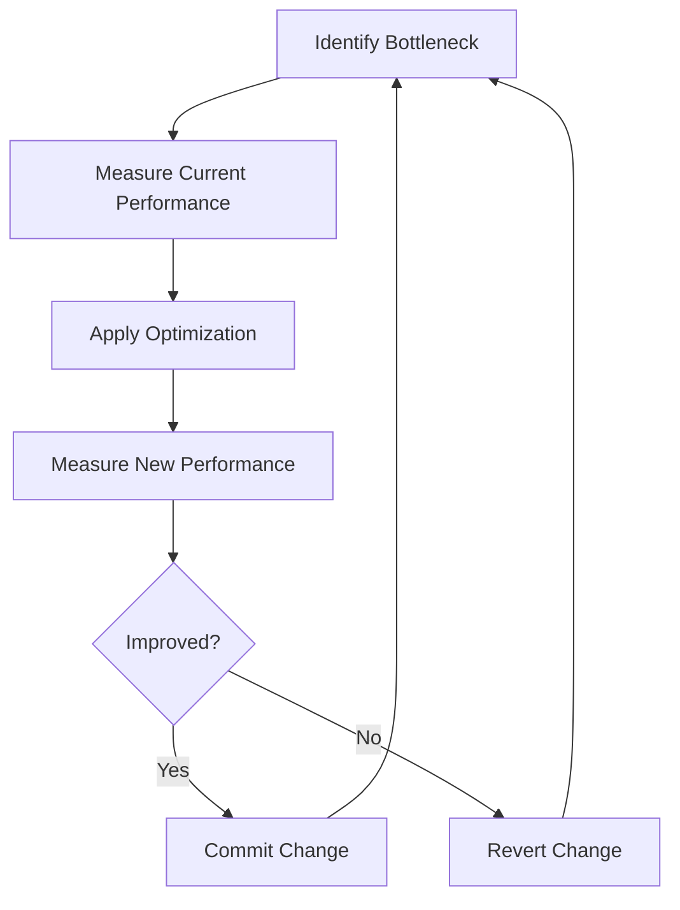

# Nginx Performance Bottlenecks

## Introduction

Nginx (pronounced "engine-x") is a popular open-source web server, reverse proxy, and load balancer known for its high performance and stability. However, like any system, it can experience performance bottlenecks that slow down your applications. In this guide, we'll explore common Nginx performance issues, how to identify them, and most importantly, how to resolve them.

Understanding performance bottlenecks is crucial because even a well-configured Nginx server can encounter limitations as traffic grows or application requirements change. By the end of this guide, you'll have a solid understanding of how to diagnose and fix Nginx performance problems.

## Common Nginx Performance Bottlenecks

### 1. Worker Processes and Connections

One of the most common bottlenecks in Nginx relates to worker processes and connection settings.

#### Worker Processes

Nginx uses a master process that manages multiple worker processes. Each worker process handles connections from clients.

```nginx
# Default configuration in nginx.conf
worker_processes 1; # Default is often too low
```

**Problem**: The default setting of 1 worker process is insufficient for most production environments, especially on multi-core systems.

**Solution**: Set the number of worker processes equal to the number of CPU cores available.

```nginx
# Optimal configuration
worker_processes auto; # Automatically detects number of CPU cores
# OR specify exact number
worker_processes 4; # For a 4-core server
```

#### Worker Connections

The `worker_connections` directive defines how many simultaneous connections each worker process can handle.

```nginx
events {
    worker_connections 1024; # Default value
}
```

**Problem**: The default setting might be too low for high-traffic websites.

**Solution**: Increase the number based on your server's capability. The total number of simultaneous connections your server can handle is:

```
max_connections = worker_processes × worker_connections
```

For example, with 4 worker processes and 2048 connections per worker:
```
max_connections = 4 × 2048 = 8192 simultaneous connections
```

```nginx
events {
    worker_connections 2048; # Increased value
}
```

### 2. Keepalive Connections

Keepalive connections allow Nginx to reuse connections for multiple requests, reducing the overhead of establishing new connections.

```nginx
http {
    keepalive_timeout 65; # Default value in seconds
    keepalive_requests 100; # Default number of requests per connection
}
```

**Problem**: Default settings might not be optimal for your specific use case.

**Solution**: Adjust based on your application needs:

```nginx
http {
    # For high-traffic sites
    keepalive_timeout 30; # Shorter timeout
    keepalive_requests 1000; # More requests per connection
    
    # For upstream servers (e.g., application servers)
    upstream backend {
        server backend1.example.com;
        server backend2.example.com;
        keepalive 32; # Reserve connections to upstream servers
    }
}
```

### 3. Buffer Sizes

Nginx uses various buffers for different operations. Improperly sized buffers can cause performance issues.

```nginx
http {
    # Default buffer settings
    client_body_buffer_size 8k;
    client_header_buffer_size 1k;
    client_max_body_size 1m;
    large_client_header_buffers 4 8k;
}
```

**Problem**: Default buffer sizes might be too small for certain requests, causing disk I/O overhead.

**Solution**: Increase buffer sizes based on typical request sizes in your application:

```nginx
http {
    # Adjusted buffer settings
    client_body_buffer_size 16k;
    client_header_buffer_size 2k;
    client_max_body_size 10m;
    large_client_header_buffers 4 16k;
}
```

### 4. Static File Serving Optimization

Nginx excels at serving static files, but improper configuration can lead to bottlenecks.

```nginx
server {
    # Default or missing settings
    location /static/ {
        root /var/www/app;
    }
}
```

**Problem**: Without proper caching and optimization directives, static file serving can be inefficient.

**Solution**: Enable sendfile, tcp_nopush, and set appropriate expires headers:

```nginx
http {
    sendfile on;
    tcp_nopush on;
    tcp_nodelay on;
    
    # Add MIME types and default type
    include /etc/nginx/mime.types;
    default_type application/octet-stream;
    
    server {
        location /static/ {
            root /var/www/app;
            expires 30d; # Cache static assets for 30 days
            add_header Cache-Control "public, no-transform";
        }
    }
}
```

### 5. Gzip Compression

Gzip compression reduces the size of responses, but it can also consume CPU resources.

```nginx
http {
    # Default settings (often disabled)
    gzip off;
}
```

**Problem**: Without compression, you're sending larger responses to clients, wasting bandwidth. With excessive compression, you might overload your CPU.

**Solution**: Enable gzip with balanced settings:

```nginx
http {
    gzip on;
    gzip_comp_level 5; # Balance between compression ratio and CPU usage
    gzip_min_length 256; # Don't compress very small responses
    gzip_proxied any;
    gzip_vary on;
    gzip_types
        application/javascript
        application/json
        application/xml
        text/css
        text/plain
        text/xml;
}
```

## Diagnosing Nginx Performance Issues

Before making changes, it's important to identify the actual bottlenecks in your system.

### Using Nginx Status Module

The Nginx status module provides basic metrics about server performance.

First, enable the status module in your configuration:

```nginx
server {
    location /nginx_status {
        stub_status on;
        allow 127.0.0.1; # Only allow access from localhost
        deny all;
    }
}
```

After reloading Nginx, you can access metrics at `http://your-server/nginx_status`:

```
Active connections: 43
server accepts handled requests
 7368 7368 10993
Reading: 0 Writing: 5 Waiting: 38
```

This output shows:
- **Active connections**: Current active client connections
- **Accepts**: Total accepted connections
- **Handled**: Successfully handled connections
- **Requests**: Total client requests
- **Reading**: Connections where Nginx is reading the request header
- **Writing**: Connections where Nginx is writing the response back to the client
- **Waiting**: Keep-alive connections waiting for the next request

### Using External Monitoring Tools

For more detailed analysis, consider using:

1. **Nginx Amplify**: Nginx's official monitoring tool
2. **Prometheus + Grafana**: Open-source monitoring stack with Nginx exporter
3. **New Relic or Datadog**: Commercial APM solutions

## Real-World Optimization Example

Let's walk through a common scenario: optimizing Nginx for a WordPress site.

### Before Optimization

```nginx
server {
    listen 80;
    server_name example.com;
    root /var/www/wordpress;
    index index.php;

    location / {
        try_files $uri $uri/ /index.php?$args;
    }

    location ~ \.php$ {
        include fastcgi_params;
        fastcgi_pass unix:/var/run/php/php7.4-fpm.sock;
        fastcgi_param SCRIPT_FILENAME $document_root$fastcgi_script_name;
    }
}
```

### After Optimization

```nginx
user www-data;
worker_processes auto;

events {
    worker_connections 2048;
    multi_accept on;
}

http {
    sendfile on;
    tcp_nopush on;
    tcp_nodelay on;
    keepalive_timeout 30;
    keepalive_requests 1000;
    
    client_body_buffer_size 16k;
    client_header_buffer_size 2k;
    client_max_body_size 8m;
    large_client_header_buffers 4 16k;
    
    # File cache settings
    open_file_cache max=5000 inactive=20s;
    open_file_cache_valid 30s;
    open_file_cache_min_uses 2;
    open_file_cache_errors on;
    
    # Gzip settings
    gzip on;
    gzip_comp_level 5;
    gzip_min_length 256;
    gzip_proxied any;
    gzip_vary on;
    gzip_types
        application/javascript
        application/json
        application/xml
        application/rss+xml
        text/css
        text/javascript
        text/plain
        text/xml;
    
    server {
        listen 80;
        server_name example.com;
        root /var/www/wordpress;
        index index.php;
        
        # Cache static files
        location ~* \.(jpg|jpeg|png|gif|ico|css|js)$ {
            expires 30d;
            add_header Cache-Control "public, no-transform";
        }
        
        # WordPress specific rules
        location / {
            try_files $uri $uri/ /index.php?$args;
        }
        
        # Optimize PHP handling
        location ~ \.php$ {
            try_files $uri =404;
            fastcgi_split_path_info ^(.+\.php)(/.+)$;
            fastcgi_pass unix:/var/run/php/php7.4-fpm.sock;
            fastcgi_index index.php;
            include fastcgi_params;
            fastcgi_param SCRIPT_FILENAME $document_root$fastcgi_script_name;
            fastcgi_param PATH_INFO $fastcgi_path_info;
            fastcgi_intercept_errors on;
            fastcgi_buffer_size 16k;
            fastcgi_buffers 4 16k;
            fastcgi_busy_buffers_size 32k;
            fastcgi_cache_key "$scheme$request_method$host$request_uri";
            fastcgi_cache_valid 200 60m; # Cache successful responses for 60 minutes
        }
        
        # Deny access to sensitive files
        location ~ /\. {
            deny all;
        }
    }
}
```

By applying these optimizations, we've addressed several potential bottlenecks:
1. Adjusted worker processes and connections
2. Optimized buffer sizes
3. Added static file caching
4. Enabled and configured gzip compression
5. Implemented FastCGI caching for PHP
6. Added security measures

## Monitoring the Impact of Changes

When making performance optimizations, it's essential to measure their impact. Here's a simple workflow:



## Summary

In this guide, we've covered the most common Nginx performance bottlenecks and how to address them:

1. **Worker Processes and Connections**: Configure these based on your server's CPU cores and available memory
2. **Keepalive Settings**: Optimize for your traffic patterns
3. **Buffer Sizes**: Adjust based on your application's needs
4. **Static File Serving**: Enable sendfile and appropriate caching
5. **Gzip Compression**: Find the right balance between compression and CPU usage
6. **Monitoring**: Use Nginx status module and external tools to identify issues

Remember that performance optimization is an ongoing process. As your traffic grows and your application evolves, you'll need to revisit these settings and make further adjustments.

## Additional Resources

- [Nginx Official Documentation](https://nginx.org/en/docs/)
- [Nginx Admin Guide](https://docs.nginx.com/nginx/admin-guide/)
- [Digital Ocean's Nginx Configuration Guide](https://www.digitalocean.com/community/tutorials/how-to-optimize-nginx-configuration)

## Exercises

1. **Basic Configuration Analysis**: Review your current Nginx configuration and identify potential bottlenecks based on what you've learned.

2. **Performance Testing**: Use a tool like Apache Bench (`ab`) or wrk to benchmark your Nginx server before and after making optimizations.

   Example command:
   ```bash
   ab -n 1000 -c 50 http://your-server/
   ```

3. **Monitoring Setup**: Configure the Nginx status module and set up a basic monitoring solution for your server.

4. **Optimization Challenge**: For an existing website, implement at least three performance optimizations discussed in this guide and measure the impact.

By following these practices, you'll be able to identify and resolve Nginx performance bottlenecks effectively, ensuring your web applications run smoothly even under heavy load.