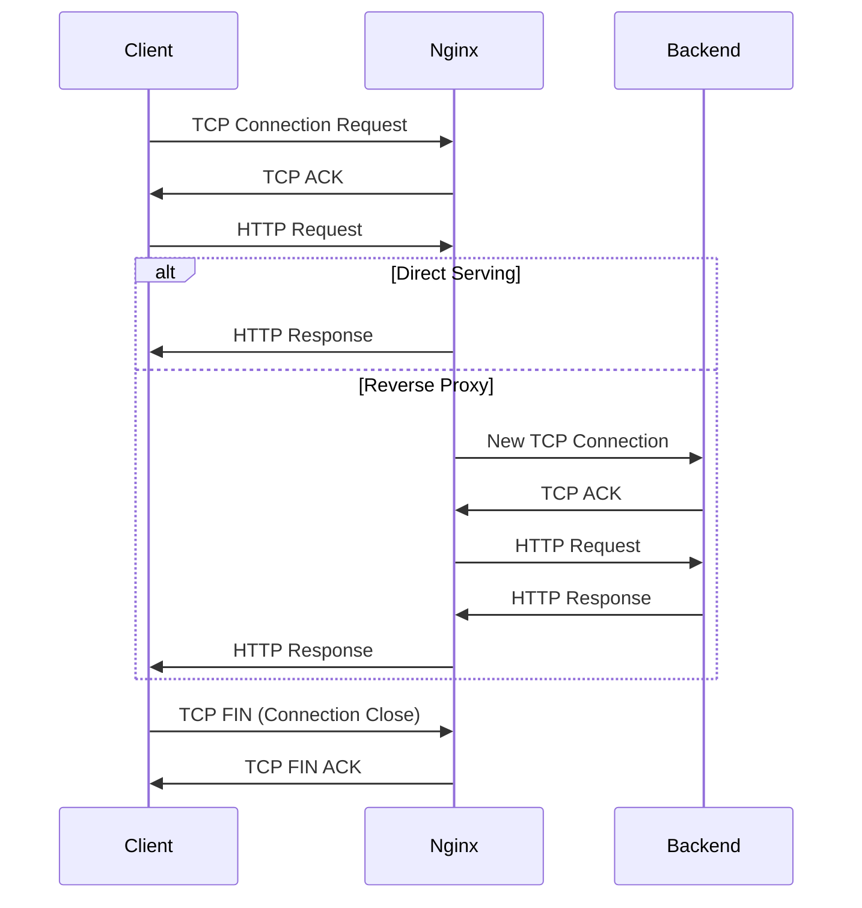

# Nginx Connection Issues

## Introduction

Nginx (pronounced "engine-x") is a popular web server known for its high performance, stability, reliability, and low resource consumption. Despite its robustness, you may occasionally encounter connection issues that prevent your web applications from functioning correctly. This guide will help you understand, diagnose, and resolve common Nginx connection problems.

Connection issues in Nginx can manifest in various ways - from users unable to access your website, to sporadic timeouts, or even complete server failures. Understanding these issues is crucial for maintaining reliable web services.

## Common Nginx Connection Issues

### 1. Connection Refused Errors

One of the most common issues users face is the "Connection Refused" error. This occurs when Nginx isn't running or listening on the expected port.

#### Symptoms
- Browser displays "Connection Refused" error
- `curl` commands return "Connection Refused"
- Log entries showing failed connection attempts

#### Diagnosis

First, verify if Nginx is running:

```bash
sudo systemctl status nginx
# or on non-systemd systems
sudo service nginx status
```

Check if Nginx is listening on the expected ports:

```bash
sudo netstat -tulpn | grep nginx
# or
sudo ss -tulpn | grep nginx
```

#### Solution

If Nginx isn't running, start it:

```bash
sudo systemctl start nginx
# or
sudo service nginx start
```

If Nginx is running but not listening on the expected port, check your configuration:

```bash
sudo nano /etc/nginx/nginx.conf
```

Make sure the `listen` directive in your server block is correctly set:

```nginx
server {
    listen 80;
    # other configuration
}
```

After making changes, validate and reload the configuration:

```bash
sudo nginx -t
sudo systemctl reload nginx
```

### 2. Connection Timeouts

Timeouts occur when Nginx takes too long to establish a connection or process a request.

#### Symptoms
- Browser displays "Connection Timed Out" error
- Slow-loading pages that eventually fail
- Inconsistent access to your web application

#### Diagnosis

Check Nginx error logs for timeout-related messages:

```bash
sudo tail -100 /var/log/nginx/error.log
```

Look for upstream timeout errors or worker connection issues.

#### Solution

Adjust timeout settings in your Nginx configuration:

```nginx
http {
    client_body_timeout 12s;
    client_header_timeout 12s;
    keepalive_timeout 65s;
    send_timeout 10s;
    
    # If you're using upstream servers
    proxy_connect_timeout 60s;
    proxy_send_timeout 60s;
    proxy_read_timeout 60s;
}
```

For high-traffic sites, you might need to increase the number of worker connections:

```nginx
events {
    worker_connections 2048;
}
```

### 3. Too Many Open Files

Nginx might hit the system's limit on open file descriptors, causing connection failures.

#### Symptoms
- Error logs showing "Too many open files" errors
- Sporadic 503 Service Unavailable errors
- Connections failing under high load

#### Diagnosis

Check the current limit set for Nginx:

```bash
cat /proc/$(cat /var/run/nginx.pid)/limits | grep "open files"
```

#### Solution

Increase the open file limit in your systemd service file or init script.

For systemd systems, create an override:

```bash
sudo systemctl edit nginx
```

Add the following content:

```ini
[Service]
LimitNOFILE=30000
```

Then restart Nginx:

```bash
sudo systemctl restart nginx
```

Also, update your Nginx configuration to use the new limits:

```nginx
worker_rlimit_nofile 15000;
```

### 4. Address Already in Use

This error occurs when Nginx tries to bind to a port that's already being used by another process.

#### Symptoms
- Nginx fails to start
- Error logs showing "Address already in use" errors

#### Diagnosis

Find out which process is using the port:

```bash
sudo netstat -tulpn | grep :80
# or
sudo ss -tulpn | grep :80
```

#### Solution

Either:
1. Stop the conflicting process
2. Configure Nginx to use a different port
3. Configure your system to start Nginx after stopping the conflicting service

To change Nginx's port, modify your server block:

```nginx
server {
    listen 8080;
    # other configuration
}
```

## Advanced Connection Issues

### SSL/TLS Connection Problems

Secure connections can fail due to certificate issues, protocol mismatches, or cipher configuration problems.

#### Symptoms
- Browser showing SSL/TLS errors
- "Certificate not trusted" warnings
- Handshake failures

#### Diagnosis

Test your SSL configuration:

```bash
openssl s_client -connect yourdomain.com:443 -tls1_2
```

Use online SSL testing tools like SSL Labs to get a comprehensive report.

#### Solution

Ensure your certificates are valid and properly configured:

```nginx
server {
    listen 443 ssl;
    server_name yourdomain.com;
    
    ssl_certificate /path/to/certificate.crt;
    ssl_certificate_key /path/to/private.key;
    
    # Modern SSL configuration
    ssl_protocols TLSv1.2 TLSv1.3;
    ssl_ciphers HIGH:!aNULL:!MD5;
    ssl_prefer_server_ciphers on;
    
    # Other settings
}
```

### Upstream Connection Issues

When Nginx functions as a reverse proxy, it may encounter issues connecting to backend servers.

#### Symptoms
- 502 Bad Gateway errors
- 504 Gateway Timeout errors
- Inconsistent upstream responses

#### Diagnosis

Check Nginx error logs for upstream connection issues:

```bash
sudo grep "upstream" /var/log/nginx/error.log
```

#### Solution

Adjust upstream connection settings in your Nginx configuration:

```nginx
upstream backend_servers {
    server backend1.example.com max_fails=3 fail_timeout=30s;
    server backend2.example.com max_fails=3 fail_timeout=30s;
    # Add backup servers for redundancy
    server backup.example.com backup;
}

server {
    # Other configuration
    
    location / {
        proxy_pass http://backend_servers;
        proxy_connect_timeout 5s;
        proxy_send_timeout 10s;
        proxy_read_timeout 10s;
        proxy_next_upstream error timeout http_502 http_503 http_504;
    }
}
```

## Diagnosing Connection Issues with Tools

Let's explore some practical tools to diagnose Nginx connection issues:

### Using curl for HTTP Diagnostics

The `curl` command with verbose output can provide valuable insights:

```bash
curl -v http://yourdomain.com
```

This displays the full HTTP exchange, including headers and connection information.

For checking redirect chains:

```bash
curl -IL http://yourdomain.com
```

### Network Diagnostics with tcpdump

For deeper diagnostics, `tcpdump` can capture and analyze network traffic:

```bash
sudo tcpdump -i any port 80 -n
```

This captures all traffic on port 80, helping you identify connection issues at the network level.

### Connection Flow Visualization

Here's a diagram showing a typical Nginx connection flow:



This visualization helps understand where connection issues might occur in the request/response chain.

## Best Practices for Preventing Connection Issues

### 1. Regular Monitoring

Set up monitoring for Nginx with tools like Prometheus and Grafana to track:

- Active connections
- Connection rates
- Error rates
- Response times

This proactive approach helps identify issues before they impact users.

### 2. Load Testing

Perform regular load testing to ensure your Nginx configuration can handle expected traffic spikes:

```bash
ab -n 1000 -c 100 http://yourdomain.com/
```

Or use more sophisticated tools like JMeter or Locust for comprehensive testing.

### 3. Nginx Configuration Optimization

Optimize your Nginx configuration for your specific workload:

```nginx
# Worker processes: typically one per CPU core
worker_processes auto;

# Worker connections: adjust based on workload
events {
    worker_connections 2048;
    multi_accept on;
}

http {
    # Enable sendfile for efficient file transfers
    sendfile on;
    
    # TCP optimizations
    tcp_nopush on;
    tcp_nodelay on;
    
    # Keep-alive connections
    keepalive_timeout 65;
    keepalive_requests 100;
    
    # Buffer sizes
    client_body_buffer_size 10K;
    client_header_buffer_size 1k;
    client_max_body_size 8m;
    large_client_header_buffers 2 1k;
    
    # Timeouts
    client_body_timeout 12;
    client_header_timeout 12;
    send_timeout 10;
}
```

## Practical Example: Troubleshooting a Real Connection Issue

Let's walk through a practical example of troubleshooting a connection issue:

**Scenario**: Users are reporting intermittent 504 Gateway Timeout errors when accessing your web application.

**Step 1**: Check Nginx error logs

```bash
sudo tail -100 /var/log/nginx/error.log
```

You notice entries like:
```
2023/01/15 12:34:56 [error] 1234#0: *5678 upstream timed out (110: Connection timed out) while reading response header from upstream, client: 192.168.1.1, server: example.com, request: "GET /api/data HTTP/1.1", upstream: "http://10.0.0.5:8080/api/data", host: "example.com"
```

**Step 2**: Verify the upstream service

```bash
curl -v http://10.0.0.5:8080/api/data
```

The request hangs and eventually times out.

**Step 3**: Check system resources on the backend server

```bash
ssh user@10.0.0.5
top
```

You discover the backend application is consuming too much CPU under load.

**Step 4**: Implement a solution

1. Add more backend servers to the upstream pool
2. Increase timeout values for slower endpoints
3. Implement caching for frequently accessed data

Updated Nginx configuration:

```nginx
# Add more backend servers
upstream api_servers {
    server 10.0.0.5:8080;
    server 10.0.0.6:8080;
    server 10.0.0.7:8080;
    
    keepalive 32;
}

server {
    # Other configuration
    
    # Increase timeouts for API endpoints
    location /api/ {
        proxy_pass http://api_servers;
        proxy_connect_timeout 10s;
        proxy_send_timeout 30s;
        proxy_read_timeout 30s;
        
        # Enable caching for GET requests
        proxy_cache api_cache;
        proxy_cache_valid 200 10m;
        proxy_cache_methods GET;
        proxy_cache_lock on;
        
        # Add response headers for debugging
        add_header X-Cache-Status $upstream_cache_status;
    }
}
```

## Summary

In this guide, we've explored common Nginx connection issues and provided practical solutions for diagnosing and resolving them. Remember these key points:

- Connection issues can occur at various layers: Nginx configuration, system resources, network, or upstream services
- Regular monitoring and proactive maintenance help prevent many connection problems
- Understanding your traffic patterns allows you to optimize Nginx configuration appropriately
- Proper logging and diagnostic tools are essential for quick issue resolution

By applying these principles, you'll be better equipped to maintain reliable Nginx-powered web services with minimal downtime.

## Additional Resources

- [Official Nginx Documentation](https://nginx.org/en/docs/)
- [Nginx Troubleshooting Guide](https://www.nginx.com/resources/wiki/start/topics/tutorials/troubleshooting/)
- [Digital Ocean's Nginx Configuration Guide](https://www.digitalocean.com/community/tutorials/how-to-optimize-nginx-configuration)

## Practice Exercises

1. Set up a test Nginx server and intentionally create connection issues (wrong port, firewall blocks, etc.) to practice troubleshooting.
2. Configure Nginx as a reverse proxy to multiple backend services and implement proper error handling.
3. Implement a monitoring solution for your Nginx server using Prometheus and Grafana.
4. Conduct a load test on your Nginx server to identify potential bottlenecks before they affect production.
5. Review your current Nginx configuration and optimize it based on the best practices outlined in this guide.