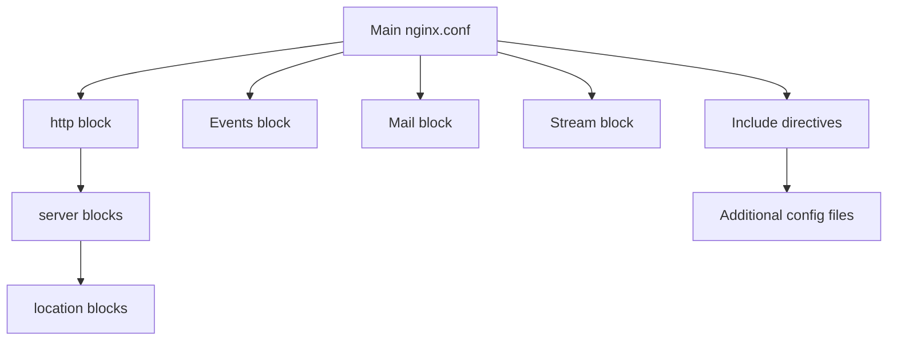

# Nginx Configuration Debugging

## Introduction

Nginx (pronounced "engine-x") is a powerful web server, reverse proxy, and load balancer that's widely used in production environments. However, as with any complex system, you'll inevitably encounter configuration issues that need debugging. This guide will walk you through systematic approaches to identify, troubleshoot, and resolve Nginx configuration problems.

Debugging Nginx configurations is an essential skill for web developers and system administrators alike. By the end of this guide, you'll have a comprehensive toolkit for diagnosing and fixing common Nginx issues.

## Prerequisites

Before diving into debugging techniques, ensure you have:

- Nginx installed on your system
- Basic familiarity with Nginx configuration syntax
- Access to server logs
- Administrator/sudo privileges

## Basic Configuration Validation

### Syntax Checking

The first step in debugging any Nginx configuration is to verify its syntax. Nginx provides a built-in tool for this purpose.

```bash
sudo nginx -t
```

This command performs a syntax check without actually applying the configuration changes. It will output something like:

```
nginx: the configuration file /etc/nginx/nginx.conf syntax is ok
nginx: configuration file /etc/nginx/nginx.conf test is successful
```

If there are syntax errors, the output will pinpoint the problem:

```
nginx: [emerg] directive "server_naem" is not terminated by ";" in /etc/nginx/sites-enabled/default:12
nginx: configuration file /etc/nginx/nginx.conf test failed
```

### Common Syntax Errors

1. **Missing semicolons**: Most directives in Nginx require a semicolon (`;`) at the end
2. **Incorrect brackets**: Mismatched curly braces `{` `}`
3. **Typos in directive names**: Like `server_naem` instead of `server_name`
4. **Invalid directive values**: Using unsupported values for directives

### Testing with a Specific Configuration File

If you're working with a non-standard configuration file location, specify it explicitly:

```bash
sudo nginx -t -c /path/to/your/nginx.conf
```

## Understanding Nginx Configuration Structure

To effectively debug Nginx, you need to understand its configuration hierarchy:



### Common Configuration Locations

- Main configuration: `/etc/nginx/nginx.conf`
- Site configurations: `/etc/nginx/sites-available/` and `/etc/nginx/sites-enabled/`
- Module configurations: `/etc/nginx/conf.d/`
- Log files: `/var/log/nginx/`

## Debugging with Logs

Logs are your best friend when debugging Nginx issues. By default, Nginx maintains two primary log files:

- Access log: Records all requests to your server
- Error log: Records any errors encountered

### Access Log Analysis

The access log typically resides at `/var/log/nginx/access.log` and records information about each request in this format:

```
192.168.1.105 - - [20/Feb/2023:18:40:32 +0000] "GET /index.html HTTP/1.1" 200 4025 "-" "Mozilla/5.0"
```

This shows:
- Client IP address
- Timestamp
- HTTP request method and path
- Response status code
- Response size
- Referrer (if any)
- User agent

### Error Log Analysis

The error log (usually at `/var/log/nginx/error.log`) contains details about configuration issues and runtime errors:

```
2023/02/20 18:42:16 [error] 1234#0: *5 open() "/usr/share/nginx/html/nonexistent.html" failed (2: No such file or directory), client: 192.168.1.105, server: example.com, request: "GET /nonexistent.html HTTP/1.1", host: "example.com"
```

### Increasing Log Verbosity

For more detailed debugging information, you can increase the error log verbosity in your `nginx.conf`:

```nginx
error_log /var/log/nginx/error.log debug;
```

Verbosity levels from least to most verbose:
- `emerg`
- `alert`
- `crit`
- `error` (default)
- `warn`
- `notice`
- `info`
- `debug`

Remember to revert to a less verbose level in production as debug logging can generate large log files.

## Practical Debugging Scenarios

### Scenario 1: 404 Not Found Errors

When your Nginx server returns 404 errors for content that should exist:

1. **Check the `root` directive** in your server block:

```nginx
server {
    listen 80;
    server_name example.com;
    
    # Is this path correct?
    root /var/www/html;
    
    # ...
}
```

2. **Verify file permissions**:

```bash
ls -la /var/www/html/
```

3. **Check the location blocks** that might be overriding the default behavior:

```nginx
location / {
    # This try_files directive attempts to serve the requested URI, 
    # then falls back to index.html if not found
    try_files $uri $uri/ /index.html;
}
```

### Scenario 2: 502 Bad Gateway Errors

A 502 error typically indicates that Nginx cannot communicate with an upstream service:

1. **Check if your backend service is running**:

```bash
sudo systemctl status php-fpm
# or
sudo systemctl status application-server
```

2. **Verify the upstream configuration**:

```nginx
upstream backend {
    server 127.0.0.1:9000;
}

server {
    # ...
    location ~ \.php$ {
        include fastcgi_params;
        fastcgi_pass backend;
        # ...
    }
}
```

3. **Check Nginx error logs** for specific connection errors:

```bash
sudo tail -f /var/log/nginx/error.log
```

### Scenario 3: SSL Certificate Issues

When SSL/TLS connections fail:

1. **Verify certificate paths and permissions**:

```nginx
server {
    listen 443 ssl;
    server_name example.com;
    
    ssl_certificate /etc/nginx/ssl/example.com.crt;
    ssl_certificate_key /etc/nginx/ssl/example.com.key;
    
    # ...
}
```

2. **Check certificate validity**:

```bash
openssl x509 -in /etc/nginx/ssl/example.com.crt -text -noout
```

3. **Test the SSL configuration**:

```bash
curl -Ik https://example.com
```

## Advanced Debugging Techniques

### Using curl for Request Testing

The `curl` command is invaluable for testing how Nginx handles requests:

```bash
# Basic GET request
curl -I http://example.com

# With custom headers
curl -I -H "Host: example.com" http://localhost

# Testing specific URL patterns
curl -I http://example.com/api/users/
```

### Debugging Rewrite Rules

Rewrite rules can be complex and difficult to debug. Enable rewrite logging to see how Nginx processes them:

```nginx
server {
    # ...
    rewrite_log on;
    error_log /var/log/nginx/rewrite.log notice;
    
    location / {
        rewrite ^/old-path/(.*)$ /new-path/$1 permanent;
        # ...
    }
}
```

### Using the debug_connection Directive

To debug specific client connections:

```nginx
events {
    # Only log debug info for these IPs
    debug_connection 192.168.1.100;
    debug_connection 2001:0db8::/32;
}
```

## Tools for Nginx Debugging

### Nginx Amplify

[Nginx Amplify](https://amplify.nginx.com/) provides monitoring, configuration analysis, and recommendations.

### GoAccess

A real-time web log analyzer that provides a terminal-based dashboard:

```bash
goaccess /var/log/nginx/access.log -c
```

### Nginx Config Formatters and Linters

These tools can help identify configuration issues before they cause problems:

```bash
# Using nginxfmt (Python-based formatter)
pip install nginxfmt
nginxfmt /etc/nginx/nginx.conf
```

## Best Practices for Nginx Configuration Management

### Use Include Files

Break your configuration into logical, manageable pieces:

```nginx
# In main nginx.conf
http {
    include /etc/nginx/mime.types;
    include /etc/nginx/conf.d/*.conf;
    include /etc/nginx/sites-enabled/*;
}
```

### Keep Backups Before Changes

Always backup configurations before making changes:

```bash
sudo cp /etc/nginx/nginx.conf /etc/nginx/nginx.conf.bak
```

### Use Version Control

Store configurations in a version control system like Git:

```bash
# Initialize a Git repo for your Nginx configs
cd /etc/nginx
sudo git init
sudo git add .
sudo git commit -m "Initial configuration"
```

### Implement a Testing Environment

Test configuration changes in a staging environment before applying them to production.

## Summary

Debugging Nginx configurations requires a systematic approach:

1. Start with basic syntax validation using `nginx -t`
2. Examine log files for clues about the issue
3. Understand the configuration hierarchy and how directives interact
4. Use specialized tools to identify and resolve complex problems
5. Follow best practices to prevent configuration issues

With the techniques covered in this guide, you should be well-equipped to tackle most Nginx configuration challenges. Remember that effective debugging is as much about prevention as it is about solving problems after they occur.

## Additional Resources

- [Official Nginx Documentation](https://nginx.org/en/docs/)
- [Nginx Cookbook](https://www.nginx.com/resources/library/complete-nginx-cookbook/)
- [Digital Ocean Nginx Tutorials](https://www.digitalocean.com/community/tutorials/series/how-to-configure-nginx)

## Exercises

1. Intentionally introduce a syntax error in an Nginx configuration file and use `nginx -t` to identify it.
2. Create a configuration that triggers a 404 error, then debug and fix it.
3. Set up a proxy pass configuration to a non-existent backend and debug the resulting 502 error.
4. Implement logging for a specific IP address using the `debug_connection` directive.
5. Create a complex rewrite rule and use `rewrite_log` to understand how it processes different URL patterns.