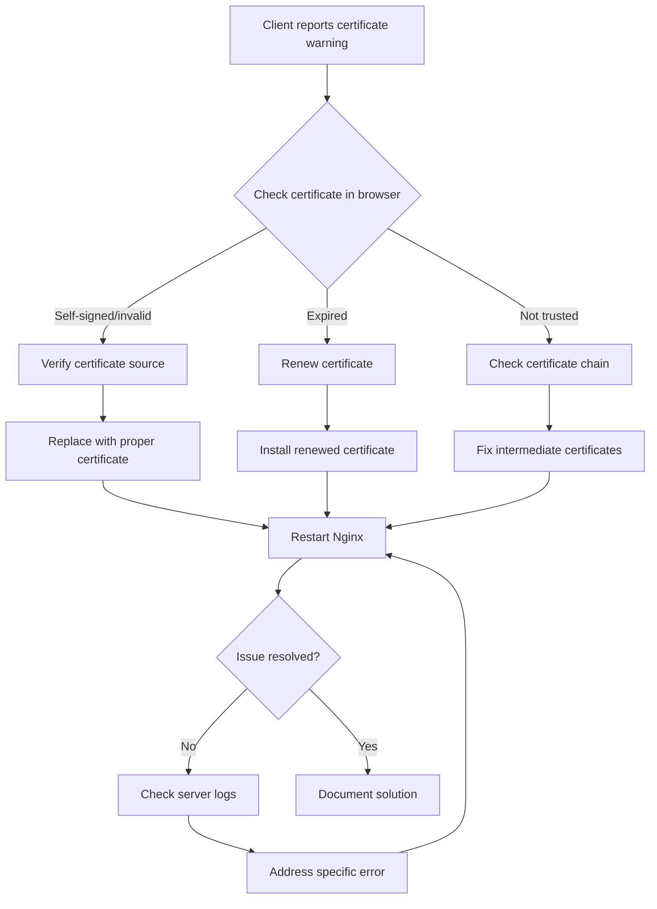

# Nginx SSL Troubleshooting

## Introduction

Secure Socket Layer (SSL) and its successor Transport Layer Security (TLS) are protocols that provide secure communication over a computer network. When configuring Nginx as a web server or reverse proxy, SSL/TLS setup is crucial for securing your applications. However, SSL configuration can sometimes be challenging, with various issues that might arise during setup or operation.

This guide aims to help you identify, diagnose, and resolve common SSL-related problems in Nginx. Whether you're a beginner facing your first SSL error or an experienced developer troubleshooting a complex certificate chain issue, this guide will provide you with the tools and knowledge to solve your SSL problems effectively.

## Prerequisites

Before diving into troubleshooting, ensure you have:

- Basic understanding of Nginx configuration
- Access to your server (SSH)
- Administrative privileges
- Basic knowledge of SSL/TLS concepts

## Common SSL Issues in Nginx

### 1. Certificate Not Found

One of the most common issues is Nginx being unable to find your SSL certificate files.

#### Symptoms:
- Nginx fails to start
- Error logs show `SSL_CTX_use_PrivateKey_file() failed` or `SSL_CTX_use_certificate_file() failed`

#### Solution:

Check your Nginx configuration file (`nginx.conf` or site-specific config in `/etc/nginx/sites-available/`):

```nginx
server {
    listen 443 ssl;
    server_name example.com;
    
    ssl_certificate /path/to/certificate.crt;
    ssl_certificate_key /path/to/private.key;
    
    # Other configurations...
}
```

Ensure that:
1. The paths to your certificate and key files are correct
2. The files exist at the specified locations
3. Nginx has read permissions for these files

You can verify file existence and permissions with:

```bash
# Check if files exist
ls -la /path/to/certificate.crt /path/to/private.key

# Set correct permissions if needed
chmod 644 /path/to/certificate.crt
chmod 600 /path/to/private.key

# Make sure nginx user can read these files
chown nginx:nginx /path/to/certificate.crt /path/to/private.key
```

### 2. Invalid Certificate Format

Nginx requires certificates in PEM format. Issues can arise if your certificate is in a different format.

#### Symptoms:
- Nginx fails to start
- Error logs mention invalid certificate format

#### Solution:

If your certificate is in DER format, convert it to PEM:

```bash
openssl x509 -in certificate.der -inform DER -out certificate.crt -outform PEM
```

For PKCS#12 (.pfx or .p12) format:

```bash
# Extract certificate
openssl pkcs12 -in certificate.pfx -clcerts -nokeys -out certificate.crt

# Extract private key
openssl pkcs12 -in certificate.pfx -nocerts -nodes -out private.key
```

Remember to secure your private key after extraction:

```bash
chmod 600 private.key
```

### 3. Certificate Chain Issues

Incomplete certificate chains are another common problem that can cause browsers to show security warnings.

#### Symptoms:
- Browser warnings about untrusted certificates
- SSL Labs test shows incomplete chain
- Errors like "missing intermediate certificate"

#### Solution:

Create a complete certificate chain file by concatenating your certificate with the intermediate certificates:

```bash
cat your_certificate.crt intermediate_certificate.crt > fullchain.crt
```

Then update your Nginx configuration:

```nginx
server {
    listen 443 ssl;
    server_name example.com;
    
    ssl_certificate /path/to/fullchain.crt;
    ssl_certificate_key /path/to/private.key;
    
    # Other configurations...
}
```

You can verify your certificate chain using online tools like [SSL Labs Server Test](https://www.ssllabs.com/ssltest/).

### 4. Certificate-Key Mismatch

Your certificate and private key must be a matching pair.

#### Symptoms:
- Nginx fails to start
- Error logs show `SSL: error:0B080074:x509 certificate routines:X509_check_private_key:key values mismatch`

#### Solution:

Verify that your certificate and key match by comparing their modulus values:

```bash
# Check certificate modulus
openssl x509 -noout -modulus -in certificate.crt | openssl md5

# Check key modulus
openssl rsa -noout -modulus -in private.key | openssl md5
```

If the outputs don't match, you're using the wrong certificate or key file. You'll need to either:
1. Find the correct matching key for your certificate
2. Generate a new certificate signing request (CSR) using your key and obtain a new certificate

### 5. SSL Protocol Version Issues

Modern browsers have deprecated older SSL/TLS versions due to security vulnerabilities.

#### Symptoms:
- Errors like "Obsolete connection settings" in browsers
- "This site uses an unsupported protocol" warnings
- Poor scores on SSL testing tools

#### Solution:

Update your Nginx configuration to use modern protocols:

```nginx
server {
    # Other configurations...
    
    ssl_protocols TLSv1.2 TLSv1.3;
    ssl_prefer_server_ciphers on;
    ssl_ciphers ECDHE-ECDSA-AES128-GCM-SHA256:ECDHE-RSA-AES128-GCM-SHA256:ECDHE-ECDSA-AES256-GCM-SHA384:ECDHE-RSA-AES256-GCM-SHA384:ECDHE-ECDSA-CHACHA20-POLY1305:ECDHE-RSA-CHACHA20-POLY1305:DHE-RSA-AES128-GCM-SHA256:DHE-RSA-AES256-GCM-SHA384;
    
    # Other SSL settings...
}
```

This configuration:
1. Enables only TLS 1.2 and TLS 1.3
2. Prioritizes server cipher preferences
3. Uses strong, modern cipher suites

### 6. SSL Handshake Failures

SSL handshake failures can occur for various reasons, including misconfigurations, network issues, or client-side problems.

#### Symptoms:
- Error logs show `SSL_do_handshake() failed` or similar messages
- Clients unable to connect with "Connection refused" errors
- Timeouts during connection establishment

#### Diagnosing:

Check Nginx error logs first:

```bash
tail -f /var/log/nginx/error.log
```

For more detailed SSL handshake information, use OpenSSL's s_client tool:

```bash
openssl s_client -connect example.com:443 -debug
```

This will show the entire SSL handshake process and any errors that occur.

#### Common Solutions:

1. **Cipher Suite Incompatibility**:
   - Update your `ssl_ciphers` directive to include ciphers supported by your clients

2. **Server Name Indication (SNI) Issues**:
   - Ensure your client supports SNI if you're hosting multiple sites
   - Test with: `openssl s_client -connect example.com:443 -servername example.com`

3. **Maximum Fragment Length Issues**:
   - Try adjusting `ssl_buffer_size` in your Nginx configuration

### 7. Expired Certificates

SSL certificates have an expiry date, and expired certificates trigger security warnings.

#### Symptoms:
- Browser shows "Your connection is not private" warnings
- Error messages mentioning expired certificates
- Certificate viewers show past expiry date

#### Solution:

Check certificate expiration with:

```bash
openssl x509 -in certificate.crt -noout -enddate
```

If expired, you need to renew your SSL certificate through your certificate provider or Let's Encrypt:

```bash
# For Let's Encrypt with Certbot
certbot renew
```

After renewal, restart Nginx:

```bash
systemctl restart nginx
```

Consider setting up automatic renewals to prevent future expirations:

```bash
# Create a cron job for Let's Encrypt renewals
echo "0 3 * * * /usr/bin/certbot renew --quiet" | sudo tee -a /etc/crontab
```

## Diagnostic Tools

These tools will help you identify and troubleshoot SSL issues:

### 1. Nginx Testing

Before applying changes, test your Nginx configuration:

```bash
nginx -t
```

This checks for syntax errors and shows where they occur.

### 2. OpenSSL Commands

OpenSSL provides powerful diagnostic capabilities:

```bash
# Check certificate information
openssl x509 -in certificate.crt -text -noout

# Test a connection
openssl s_client -connect example.com:443 -showcerts
```

### 3. Browser Developer Tools

Most modern browsers include network analysis tools:

1. Open your browser's developer tools (F12 or Ctrl+Shift+I)
2. Navigate to the "Network" tab
3. Look for SSL/TLS handshake details in the connection information

### 4. Online SSL Testers

Several websites offer free SSL configuration analysis:

- SSL Labs Server Test
- DigiCert SSL Checker
- SSL Shopper Checker

## Best Practices for Nginx SSL Configuration

To avoid common issues, follow these best practices:

```nginx
server {
    listen 443 ssl http2;
    server_name example.com;
    
    # Certificate Configuration
    ssl_certificate /path/to/fullchain.crt;
    ssl_certificate_key /path/to/private.key;
    
    # Modern SSL Configuration
    ssl_protocols TLSv1.2 TLSv1.3;
    ssl_prefer_server_ciphers on;
    ssl_ciphers ECDHE-ECDSA-AES128-GCM-SHA256:ECDHE-RSA-AES128-GCM-SHA256:ECDHE-ECDSA-AES256-GCM-SHA384:ECDHE-RSA-AES256-GCM-SHA384:ECDHE-ECDSA-CHACHA20-POLY1305:ECDHE-RSA-CHACHA20-POLY1305:DHE-RSA-AES128-GCM-SHA256:DHE-RSA-AES256-GCM-SHA384;
    
    # SSL Performance Optimizations
    ssl_session_cache shared:SSL:10m;
    ssl_session_timeout 10m;
    ssl_session_tickets off;
    
    # OCSP Stapling
    ssl_stapling on;
    ssl_stapling_verify on;
    resolver 8.8.8.8 8.8.4.4 valid=300s;
    resolver_timeout 5s;
    
    # Security Headers
    add_header Strict-Transport-Security "max-age=63072000; includeSubDomains; preload" always;
    add_header X-Content-Type-Options nosniff;
    add_header X-Frame-Options SAMEORIGIN;
    add_header X-XSS-Protection "1; mode=block";
    
    # Other configurations...
}
```

This configuration:
1. Enables HTTP/2 for better performance
2. Uses only modern, secure protocols and ciphers
3. Implements session caching for performance
4. Enables OCSP stapling for faster certificate validation
5. Adds security headers like HSTS

## Real-World Troubleshooting Workflow

Let's walk through a practical troubleshooting example:

### Scenario: Clients reporting certificate warnings



### Step-by-Step Process:

1. **Identify the exact warning message** the client is seeing

2. **Check certificate details** using your browser:
   - Click on the padlock icon in the address bar
   - View certificate details
   - Note any errors or warnings

3. **Verify certificate status** on the server:
   ```bash
   openssl x509 -in /path/to/certificate.crt -text -noout | grep "Not After"
   ```

4. **Inspect certificate chain** completeness:
   ```bash
   openssl s_client -connect example.com:443 -showcerts
   ```

5. **Fix identified issues** (renewal, chain completion, etc.)

6. **Restart Nginx** and verify:
   ```bash
   systemctl restart nginx
   curl -Ivs https://example.com 2>&1 | grep "HTTP"
   ```

## Common Misconfigurations to Avoid

1. **Missing redirects from HTTP to HTTPS**
   - Always implement proper redirects to ensure secure connections

   ```nginx
   server {
       listen 80;
       server_name example.com;
       return 301 https://$server_name$request_uri;
   }
   ```

2. **Using weak Diffie-Hellman parameters**
   - Generate strong DH parameters:
   
   ```bash
   openssl dhparam -out /etc/nginx/dhparam.pem 2048
   ```
   
   - Include in your Nginx configuration:
   
   ```nginx
   ssl_dhparam /etc/nginx/dhparam.pem;
   ```

3. **Not enabling HTTP Strict Transport Security (HSTS)**
   - Add the header to enforce HTTPS:
   
   ```nginx
   add_header Strict-Transport-Security "max-age=63072000; includeSubDomains; preload" always;
   ```

4. **Forgetting to update paths after certificate renewal**
   - Automate the renewal and deployment process to avoid this issue

## Summary

SSL troubleshooting in Nginx involves several key areas:

1. **Certificate and key file issues**: Ensuring files exist, have correct permissions, and match each other
2. **Certificate chain completeness**: Providing all intermediate certificates
3. **Protocol and cipher configuration**: Using modern, secure protocols and ciphers
4. **Performance optimization**: Implementing session caching and OCSP stapling
5. **Regular maintenance**: Keeping certificates up-to-date and monitoring for issues

By following the troubleshooting steps and best practices outlined in this guide, you should be able to resolve most SSL-related issues in your Nginx configuration and maintain a secure, properly functioning web server.

## Additional Resources

- [Nginx Documentation on HTTPS Configuration](https://nginx.org/en/docs/http/configuring_https_servers.html)
- [Mozilla SSL Configuration Generator](https://ssl-config.mozilla.org/)
- [Let's Encrypt Documentation](https://letsencrypt.org/docs/)
- [SSL Labs Best Practices](https://github.com/ssllabs/research/wiki/SSL-and-TLS-Deployment-Best-Practices)

## Exercises

1. **Certificate Inspection**: Use OpenSSL to examine a certificate and identify its expiration date, issuer, and subject.
   
2. **Fixing Chain Issues**: Create a proper certificate chain file from individual certificate files.
   
3. **Security Scan**: Use SSL Labs to test your server's SSL configuration and implement improvements based on the results.
   
4. **Automated Renewal**: Set up an automated certificate renewal process using certbot or another tool.
   
5. **Debugging Practice**: Intentionally introduce an SSL configuration error, then use the troubleshooting techniques from this guide to identify and fix it.