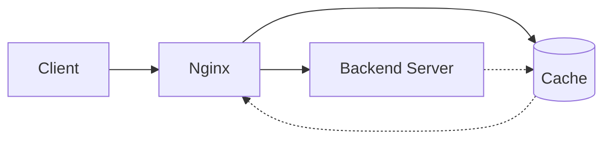

# Nginx Cache Problems

When working with Nginx as a web server or reverse proxy, caching is one of its most powerful features for improving performance. However, caching can sometimes cause confusing issues that are difficult to debug. This guide will help you understand, identify, and solve common Nginx caching problems.

## Introduction to Nginx Caching

Nginx can cache responses from upstream servers (like your application servers) to serve content faster and reduce the load on backend systems. But when caching doesn't work as expected, it can lead to outdated content, inconsistent behavior, or performance problems.



## Common Nginx Caching Problems

### 1. Cache Not Being Used

One of the most common issues is that Nginx isn't caching content even though you've configured it to do so.

#### Symptoms
- High load on backend servers
- Slow response times
- No cache files in your cache directory

#### Troubleshooting Steps

**Check if caching is properly configured:**

```nginx
http {
    proxy_cache_path /path/to/cache levels=1:2 keys_zone=my_cache:10m max_size=10g inactive=60m;
    
    server {
        location / {
            proxy_cache my_cache;
            proxy_pass http://backend;
            proxy_cache_valid 200 302 10m;
            proxy_cache_valid 404 1m;
        }
    }
}
```

**Verify cache headers in responses:**

```bash
curl -I http://yourwebsite.com/
```

Expected output:
```
HTTP/1.1 200 OK
Server: nginx/1.20.2
Date: Fri, 14 Mar 2025 12:00:00 GMT
Content-Type: text/html
X-Cache-Status: HIT
```

**Add debug headers to see cache status:**

```nginx
add_header X-Cache-Status $upstream_cache_status;
```

This will add a header showing one of the following values:
- `MISS` - Content was not found in the cache
- `HIT` - Content was served from the cache
- `BYPASS` - Cache was bypassed
- `EXPIRED` - Content in the cache has expired
- `STALE` - Content is stale but was served from the cache

### 2. Cache Not Updating

Another common issue is when Nginx serves stale content and doesn't refresh the cache.

#### Symptoms
- Outdated content being served
- Changes to the backend not reflecting on the site
- Cache files have old timestamps

#### Troubleshooting Steps

**Check cache key configuration:**

```nginx
proxy_cache_key "$scheme$request_method$host$request_uri";
```

**Force cache refresh by adding cache busting parameters:**

For testing, you can add a query parameter to force a new cache entry:
```
https://yourwebsite.com/page?_refresh=123456789
```

**Implement cache purging:**

```nginx
location ~ /purge(/.*) {
    allow 127.0.0.1;
    deny all;
    proxy_cache_purge my_cache "$scheme$request_method$host$1";
}
```

You can then purge a cache entry with:
```bash
curl -X PURGE http://yourwebsite.com/path/to/resource
```

### 3. Cache Disk Usage Problems

Nginx cache can sometimes grow too large and fill up your disk space.

#### Symptoms
- Disk space warnings
- Nginx unable to write new cache entries
- System slowdowns

#### Troubleshooting Steps

**Check current disk usage:**

```bash
du -sh /path/to/cache
```

**Configure proper cache size limits:**

```nginx
proxy_cache_path /path/to/cache levels=1:2 keys_zone=my_cache:10m max_size=10g inactive=60m use_temp_path=off;
```

The important parameters here are:
- `max_size=10g` - Maximum size of the cache
- `inactive=60m` - How long to keep inactive entries

**Manually clean the cache if necessary:**

```bash
find /path/to/cache -type f -mtime +7 -delete
```

This removes cache files older than 7 days.

### 4. Cache Inconsistency Across Multiple Nginx Instances

When running multiple Nginx servers, cache inconsistency can occur.

#### Symptoms
- Different content served from different servers
- Intermittent cache misses
- Unpredictable behavior for users

#### Solution: Implement Shared Cache or Cache Synchronization

**Option 1: Use a shared network filesystem:**

```nginx
proxy_cache_path /shared/network/path/cache levels=1:2 keys_zone=shared_cache:10m max_size=10g;
```

**Option 2: Implement cache synchronization through purging:**

When content changes, send purge requests to all Nginx instances:

```bash
for server in server1 server2 server3; do
  curl -X PURGE http://$server/path/to/resource
done
```

### 5. Caching Dynamic Content Incorrectly

Sometimes Nginx might cache content that should be dynamic.

#### Symptoms
- Personalized content showing incorrect information
- Session-specific data being shared between users
- Forms or interactive elements not working properly

#### Troubleshooting Steps

**Check if cookies or headers should bypass cache:**

```nginx
# Skip cache for authenticated users
proxy_cache_bypass $cookie_sessionid;
proxy_no_cache $cookie_sessionid;

# Don't cache requests with specific headers
proxy_cache_bypass $http_cache_control;
proxy_no_cache $http_pragma;
```

**Use vary headers to create different cache entries:**

```nginx
proxy_set_header Accept-Encoding "";
proxy_hide_header Vary;
proxy_set_header Vary Accept-Encoding;
```

This creates separate cache entries for different encodings.

## Practical Examples

### Example 1: Setting Up Cache with Debug Headers

Let's implement a caching configuration with proper debugging headers:

```nginx
http {
    proxy_cache_path /var/cache/nginx levels=1:2 keys_zone=my_cache:10m max_size=1g inactive=60m;
    
    server {
        listen 80;
        server_name example.com;
        
        location / {
            proxy_cache my_cache;
            proxy_cache_key "$scheme$request_method$host$request_uri";
            proxy_cache_valid 200 302 10m;
            proxy_cache_valid 404 1m;
            proxy_cache_use_stale error timeout updating http_500 http_502 http_503 http_504;
            proxy_cache_lock on;
            
            # Debug headers
            add_header X-Cache-Status $upstream_cache_status;
            add_header X-Cache-Key "$scheme$request_method$host$request_uri";
            
            proxy_pass http://backend;
        }
    }
}
```

### Example 2: Implementing Conditional Caching

This example shows how to cache different content types for different durations and bypass cache for certain requests:

```nginx
http {
    proxy_cache_path /var/cache/nginx levels=1:2 keys_zone=my_cache:10m max_size=1g inactive=60m;
    
    map $request_uri $no_cache {
        default 0;
        ~*/admin/* 1;
        ~*/cart/* 1;
        ~*/checkout/* 1;
    }
    
    server {
        listen 80;
        server_name example.com;
        
        location / {
            proxy_cache my_cache;
            proxy_cache_key "$scheme$request_method$host$request_uri";
            
            # Don't cache admin, cart, or checkout pages
            proxy_no_cache $no_cache;
            proxy_cache_bypass $no_cache;
            
            # Cache different content types differently
            proxy_cache_valid 200 302 60m;  # Regular responses
            proxy_cache_valid 404 5m;       # Not found pages
            
            # Cache static content longer
            location ~* \.(jpg|jpeg|png|gif|ico|css|js)$ {
                proxy_cache_valid 200 302 24h;
            }
            
            proxy_pass http://backend;
        }
    }
}
```

### Example 3: Implementing Cache Purging

This example shows how to set up cache purging:

```nginx
http {
    proxy_cache_path /var/cache/nginx levels=1:2 keys_zone=my_cache:10m max_size=1g inactive=60m;
    
    server {
        listen 80;
        server_name example.com;
        
        # Cache purge location
        location ~ /purge(/.*) {
            allow 127.0.0.1;  # Only allow from localhost
            allow 192.168.0.0/24;  # Allow from internal network
            deny all;  # Deny from everywhere else
            
            proxy_cache_purge my_cache "$scheme$request_method$host$1";
        }
        
        location / {
            proxy_cache my_cache;
            proxy_cache_key "$scheme$request_method$host$request_uri";
            proxy_cache_valid 200 302 10m;
            
            proxy_pass http://backend;
        }
    }
}
```

To purge a specific URL from the cache:

```bash
curl -X PURGE http://example.com/purge/some/path
```

## Debugging Tools for Nginx Cache

### 1. Check Cache Status with Headers

The simplest way to check if content is being cached:

```bash
curl -I http://your-website.com/
```

Look for the `X-Cache-Status` header in the response.

### 2. Examine Cache Files Directly

You can examine the cache files on disk:

```bash
ls -la /path/to/cache/
hexdump -C /path/to/cache/some-cache-file
```

### 3. Nginx Cache Inspector

For more complex setups, you can use tools like `nginx-cache-inspector`:

```bash
npm install -g nginx-cache-inspector
nginx-cache-inspector --path=/path/to/cache --keys-zone=my_cache
```

## Summary

Nginx caching is a powerful feature that can dramatically improve your site's performance, but it can also cause issues when not configured correctly. The most common caching problems involve:

1. Cache not being used at all
2. Cache not updating when content changes
3. Cache taking up too much disk space
4. Cache inconsistency across multiple servers
5. Incorrect caching of dynamic content

By understanding how Nginx caching works and knowing how to troubleshoot these common issues, you'll be able to take full advantage of Nginx's caching capabilities while avoiding potential pitfalls.

## Additional Resources

- [Nginx Documentation: Content Caching](https://nginx.org/en/docs/http/ngx_http_proxy_module.html#proxy_cache)
- [Nginx Blog: Nginx Caching Guide](https://www.nginx.com/blog/nginx-caching-guide/)

## Exercises

1. Configure Nginx to cache all static files for 1 day, but HTML files for only 1 hour.
2. Set up a cache purging mechanism that allows purging from a specific IP address.
3. Implement conditional caching that bypasses the cache for logged-in users but caches content for anonymous visitors.
4. Configure Nginx to store separate cache entries for mobile and desktop users.
5. Set up monitoring to alert you when your cache hit ratio drops below 80%.