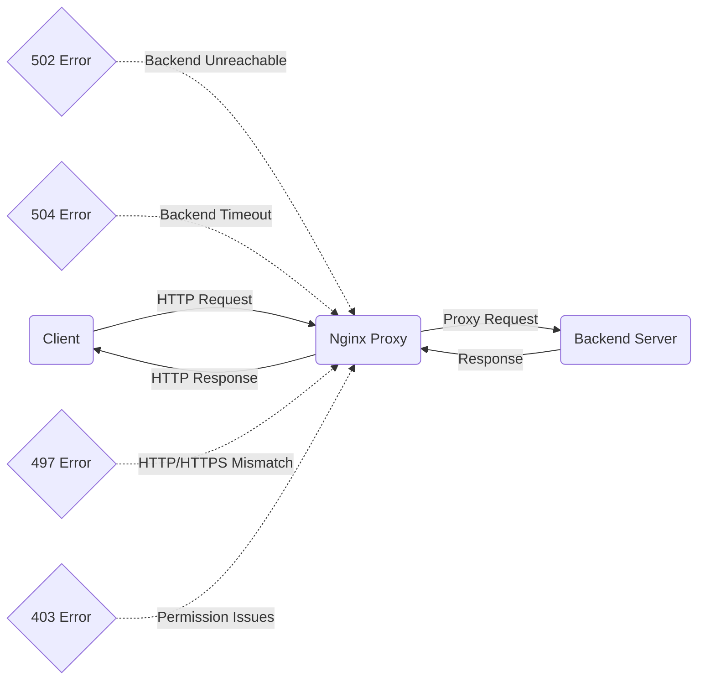

# Nginx Proxy Errors

## Introduction

When using Nginx as a reverse proxy, you might encounter various error messages that can be confusing for beginners. Proxy errors occur when Nginx is unable to properly forward requests to your backend servers or applications. Understanding these errors is essential for maintaining a stable web infrastructure.

In this guide, we'll explore common Nginx proxy errors, their meanings, and step-by-step troubleshooting approaches. By the end, you'll be able to identify, diagnose, and resolve these issues efficiently.

## Common Nginx Proxy Errors

### 1. 502 Bad Gateway

The 502 Bad Gateway error is one of the most common proxy errors you'll encounter with Nginx. This error occurs when Nginx, acting as a proxy, receives an invalid response from an upstream server.

#### Causes of 502 Bad Gateway

- Backend server is down or unreachable
- Timeout while connecting to the backend server
- Backend application crashes or returns malformed responses
- Misconfigured proxy settings

#### Troubleshooting Example

Let's walk through a scenario where Nginx is configured to proxy requests to a Node.js application running on port 3000:

```nginx
server {
    listen 80;
    server_name example.com;

    location / {
        proxy_pass http://localhost:3000;
        proxy_http_version 1.1;
        proxy_set_header Upgrade $http_upgrade;
        proxy_set_header Connection 'upgrade';
        proxy_set_header Host $host;
        proxy_cache_bypass $http_upgrade;
    }
}
```

If you're receiving a 502 Bad Gateway error, follow these steps:

1. **Check if your backend application is running:**

```bash
# Check if Node.js process is running
ps aux | grep node

# Check if anything is listening on port 3000
netstat -tuln | grep 3000
```

2. **Check Nginx error logs:**

```bash
sudo tail -f /var/log/nginx/error.log
```

You might see errors like:

```
2023/10/15 14:30:45 [error] 12345#0: *123 connect() failed (111: Connection refused) while connecting to upstream, client: 192.168.1.1, server: example.com, request: "GET / HTTP/1.1", upstream: "http://127.0.0.1:3000/", host: "example.com"
```

3. **Solution:** Start your backend application if it's not running, or fix any issues causing it to crash.

### 2. 504 Gateway Timeout

A 504 Gateway Timeout error occurs when Nginx doesn't receive a timely response from an upstream server.

#### Causes of 504 Gateway Timeout

- Backend server takes too long to process requests
- Network issues between Nginx and the backend server
- Insufficient timeout settings in Nginx configuration

#### Configuration Example

To fix timeout issues, you can adjust the proxy timeout settings in your Nginx configuration:

```nginx
server {
    listen 80;
    server_name example.com;

    location / {
        proxy_pass http://localhost:3000;
        proxy_http_version 1.1;
        proxy_set_header Upgrade $http_upgrade;
        proxy_set_header Connection 'upgrade';
        proxy_set_header Host $host;
        proxy_cache_bypass $http_upgrade;
        
        # Increase timeout settings
        proxy_connect_timeout 75s;
        proxy_read_timeout 300s;
        proxy_send_timeout 300s;
    }
}
```

### 3. 497 HTTP to HTTPS

This less common error occurs when a client makes an HTTP request to a server that only accepts HTTPS connections.

#### Configuration Example

To properly redirect HTTP to HTTPS, use the following configuration:

```nginx
server {
    listen 80;
    server_name example.com;
    return 301 https://$host$request_uri;
}

server {
    listen 443 ssl;
    server_name example.com;
    
    ssl_certificate /etc/nginx/ssl/example.com.crt;
    ssl_certificate_key /etc/nginx/ssl/example.com.key;
    
    # Other SSL settings
    
    location / {
        proxy_pass http://localhost:3000;
        # Other proxy settings
    }
}
```

### 4. 403 Forbidden in Proxy Context

Sometimes you might receive a 403 Forbidden error when Nginx is unable to access resources it needs to proxy.

#### Causes of 403 Forbidden

- Permission issues with Nginx worker process
- Issues with proxy headers
- Backend server rejecting the request

#### Solution Example

Ensure proper headers are set in your configuration:

```nginx
server {
    listen 80;
    server_name example.com;

    location / {
        proxy_pass http://backend_server;
        proxy_set_header Host $host;
        proxy_set_header X-Real-IP $remote_addr;
        proxy_set_header X-Forwarded-For $proxy_add_x_forwarded_for;
        proxy_set_header X-Forwarded-Proto $scheme;
    }
}
```

## Debugging Nginx Proxy Issues

### Using Nginx Debug Log

Enable debug-level logging to get more detailed information about proxy issues:

```nginx
# In nginx.conf or within the http context
error_log /var/log/nginx/error.log debug;
```

### Testing Backend Connectivity

Use simple tools to test if Nginx can reach your backend server:

```bash
# From the Nginx server, test connection to backend
curl -v http://backend_server:port/

# Check network connectivity
ping backend_server
telnet backend_server port
```

### Visualizing Nginx Proxy Flow

Below is a diagram showing the typical flow of requests through Nginx as a reverse proxy:



## Real-World Scenarios and Solutions

### Scenario 1: Containerized Applications

When running Nginx as a reverse proxy for containerized applications (like Docker containers), you might encounter connectivity issues.

**Problem:** Nginx cannot connect to containers using `localhost`.

**Solution:** Use the container name or service name instead of localhost:

```nginx
# Incorrect
proxy_pass http://localhost:3000;

# Correct (Docker Compose example)
proxy_pass http://app-container:3000;
```

### Scenario 2: Handling WebSocket Connections

WebSocket connections might fail with proxy errors if not properly configured.

**Solution:** Add WebSocket support to your Nginx configuration:

```nginx
server {
    listen 80;
    server_name example.com;

    location /ws/ {
        proxy_pass http://websocket_backend;
        proxy_http_version 1.1;
        proxy_set_header Upgrade $http_upgrade;
        proxy_set_header Connection "upgrade";
        proxy_set_header Host $host;
        proxy_set_header X-Real-IP $remote_addr;
        proxy_read_timeout 3600s; # Longer timeout for WebSockets
        proxy_send_timeout 3600s;
    }
}
```

### Scenario 3: Load Balancing Issues

When Nginx is configured as a load balancer, you might encounter proxy errors when some backend servers are down.

**Solution:** Implement health checks and backup servers:

```nginx
http {
    upstream backend {
        server backend1.example.com max_fails=3 fail_timeout=30s;
        server backend2.example.com max_fails=3 fail_timeout=30s;
        server backup.example.com backup;
    }
    
    server {
        listen 80;
        server_name example.com;
        
        location / {
            proxy_pass http://backend;
            # Other proxy settings
        }
    }
}
```

## Common Fixes for Nginx Proxy Errors

Here's a quick reference for fixing the most common Nginx proxy errors:

| Error | Common Cause | Quick Fix |
|-------|--------------|-----------|
| 502 Bad Gateway | Backend server down | Ensure backend is running |
| 504 Gateway Timeout | Slow backend response | Increase timeout values |
| 497 HTTP to HTTPS | SSL configuration issue | Set up proper redirects |
| 403 Forbidden | Permission problems | Check file permissions, fix headers |
| 500 Internal Server Error | Backend application error | Check application logs |
| 404 Not Found | Wrong proxy_pass URL | Verify backend URL path |

## Summary

Nginx proxy errors can appear challenging at first, but with a systematic approach to troubleshooting, they become manageable. Remember these key points:

1. Always check Nginx error logs first for detailed information
2. Verify that your backend services are running and accessible
3. Adjust timeout settings for slow applications
4. Ensure proper proxy headers are being passed
5. Test connectivity directly from the Nginx server to the backend

By understanding the root causes of common proxy errors and following the troubleshooting steps outlined in this guide, you'll be able to maintain a stable Nginx proxy setup and quickly resolve issues when they arise.

## Additional Resources

- For more in-depth troubleshooting: Official Nginx Documentation
- To practice debugging: Set up a test environment with multiple backends
- For advanced configurations: Learn about Nginx upstream modules and load balancing
- Practice Exercise: Try intentionally causing different proxy errors and fixing them

## Practice Exercises

1. **Exercise 1:** Configure Nginx to proxy requests to a deliberately non-existent backend, observe the 502 error, and then fix it.

2. **Exercise 2:** Set up a slow-responding backend (you can use `sleep` commands in a simple script) and observe timeout errors. Then adjust Nginx configuration to handle longer response times.

3. **Exercise 3:** Create a configuration with WebSocket support and test it with a simple WebSocket application.