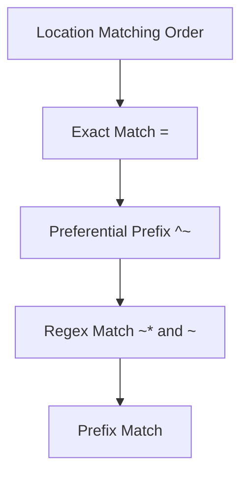

# Nginx Common Pitfalls

## Introduction

Nginx (pronounced "engine-x") is a powerful, high-performance web server and reverse proxy that has gained immense popularity due to its efficiency and scalability. However, even experienced developers can encounter various issues when configuring and using Nginx. This guide will walk you through the most common pitfalls that developers face with Nginx and provide practical solutions to overcome them.

Whether you're setting up Nginx for the first time or debugging an existing configuration, understanding these common mistakes will help you avoid frustrating issues and ensure your web server runs smoothly.

## Configuration File Structure Pitfalls

### Forgetting to Include Configuration Files

One of the most common mistakes is forgetting to include configuration files or using incorrect paths.

**Issue:**
```nginx
# Missing or incorrect include statement
server {
    listen 80;
    # No includes or wrong path
}
```

**Solution:**
```nginx
# Properly including configuration files
server {
    listen 80;
    include /etc/nginx/conf.d/*.conf;
}
```

### Misplaced Directives

Placing directives in the wrong context can cause Nginx to fail during configuration reload or startup.

**Issue:**
```nginx
# http directive placed inside server block (incorrect)
server {
    listen 80;
    http {
        gzip on;
    }
}
```

**Solution:**
```nginx
# Correct structure
http {
    gzip on;
    
    server {
        listen 80;
    }
}
```

## Path and Location Block Pitfalls

### Incorrect Location Block Order

Nginx processes location blocks in a specific order, and incorrect ordering can lead to unexpected behavior.



**Issue:**
```nginx
# Incorrect order can cause problems
server {
    location /api {
        # Will never be reached for /api/v1 requests
        # because the next block will match first
    }
    
    location ~ ^/api/v\d {
        # This regex block will be checked before the prefix block
    }
}
```

**Solution:**
```nginx
server {
    # Exact match has highest priority
    location = /api {
        # Handles exactly /api
    }
    
    # Regex matches checked before prefix matches
    location ~ ^/api/v\d {
        # Handles /api/v1, /api/v2, etc.
    }
    
    # Prefix match has lowest priority
    location /api {
        # Handles all other /api/ paths
    }
}
```

### Trailing Slash Confusion

The presence or absence of a trailing slash in location directives can lead to unexpected behavior.

**Issue:**
```nginx
# Without understanding trailing slash implications
location /api {
    # This matches /api and /api/anything
}
```

**Solution:**
```nginx
# Be explicit about what you want to match
location = /api {
    # This matches exactly /api
}

location /api/ {
    # This matches /api/ and anything under it
}
```

## Proxy and Upstream Pitfalls

### Missing or Incomplete Proxy Headers

When using Nginx as a reverse proxy, forgetting to set proper headers can cause issues with the backend application.

**Issue:**
```nginx
# Missing important headers
location /api {
    proxy_pass http://backend;
    # No proxy headers set
}
```

**Solution:**
```nginx
# Complete proxy header configuration
location /api {
    proxy_pass http://backend;
    proxy_set_header Host $host;
    proxy_set_header X-Real-IP $remote_addr;
    proxy_set_header X-Forwarded-For $proxy_add_x_forwarded_for;
    proxy_set_header X-Forwarded-Proto $scheme;
}
```

### Incorrect Proxy Pass URL Trailing Slash

A common source of confusion is the trailing slash in the `proxy_pass` directive, which affects how URI parts are handled.

**Issue:**
```nginx
# Without understanding trailing slash behavior
location /api {
    # This will forward /api/users to http://backend/api/users
    proxy_pass http://backend;
}

location /service {
    # This will forward /service/data to http://backend/data
    # The /service part is dropped!
    proxy_pass http://backend/;
}
```

**Solution:**
```nginx
# Be explicit about what you want
location /api/ {
    # This will keep the /api/ prefix
    proxy_pass http://backend/api/;
}

location /service/ {
    # This will remove the /service/ prefix
    proxy_pass http://backend/;
}
```

## SSL/TLS Configuration Pitfalls

### Insecure SSL Configurations

Using outdated SSL/TLS protocols or weak ciphers can expose your site to security vulnerabilities.

**Issue:**
```nginx
# Insecure SSL configuration
server {
    listen 443 ssl;
    ssl_protocols TLSv1 TLSv1.1;  # These are outdated
    ssl_ciphers LOW:!aNULL:!MD5;  # Weak ciphers
}
```

**Solution:**
```nginx
# Modern, secure SSL configuration
server {
    listen 443 ssl;
    ssl_protocols TLSv1.2 TLSv1.3;
    ssl_ciphers ECDHE-ECDSA-AES128-GCM-SHA256:ECDHE-RSA-AES128-GCM-SHA256:ECDHE-ECDSA-AES256-GCM-SHA384:ECDHE-RSA-AES256-GCM-SHA384:DHE-RSA-AES128-GCM-SHA256:DHE-RSA-AES256-GCM-SHA384;
    ssl_prefer_server_ciphers on;
    ssl_session_cache shared:SSL:10m;
    ssl_session_timeout 10m;
}
```

### Missing HTTPS Redirect

Forgetting to redirect HTTP to HTTPS can leave your site accessible via insecure connections.

**Issue:**
```nginx
# Missing HTTP to HTTPS redirect
server {
    listen 80;
    server_name example.com;
    # No redirect to HTTPS
}

server {
    listen 443 ssl;
    server_name example.com;
    # SSL configuration
}
```

**Solution:**
```nginx
# Proper HTTP to HTTPS redirect
server {
    listen 80;
    server_name example.com;
    
    # Redirect all HTTP traffic to HTTPS
    return 301 https://$host$request_uri;
}

server {
    listen 443 ssl;
    server_name example.com;
    # SSL configuration
}
```

## Performance Pitfalls

### Missing Gzip Compression

Forgetting to enable compression can significantly slow down your site for users.

**Issue:**
```nginx
# No compression configured
http {
    # Missing gzip configuration
}
```

**Solution:**
```nginx
# Proper gzip configuration
http {
    gzip on;
    gzip_comp_level 5;
    gzip_min_length 256;
    gzip_proxied any;
    gzip_vary on;
    gzip_types
        application/javascript
        application/json
        application/xml
        text/css
        text/javascript
        text/plain
        text/xml;
}
```

### Inefficient Worker Configuration

Incorrect worker settings can lead to poor performance and resource utilization.

**Issue:**
```nginx
# Default or incorrect worker settings
worker_processes 1;  # Too few for a multi-core system
events {
    worker_connections 768;  # May be too low for high-traffic sites
}
```

**Solution:**
```nginx
# Optimized worker configuration
worker_processes auto;  # Automatically use all available cores
worker_rlimit_nofile 30000;  # Increase system file descriptor limit
events {
    worker_connections 4096;  # Higher limit for busy servers
    multi_accept on;  # Process multiple connections per worker
    use epoll;  # Use efficient I/O event notification mechanism on Linux
}
```

## File Serving Pitfalls

### Incorrect Root Directory

Setting the wrong root directory can cause file not found errors.

**Issue:**
```nginx
# Incorrect root path
server {
    listen 80;
    server_name example.com;
    
    root /var/www/wrong_folder;
    
    location / {
        # Files won't be found
    }
}
```

**Solution:**
```nginx
# Correct root path with verification
server {
    listen 80;
    server_name example.com;
    
    root /var/www/example.com/public;
    
    location / {
        # Added file existence check for debugging
        try_files $uri $uri/ =404;
    }
}
```

### Missing MIME Types

Incorrectly configured or missing MIME types can cause browser rendering issues.

**Issue:**
```nginx
# Missing or incomplete MIME types
http {
    # Default types might be missing
}
```

**Solution:**
```nginx
# Complete MIME type configuration
http {
    include /etc/nginx/mime.types;
    default_type application/octet-stream;
    
    # Adding custom MIME types if needed
    types {
        application/wasm wasm;
        application/manifest+json webmanifest;
    }
}
```

## Logging and Debugging Pitfalls

### Insufficient Logging

Default logging may not provide enough information to troubleshoot issues.

**Issue:**
```nginx
# Default minimal logging
http {
    access_log /var/log/nginx/access.log;
    error_log /var/log/nginx/error.log;
}
```

**Solution:**
```nginx
# Enhanced logging for better debugging
http {
    log_format detailed '$remote_addr - $remote_user [$time_local] '
                       '"$request" $status $body_bytes_sent '
                       '"$http_referer" "$http_user_agent" '
                       '$request_time $upstream_response_time $pipe';
    
    access_log /var/log/nginx/access.log detailed;
    error_log /var/log/nginx/error.log warn;
    
    # Enable request body logging for debugging
    client_body_buffer_size 128k;
    client_max_body_size 10m;
}
```

### Forgetting to Test Configuration

Not testing configuration changes before applying them can lead to server downtime.

**Issue:**
```bash
# Directly applying changes without testing
sudo service nginx restart
```

**Solution:**
```bash
# Test configuration first
sudo nginx -t

# If successful, then reload or restart
sudo service nginx reload  # Preferred when possible
# or
sudo service nginx restart
```

## Real-World Example: Complete Server Block

Here's a comprehensive example that avoids many common pitfalls:

```nginx
# Main server block for example.com
server {
    # Listen on both IPv4 and IPv6
    listen 80;
    listen [::]:80;
    server_name example.com www.example.com;
    
    # Redirect to HTTPS
    return 301 https://$host$request_uri;
}

server {
    # HTTPS configuration
    listen 443 ssl http2;
    listen [::]:443 ssl http2;
    server_name example.com www.example.com;
    
    # SSL configuration
    ssl_certificate /etc/letsencrypt/live/example.com/fullchain.pem;
    ssl_certificate_key /etc/letsencrypt/live/example.com/privkey.pem;
    ssl_protocols TLSv1.2 TLSv1.3;
    ssl_prefer_server_ciphers on;
    ssl_ciphers ECDHE-ECDSA-AES128-GCM-SHA256:ECDHE-RSA-AES128-GCM-SHA256:ECDHE-ECDSA-AES256-GCM-SHA384:ECDHE-RSA-AES256-GCM-SHA384:DHE-RSA-AES128-GCM-SHA256:DHE-RSA-AES256-GCM-SHA384;
    
    # Security headers
    add_header Strict-Transport-Security "max-age=31536000; includeSubDomains" always;
    add_header X-Content-Type-Options nosniff;
    add_header X-Frame-Options SAMEORIGIN;
    add_header X-XSS-Protection "1; mode=block";
    
    # Root directory
    root /var/www/example.com/public;
    index index.html index.htm;
    
    # Main location block
    location / {
        try_files $uri $uri/ /index.html;
    }
    
    # API requests
    location /api/ {
        proxy_pass http://backend_servers/;
        proxy_http_version 1.1;
        proxy_set_header Host $host;
        proxy_set_header X-Real-IP $remote_addr;
        proxy_set_header X-Forwarded-For $proxy_add_x_forwarded_for;
        proxy_set_header X-Forwarded-Proto $scheme;
        proxy_buffering on;
        proxy_buffer_size 8k;
        proxy_buffers 8 8k;
    }
    
    # Static assets with caching
    location ~* \.(jpg|jpeg|png|gif|ico|css|js)$ {
        expires 30d;
        add_header Cache-Control "public, no-transform";
    }
    
    # Deny access to hidden files
    location ~ /\. {
        deny all;
        access_log off;
        log_not_found off;
    }
}
```

## Troubleshooting Process

When facing issues with Nginx, follow this systematic approach:

1. **Check Syntax**: Always run `nginx -t` to validate your configuration syntax.
2. **Review Logs**: Check both error and access logs with `tail -f /var/log/nginx/error.log`.
3. **Test Connections**: Use `curl` with verbose output: `curl -v http://localhost`.
4. **Check Permissions**: Verify file permissions with `ls -la` for configuration files and web content.
5. **Inspect Process Status**: Check if Nginx is running with `systemctl status nginx`.

```mermaid
flowchart TD
    A[Nginx Issue] --> B{Check Syntax}
    B -->|Failed| C[Fix Configuration]
    B -->|Success| D{Check Logs}
    D -->|Error Found| E[Address Error]
    D -->|No Errors| F{Test Connection}
    F -->|Connection Failed| G[Check Ports/Firewall]
    F -->|Connection Works| H{Check Content}
    H -->|Content Issue| I[Fix File Paths/Permissions]
    H -->|Content OK| J[Review Specific Features]
    C --> B
    E --> D
    G --> F
    I --> H
</mermaid>

## Summary

In this guide, we've covered the most common pitfalls you might encounter when working with Nginx:

- Configuration structure issues
- Path and location block confusion
- Proxy and upstream configuration problems
- SSL/TLS security concerns
- Performance optimization mistakes
- File serving errors
- Logging and debugging limitations

By understanding these common issues and their solutions, you'll be better equipped to set up and maintain your Nginx servers effectively.

## Additional Resources

For further learning, consider exploring these resources:

- **Official Nginx Documentation**: The most authoritative source for Nginx configuration.
- **Nginx Cookbook**: Contains practical recipes for common Nginx tasks.
- **Mozilla SSL Configuration Generator**: Helps create secure SSL configurations for Nginx.

## Practice Exercises

To reinforce your understanding, try these exercises:

1. Set up a basic Nginx server that serves static content and properly redirects from HTTP to HTTPS.
2. Configure Nginx as a reverse proxy for a simple backend application, ensuring all headers are properly set.
3. Optimize your Nginx configuration for performance, implementing caching and compression.
4. Set up custom logging to capture detailed information about requests and troubleshoot a sample issue.

By mastering these common pitfalls and their solutions, you'll be well on your way to becoming proficient with Nginx configuration and troubleshooting.