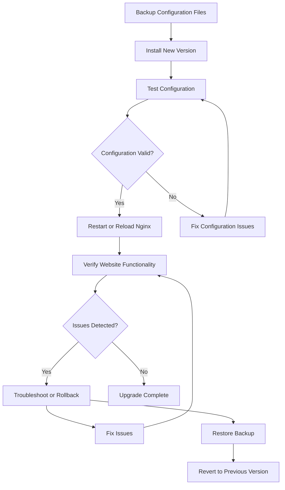

# Nginx Upgrade Issues

## Introduction

Upgrading Nginx is a routine maintenance task that helps keep your web server secure, performant, and equipped with the latest features. However, these upgrades can sometimes lead to unexpected issues that might affect your website's functionality. This guide will help you understand, identify, and resolve common Nginx upgrade problems, ensuring your web applications continue to run smoothly after updates.

## Understanding Nginx Upgrades

Before diving into specific issues, let's understand what happens during an Nginx upgrade.

### Types of Nginx Upgrades

Nginx can be upgraded in several ways:

1. **Minor version upgrades** - These typically include bug fixes and minor improvements (e.g., 1.18.0 to 1.18.1)
2. **Major version upgrades** - These introduce new features and potentially breaking changes (e.g., 1.18.x to 1.20.x)
3. **Distribution package upgrades** - Updates through package managers like apt, yum, etc.
4. **Source code compilation** - Building Nginx from source code

### The Upgrade Process

A typical Nginx upgrade process involves:



## Common Nginx Upgrade Issues

### 1. Configuration Syntax Errors

One of the most common issues after upgrading Nginx is that your existing configuration files may contain syntax that is no longer supported or has changed in the new version.

#### Example Problem

Suppose you have this configuration in an older Nginx version:

```nginx
server {
    listen 80;
    server_name example.com;
    
    ssl on;
    ssl_certificate /etc/nginx/ssl/example.com.crt;
    ssl_certificate_key /etc/nginx/ssl/example.com.key;
    
    # Other directives...
}
```

After upgrading to a newer version, you might encounter this error:

```
nginx: [emerg] "ssl" directive is deprecated, use "listen ... ssl"
```

#### Solution

Update your configuration to use the newer syntax:

```nginx
server {
    listen 80;
    listen 443 ssl;
    server_name example.com;
    
    ssl_certificate /etc/nginx/ssl/example.com.crt;
    ssl_certificate_key /etc/nginx/ssl/example.com.key;
    
    # Other directives...
}
```

### 2. Module Compatibility Issues

Newer Nginx versions might change or remove modules that your configuration depends on.

#### Example Problem

You might see an error like:

```
nginx: [emerg] unknown directive "spdy" in /etc/nginx/sites-enabled/default:5
```

This occurs because the SPDY protocol support has been replaced with HTTP/2 in newer Nginx versions.

#### Solution

Replace the deprecated directive with its modern equivalent:

```nginx
# Old configuration
server {
    listen 443 ssl spdy;
    # ...
}

# New configuration
server {
    listen 443 ssl http2;
    # ...
}
```

### 3. Path Changes

File paths or default locations might change between Nginx versions.

#### Example Problem

After upgrading, you might notice missing log files or errors like:

```
nginx: [emerg] open() "/var/log/nginx/access.log" failed (2: No such file or directory)
```

#### Solution

Create the necessary directories and update paths in your configuration:

```bash
# Create missing directories
sudo mkdir -p /var/log/nginx

# Set proper permissions
sudo chown -R nginx:nginx /var/log/nginx
```

### 4. SSL/TLS Protocol and Cipher Changes

Newer Nginx versions often update their default SSL/TLS protocols and ciphers for security reasons.

#### Example Problem

After upgrading, you might find that older clients can't connect, or you see errors in the logs related to SSL handshakes.

#### Solution

Update your SSL configuration to balance security and compatibility:

```nginx
server {
    listen 443 ssl;
    server_name example.com;
    
    ssl_protocols TLSv1.2 TLSv1.3;
    ssl_ciphers HIGH:!aNULL:!MD5;
    ssl_prefer_server_ciphers on;
    
    # Rest of your SSL configuration...
}
```

### 5. Binary Compatibility with Dynamic Modules

If you use dynamic modules with Nginx, they might not be compatible with the new Nginx binary after an upgrade.

#### Example Problem

You might see an error like:

```
nginx: [emerg] module "/usr/lib/nginx/modules/ngx_http_geoip_module.so" version 1016000 instead of 1018000
```

#### Solution

Reinstall or recompile the dynamic modules for your new Nginx version:

```bash
# For package installations
sudo apt-get install --reinstall nginx-module-geoip

# Or for source installations
./configure --with-compat --add-dynamic-module=modules/geoip
make modules
```

## Best Practices for Seamless Nginx Upgrades

### 1. Always Back Up Your Configuration

Before upgrading, create backups of your entire Nginx configuration:

```bash
# Create a backup of Nginx configuration
sudo cp -a /etc/nginx /etc/nginx.backup-$(date +"%Y%m%d")
```

### 2. Test Configuration Before Restarting

Always test your configuration before applying it:

```bash
sudo nginx -t
```

### 3. Use Version Control for Configuration

Track changes to your Nginx configuration using Git or another version control system:

```bash
# Initialize Git repository for Nginx config
cd /etc/nginx
sudo git init
sudo git add .
sudo git commit -m "Initial Nginx configuration"
```

### 4. Implement a Staging Environment

Test upgrades in a staging environment before applying to production:

```bash
# Create a Docker container with the new Nginx version
docker run --name nginx-test -v $(pwd)/nginx.conf:/etc/nginx/nginx.conf:ro -p 8080:80 nginx:latest
```

### 5. Use Zero-Downtime Upgrades

For production servers, use Nginx's ability to perform zero-downtime upgrades:

```bash
# Send USR2 signal to spawn a new master process
sudo kill -USR2 $(cat /var/run/nginx.pid)

# Gracefully shut down old worker processes
sudo kill -WINCH $(cat /var/run/nginx.pid.oldbin)
```

## Practical Upgrade Scenario

Let's walk through a complete upgrade scenario to illustrate the process and potential issues.

### Scenario: Upgrading from Nginx 1.18 to 1.22

#### Step 1: Back up current configuration

```bash
sudo cp -a /etc/nginx /etc/nginx.backup
```

#### Step 2: Update repository and install new version

```bash
# For Debian/Ubuntu
sudo apt update
sudo apt install nginx

# For CentOS/RHEL
sudo yum update nginx
```

#### Step 3: Check for deprecated directives

```bash
sudo nginx -t
```

If you see errors about deprecated directives, update them accordingly.

#### Step 4: Test configuration with new version

```bash
sudo nginx -t -c /etc/nginx/nginx.conf
```

#### Step 5: Implement a controlled restart

```bash
sudo systemctl restart nginx
```

#### Step 6: Verify functionality

```bash
# Check if Nginx is running
sudo systemctl status nginx

# Test a web page
curl -I http://localhost
```

## Troubleshooting Upgrade Issues

### Issue: Nginx Won't Start After Upgrade

1. Check logs for detailed error messages:

```bash
sudo journalctl -u nginx.service --no-pager
```

2. Verify that the configuration is valid:

```bash
sudo nginx -t
```

3. Check for port conflicts:

```bash
sudo ss -tulpn | grep :80
```

### Issue: SSL/TLS Handshake Failures

1. Test SSL configuration:

```bash
openssl s_client -connect example.com:443 -tls1_2
```

2. Verify certificate chain validity:

```bash
echo | openssl s_client -showcerts -servername example.com -connect example.com:443 2>/dev/null | openssl x509 -inform pem -noout -text
```

### Issue: Performance Degradation After Upgrade

1. Check worker processes and connections:

```nginx
worker_processes auto;
worker_connections 1024;
```

2. Review keepalive settings:

```nginx
keepalive_timeout 65;
keepalive_requests 100;
```

## Summary

Upgrading Nginx is a critical maintenance task that helps keep your web server secure and performant. By understanding common upgrade issues and following best practices, you can minimize downtime and resolve problems quickly when they occur.

Remember these key points:
- Always back up your configuration before upgrading
- Test your configuration before restarting
- Be aware of deprecated directives and syntax changes
- Implement a proper testing environment
- Use version control for tracking configuration changes
- Understand how to perform zero-downtime upgrades

## Additional Resources

- [Official Nginx Documentation](https://nginx.org/en/docs/)
- [Nginx Changelog](https://nginx.org/en/CHANGES)
- [Nginx Admin Guide](https://docs.nginx.com/nginx/admin-guide/)

## Practice Exercise

1. Set up a local Nginx server using Docker with an older version
2. Create a configuration using some features known to have changed (like SSL configuration)
3. Perform an upgrade to the latest version
4. Identify and fix any issues that arise
5. Implement a zero-downtime upgrade process

By practicing these skills in a controlled environment, you'll be better prepared to handle Nginx upgrades in production scenarios.