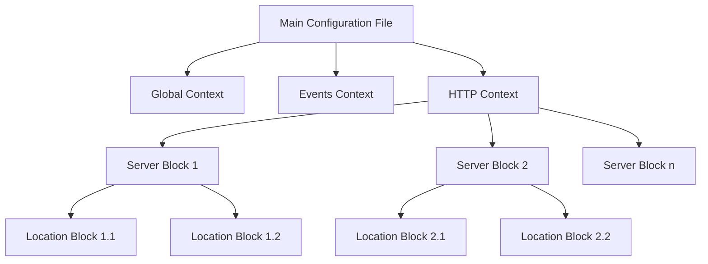

# Nginx Configuration Structure

## Introduction

Nginx (pronounced "engine-x") is a powerful, high-performance web server and reverse proxy that has gained immense popularity due to its speed, reliability, and efficient resource utilization. One of Nginx's key strengths is its flexible and modular configuration system.

In this guide, we'll explore how Nginx configuration files are structured, the key components that make up these files, and best practices for organizing your configurations. Understanding this structure is essential for properly configuring and maintaining your Nginx server.

## The Nginx Configuration Hierarchy

Nginx uses a hierarchical structure for its configuration files. Let's break down this hierarchy:



### Main Configuration File

The primary Nginx configuration file is usually located at `/etc/nginx/nginx.conf`. This file contains the global settings and includes other configuration files.

```nginx
# Main configuration file: /etc/nginx/nginx.conf
user nginx;
worker_processes auto;
error_log /var/log/nginx/error.log warn;
pid /var/run/nginx.pid;

events {
    worker_connections 1024;
}

http {
    include /etc/nginx/mime.types;
    default_type application/octet-stream;
    
    # Logging settings
    log_format main '$remote_addr - $remote_user [$time_local] "$request" '
                    '$status $body_bytes_sent "$http_referer" '
                    '"$http_user_agent" "$http_x_forwarded_for"';
    access_log /var/log/nginx/access.log main;
    
    # Include virtual host configurations
    include /etc/nginx/conf.d/*.conf;
}
```

## Key Configuration Contexts

Nginx configuration uses a context-based structure. Let's explore each of the main contexts:

### Global Context

The global context contains directives that affect the Nginx process as a whole:

```nginx
user nginx;              # User under which Nginx will run
worker_processes auto;   # Number of worker processes
error_log /var/log/nginx/error.log warn;  # Error log path and level
pid /var/run/nginx.pid;  # Process ID file location
```

### Events Context

The events context defines how Nginx handles connections:

```nginx
events {
    worker_connections 1024;  # Maximum connections per worker
    # multi_accept on;        # Accept multiple connections at once
    # use epoll;              # Connection processing method (Linux)
}
```

### HTTP Context

The HTTP context contains all the directives related to HTTP/HTTPS handling:

```nginx
http {
    include /etc/nginx/mime.types;        # Include MIME types
    default_type application/octet-stream; # Default MIME type
    
    # Basic Settings
    sendfile on;
    tcp_nopush on;
    tcp_nodelay on;
    keepalive_timeout 65;
    types_hash_max_size 2048;
    
    # SSL Settings
    ssl_protocols TLSv1.2 TLSv1.3;
    ssl_prefer_server_ciphers on;
    
    # Gzip Settings
    gzip on;
    gzip_disable "msie6";
    
    # Virtual Host Configs
    include /etc/nginx/conf.d/*.conf;
}
```

## Server Blocks

Server blocks (similar to Apache's virtual hosts) define settings for specific domains or IP addresses:

```nginx
# /etc/nginx/conf.d/example.com.conf
server {
    listen 80;
    server_name example.com www.example.com;
    
    location / {
        root /var/www/example.com;
        index index.html index.htm;
    }
    
    error_page 404 /404.html;
    error_page 500 502 503 504 /50x.html;
}
```

A single Nginx installation can host multiple websites, each defined in its own server block.

## Location Blocks

Location blocks define how Nginx processes specific URI patterns:

```nginx
server {
    # ...server settings...
    
    # Exact match
    location = /exact {
        # ...
    }
    
    # Prefix match with priority
    location ^~ /images/ {
        # Handle requests for /images/
    }
    
    # Regular expression match (case sensitive)
    location ~ \.php$ {
        # Handle PHP files
    }
    
    # Regular expression match (case insensitive)
    location ~* \.(jpg|jpeg|png|gif)$ {
        # Handle image files
    }
    
    # Standard prefix match
    location /docs/ {
        # Handle requests for /docs/
    }
    
    # Default catch-all
    location / {
        # Handle all other requests
    }
}
```

### Location Block Matching Priority

Nginx processes location blocks in the following order:

1. Exact match (`=`)
2. Prefix match with priority (`^~`)
3. Regular expression match (`~` and `~*`) - first match wins
4. Standard prefix match
5. Default catch-all (`/`)

## Practical Example: Setting Up a Basic Website

Let's look at a real-world example for hosting a static website:

```nginx
# /etc/nginx/conf.d/mywebsite.conf
server {
    listen 80;
    server_name mywebsite.com www.mywebsite.com;
    root /var/www/mywebsite;
    
    # Serve static files directly
    location ~* \.(jpg|jpeg|png|gif|ico|css|js)$ {
        expires 30d;  # Cache static files
        add_header Cache-Control "public, no-transform";
    }
    
    # All other URIs go to index.html
    location / {
        try_files $uri $uri/ /index.html;
        index index.html;
    }
    
    # Error pages
    error_page 404 /404.html;
    location = /404.html {
        root /var/www/error_pages;
        internal;
    }
}
```

## Including Configuration Files

Nginx allows modular configuration by including other files:

```nginx
# Include all server blocks
include /etc/nginx/conf.d/*.conf;

# Include specific functionality
include /etc/nginx/snippets/ssl-params.conf;
```

Common organization patterns:

```
/etc/nginx/
├── nginx.conf            # Main configuration
├── conf.d/               # Server blocks
│   ├── default.conf
│   ���── example.com.conf
├── snippets/             # Reusable configuration snippets
│   ├── fastcgi-php.conf
│   └── ssl-params.conf
└── sites-available/      # Available sites (optional)
    └── example.com
```

## Testing and Applying Configuration

After modifying your Nginx configuration, always test it before applying:

```bash
# Test configuration syntax
nginx -t

# Expected output:
# nginx: the configuration file /etc/nginx/nginx.conf syntax is ok
# nginx: configuration file /etc/nginx/nginx.conf test is successful
```

To apply the new configuration:

```bash
# Reload Nginx (keeps connections alive)
nginx -s reload

# Or restart Nginx (closes all connections)
systemctl restart nginx
```

## Common Configuration Directives

Here are some commonly used directives and their purpose:

| Directive | Context | Description |
|-----------|---------|-------------|
| `server_name` | server | Defines which domains this server block handles |
| `root` | http, server, location | Document root directory |
| `index` | http, server, location | Default files to serve |
| `try_files` | server, location | Tries files in specified order |
| `proxy_pass` | location | Forwards requests to another server |
| `return` | server, location | Returns HTTP code or redirects |
| `rewrite` | server, location | Rewrites the URI |
| `listen` | server | Defines IP/port for accepting connections |
| `add_header` | http, server, location | Adds headers to response |
| `error_page` | http, server, location | Defines custom error pages |

## Advanced Configuration Example: Reverse Proxy

A common use case for Nginx is as a reverse proxy in front of application servers:

```nginx
# Proxy requests to Node.js application
server {
    listen 80;
    server_name app.example.com;
    
    location / {
        proxy_pass http://localhost:3000;
        proxy_http_version 1.1;
        proxy_set_header Upgrade $http_upgrade;
        proxy_set_header Connection 'upgrade';
        proxy_set_header Host $host;
        proxy_cache_bypass $http_upgrade;
    }
}
```

## Summary

Nginx configuration follows a hierarchical structure with contexts (global, events, http), server blocks, and location blocks. This modular approach makes Nginx extremely flexible and suitable for various use cases, from simple static file serving to complex reverse proxy setups.

Key points to remember:
- The main configuration file is `/etc/nginx/nginx.conf`
- Server blocks define virtual hosts
- Location blocks handle specific URI patterns
- Always test your configuration before applying it
- Use includes for modular and maintainable configurations

## Additional Resources

- [Official Nginx Documentation](https://nginx.org/en/docs/)
- [Nginx Beginner's Guide](https://nginx.org/en/docs/beginners_guide.html)
- [Digital Ocean Nginx Configuration Guide](https://www.digitalocean.com/community/tutorials/understanding-the-nginx-configuration-file-structure-and-configuration-contexts)

## Exercises

1. Create a basic Nginx configuration file for serving a static website.
2. Set up a server block that redirects HTTP requests to HTTPS.
3. Configure Nginx as a reverse proxy for a local application running on port 3000.
4. Create a location block that serves cached static files with appropriate headers.
5. Implement rate limiting for specific endpoints in your configuration.