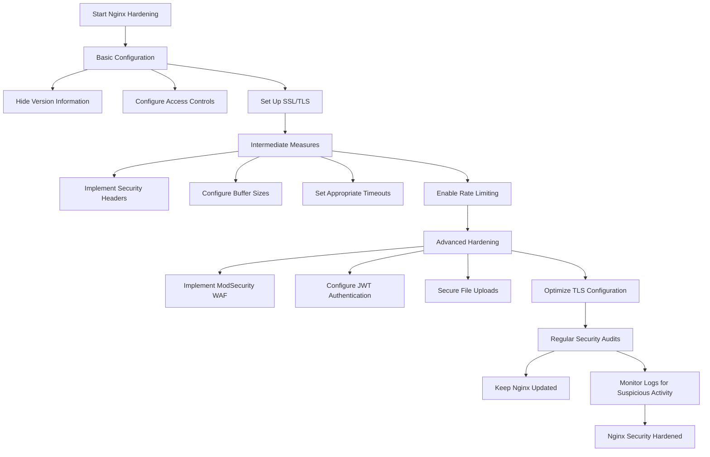

# Nginx Security Hardening

## Introduction

Nginx (pronounced "engine-x") is one of the most popular web servers in the world, known for its high performance, stability, and rich feature set. However, like any internet-facing service, an improperly configured Nginx server can become a security liability. This guide will walk you through essential security hardening techniques to protect your Nginx server from common threats and vulnerabilities.

Security hardening is the process of reducing your server's attack surface by implementing configuration changes that follow security best practices. For Nginx, this means carefully configuring the web server to reveal minimal information, restrict unnecessary access, and protect against common exploitation techniques.

## Why Security Hardening Matters

Before diving into specific techniques, let's understand why security hardening for Nginx is critical:

- **Attack Surface Reduction**: Every enabled feature or exposed piece of information represents a potential entry point for attackers
- **Vulnerability Mitigation**: Proper configuration can help mitigate known vulnerability classes like XSS, CSRF, and injection attacks
- **Data Protection**: Securing your Nginx server helps protect sensitive user data
- **Compliance Requirements**: Many regulatory frameworks require implementing security best practices

## Basic Nginx Security Hardening

### 1. Hide Nginx Version Information

By default, Nginx reveals its version number in error pages and in the `Server` HTTP response header. This information can help attackers identify specific vulnerabilities affecting your server version.

```nginx
# In http, server, or location context
server_tokens off;
```

**Before:**
```
HTTP/1.1 200 OK
Server: nginx/1.18.0
Date: Fri, 14 Mar 2025 10:00:00 GMT
```

**After:**
```
HTTP/1.1 200 OK
Server: nginx
Date: Fri, 14 Mar 2025 10:00:00 GMT
```

### 2. Implement Proper Access Controls

Restrict access to sensitive resources using the `location` directive combined with `deny` and `allow` directives:

```nginx
# Block access to hidden files and directories
location ~ /\. {
    deny all;
    return 404;
}

# Restrict access to specific IP addresses for admin areas
location /admin {
    allow 192.168.1.0/24;
    allow 10.0.0.1;
    deny all;
}
```

### 3. Configure SSL/TLS Correctly

Use strong encryption settings for HTTPS:

```nginx
server {
    listen 443 ssl;
    server_name example.com;

    ssl_certificate /path/to/certificate.crt;
    ssl_certificate_key /path/to/private.key;
    
    # Use only TLS protocols (disable SSLv2 and SSLv3)
    ssl_protocols TLSv1.2 TLSv1.3;
    
    # Use secure ciphers
    ssl_ciphers 'ECDHE-ECDSA-AES128-GCM-SHA256:ECDHE-RSA-AES128-GCM-SHA256:ECDHE-ECDSA-AES256-GCM-SHA384:ECDHE-RSA-AES256-GCM-SHA384';
    ssl_prefer_server_ciphers on;
    
    # Enable HSTS (strict transport security)
    add_header Strict-Transport-Security "max-age=31536000; includeSubDomains" always;
    
    # Other configurations...
}
```

### 4. Redirect HTTP to HTTPS

Force all connections to use HTTPS:

```nginx
server {
    listen 80;
    server_name example.com;
    return 301 https://$host$request_uri;
}
```

## Intermediate Security Measures

### 1. Implement Security Headers

HTTP security headers provide browsers with instructions for handling your website's content:

```nginx
# In the server or location context
add_header X-Content-Type-Options "nosniff" always;
add_header X-Frame-Options "SAMEORIGIN" always;
add_header X-XSS-Protection "1; mode=block" always;
add_header Content-Security-Policy "default-src 'self'; script-src 'self'" always;
add_header Referrer-Policy "strict-origin-when-cross-origin" always;
add_header Permissions-Policy "camera=(), microphone=(), geolocation=()" always;
```

Let's understand what each header does:

- **X-Content-Type-Options**: Prevents browsers from MIME-sniffing a response from the declared content-type
- **X-Frame-Options**: Prevents clickjacking attacks by ensuring your page can't be embedded in frames
- **X-XSS-Protection**: Enables the browser's XSS filters
- **Content-Security-Policy**: Controls which resources the browser is allowed to load
- **Referrer-Policy**: Controls how much referrer information is included with requests
- **Permissions-Policy**: Controls which browser features can be used on your website

### 2. Configure Buffer Sizes

Properly configured buffer sizes help prevent buffer overflow attacks:

```nginx
client_body_buffer_size 10K;
client_header_buffer_size 1k;
client_max_body_size 8m;
large_client_header_buffers 2 1k;
```

### 3. Configure Timeouts

Appropriate timeouts can prevent slow HTTP attacks and resource exhaustion:

```nginx
client_body_timeout 12;
client_header_timeout 12;
keepalive_timeout 15;
send_timeout 10;
```

### 4. Enable Rate Limiting

Rate limiting helps mitigate DDoS attacks and brute force attempts:

```nginx
# Define a zone
limit_req_zone $binary_remote_addr zone=one:10m rate=1r/s;

server {
    # Apply rate limiting to the login page
    location /login {
        limit_req zone=one burst=5;
        
        # Other configurations...
    }
}
```

This configuration:
1. Creates a shared memory zone named "one" with 10MB size
2. Sets a rate limit of 1 request per second based on IP address
3. Allows a burst of 5 requests before rejecting connections

## Advanced Security Hardening

### 1. Implement ModSecurity Web Application Firewall (WAF)

ModSecurity provides a robust layer of protection against various web attacks:

```nginx
# Load ModSecurity module
load_module modules/ngx_http_modsecurity_module.so;

server {
    # Enable ModSecurity
    modsecurity on;
    modsecurity_rules_file /etc/nginx/modsecurity/main.conf;
    
    # Other configurations...
}
```

The ModSecurity configuration file can include OWASP Core Rule Set (CRS) for protection against common vulnerabilities.

### 2. Configure Access Control with JWT

For APIs or protected resources, you can authenticate requests using JSON Web Tokens (JWT):

```nginx
# Load JWT module
load_module modules/ngx_http_auth_jwt_module.so;

server {
    location /api {
        auth_jwt "Protected API";
        auth_jwt_key_file /etc/nginx/keys/jwt_public_key.pem;
        
        # Other configurations...
    }
}
```

### 3. Secure File Uploads

If your application accepts file uploads, restrict the types and sizes:

```nginx
location /uploads {
    # Limit file types
    if ($request_filename ~* \.(php|pl|py|jsp|asp|sh|cgi)$) {
        return 403;
    }
    
    # Set client body size
    client_max_body_size 2m;
    
    # Other configurations...
}
```

### 4. Configure TLS Session Tickets and Caching

Optimize SSL/TLS performance while maintaining security:

```nginx
# TLS session caching
ssl_session_cache shared:SSL:10m;
ssl_session_timeout 10m;
ssl_session_tickets off;

# Diffie-Hellman parameters
ssl_dhparam /etc/nginx/ssl/dhparam.pem;
```

## Real-World Example: Complete Hardened Server Block

Here's a comprehensive example that combines multiple security measures:

```nginx
server {
    listen 443 ssl http2;
    server_name secure.example.com;
    
    # SSL configuration
    ssl_certificate /etc/nginx/ssl/example.com.crt;
    ssl_certificate_key /etc/nginx/ssl/example.com.key;
    ssl_protocols TLSv1.2 TLSv1.3;
    ssl_ciphers 'ECDHE-ECDSA-AES128-GCM-SHA256:ECDHE-RSA-AES128-GCM-SHA256:ECDHE-ECDSA-AES256-GCM-SHA384:ECDHE-RSA-AES256-GCM-SHA384';
    ssl_prefer_server_ciphers on;
    ssl_session_cache shared:SSL:10m;
    ssl_session_timeout 10m;
    ssl_session_tickets off;
    ssl_dhparam /etc/nginx/ssl/dhparam.pem;
    
    # Security headers
    add_header X-Content-Type-Options "nosniff" always;
    add_header X-Frame-Options "SAMEORIGIN" always;
    add_header X-XSS-Protection "1; mode=block" always;
    add_header Content-Security-Policy "default-src 'self'; script-src 'self'; img-src 'self'; style-src 'self'; font-src 'self'; connect-src 'self';" always;
    add_header Strict-Transport-Security "max-age=31536000; includeSubDomains; preload" always;
    add_header Referrer-Policy "strict-origin-when-cross-origin" always;
    
    # Hide server information
    server_tokens off;
    
    # Rate limiting
    limit_req_zone $binary_remote_addr zone=app_limit:10m rate=10r/s;
    limit_req zone=app_limit burst=20 nodelay;
    
    # Timeouts
    client_body_timeout 12;
    client_header_timeout 12;
    keepalive_timeout 15;
    send_timeout 10;
    
    # Buffer sizes
    client_body_buffer_size 10k;
    client_header_buffer_size 1k;
    client_max_body_size 8m;
    large_client_header_buffers 4 4k;
    
    # Block access to sensitive files
    location ~ /\.(git|htaccess|env|config|yml) {
        deny all;
        return 404;
    }
    
    # Main application location
    location / {
        proxy_pass http://backend_app;
        proxy_set_header Host $host;
        proxy_set_header X-Real-IP $remote_addr;
        proxy_set_header X-Forwarded-For $proxy_add_x_forwarded_for;
        proxy_set_header X-Forwarded-Proto $scheme;
    }
    
    # Admin area with IP restrictions
    location /admin {
        allow 192.168.1.0/24;  # Internal network
        allow 203.0.113.42;    # Office static IP
        deny all;
        
        proxy_pass http://backend_admin;
        proxy_set_header Host $host;
        proxy_set_header X-Real-IP $remote_addr;
    }
}
```

## Security Hardening Flowchart



## Testing Your Security Configuration

After implementing these hardening measures, it's important to verify their effectiveness:

1. **Use SSL/TLS Testing Tools**:
   - [SSL Labs Server Test](https://www.ssllabs.com/ssltest/)
   - [Hardenize](https://www.hardenize.com/)

2. **Check Security Headers**:
   - [Security Headers](https://securityheaders.com/)
   - [Observatory by Mozilla](https://observatory.mozilla.org/)

3. **Vulnerability Scanning**:
   - Use tools like Nikto, OWASP ZAP, or Nmap to scan for common vulnerabilities

To run a simple headers check using curl:

```bash
curl -IL https://example.com | grep -E '(X-|Content-Security|Strict)'
```

## Summary

Securing your Nginx server is an ongoing process that requires attention to detail and regular updates. By implementing the steps outlined in this guide, you can significantly reduce the attack surface of your web server and protect against common threats.

Key takeaways:
- Hide unnecessary server information
- Use strong SSL/TLS configurations
- Implement security headers
- Configure appropriate timeouts and buffer sizes
- Enable rate limiting for sensitive endpoints
- Consider advanced measures like WAF for critical applications
- Regularly test and audit your security configurations

Remember that security is not a one-time task but a continuous process of improvement and vigilance. Stay informed about new vulnerabilities and best practices to keep your Nginx server secure.

## Additional Resources

- [Official Nginx Security Controls Documentation](https://docs.nginx.com/nginx/admin-guide/security-controls/)
- [OWASP Secure Configuration Guide for Nginx](https://owasp.org/www-project-secure-headers/)
- [Mozilla SSL Configuration Generator](https://ssl-config.mozilla.org/)
- [Nginx Hardening Guide by SANS Institute](https://www.sans.org/reading-room/whitepapers/webservers/securing-web-application-technologies-checklist)

## Exercises

1. Create a basic hardened Nginx configuration file for a simple static website.
2. Set up rate limiting for a login page to prevent brute force attacks.
3. Configure your SSL/TLS settings and test them using SSL Labs.
4. Implement a Content Security Policy for your website and verify it using the browser's developer tools.
5. Set up logging for Nginx and create a simple script to monitor for potential security issues.